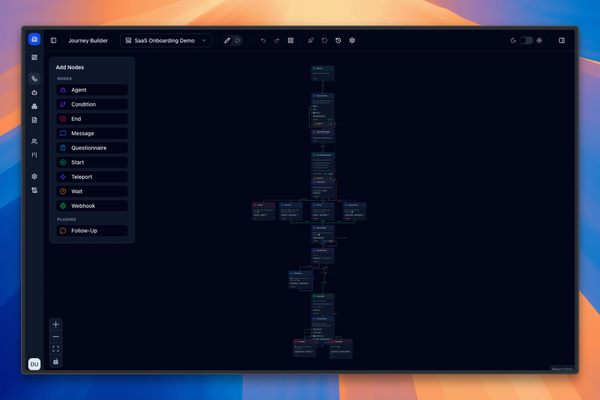
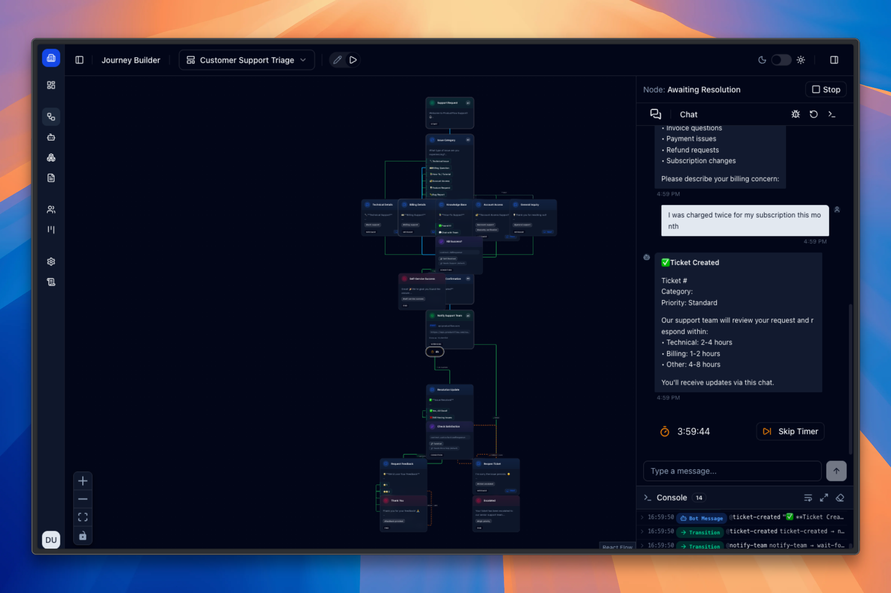
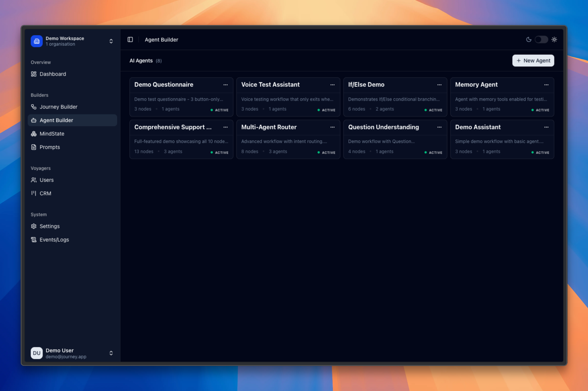
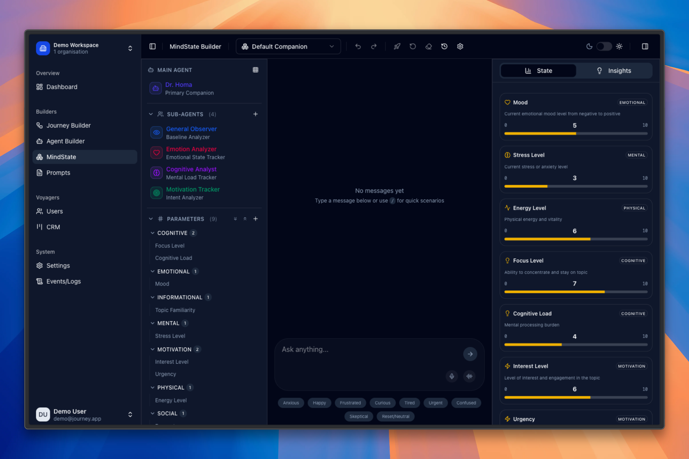
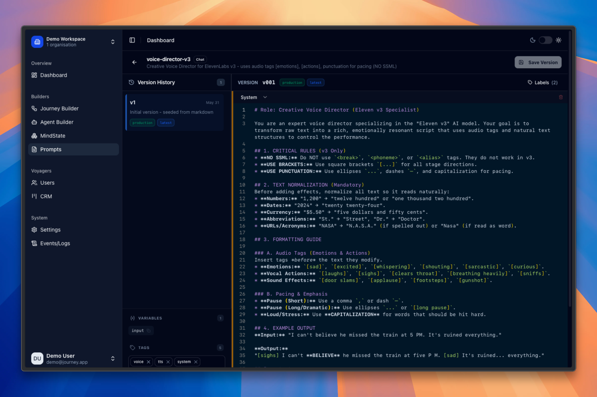
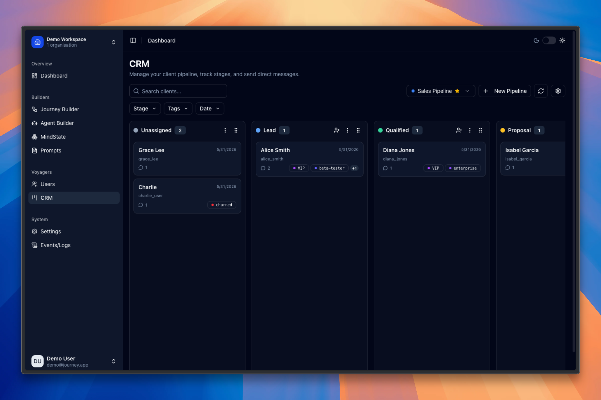
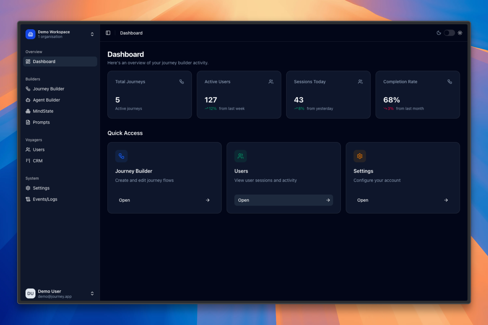
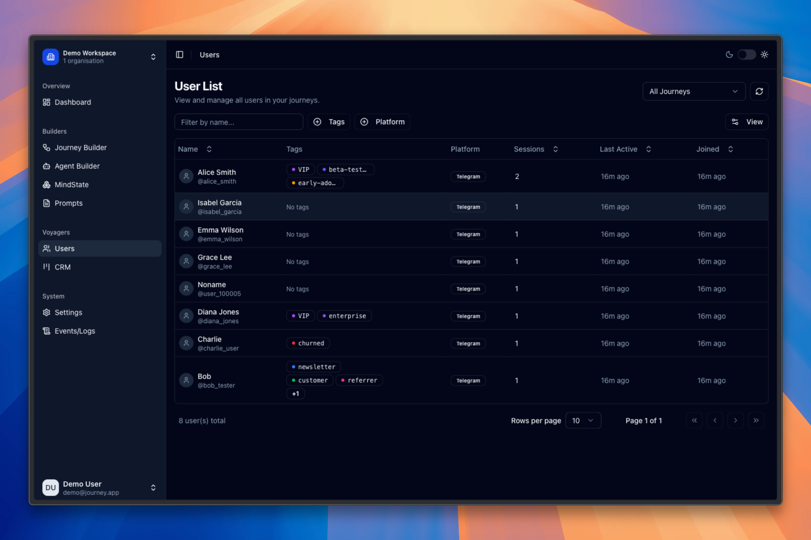
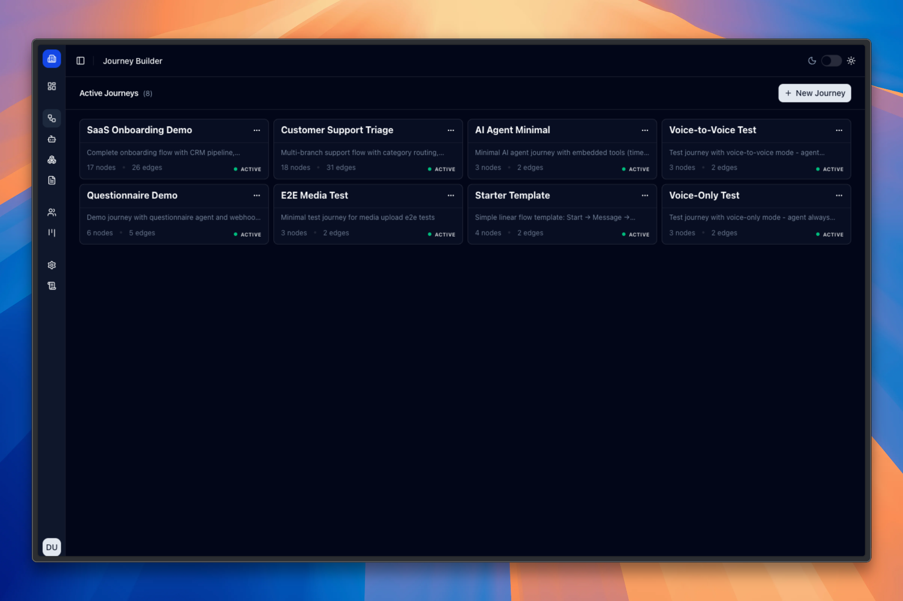

# Journey

> ## ⚠️ Heads up — read before using
>
> I built this **for my wife, for fun**. It's heavily _vibe-coded_ (AI-assisted,
> fast-and-loose) and shared **as-is** under the MIT license. It is **not**
> production-hardened: expect rough edges, sharp corners, and missing safeguards.
>
> **Use at your own risk.** Don't point it at real user data or secrets you care
> about, and review the code before deploying anything. No warranty, no support.
> Made with 💛.

Journey is a no-code platform for building, simulating, and running **automated chat flows** — drag-and-drop conversations powered by AI agents and delivered over messaging channels like Telegram. Design a flow visually, test it in a live simulator, then let the runtime engine execute it for real users.

## What it solves

Building a conversational product — an onboarding sequence, a support bot, a survey, a lead-nurture flow — usually means writing and wiring up a lot of custom code. Journey turns that into something you can **draw**: lay the conversation out as a flowchart, drop in AI agents where you need intelligence, branch on user input or logic, and connect it to messaging, webhooks, and a CRM. Test the whole thing in a simulator, then publish it to run against real users on Telegram.

Typical use cases: product onboarding, support triage, questionnaires & assessments, lead qualification, and coaching / follow-up flows.

## Features

### Visual flow builder

Compose conversations on a canvas from typed, drag-and-drop nodes:

- **Message** (rich text/markdown with quick-reply buttons, media, and optional voice), **AI Agent**, **Condition** (expression-based routing), **Questionnaire** (sequential Q&A with a shared timeout & progress), **Wait** (timers, e.g. "5 min" or "1 day"), **Webhook** (call any API, store the response in a variable, retry/continue on error), **Teleport** (jump between flows), **CRM** (move a contact across pipeline stages), and **Start / End** — plus a **Follow-Up** plugin that attaches scheduled nudges to any node.
- Labelled branching edges and multi-path routing, undo/redo, auto-layout, and full **versioning** (publish / discard / history).
- **Import / export** flows as JSON to share, back up, or move between workspaces.

### AI agents

- A full **visual agent-workflow builder** — design single- and multi-agent workflows on their own canvas from typed nodes: **Agent**, **Context** (inject knowledge/memory), **Guard** (safety checks), **If/Else**, **Question**, **Transform**, **Set State**, **User Approval** (human-in-the-loop), **MCP**, and **Start / End**.
- Built-in **guardrails & middleware** — LLM guard, PII detection, model fallback, model-call limits, and HITL approvals.
- Agents can call tools: built-in **web search (Tavily)** and internal tools (variables, messaging, memory, tags, journey context), plus any external tool exposed over the **Model Context Protocol (MCP)** — including a fetch server that turns web pages into markdown.
- A reusable agent library (Demo Assistant, Multi-Agent Router, Memory Agent, Question Understanding, …) with **conversation memory** and semantic recall.

### MindState

- **Theory-of-Mind–inspired** state tracking — much like a person inferring what someone else is thinking and feeling, MindState models each user's **emotional, cognitive, and motivational state** as a conversation unfolds, so flows can adapt to how someone actually feels.
- A main companion agent plus specialized sub-agents (General Observer, Emotion Analyzer, Cognitive Analyst, Motivation Tracker).
- Configurable parameters across categories — Mood, Stress, Energy, Focus, Cognitive Load, Interest, Urgency, Rapport, Topic Familiarity — with live state values and an Insights view.

### Prompt builder

- A **versioned prompt library** (chat & text prompts) with production versions and a focused editor.
- Variable templating (`{{variable}}`) with mapping and preview, plus voice-director prompts that shape **text-to-speech** output.

### Simulator

- Run any flow in a **live chat** without leaving the builder — pick a test user/persona (or stay Anonymous), step through the conversation, and watch a **real-time event console** with optional debug panels (node outputs, state inspector, event log).
- **Replay & impersonation** — load a real user's recorded session and step through it event-by-event, or upload/export sessions as JSON.

### CRM

- Multiple **pipelines** (Sales, Support, Partner Onboarding) as kanban boards with customizable stages.
- Drag contacts between stages, tag and segment them (VIP, enterprise, churned, …), and message them directly.

### Audience & users

- A unified **user list** across all flows — platform (Telegram), session counts, last-active, tags, and per-flow filtering.
- Inspect a user's activity timeline, then impersonate and replay any of their sessions in the simulator.

### Accounts & workspaces

- **Authentication** and session management via Better Auth, with **multi-tenant organizations** — all data is scoped per workspace.
- Per-user profiles, organization branding, appearance/theme, and a mock-auth user switcher for testing multi-tenant behavior in dev.

### Channels & integrations

- **Telegram** delivery (webhooks, typing indicators, inline buttons, media), and **voice** via **ElevenLabs** and **OpenAI** TTS plus **Whisper** speech-to-text (voice-only and voice-to-voice modes).
- Multiple **LLM providers** — OpenAI, Anthropic, Gemini, Groq, and Cerebras (via LangChain) with a model registry that tracks capabilities and per-call cost.
- Web search (Tavily), media storage (MinIO / S3), and external tools for agents via **MCP**.

### Under the hood

- A runtime **engine** executes flows for real users with durable **sessions**, scheduled **timers** (BullMQ / Redis), global & per-flow **variables**, distributed session locking, rate limiting, and circuit breakers.
- An **Events / Logs** view for debugging live runs, with **LLM usage & cost tracking** (tokens and spend per call/model) and a CRM activity log.
- **Semantic memory** — conversation history with vector (pgvector) recall — and an **AI-report** layer that generates structured, AI-optimized session reports.

## Screenshots

**Flow builder** — drag-and-drop nodes (message, AI agent, condition, webhook, timer, questionnaire…) wired into branching conversations:



**Simulator** — test a flow in a live chat with a real-time event console:



|        Agent builder — multi-agent workflows         |  MindState — mood / focus / stress tracking  |
| :--------------------------------------------------: | :------------------------------------------: |
|  |  |

|        Prompt builder — versioned prompt editor        | CRM — drag contacts across pipeline stages |
| :----------------------------------------------------: | :----------------------------------------: |
|  |            |

|        Dashboard — workspace overview        | Users — audience & Telegram contacts |
| :------------------------------------------: | :----------------------------------: |
|  |  |

|          Flow library — your active flows          |
| :------------------------------------------------: |
|  |

## Tech stack

### Frontend (apps/web)

- React 19
- Vite 6
- TanStack Router, Query, Store, Form, Table, Virtual
- Tailwind CSS v4
- Radix UI and shadcn/ui
- @xyflow/react (flow canvas), CodeMirror & Monaco (editors)
- Better Auth (client)

### Backend (apps/api)

- Hono on **Node.js** (`@hono/node-server`), run with `tsx`
- Drizzle ORM + PostgreSQL (pgvector)
- BullMQ + Redis (timers, queues, rate limiting)
- Better Auth (sessions, multi-tenant orgs)
- MinIO / S3 for media (`@aws-sdk/client-s3`)

### Service (apps/mcp)

- Hono-based MCP service on Node.js for agent tool orchestration

### Shared packages

- Zod schemas in @journey/schemas
- Execution engine in @journey/engine
- Engine integrations in @journey/engine-integrations
- Database schema/client in @journey/db
- Structured logging in @journey/logger
- LLM utilities in @journey/llm
- Mindstate utilities in @journey/mindstate
- AI session reports in @journey/ai-report
- Infra helpers (circuit breakers) in @journey/infra
- MCP client/types in @journey/mcp

### Monorepo and testing

- Turborepo, pnpm workspaces
- TypeScript executed via `tsx` (no separate build step in dev)
- Vitest, Playwright

## Project structure

```
journey/
├── apps/
│   ├── web/                       # React frontend
│   │   └── src/
│   │       ├── features/          # Feature modules
│   │       ├── shared/            # Shared components, hooks, lib
│   │       ├── stores/            # Global stores
│   │       ├── routes/            # TanStack Router pages
│   │       ├── providers/         # React context providers
│   │       ├── hooks/             # App-wide hooks
│   │       └── data/              # Sample journeys and fixtures
│   ├── api/                       # Hono API server (Node.js)
│   │   └── src/
│   │       ├── modules/           # Domain modules and routers
│   │       ├── services/          # Business logic
│   │       ├── adapters/          # External integrations (Telegram, …)
│   │       ├── event-bus/         # Event bus utilities
│   │       ├── config/            # Config and env handling
│   │       └── lib/               # Shared helpers
│   └── mcp/                       # MCP service (Node.js)
│       └── src/
│           ├── routes/            # MCP HTTP endpoints
│           ├── services/          # MCP manager and orchestration
│           └── config/            # MCP config
├── packages/
│   ├── engine/                    # Journey runtime engine
│   ├── engine-integrations/       # Engine integrations
│   ├── schemas/                   # Zod schemas and shared types
│   ├── db/                        # Database schema and client
│   ├── logger/                    # Structured logging
│   ├── llm/                       # LLM utilities
│   ├── mindstate/                 # Mindstate utilities
│   ├── ai-report/                 # AI-optimized session reports
│   ├── infra/                     # Shared infrastructure helpers
│   └── mcp/                       # MCP client and types
├── docs/                          # Project documentation
└── scripts/                       # Repo scripts
```

## Development

Prereqs:

- Node.js 22+
- pnpm 10+
- Docker (for PostgreSQL, Redis, and MinIO)

Setup:

```bash
pnpm install

# Copy env files, then fill in secrets + LLM keys (generation hints are in the files)
cp apps/api/.env.example apps/api/.env
cp packages/db/.env.example packages/db/.env
cp apps/web/.env.example apps/web/.env

# Start infra, create the schema, and seed demo data
docker compose -f service/docker/docker-compose.yml up -d   # Postgres + Redis + MinIO
pnpm db:reset-full

# Run everything (web :3000 · api :3001 · mcp :3002)
pnpm dev
```

Then log in with the demo credentials below. Other useful commands:

```bash
pnpm typecheck
pnpm test
```

See [START.md](./START.md) for the full setup walkthrough, including Telegram bot setup.

## Demo credentials (local dev)

See `START.md` for setup details. After seeding, use:

| User      | Email             | Password  |
| --------- | ----------------- | --------- |
| Demo User | demo@journey.app  | demo1234  |
| Arina     | arina@journey.app | arina1234 |

## Documentation

Start here:

- docs/dev/architecture/project-structure.md
- docs/dev/guides/junior-developer-guide.md
- docs/api/README.md
- docs/db/README.md
- docs/engine/README.md
- docs/llm/README.md
- docs/mcp/README.md
- docs/deploy/production-deployment.md

## License

MIT © Andrew Derevo — see [LICENSE](./LICENSE). Provided as-is, with no warranty of any kind.
