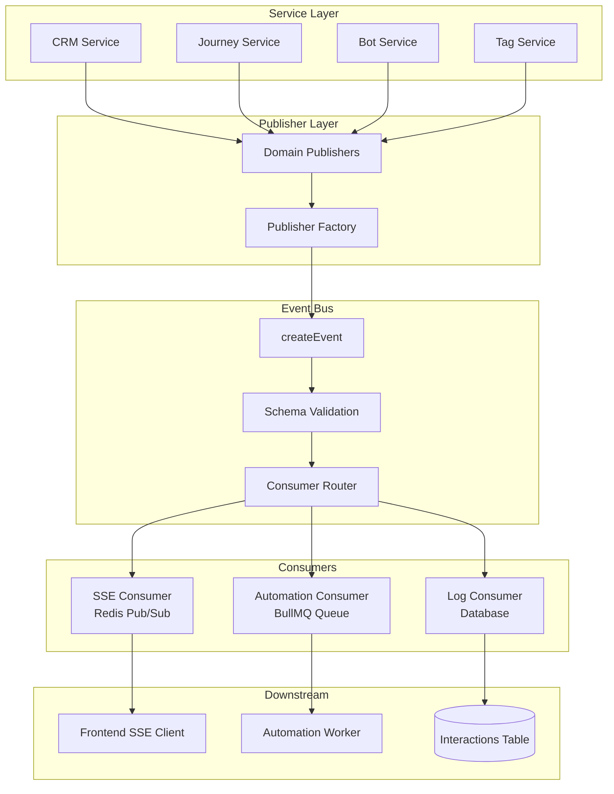
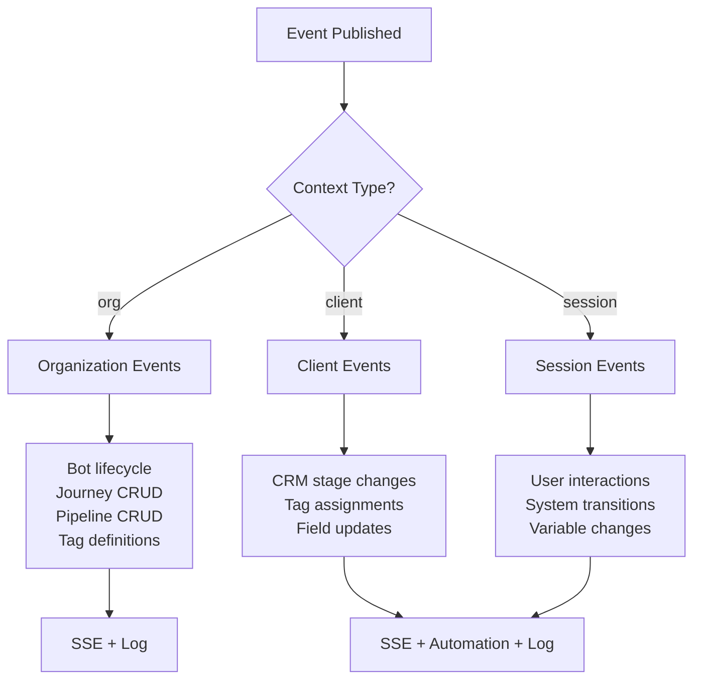
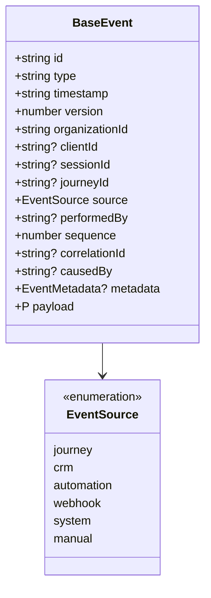
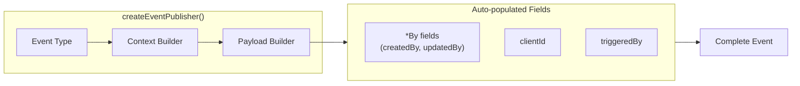
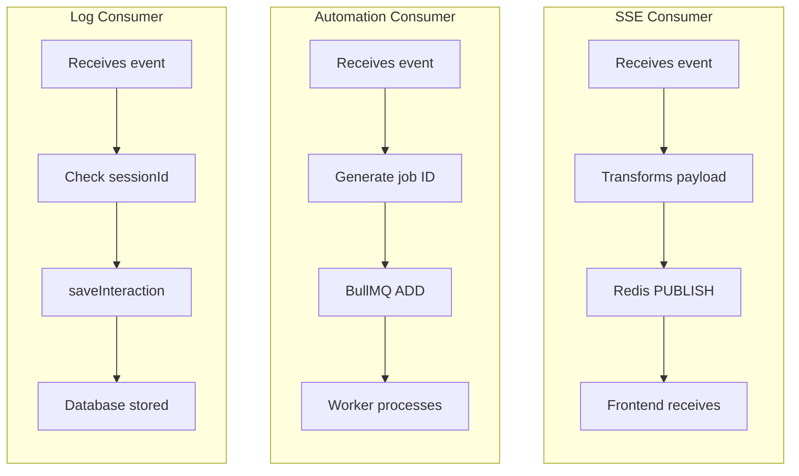
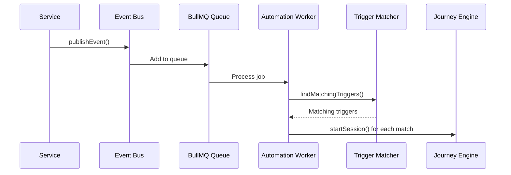

# Events System

The Journey platform uses a unified event system to manage all events across modules. This document provides a comprehensive guide to understanding and using the events system.

## Table of Contents

- [Overview](#overview)
- [Architecture](#architecture)
- [Event Structure](#event-structure)
- [Event Types](#event-types)
- [Publishing Events](#publishing-events)
- [Consuming Events](#consuming-events)
- [Automation Triggers](#automation-triggers)
- [Adding New Events](#adding-new-events)
- [Best Practices](#best-practices)
- [Event Replay](#event-replay)
- [Event Versioning](#event-versioning)
- [Event Tracing](#event-tracing)
- [Rate Limiting](#rate-limiting)
- [Health Checks](#health-checks)
- [Event Retention](#event-retention)
- [Event Metadata](#event-metadata)

---

## Overview

The events system provides:

- **Single API** - One `publishEvent()` function for all modules
- **Type-safe publishing** - Publisher factory with compile-time type checking
- **Multi-consumer routing** - Events automatically routed to SSE, automation queue, and database
- **Registry-based validation** - Zod schemas validate all event payloads
- **Context-aware publishing** - Automatic field population based on event context
- **Sequence tracking** - Event ordering for deduplication and missed event detection

### When to Use Events

- Real-time UI updates (SSE streaming)
- Triggering automation workflows
- Audit logging and history
- Cross-module communication

---

## Architecture

### High-Level Event Flow



### Consumer Architecture

```mermaid
flowchart LR
    subgraph Input["Event Input"]
        E[BaseEvent]
    end

    subgraph Registry["Event Registry"]
        R{Lookup<br/>consumers[]}
    end

    subgraph Routing["Parallel Routing"]
        direction TB
        SSE["SSE<br/>org-scoped"]
        AUTO["Automation<br/>registry-driven"]
        LOG["Log<br/>events + interactions"]
    end

    subgraph Output["Output"]
        Redis[(Redis<br/>Pub/Sub)]
        Queue[(BullMQ<br/>Queue)]
        DB[(Database)]
    end

    E --> R
    R --> SSE
    R --> AUTO
    R --> LOG

    SSE --> Redis
    AUTO --> Queue
    LOG --> DB
```

### Context Type Decision Tree



### Key Components

| Component | Location | Purpose |
|-----------|----------|---------|
| Event Bus | `apps/api/src/event-bus/event-bus.ts` | Central routing and publishing |
| Publisher Factory | `apps/api/src/event-bus/publisher-factory.ts` | Type-safe event creation |
| Domain Publishers | `apps/api/src/event-bus/publishers/` | Module-specific publishers |
| Event Registry | `packages/schemas/src/events/registry.ts` | Event definitions and routing |
| Payload Schemas | `packages/schemas/src/events/payloads/` | Zod validation schemas |
| SSE Consumer | `apps/api/src/event-bus/consumers/sse-consumer.ts` | Redis pub/sub streaming |
| Automation Consumer | `apps/api/src/event-bus/consumers/automation-consumer.ts` | BullMQ queue for triggers |
| Log Consumer | `apps/api/src/event-bus/consumers/log-consumer.ts` | Database persistence |

---

## Event Structure

### Base Event Schema



Every event follows the `BaseEvent` structure:

```typescript
interface BaseEvent<T extends string = string, P = unknown> {
  // Identity
  id: string;           // UUID - auto-generated
  type: T;              // Event type (e.g., "crm.stage.changed")
  timestamp: string;    // ISO timestamp - auto-generated
  version: number;      // Schema version (default: 1)

  // Context - required
  organizationId: string;

  // Context - optional
  clientId?: string;    // Required for automation triggers
  sessionId?: string;   // Required for log persistence
  journeyId?: string;

  // Source tracking
  source: EventSource;  // Who triggered this event
  performedBy?: string; // User ID if human-triggered

  // Ordering
  sequence: number;     // Per-org sequence for ordering

  // Tracing
  correlationId?: string; // Correlate related events across requests
  causedBy?: string;      // Link to parent event ID

  // Metadata
  metadata?: EventMetadata;

  // Payload
  payload: P;           // Event-specific data
}
```

### Event Sources

| Source | Description |
|--------|-------------|
| `journey` | From journey engine (node execution) |
| `crm` | From CRM UI/API operations |
| `automation` | From automation trigger |
| `webhook` | From external webhook |
| `system` | From internal system operations |
| `manual` | From manual user action via UI |

### Context Types

Events are categorized by their required context:

| Context | Required Fields | Example Events |
|---------|-----------------|----------------|
| `org` | `organizationId` | Bot lifecycle, Journey CRUD, Pipeline CRUD |
| `client` | `organizationId`, `clientId` | CRM stage changes, Tag assignments |
| `session` | `organizationId`, `clientId`, `sessionId` | User messages, System transitions |

---

## Event Types

### Naming Convention

Events follow the pattern: `module.entity.action` or `actor.action`

Examples:
- `crm.stage.changed` - Client moved to different CRM stage
- `tag.assigned` - Tag assigned to client
- `journey.session.started` - Journey session started
- `user.message` - User sent a text message
- `system.transition` - Engine moved user between nodes

### Event Categories Summary

| Category | Examples | Description |
|----------|----------|-------------|
| `bot` | `bot.created`, `bot.webhook.registered` | Channel lifecycle events |
| `crm` | `crm.stage.changed`, `crm.pipeline.updated` | CRM pipeline, stage, field, message operations |
| `tag` | `tag.assigned`, `tag.definition.updated` | Tag assignments and definitions |
| `variable` | `variable.changed` | Variable value changes |
| `journey` | `journey.created`, `journey.session.started` | Journey lifecycle and sessions |
| `interaction` | `user.message`, `system.transition` | User and system interactions |
| `workflow` | `workflow.started`, `workflow.approval.requested` | Workflow execution lifecycle |

See `packages/schemas/src/events/registry.ts` for the full list.

---

### Bot Events

| Event Type | Consumers | Context | Description |
|------------|-----------|---------|-------------|
| `bot.created` | sse, log | org | New bot registered |
| `bot.updated` | sse, log | org | Bot configuration updated |
| `bot.deleted` | sse, log | org | Bot deleted |
| `bot.activated` | sse, log | org | Bot activated |
| `bot.deactivated` | sse, log | org | Bot deactivated |
| `bot.webhook.registered` | sse, log | org | Bot webhook URL registered |

---

### CRM Events

#### Stage Events

| Event Type | Consumers | Context | Description |
|------------|-----------|---------|-------------|
| `crm.stage.changed` | sse, automation, log | client | Client moved to different stage |
| `crm.stage.created` | sse, log | org | New stage created in pipeline |
| `crm.stage.updated` | sse, log | org | Stage configuration updated |
| `crm.stage.deleted` | sse, log | org | Stage deleted from pipeline |
| `crm.stages.reordered` | sse, log | org | Stages reordered in pipeline |

#### Pipeline Events

| Event Type | Consumers | Context | Description |
|------------|-----------|---------|-------------|
| `crm.pipeline.entered` | sse, automation, log | client | Client entered a pipeline |
| `crm.pipeline.exited` | sse, log | client | Client exited a pipeline |
| `crm.pipeline.created` | sse, log | org | New pipeline created |
| `crm.pipeline.updated` | sse, log | org | Pipeline configuration updated |
| `crm.pipeline.deleted` | sse, log | org | Pipeline deleted |
| `crm.pipeline.default_set` | sse, log | org | Default pipeline changed |

#### Field & Message Events

| Event Type | Consumers | Context | Description |
|------------|-----------|---------|-------------|
| `crm.field.updated` | sse, automation, log | client | Custom field value changed |
| `crm.message.sent` | sse, log | client | Direct message sent to client |
| `crm.tag.assigned` | sse, log | client | Tag assigned via CRM UI |
| `crm.tag.removed` | sse, log | client | Tag removed via CRM UI |

---

### Tag Events

| Event Type | Consumers | Context | Description |
|------------|-----------|---------|-------------|
| `tag.assigned` | sse, automation, log | client | Tag assigned to client |
| `tag.removed` | sse, automation, log | client | Tag removed from client |
| `tag.definition.created` | sse, log | org | New tag definition created |
| `tag.definition.updated` | sse, log | org | Tag definition updated |
| `tag.definition.deleted` | sse, log | org | Tag definition deleted |

---

### Variable Events

| Event Type | Consumers | Context | Description |
|------------|-----------|---------|-------------|
| `variable.changed` | sse, automation, log | session | Variable value changed |

---

### Journey Events

#### Lifecycle Events

| Event Type | Consumers | Context | Description |
|------------|-----------|---------|-------------|
| `journey.created` | sse, log | org | New journey created |
| `journey.updated` | sse, log | org | Journey configuration updated |
| `journey.deleted` | sse, log | org | Journey deleted |
| `journey.activated` | sse, log | org | Journey activated |
| `journey.deactivated` | sse, log | org | Journey deactivated |

#### Session Events

| Event Type | Consumers | Context | Description |
|------------|-----------|---------|-------------|
| `journey.session.started` | sse, automation, log | session | Journey session started |
| `journey.session.completed` | sse, automation, log | session | Journey session completed |

#### Trigger Events

| Event Type | Consumers | Context | Description |
|------------|-----------|---------|-------------|
| `journey.schedule.fired` | automation | org | Scheduled trigger fired |
| `journey.webhook.received` | automation | org | External webhook received |

---

### Workflow Events

| Event Type | Consumers | Context | Description |
|------------|-----------|---------|-------------|
| `workflow.started` | sse, log | session | Workflow execution started |
| `workflow.completed` | sse, log | session | Workflow execution completed |
| `workflow.error` | sse, log | session | Workflow execution failed |
| `workflow.step.started` | sse, log | session | Workflow step started |
| `workflow.step.completed` | sse, log | session | Workflow step completed |
| `workflow.step.error` | sse, log | session | Workflow step failed |
| `workflow.paused` | sse, log | session | Workflow paused (approval/guard) |
| `workflow.resumed` | sse, log | session | Workflow resumed |
| `workflow.approval.requested` | sse, log | session | Approval requested |
| `workflow.approval.response` | sse, log | session | Approval response recorded |
| `workflow.guard.blocked` | sse, log | session | Guard blocked execution |

---

### Interaction Events

#### User Actions

| Event Type | Consumers | Context | Description |
|------------|-----------|---------|-------------|
| `user.message` | sse, log | session | User sent text message |
| `user.click` | sse, log | session | User clicked button |

#### System Actions

| Event Type | Consumers | Context | Description |
|------------|-----------|---------|-------------|
| `system.message` | sse, log | session | Bot sent message |
| `system.transition` | sse, log | session | Engine moved user between nodes |
| `system.timeout` | sse, log | session | Timer expired |
| `system.error` | sse, log | session | Error during execution |
| `system.tags` | sse, log | session | Tags modified during journey |
| `system.variables` | sse, log | session | Variables modified during journey |

---

## Publishing Events

### Publisher Factory Pattern



The publisher factory creates type-safe publishers with automatic field population:

```typescript
import { publishers } from "../events";

// CRM stage change
await publishers.crm.stageChanged(
  {
    organizationId: "org-123",
    clientId: "client-456",
    triggeredBy: "manual",
    performedBy: "user-xyz",
  },
  {
    pipelineId: "pipe-1",
    pipelineName: "Sales",
    fromStageId: "stage-1",
    fromStageName: "Lead",
    toStageId: "stage-2",
    toStageName: "Qualified",
    durationMs: 86400000,
    notes: "Good prospect",
  }
);

// Journey created
await publishers.journey.created(
  {
    organizationId: "org-123",
    performedBy: "user-xyz",
  },
  {
    journeyId: "journey-1",
    journeyName: "Welcome Flow",
    slug: "welcome-flow",
    // createdBy is auto-added from performedBy
  }
);

// Tag assigned
await publishers.tag.assigned(
  {
    organizationId: "org-123",
    clientId: "client-456",
    triggeredBy: "journey",
    performedBy: null,
  },
  {
    tagId: "tag-1",
    tagName: "VIP",
    // clientId is auto-added from context
  }
);
```

### Domain Publishers

Publishers are organized by domain:

```typescript
import { publishers } from "../events";

// Or import individually
import { crm, journey, bot, tag, variable, interaction } from "../events";

// Available publishers:
publishers.crm.stageChanged(ctx, data);
publishers.crm.stageCreated(ctx, data);
publishers.crm.pipelineEntered(ctx, data);
// ... etc

publishers.journey.created(ctx, data);
publishers.journey.sessionStarted(ctx, data);
// ... etc

publishers.bot.created(ctx, data);
publishers.bot.activated(ctx, data);
// ... etc

publishers.tag.assigned(ctx, data);
publishers.tag.removed(ctx, data);
// ... etc

publishers.interaction.userMessage(ctx, data);
publishers.interaction.systemTransition(ctx, data);
// ... etc

publishers.workflow.started(ctx, data);
publishers.workflow.approvalRequested(ctx, data);
// ... etc
```

### Low-Level API

For advanced use cases, you can use the event bus directly:

```typescript
import { createEvent, publishEvent } from "../events/event-bus";

await publishEvent(
  createEvent(
    "crm.stage.changed",           // Event type
    organizationId,                 // Required context
    {                               // Payload
      clientId: "client-456",
      pipelineId: "pipe-123",
      pipelineName: "Sales",
      fromStageId: "stage-1",
      fromStageName: "Lead",
      toStageId: "stage-2",
      toStageName: "Qualified",
      durationMs: 86400000,
      notes: null,
    },
    {                               // Optional context
      clientId: "client-456",
      sessionId: "session-789",
      journeyId: "journey-abc",
      performedBy: "user-xyz",
      source: "manual",
    }
  )
);
```

### Publish Options

```typescript
await publishEvent(event, {
  skipValidation: false,  // Skip payload schema validation
  throwOnError: false,    // Throw on consumer errors instead of continuing
});
```

---

## Consuming Events

### Consumer Types



#### SSE Consumer (Real-time Streaming)

- **Transport**: Redis pub/sub
- **Channel**: `events:${organizationId}`
- **Usage**: Frontend subscribes via `/api/events/stream`

```typescript
// Frontend subscription
const eventSource = new EventSource('/api/events/stream');
eventSource.onmessage = (event) => {
  const data = JSON.parse(event.data);
  console.log('Event received:', data.type);
};
```

#### Automation Consumer (BullMQ Queue)

- **Transport**: BullMQ Redis queue
- **Queue**: `journey-events`
- **Features**:
  - Deduplication via deterministic job IDs
  - FIFO processing per client via group keys
  - Sequence tracking for ordering
- **Routing**: event registry controls which event types reach the automation consumer; matcher/handler further filter by trigger type

```typescript
// Group key pattern for FIFO ordering
`client:${organizationId}:${clientId}`  // Client-specific events
`org:${organizationId}`                  // Org-level events
```

#### Log Consumer (Database Persistence)

- **Storage**: always writes to `events`, and writes to `interactions` when `sessionId` is present
- **Filtering**: session-less events still land in `events`
- **Metadata**: includes source, performedBy, timestamp, eventId, correlationId

### Consumer Routing

Routing is defined in the event registry:

```typescript
// In packages/schemas/src/events/registry.ts
"crm.stage.changed": {
  category: "crm",
  description: "Client moved to a different stage",
  consumers: ["sse", "automation", "log"],  // Routes to these consumers
  level: "info",
  contextType: "client",
  payloadSchema: CrmStageChangedPayloadSchema,
},
```

---

## Automation Triggers

Events can trigger automation workflows. The automation system:

1. Receives events via the automation consumer
2. Matches events against configured triggers
3. Starts new journey sessions for matching triggers

### Trigger Types

| Trigger Type | Event | Description |
|--------------|-------|-------------|
| `tag_change` | `tag.assigned`, `tag.removed` | When tag is added/removed |
| `variable_condition` | `variable.changed` | When variable meets condition |
| `journey_completed` | `journey.session.completed` | When journey ends |
| `crm_stage_change` | `crm.stage.changed` | When CRM stage changes |
| `crm_pipeline_entered` | `crm.pipeline.entered` | When client enters pipeline |
| `crm_field_change` | `crm.field.updated` | When CRM field changes |
| `schedule` | `journey.schedule.fired` | Cron-based schedule |
| `webhook` | `journey.webhook.received` | External webhook |

### Automation Flow



---

## Adding New Events

### Step 1: Define Payload Schema

Create or update a payload file in `packages/schemas/src/events/payloads/`:

```typescript
// packages/schemas/src/events/payloads/my-module.ts
import { z } from "zod";

export const MyEventPayloadSchema = z.object({
  fieldA: z.string(),
  fieldB: z.number(),
  fieldC: z.boolean().optional(),
});

export type MyEventPayload = z.infer<typeof MyEventPayloadSchema>;
```

Export from index:

```typescript
// packages/schemas/src/events/payloads/index.ts
export * from "./my-module";
```

### Step 2: Register Event Type

Add to the event registry:

```typescript
// packages/schemas/src/events/registry.ts
import { MyEventPayloadSchema } from "./payloads";

export const EVENT_REGISTRY: Record<string, EventRegistryEntry> = {
  // ... existing events

  "my-module.entity.action": {
    category: "my-module",        // Add to EventCategory if new
    description: "Description of what happened",
    consumers: ["sse", "log"],    // Which consumers receive this
    level: "info",
    contextType: "client",        // org, client, or session
    logContext: "my-module:entity:action",
    payloadSchema: MyEventPayloadSchema,
  },
};
```

### Step 3: Create Publisher

Add to domain publishers:

```typescript
// apps/api/src/event-bus/publishers/my-module.ts
import { createEventPublisher } from "../events/publisher-factory";

export const entityAction = createEventPublisher("my-module.entity.action");

// Export from index
export const myModule = {
  entityAction,
};
```

### Step 4: Use the Publisher

```typescript
import { publishers } from "../events";

await publishers.myModule.entityAction(
  { organizationId, clientId, triggeredBy, performedBy },
  { fieldA: "value", fieldB: 42 }
);
```

---

## Best Practices

### 1. Use Domain Publishers

Prefer the type-safe domain publishers:

```typescript
// Good - type-safe, auto-populates fields
await publishers.crm.stageChanged(ctx, data);

// Works but verbose
await publishEvent(createEvent("crm.stage.changed", ...));
```

### 2. Include Required Context

```typescript
// Good - includes all required fields
await publishers.tag.assigned(
  {
    organizationId,
    clientId,      // Required for automation
    triggeredBy: "journey",
    performedBy: null,
  },
  { tagId, tagName }
);

// Missing context - automation won't trigger
await publishers.tag.assigned(
  { organizationId, triggeredBy: "journey" },  // No clientId!
  { tagId, tagName }
);
```

### 3. Handle Consumer Errors Gracefully

Consumers should not throw errors that break the event flow:

```typescript
async handle(event: BaseEvent): Promise<void> {
  try {
    await processEvent(event);
  } catch (error) {
    // Log but don't throw
    log.warn({ err: serializeError(error) }, "consumer:error");
  }
}
```

### 4. Use Consistent Naming

Follow the `module.entity.action` pattern:

```typescript
// Good
"crm.stage.changed"
"tag.assigned"
"journey.session.started"

// Bad
"stageChanged"
"TAG_ASSIGNED"
"journey-started"
```

### 5. Validate Before Publishing

The event bus validates payloads against schemas. If validation fails:

- Event is not published
- Error is logged
- No consumers receive the event

---

## Debugging

### View Event Logs

Events are logged by the event bus:

```
eventBus:publishing { eventType, organizationId, clientId, consumers }
eventBus:consumer:success { eventType, consumer }
eventBus:consumer:error { eventType, consumer, error }
```

### Check Consumer Status

```typescript
import { isEventBusInitialized } from "./events/event-bus";
import { getAutomationQueue } from "./events/consumers/automation-consumer";

// Check if event bus is ready
console.log("Event bus initialized:", isEventBusInitialized());

// Check automation queue
const queue = getAutomationQueue();
console.log("Automation queue:", queue ? "ready" : "not initialized");
```

### Test Event Publishing

```typescript
// In tests, mock the event bus
vi.mock("../events/event-bus", () => ({
  publishEvent: vi.fn().mockResolvedValue(undefined),
  createEvent: vi.fn((type, orgId, payload, opts) => ({
    id: "test-id",
    type,
    timestamp: new Date().toISOString(),
    organizationId: orgId,
    payload,
    ...opts,
  })),
}));
```

---

## Server Initialization

The event system is initialized during server startup:

```typescript
// 1. Register consumers
registerEventConsumer(sseConsumer);
registerEventConsumer(automationConsumer);
registerEventConsumer(logConsumer);

// 2. Initialize automation queue (requires Redis)
initAutomationConsumerQueue();

// 3. Start event bus router
initEventBus();

// 4. Initialize automation event service (worker)
await initAutomationEventService(handleAutomationEvent);
```

Graceful shutdown (reverse order):

```typescript
await shutdownAutomationEventService();
await shutdownTimerService();
await shutdownAutomationConsumerQueue();
shutdownEventBus();
await closeRedisConnection();
```

---

## Event Replay

The events system supports event replay for rebuilding state after downtime, debugging, and audit trails.

### Replay API

```
GET /api/events/replay?sinceSequence=1234&types=crm.*&limit=100
```

**Query Parameters:**

| Parameter | Type | Description |
|-----------|------|-------------|
| `sinceSequence` | number | Get events with sequence > this value |
| `startDate` | ISO string | Filter by timestamp start |
| `endDate` | ISO string | Filter by timestamp end |
| `types` | string | Event types (comma-separated, supports wildcards like `crm.*`) |
| `clientId` | string | Filter by client |
| `sessionId` | string | Filter by session |
| `journeyId` | string | Filter by journey |
| `limit` | number | Max events to return (default 100, max 1000) |
| `offset` | number | Pagination offset |
| `order` | string | `asc` (oldest first) or `desc` (newest first) |

**Response:**

```json
{
  "events": [...],
  "pagination": {
    "total": 1000,
    "limit": 100,
    "offset": 0,
    "hasMore": true
  }
}
```

### Get Latest Sequence

```
GET /api/events/replay/latest
```

Returns the latest sequence number for the organization:

```json
{
  "organizationId": "org-uuid",
  "latestSequence": 12345
}
```

### Event Persistence

All events are persisted to the `events` table:

```sql
events
├── id (uuid, primary key)
├── type (text)
├── timestamp (timestamp)
├── version (integer) -- Schema version
├── organization_id (uuid)
├── client_id (uuid, optional)
├── session_id (uuid, optional)
├── journey_id (uuid, optional)
├── source (text)
├── performed_by (text, optional)
├── sequence (integer) -- Per-org sequence
├── correlation_id (uuid, optional)
├── caused_by (uuid, optional)
├── payload (jsonb)
└── metadata (jsonb)
```

---

## Event Versioning

Events include a `version` field for schema evolution. This enables:

- Tracking schema changes over time
- Future migration capabilities
- Backward compatibility analysis

### Version Field

```typescript
interface BaseEvent<T extends string = string, P = unknown> {
  // ... other fields
  version: number;  // Schema version (starts at 1)
}
```

All events in the registry include `version: 1` by default:

```typescript
"crm.stage.changed": {
  version: 1,  // Schema version
  category: "crm",
  // ... other fields
}
```

---

## Event Tracing

The events system supports distributed tracing through `correlationId` and `causedBy` fields.

### Tracing Fields

```typescript
interface BaseEvent {
  // ... other fields
  correlationId?: string;  // Links all events in a request
  causedBy?: string;       // ID of parent event
}
```

### Automatic Correlation

The tracing middleware automatically populates `correlationId` for all events created during a request:

```typescript
// All events in this request share the same correlationId
await publishers.crm.stageChanged(ctx, data);
await publishers.tag.assigned(ctx, data);  // Same correlationId
```

### Causal Chains

Use `causedBy` to track event chains:

```typescript
// Event A causes Event B
const eventA = await publishers.crm.stageChanged(ctx, data);

// Event B references Event A
setCausedBy(eventA.id);
await publishers.tag.assigned(ctx, tagData);
```

### Querying Related Events

The replay API does not filter by `correlationId` today. To inspect a causal chain:

- filter by `types`, `sessionId`, or `clientId` via `/api/events/replay`
- or query the `events` table directly with SQL

---

## Rate Limiting

Events are rate-limited per organization to prevent abuse.

### Configuration

```typescript
const RATE_LIMITS = {
  events: {
    maxTokens: 1000,      // Max events per interval
    refillRate: 1000,     // Tokens refilled per interval
    refillInterval: 60,   // Interval in seconds
  },
};
```

### Behavior

- Uses token bucket algorithm with Redis
- Drops events when limit exceeded (unless `throwOnError` is enabled)
- System events can skip rate limiting

### Skipping Rate Limit

For internal system events:

```typescript
await publishEvent(event, {
  skipRateLimit: true,  // Skip for system events
});
```

To surface an error to the caller, pass `throwOnError: true` and handle the exception.

---

## Health Checks

### Event System Health

```
GET /api/events/health
```

Returns health status for event system components:

```json
{
  "status": "healthy",
  "timestamp": "2024-01-01T00:00:00.000Z",
  "components": {
    "redis": {
      "status": "healthy",
      "latency": 5,
      "message": "Redis connection is healthy"
    },
    "eventBus": {
      "status": "healthy",
      "message": "Event bus is initialized and ready"
    },
    "queues": {
      "status": "healthy",
      "latency": 3,
      "message": "Queue system is operational"
    }
  }
}
```

### Detailed System Health

```
GET /health/detailed
```

Returns comprehensive health for all components:

```json
{
  "status": "healthy",
  "timestamp": "2024-01-01T00:00:00.000Z",
  "components": {
    "database": { "status": "healthy", "latency": 10 },
    "redis": { "status": "healthy", "latency": 5 },
    "eventBus": { "status": "healthy" },
    "queues": { "status": "healthy", "latency": 3 }
  },
  "summary": {
    "totalComponents": 4,
    "healthyComponents": 4,
    "degradedComponents": 0,
    "unhealthyComponents": 0
  }
}
```

---

## Event Retention

Events and related tables are automatically cleaned up based on retention policy.

### Configuration

```bash
EVENT_RETENTION_DAYS=90  # Default: 90 days
INTERACTIONS_RETENTION_DAYS=0  # 0 = keep forever
LLM_USAGE_RETENTION_DAYS=365   # Default: 1 year
```

### Retention Job

- Runs daily at 3 AM UTC
- Deletes events older than retention period
- Processes in batches to avoid long locks

---

## Event Metadata

Events include a standardized metadata structure:

```typescript
interface EventMetadata {
  requestId?: string;   // Unique request identifier
  ipAddress?: string;   // Client IP address
  userAgent?: string;   // Client user agent
  adapter?: string;     // Channel adapter (telegram, web, etc.)
  nodeId?: string;      // Journey node identifier
  nodeName?: string;    // Journey node name
  custom?: Record<string, unknown>;  // Custom fields
}
```

Metadata is automatically populated from the tracing context:

```typescript
// These are auto-populated from the request
createEvent("crm.stage.changed", orgId, payload);
// → metadata.requestId, metadata.ipAddress, metadata.userAgent
```

---

## Related Documentation

- [Automation Triggers](./automation-triggers.md)
- [CRM Events](./crm-events.md)
- [SSE Streaming](./sse-streaming.md)
