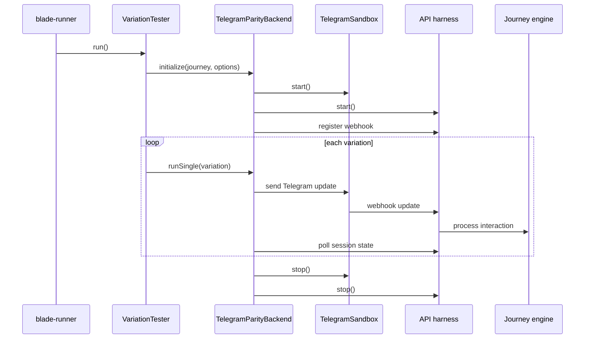

# Blade Runner Architecture

This document describes the current Blade Runner architecture, how the components interact, and where the code lives.

## Component Map

| Component          | Responsibility                               | Code                                                    |
| ------------------ | -------------------------------------------- | ------------------------------------------------------- |
| CLI                | Parse args, load journey, select mode        | `packages/engine/bin/blade-runner.ts`                   |
| Menu + Dashboard   | Interactive menu and live progress UI        | `packages/engine/src/testing/blade-runner/`             |
| VariationExplorer  | Generate paths and input variations          | `packages/engine/src/testing/variation-explorer.ts`     |
| VariationTester    | Orchestrate exploration, execution, coverage | `packages/engine/src/testing/variation-tester.ts`       |
| VariationRunner    | Execute a single variation                   | `packages/engine/src/testing/variation-runner.ts`       |
| CoverageTracker    | Track node/edge/branch/input coverage        | `packages/engine/src/testing/coverage-tracker.ts`       |
| Diagnosis          | Classify failures (design vs engine)         | `packages/engine/src/testing/blade-runner/diagnosis.ts` |
| Reporter           | Format results for console/export            | `packages/engine/src/testing/blade-runner/reporter.ts`  |
| Execution backends | Engine or Telegram parity execution          | `packages/engine/src/testing/backends/`                 |

## High-Level Flow

```mermaid
flowchart TD
  CLI[blade-runner CLI] --> Load[Load journey JSON]
  Load --> Merge[Merge content.json (optional)]
  Merge --> Validate[Validate journey structure]
  Validate --> Explore[VariationExplorer]
  Explore --> Test[VariationTester]
  Test --> Run[VariationRunner]
  Run --> Backend[TestExecutionBackend]
  Backend --> Engine[Engine backend]
  Backend --> Parity[Telegram parity backend]
  Run --> Coverage[CoverageTracker]
  Coverage --> Diagnose[Diagnosis engine]
  Diagnose --> Report[Reporter / Export]
  Report --> CLI
```

## Backend Contract

Blade Runner targets a backend interface so the same variations can be executed against different pipelines.

```ts
export interface TestExecutionBackend {
  name: string;
  supportsWorkers: boolean;
  initialize(params: BackendInitParams): Promise<void> | void;
  runSingle(variation: TestVariation): Promise<VariationResult>;
  teardown(): Promise<void> | void;
}
```

## Telegram Parity Flow



## Execution Loop (Engine Backend)

1. VariationExplorer enumerates paths and input variants.
2. VariationTester schedules variations with concurrency and time scaling.
3. Engine backend uses VariationRunner to drive SessionEngine directly.
4. CoverageTracker collects coverage metrics.
5. Diagnosis classifies failures.
6. Reporter formats output (text, JSON, markdown, or JUnit).
