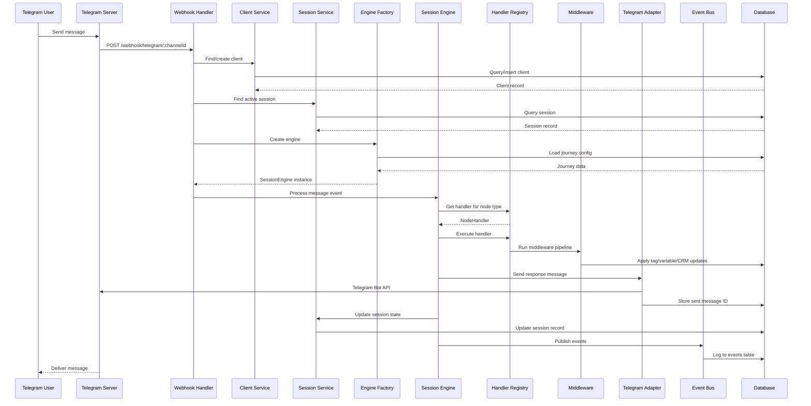
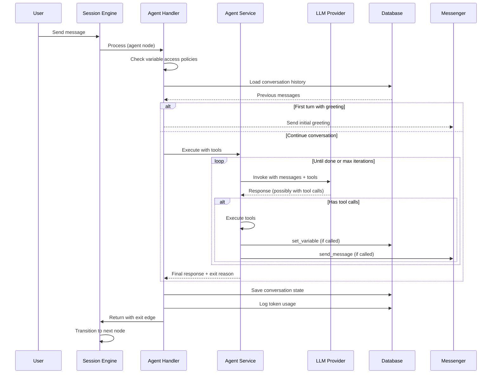
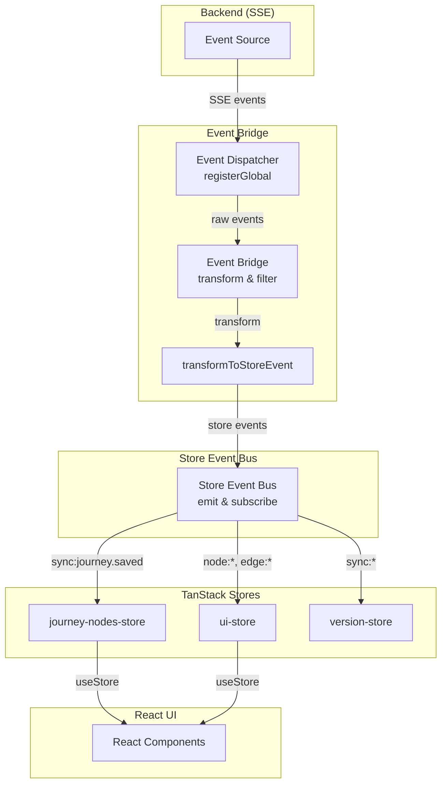
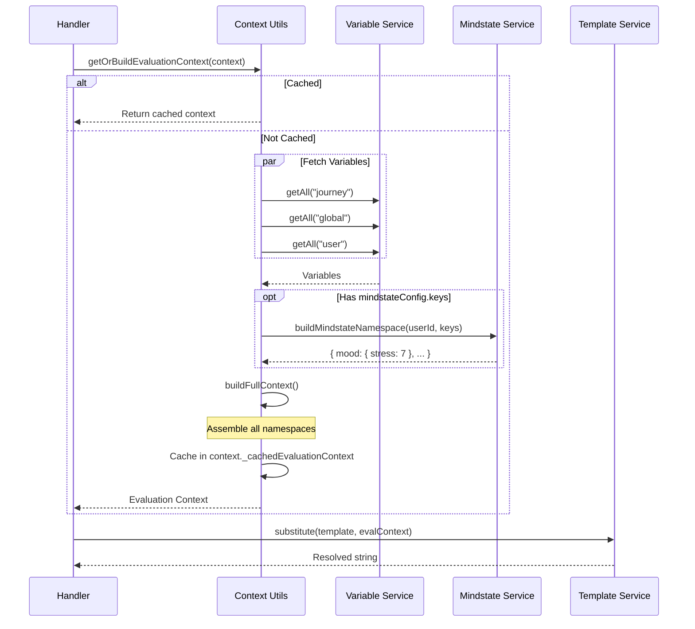

# Data Flow Documentation

> Detailed diagrams of key data flows in the Journey Builder platform.

## Overview

This document describes the major data flows through the system:

1. [User Message → Journey Execution](#1-user-message-to-journey-execution)
2. [Journey Save → Database Persistence](#2-journey-save-to-database-persistence)
3. [Real-time Updates (SSE)](#3-real-time-updates-sse)
4. [Automation Trigger Flow](#4-automation-trigger-flow)
5. [MindState Analysis Pipeline](#5-mindstate-analysis-pipeline)
6. [Agent Node Execution](#6-agent-node-execution)
7. [Event Bridge (Frontend Store Sync)](#7-event-bridge-frontend-store-sync)
8. [Evaluation Context Building](#8-evaluation-context-building)

---

## 1. User Message to Journey Execution

When a user sends a message via Telegram (or other channel), this flow processes it through the journey engine.

### ASCII Diagram

```
┌──────────────────────────────────────────────────────────────────────────────┐
│                        USER MESSAGE FLOW                                      │
└──────────────────────────────────────────────────────────────────────────────┘

  Telegram User                                                    Database
       │                                                               │
       │  1. Send message                                              │
       ▼                                                               │
┌─────────────┐                                                        │
│  Telegram   │                                                        │
│   Server    │                                                        │
└──────┬──────┘                                                        │
       │  2. POST /webhook/telegram/:channelId                         │
       ▼                                                               │
┌─────────────────────────────────────────────────────────────────┐    │
│                    API LAYER                                     │    │
│  ┌─────────────────────────────────────────────────────────┐    │    │
│  │  Webhook Handler                                         │    │    │
│  │   • Parse Telegram update                                │    │    │
│  │   • Extract message/callback                             │    │    │
│  └─────────────────────────────┬───────────────────────────┘    │    │
│                                │                                 │    │
│  3. Find/Create Client         │                                 │    │
│     ┌──────────────────────────▼───────────────────────────┐    │    │
│     │  Client Service                                       │◄───┼────┤
│     │   • Lookup by platform_userId                         │    │    │
│     │   • Create if new user                                │────┼───►│
│     └──────────────────────────┬───────────────────────────┘    │    │
│                                │                                 │    │
│  4. Find Active Session        │                                 │    │
│     ┌──────────────────────────▼───────────────────────────┐    │    │
│     │  Session Service                                      │◄───┼────┤
│     │   • Find session for client + channel                 │    │    │
│     │   • Create new session if needed                      │────┼───►│
│     └──────────────────────────┬───────────────────────────┘    │    │
└────────────────────────────────┼────────────────────────────────┘    │
                                 │                                      │
  5. Create Session Engine       │                                      │
     ┌───────────────────────────▼────────────────────────────┐        │
     │  Session Engine Factory                                 │        │
     │   • Load journey configuration                          │◄───────┤
     │   • Create TelegramAdapter                              │        │
     │   • Initialize services (messenger, timer, etc.)        │        │
     │   • Set up callbacks (onEvent, onTagOperation, etc.)    │        │
     └───────────────────────────┬────────────────────────────┘        │
                                 │                                      │
  6. Process Event               │                                      │
     ┌───────────────────────────▼────────────────────────────┐        │
     │  Session Engine                                         │        │
     │   ┌─────────────────────────────────────────────────┐  │        │
     │   │  Event Router                                    │  │        │
     │   │   • Route message/button/timeout event           │  │        │
     │   └──────────────────────┬──────────────────────────┘  │        │
     │                          │                              │        │
     │   ┌──────────────────────▼──────────────────────────┐  │        │
     │   │  Handler Registry                                │  │        │
     │   │   • Get handler for current node type            │  │        │
     │   │   • Execute handler (message, condition, etc.)   │  │        │
     │   └──────────────────────┬──────────────────────────┘  │        │
     │                          │                              │        │
     │   ┌──────────────────────▼──────────────────────────┐  │        │
     │   │  Middleware Pipeline                             │  │        │
     │   │   • Tag middleware (apply tag actions)           │  │        │
     │   │   • Variable middleware (apply variable ops)     │  │        │
     │   │   • CRM middleware (update pipeline/stage)       │  │        │
     │   └──────────────────────┬──────────────────────────┘  │        │
     │                          │                              │        │
     └──────────────────────────┼──────────────────────────────┘        │
                                │                                       │
  7. Send Response              │                                       │
     ┌──────────────────────────▼──────────────────────────────┐       │
     │  Telegram Adapter                                        │       │
     │   • Send message to Telegram API                         │       │
     │   • Store sent message ID (for edit/delete)              │───────►
     └──────────────────────────┬──────────────────────────────┘       │
                                │                                       │
  8. Update Session State       │                                       │
     ┌──────────────────────────▼──────────────────────────────┐       │
     │  Session Service                                         │       │
     │   • Update currentNodeId                                 │───────►
     │   • Update session context                               │       │
     │   • Log interaction                                      │───────►
     └──────────────────────────┬──────────────────────────────┘       │
                                │                                       │
  9. Publish Events             │                                       │
     ┌──────────────────────────▼──────────────────────────────┐       │
     │  Event Bus                                               │       │
     │   • interaction.message_received                         │       │
     │   • journey.node_entered                                 │       │
     │   → SSE Consumer → Redis Pub/Sub → Web UI                │       │
     │   → Automation Consumer → Check triggers                 │       │
     │   → Log Consumer → events table                          │───────►
     └─────────────────────────────────────────────────────────┘       │

```

### Mermaid Sequence Diagram



### Key Files

| Component        | Location                                               |
| ---------------- | ------------------------------------------------------ |
| Webhook Handler  | `apps/api/src/modules/channels/webhooks/telegram.ts`    |
| Client Service   | `apps/api/src/modules/channels/client-service.ts`      |
| Session Service  | `apps/api/src/modules/channels/session-service.ts`     |
| Engine Factory   | `apps/api/src/services/session-engine-factory.ts`      |
| Session Engine   | `packages/engine/src/session-engine.ts`                |
| Handler Registry | `packages/engine/src/handlers/`                        |
| Telegram Adapter | `apps/api/src/adapters/telegram/adapter.ts`            |
| Event Bus        | `apps/api/src/event-bus/event-bus.ts`                     |

---

## 2. Journey Save to Database Persistence

When a user saves changes to a journey in the web editor.

### ASCII Diagram

```
┌──────────────────────────────────────────────────────────────────────────────┐
│                        JOURNEY SAVE FLOW                                      │
└──────────────────────────────────────────────────────────────────────────────┘

  Web Browser                                API                        Database
       │                                      │                              │
  1. User clicks Save                         │                              │
       │                                      │                              │
       ▼                                      │                              │
┌─────────────────────────────────────────────┤                              │
│  Journey Canvas (React)                     │                              │
│   ├── journeyNodesStore.nodes               │                              │
│   └── journeyNodesStore.edges               │                              │
└──────────────────────┬──────────────────────┤                              │
                       │                      │                              │
  2. Prepare payload   │                      │                              │
       ┌───────────────▼───────────────────┐  │                              │
       │  Store Actions                     │  │                              │
       │   • Collect nodes + edges          │  │                              │
       │   • Build JourneyConfig            │  │                              │
       │   • Validate locally               │  │                              │
       └───────────────┬───────────────────┘  │                              │
                       │                      │                              │
  3. API Request       │                      │                              │
       ┌───────────────▼───────────────────┐  │                              │
       │  TanStack Mutation                 │  │                              │
       │   • PUT /api/journeys/:id          │──┼──────────────────────────────►
       └───────────────────────────────────┘  │                              │
                                              │                              │
       ┌──────────────────────────────────────▼──────────────────────────────┐
       │  Journey Route Handler                                               │
       │   • Validate request body (Zod)                                      │
       │   • Check organization access                                        │
       └──────────────────────┬───────────────────────────────────────────────┘
                              │                                               │
  4. Validate Journey         │                                               │
       ┌──────────────────────▼───────────────────────────────────────────────┐
       │  Journey Service                                                      │
       │   • Validate journey configuration                                    │
       │   • Check for orphan nodes                                           │
       │   • Verify start node exists                                         │
       └──────────────────────┬───────────────────────────────────────────────┘
                              │                                               │
  5. Save Version (Optional)  │                                               │
       ┌──────────────────────▼───────────────────────────────────────────────┐
       │  Version Service                                                      │
       │   • Create version snapshot                                          │
       │   • Store previous config                                            │───►
       └──────────────────────┬───────────────────────────────────────────────┘
                              │                                               │
  6. Update Journey           │                                               │
       ┌──────────────────────▼───────────────────────────────────────────────┐
       │  Database Transaction                                                 │
       │   • UPDATE journeys SET configuration = ...                          │───►
       │   • UPDATE journeys SET updatedAt = NOW()                            │───►
       └──────────────────────┬───────────────────────────────────────────────┘
                              │                                               │
  7. Publish Event            │                                               │
       ┌──────────────────────▼───────────────────────────────────────────────┐
       │  Event Bus                                                            │
       │   • journey.updated event                                            │───►
       │   → SSE Consumer → Real-time update to other tabs                    │
       └──────────────────────┬───────────────────────────────────────────────┘
                              │                                               │
  8. Response                 │                                               │
       ◄──────────────────────┘                                               │
       │                                                                       │
  9. Update UI                │                                               │
       ┌───────────────────────────────────────┐                              │
       │  TanStack Query                        │                              │
       │   • Invalidate journey query           │                              │
       │   • Update store with response         │                              │
       │   • Show success toast                 │                              │
       └───────────────────────────────────────┘                              │
```

### Key Files

| Component       | Location                                     |
| --------------- | -------------------------------------------- |
| Journey Store   | `apps/web/src/stores/journey-nodes-store.ts` |
| Store Actions   | `apps/web/src/stores/store-actions.ts`       |
| Journey API     | `apps/web/src/shared/lib/api/journeys.ts` |
| Journey Route   | `apps/api/src/modules/journeys/routes/index.ts`            |
| Journey Service | `apps/api/src/modules/journeys/journey-service.ts`   |

---

## 3. Real-time Updates (SSE)

Server-Sent Events flow for real-time UI updates.

### ASCII Diagram

```
┌──────────────────────────────────────────────────────────────────────────────┐
│                        SSE EVENT FLOW                                         │
└──────────────────────────────────────────────────────────────────────────────┘

  Action Trigger           Event Bus              Redis              Web Client
       │                       │                    │                     │
  1. Something happens         │                    │                     │
     (tag assigned,            │                    │                     │
      message sent,            │                    │                     │
      session updated)         │                    │                     │
       │                       │                    │                     │
       ▼                       │                    │                     │
┌─────────────────────┐        │                    │                     │
│  Event Publisher    │        │                    │                     │
│   • tag.assigned    │        │                    │                     │
│   • interaction.*   │        │                    │                     │
│   • journey.*       │        │                    │                     │
└──────────┬──────────┘        │                    │                     │
           │                   │                    │                     │
  2. Emit Event                │                    │                     │
           └──────────────────►│                    │                     │
                               │                    │                     │
           ┌───────────────────▼───────────────────┐│                     │
           │  Event Bus                             ││                     │
           │   • Add sequence number                ││                     │
           │   • Validate event schema              ││                     │
           │   • Route to consumers                 ││                     │
           └──────────┬────────────────────────────┘│                     │
                      │                             │                     │
  3. Consumers        │                             │                     │
      ┌───────────────┼───────────────┐            │                     │
      ▼               ▼               ▼            │                     │
┌───────────┐   ┌───────────┐   ┌───────────┐     │                     │
│    Log    │   │    SSE    │   │Automation │     │                     │
│ Consumer  │   │ Consumer  │   │ Consumer  │     │                     │
│(→events)  │   │(→Redis)   │   │(→triggers)│     │                     │
└─────┬─────┘   └─────┬─────┘   └───────────┘     │                     │
      │               │                            │                     │
      ▼               │                            │                     │
  Database            │                            │                     │
                      │                            │                     │
  4. Publish to Redis │                            │                     │
                      └───────────────────────────►│                     │
                                                   │                     │
                               ┌───────────────────▼───────────────────┐ │
                               │  Redis Pub/Sub                         │ │
                               │   Channel: events:{organizationId}     │ │
                               └───────────────────┬───────────────────┘ │
                                                   │                     │
  5. Subscribe to channel                          │                     │
                                                   │                     │
                               ┌───────────────────┼─────────────────────┤
                               │                   │                     │
                               ▼                   │                     ▼
                         ┌───────────┐             │              ┌───────────┐
                         │   API     │             │              │EventSource│
                         │  SSE     ◄│─────────────┘              │  Client   │
                         │ Endpoint  │                            │           │
                         └─────┬─────┘                            └─────┬─────┘
                               │                                        │
  6. Stream to client          │                                        │
                               └────────────────────────────────────────►
                                          (SSE: data: {...})            │
                                                                        │
  7. Handle in UI                                                       │
                                                   ┌────────────────────▼────┐
                                                   │  Event Provider          │
                                                   │   • Parse event          │
                                                   │   • Invalidate queries   │
                                                   │   • Update stores        │
                                                   └─────────────────────────┘
```

### Mermaid Diagram

```mermaid
flowchart LR
    subgraph Origin["Event Origin"]
        A[Tag Service]
        B[Session Service]
        C[Journey Service]
    end

    subgraph EventBus["Event Bus"]
        EB[Event Bus<br/>Validate & Route]
    end

    subgraph Consumers["Consumers"]
        LOG[Log Consumer<br/>→ events table]
        SSE[SSE Consumer<br/>→ Redis]
        AUTO[Automation Consumer<br/>→ trigger check]
    end

    subgraph Redis["Redis"]
        PUB[Pub/Sub<br/>events:{orgId}]
    end

    subgraph Client["Web Client"]
        ESP[EventSource]
        EP[Event Provider]
        UI[React UI]
    end

    A --> EB
    B --> EB
    C --> EB

    EB --> LOG
    EB --> SSE
    EB --> AUTO

    SSE --> PUB
    PUB --> ESP
    ESP --> EP
    EP --> UI
```

### Key Files

| Component      | Location                                        |
| -------------- | ----------------------------------------------- |
| Event Bus      | `apps/api/src/event-bus/event-bus.ts`              |
| SSE Consumer   | `apps/api/src/event-bus/consumers/sse-consumer.ts` |
| SSE Route      | `apps/api/src/modules/event-api/routes/index.ts`         |
| Event Provider | `apps/web/src/providers/event-provider.tsx`     |

---

## 4. Automation Trigger Flow

How automation triggers are evaluated and executed.

### ASCII Diagram

```
┌──────────────────────────────────────────────────────────────────────────────┐
│                        AUTOMATION TRIGGER FLOW                                │
└──────────────────────────────────────────────────────────────────────────────┘

  Triggering Event                Automation System                    Engine
       │                                │                                │
  1. Event occurs                       │                                │
     (tag assigned,                     │                                │
      variable changed,                 │                                │
      journey completed)                │                                │
       │                                │                                │
       ▼                                │                                │
┌─────────────────────┐                 │                                │
│  Event Publisher    │                 │                                │
│   • tag.assigned    │                 │                                │
│   • variable.set    │                 │                                │
│   • journey.completed│                │                                │
└──────────┬──────────┘                 │                                │
           │                            │                                │
  2. Route to Automation Consumer       │                                │
           └───────────────────────────►│                                │
                                        │                                │
           ┌────────────────────────────▼────────────────────────────────┐
           │  Automation Consumer                                         │
           │   • Check if event type has triggers                        │
           │   • Filter by organization                                  │
           └────────────────────────────┬────────────────────────────────┘
                                        │                                │
  3. Load Matching Triggers             │                                │
           ┌────────────────────────────▼────────────────────────────────┐
           │  Automation Handler                                          │
           │   • Query automationTriggers table                          │
           │   • Filter by trigger type:                                 │
           │     - tag_change: match tag name                            │
           │     - variable_condition: evaluate expression               │
           │     - journey_completed: match journey ID                   │
           │     - crm: match pipeline/stage                             │
           │     - webhook: validate signature                           │
           └────────────────────────────┬────────────────────────────────┘
                                        │                                │
  4. Evaluate Conditions                │                                │
           ┌────────────────────────────▼────────────────────────────────┐
           │  Condition Evaluator                                         │
           │   • For variable triggers:                                  │
           │     - Parse expression (expr-eval)                          │
           │     - Evaluate against current variable value               │
           │   • For tag triggers:                                       │
           │     - Check tag operation (add/remove)                      │
           │     - Match tag name                                        │
           └────────────────────────────┬────────────────────────────────┘
                                        │                                │
  5. Queue Journey Start                │                                │
           ┌────────────────────────────▼────────────────────────────────┐
           │  BullMQ Queue                                                │
           │   • Add job: start journey for client                       │
           │   • Include: journeyId, clientId, context                   │
           │   • Optional delay                                          │
           └────────────────────────────┬────────────────────────────────┘
                                        │                                │
  6. Process Queue                      │                                │
           ┌────────────────────────────▼────────────────────────────────┐
           │  Queue Worker                                                │
           │   • Pop job from queue                                      │
           │   • Create/resume session for client                        │
           └────────────────────────────┬────────────────────────────────┘
                                        │                                │
  7. Start Journey                      │                                │
                                        └───────────────────────────────►│
                                                                         │
           ┌─────────────────────────────────────────────────────────────▼─┐
           │  Session Engine Factory                                        │
           │   • Create new session                                         │
           │   • Load target journey                                        │
           │   • Initialize with automation context                         │
           │   • Execute from start node                                    │
           └───────────────────────────────────────────────────────────────┘
```

### Trigger Types

| Type                 | Trigger Condition         | Example                            |
| -------------------- | ------------------------- | ---------------------------------- |
| `tag_change`         | Tag assigned/removed      | Start journey when "vip" tag added |
| `variable_condition` | Expression evaluates true | Start when `purchaseCount > 5`     |
| `journey_completed`  | Journey finishes          | Start follow-up journey            |
| `crm`                | Stage transition          | Start when moved to "Qualified"    |
| `webhook`            | External HTTP call        | Start from external system         |

### Key Files

| Component           | Location                                               |
| ------------------- | ------------------------------------------------------ |
| Automation Consumer | `apps/api/src/event-bus/consumers/automation-consumer.ts` |
| Automation Handler  | `apps/api/src/services/automation-handler.ts`          |
| Triggers Schema     | `packages/db/src/schema/automation.ts` (automationTriggers) |

---

## 5. MindState Analysis Pipeline

How the MindState ECS system analyzes user psychological state. The pipeline is pure (no DB); callers supply context and persist results.

### ASCII Diagram

```
┌──────────────────────────────────────────────────────────────────────────────┐
│                        MINDSTATE PIPELINE FLOW                                │
└──────────────────────────────────────────────────────────────────────────────┘

  User Message                     Pipeline (pure)                      Persistence
       │                                │                                │
  1. Message arrives                    │                                │
       │                                │                                │
       ▼                                │                                │
┌─────────────────────┐                 │                                │
│ Caller (Engine/API) │                 │                                │
│ • supplies context  │                 │                                │
│ • chooses agents    │                 │                                │
└──────────┬──────────┘                 │                                │
           │                            │                                │
  2. Execute pipeline                   │                                │
           └───────────────────────────►│                                │
                                        │                                │
┌───────────────────────────────────────▼────────────────────────────────┐
│  STEP 1: ingestMessage()                                                │
│   • Normalize user message                                              │
│   • Add ID + timestamp                                                  │
└───────────────────────────────────────┬────────────────────────────────┘
                                        │                                │
┌───────────────────────────────────────▼────────────────────────────────┐
│  STEP 2: prepareContext()                                               │
│   • Build context from provided messages                               │
│   • Limit to recent N messages (no DB fetch)                           │
└───────────────────────────────────────┬────────────────────────────────┘
                                        │                                │
┌───────────────────────────────────────▼────────────────────────────────┐
│  STEP 3: assignWorkload()                                               │
│   • Map agents to parameters                                            │
│   • Fallback to configured agent ID                                    │
└───────────────────────────────────────┬────────────────────────────────┘
                                        │                                │
┌───────────────────────────────────────▼────────────────────────────────┐
│  STEP 4: dispatchAgents()                          ┌──────────────────┐│
│   • Execute agents in PARALLEL                     │    LLM API       ││
│   • Uses structured output + mock mode             │   (OpenAI,       ││
│                                                    │    Claude,       ││
│   ┌─────────┐  ┌─────────┐  ┌─────────┐           │    Gemini)       ││
│   │ Agent A │  │ Agent B │  │ Agent C │  ────────►│                  ││
│   │ analyze │  │ analyze │  │ analyze │  ◄────────│                  ││
│   └────┬────┘  └────┬────┘  └────┬────┘           └──────────────────┘│
│        │            │            │                                     │
│        └────────────┼────────────┘                                     │
│                     │ (batch results)                                  │
└───────────────────────────────────────┬────────────────────────────────┘
                                        │                                │
┌───────────────────────────────────────▼────────────────────────────────┐
│  STEP 5: aggregateResults()                                             │
│   • Flatten all agent updates                                          │
│   • No conflict resolution (first match wins)                           │
└───────────────────────────────────────┬────────────────────────────────┘
                                        │                                │
┌───────────────────────────────────────▼────────────────────────────────┐
│  STEP 6: applyStateUpdates()                                            │
│   • Apply hysteresis (numeric only)                                    │
│   • Append state history                                                │
└───────────────────────────────────────┬────────────────────────────────┘
                                        │                                │
┌───────────────────────────────────────▼────────────────────────────────┐
│  STEP 7: generateInsights()                                             │
│   • Build AgentInsight records from agent analyses                      │
│   • No additional LLM calls                                             │
└───────────────────────────────────────┬────────────────────────────────┘
                                        │                                │
┌───────────────────────────────────────▼────────────────────────────────┐
│  STEP 8: generateResponse()                        ┌──────────────────┐│
│   • Run MainAgent with updated state               │    LLM API       ││
│   • Generate contextual response     ──────────────►                  ││
│   • Return assistant message         ◄──────────────                  ││
│                                                    └──────────────────┘│
└───────────────────────────────────────┬────────────────────────────────┘
                                        │                                │
  9. Persist Results                    │                                │
       ┌────────────────────────────────▼────────────────────────────────┐
       │  Save to Database (caller responsibility)                        │
       │   • clientMindstates.stateParameters = updated                  │───►
       │   • clientMindstates.agentInsights = new insights               │───►
       │   • mindstateAnalysisLog = append entry                         │───►
       └─────────────────────────────────────────────────────────────────┘
```

### Pipeline Result

```typescript
interface PipelineResult {
  userMessage: Message; // Original user message
  assistantMessage: Message; // Generated response
  updatedState: StateParameter[]; // New state values
  newInsights: AgentInsight[]; // Generated insights
  changes: Array<{
    parameterId: string;
    parameterName: string;
    oldValue: string | number | boolean;
    newValue: string | number | boolean;
    reasoning: string;
  }>; // Applied changes
  metrics: PipelineMetrics; // Timing, token usage
  requestId?: string;
  failedAgents?: AgentDispatchFailure[]; // Any agents that failed
  partialSuccess?: boolean; // Pipeline completed with failures
}
```

### Key Files

| Component             | Location                                                 |
| --------------------- | -------------------------------------------------------- |
| Pipeline Orchestrator | `packages/mindstate/src/pipeline/orchestrator.ts`        |
| Pipeline Steps        | `packages/mindstate/src/pipeline/steps/`                 |
| Agent Service         | `packages/mindstate/src/llm/agent-service.ts`            |
| Engine Analyzer       | `packages/engine/src/mindstate/mindstate-analyzer.ts`    |
| API Persistence       | `apps/api/src/modules/mindstates/services/analysis-service.ts`    |

---

## 6. Agent Node Execution

When session reaches an agent node, this flow handles LLM-powered tool execution with variable access policies.

### ASCII Diagram

```
┌──────────────────────────────────────────────────────────────────────────────┐
│                        AGENT NODE EXECUTION FLOW                              │
└──────────────────────────────────────────────────────────────────────────────┘

  User Message                   Agent Handler                       External
       │                              │                                  │
  1. Message arrives at agent node    │                                  │
       │                              │                                  │
       ▼                              │                                  │
┌─────────────────────────────────────▼─────────────────────────────────────────┐
│  STEP 1: Check Variable Access Policies                                        │
│   • Read node.data.variableAccess configuration                               │
│   • Filter variables by scope permissions:                                     │
│     - journey: { read: true/false, write: true/false }                        │
│     - user: { read: true/false, write: true/false }                           │
│     - global: { read: true/false, write: true/false }                         │
│   • Build available variables context for LLM                                  │
└─────────────────────────────────────┬─────────────────────────────────────────┘
                                      │                                  │
┌─────────────────────────────────────▼─────────────────────────────────────────┐
│  STEP 2: Load Conversation History                                             │
│   • Query agentConversations table for session + nodeId                       │◄──DB
│   • Deserialize messages array (HumanMessage, AIMessage)                      │
│   • Append to message history if continuing conversation                       │
└─────────────────────────────────────┬─────────────────────────────────────────┘
                                      │                                  │
┌─────────────────────────────────────▼─────────────────────────────────────────┐
│  STEP 3: Check Initial Greeting (First Turn)                                   │
│   • If conversation empty AND initialGreeting configured:                     │
│     - Return greeting message immediately                                      │
│     - Skip LLM call                                                            │
│   • Else: continue to LLM execution                                           │
└─────────────────────────────────────┬─────────────────────────────────────────┘
                                      │                                  │
┌─────────────────────────────────────▼─────────────────────────────────────────┐
│  STEP 4: Build Tool Definitions                                                │
│   • Map configured tools to LangChain tool schemas:                           │
│     - set_variable (with write-permitted scopes only)                         │
│     - get_variable (with read-permitted scopes only)                          │
│     - send_message                                                             │
│     - end_conversation                                                         │
│     - Custom tools defined in node config                                      │
└─────────────────────────────────────┬─────────────────────────────────────────┘
                                      │                                  │
┌─────────────────────────────────────▼─────────────────────────────────────────┐
│  STEP 5: Execute LLM with Tools (Loop)                       ┌───────────────┐│
│   • Send messages + tools to LLM provider                    │   LLM API     ││
│                                                              │  (OpenAI,     ││
│   ┌─────────────────────────────────────────────────────┐    │   Claude,     ││
│   │  while (!done && iterations < maxIterations)         │───►│   Gemini,     ││
│   │    response = await llm.invoke(messages)             │◄───│   GROQ)       ││
│   │    if (response.hasToolCalls)                        │    └───────────────┘│
│   │      results = await executeTools(response.tools)    │                     │
│   │      messages.push(toolResults)                      │                     │
│   │    else                                              │                     │
│   │      done = true                                     │                     │
│   └─────────────────────────────────────────────────────┘                     │
│                                                                                │
│   • Retry on failure with exponential backoff (1s → 2s → 4s)                  │
│   • Max retries configurable (default: 3)                                     │
└─────────────────────────────────────┬─────────────────────────────────────────┘
                                      │                                  │
┌─────────────────────────────────────▼─────────────────────────────────────────┐
│  STEP 6: Process Tool Calls                                                    │
│   • set_variable → Update session/journey/global variables  ─────────────────►DB
│   • get_variable → Return current value from context                          │
│   • send_message → Queue message via messenger adapter      ─────────────────►TG
│   • end_conversation → Set exitReason = 'completed'                           │
│   • Custom tools → Execute registered handlers                                │
└─────────────────────────────────────┬─────────────────────────────────────────┘
                                      │                                  │
┌─────────────────────────────────────▼─────────────────────────────────────────┐
│  STEP 7: Check Exit Conditions                                                 │
│   • Completed: Agent called end_conversation tool                             │
│   • Timeout: No response within configured timeout                            │
│   • Max turns: Exceeded maximum conversation turns                            │
│   • Error: Unrecoverable error after retries                                  │
│                                                                                │
│   exitReason = 'completed' | 'timeout' | 'max_turns' | 'error'                │
└─────────────────────────────────────┬─────────────────────────────────────────┘
                                      │                                  │
┌─────────────────────────────────────▼─────────────────────────────────────────┐
│  STEP 8: Save Conversation State                                               │
│   • Serialize message history (with tool calls + results)                     │
│   • Upsert to agentConversations table                       ─────────────────►DB
│   • Store: sessionId, nodeId, messages[], metadata                            │
└─────────────────────────────────────┬─────────────────────────────────────────┘
                                      │                                  │
┌─────────────────────────────────────▼─────────────────────────────────────────┐
│  STEP 9: Track Token Usage & Costs                                             │
│   • Extract token counts from LLM response metadata                           │
│   • Calculate cost based on model pricing                                     │
│   • Log: { inputTokens, outputTokens, totalCost, model }     ─────────────────►DB
└─────────────────────────────────────┬─────────────────────────────────────────┘
                                      │                                  │
┌─────────────────────────────────────▼─────────────────────────────────────────┐
│  STEP 10: Route to Next Node                                                   │
│   • Find edge matching exitReason:                                            │
│     - 'completed' → completion edge                                           │
│     - 'timeout' → timeout edge                                                │
│     - 'error' → error edge (if configured)                                    │
│   • Transition session to next node                                           │
└───────────────────────────────────────────────────────────────────────────────┘
```

### Mermaid Sequence Diagram



### Variable Access Policy Example

```typescript
// Node configuration
const agentNode = {
  type: 'agent',
  data: {
    variableAccess: {
      journey: { read: true, write: true },   // Can read/write journey vars
      user: { read: true, write: false },     // Can only read user vars
      global: { read: true, write: false }    // Can only read global vars
    },
    tools: ['set_variable', 'get_variable', 'send_message'],
    model: 'gpt-4o',
    systemPrompt: 'You are a helpful assistant...',
    exitStrategy: {
      type: 'timeout',
      timeoutMs: 300000  // 5 minutes
    }
  }
};
```

### Key Files

| Component           | Location                                           |
| ------------------- | -------------------------------------------------- |
| Agent Handler       | `packages/engine/src/handlers/agent-handler.ts`    |
| Agent Service       | `packages/llm/src/agent-service.ts`                |
| Variable Access     | `packages/schemas/src/nodes/agent.ts`              |
| Conversation Store  | `packages/db/src/schema/session.ts` (agentConversations) |
| Tool Definitions    | `packages/llm/src/tools/`                          |
| Retry Utility       | `packages/engine/src/utils/retry.ts`               |

---

## 7. Event Bridge (Frontend Store Sync)

How the frontend Event Bridge transforms SSE events from the backend and routes them to the store event bus for real-time UI updates.

### ASCII Diagram

```
┌──────────────────────────────────────────────────────────────────────────────┐
│                        EVENT BRIDGE SYNC FLOW                                 │
└──────────────────────────────────────────────────────────────────────────────┘

  Backend Events          Event Bridge            Store Event Bus        Stores
       │                       │                       │                    │
  1. SSE delivers event        │                       │                    │
     (from Section 3)          │                       │                    │
       │                       │                       │                    │
       ▼                       │                       │                    │
┌─────────────────────┐        │                       │                    │
│  EventSource/       │        │                       │                    │
│  EventDispatcher    │        │                       │                    │
│   • session.started │        │                       │                    │
│   • journey.updated │        │                       │                    │
│   • node.created    │        │                       │                    │
└──────────┬──────────┘        │                       │                    │
           │                   │                       │                    │
  2. Global handler receives   │                       │                    │
           └──────────────────►│                       │                    │
                               │                       │                    │
          ┌────────────────────▼────────────────────┐  │                    │
          │  Event Bridge                           │  │                    │
          │   • Check filter (if configured)        │  │                    │
          │   • Track metrics (eventsReceived++)    │  │                    │
          └────────────────────┬────────────────────┘  │                    │
                               │                       │                    │
  3. Transform event type      │                       │                    │
          ┌────────────────────▼────────────────────┐  │                    │
          │  transformToStoreEvent()                 │  │                    │
          │                                          │  │                    │
          │  Backend Event      →   Store Event      │  │                    │
          │  ─────────────────     ────────────────  │  │                    │
          │  session.started   →  sync:session.started │                    │
          │  journey.updated   →  sync:journey.saved   │                    │
          │  node.created      →  node:added           │                    │
          │  node.updated      →  node:updated         │                    │
          │  node.deleted      →  node:deleted         │                    │
          │  edge.created      →  edge:added           │                    │
          │  edge.deleted      →  edge:deleted         │                    │
          │                                          │  │                    │
          │  (Unknown events → null, not bridged)    │  │                    │
          └────────────────────┬────────────────────┘  │                    │
                               │                       │                    │
  4. Emit to store bus         │                       │                    │
                               └──────────────────────►│                    │
                                                       │                    │
          ┌────────────────────────────────────────────▼───────────────────┐│
          │  Store Event Bus                                                ││
          │   • Type-safe event routing                                     ││
          │   • Multi-subscriber support                                    ││
          └────────────────────────────────────────────┬───────────────────┘│
                                                       │                    │
  5. Stores receive events                             │                    │
                                    ┌──────────────────┼──────────────────┐ │
                                    ▼                  ▼                  ▼ │
                             ┌─────────────┐    ┌─────────────┐    ┌─────────────┐
                             │ journey-    │    │   ui-       │    │  version-   │
                             │ nodes-store │    │   store     │    │   store     │
                             │             │    │             │    │             │
                             │ Subscribe:  │    │ Subscribe:  │    │ Subscribe:  │
                             │ sync:journey│    │ node:*      │    │ sync:*      │
                             │ .saved      │    │ edge:*      │    │             │
                             └──────┬──────┘    └──────┬──────┘    └─────────────┘
                                    │                  │
  6. Update UI                      │                  │
          ┌─────────────────────────▼──────────────────▼──────────────────────┐
          │  React Components                                                   │
          │   • useStore() subscriptions re-render                             │
          │   • Query invalidation triggers refetch                            │
          │   • Toast notifications for collaboration                          │
          └─────────────────────────────────────────────────────────────────────┘
```

### Mermaid Diagram



Note: `sync:session.*` events are emitted by the Event Bridge but are only consumed by stores that opt in (no default subscribers in core stores).

### Event Transformation Table

| Backend Event Type | Store Event Type | Payload Mapping |
|-------------------|------------------|-----------------|
| `session.started` | `sync:session.started` | `{ sessionId, journeyId }` |
| `session.event` | `sync:session.event` | `{ sessionId, eventType, data }` |
| `journey.created` | `sync:journey.saved` | `{ journeyId, savedBy, timestamp }` |
| `journey.updated` | `sync:journey.saved` | `{ journeyId, savedBy, timestamp }` |
| `node.created` | `node:added` | `{ nodeId, nodeType, position? }` |
| `node.updated` | `node:updated` | `{ nodeId, updates }` |
| `node.deleted` | `node:deleted` | `{ nodeId }` |
| `edge.created` | `edge:added` | `{ edgeId, source, target }` |
| `edge.deleted` | `edge:deleted` | `{ edgeId }` |

### Metrics Tracking

The Event Bridge tracks operational metrics for monitoring:

```typescript
interface EventBridgeMetrics {
  eventsReceived: number;    // Total events from dispatcher
  eventsBridged: number;     // Successfully transformed and emitted
  eventsFiltered: number;    // Filtered out by filter function
  transformErrors: number;   // Failed transformation
}

// Access metrics
const metrics = eventBridge.getMetrics();
```

### Usage Patterns

#### Basic Setup (in App root)

```tsx
import { useEventBridge } from "@/stores/event-bridge";

function App() {
  // Automatically starts/stops with component lifecycle
  useEventBridge({ debug: process.env.NODE_ENV === "development" });

  return <AppContent />;
}
```

#### Store Subscription

```typescript
import { storeEventBus } from "@/stores/store-event-bus";

// In store initialization
storeEventBus.on("sync:journey.saved", (event) => {
  if (event.payload.savedBy !== currentUserId) {
    // Another user saved - show conflict dialog
    showConflictDialog(event.payload);
  }
});
```

### Key Files

| Component | Location |
|-----------|----------|
| Event Bridge | `apps/web/src/stores/event-bridge.ts` |
| Store Event Bus | `apps/web/src/stores/store-event-bus.ts` |
| Event Types | `packages/schemas/src/events/store-events.ts` |
| Event Provider | `apps/web/src/providers/event-provider.tsx` |
| Event Stream Hook | `apps/web/src/features/developers/hooks/events/use-event-stream.ts` |

### Relationship to SSE Flow

This flow continues from **Section 3: Real-time Updates (SSE)**. While Section 3 covers how events travel from the backend through Redis Pub/Sub to the frontend EventSource, this section documents what happens **after** events arrive at the frontend—specifically how they're transformed and distributed to TanStack stores.

---

## 8. Evaluation Context Building

How the engine builds the evaluation context with all available namespaces for template resolution and expression evaluation.

### ASCII Diagram

```
┌──────────────────────────────────────────────────────────────────────────────┐
│                    EVALUATION CONTEXT BUILDING FLOW                           │
└──────────────────────────────────────────────────────────────────────────────┘

  Handler needs template resolution / expression evaluation
       │
       ▼
┌─────────────────────────────────────────────────────────────────────────────┐
│  getOrBuildEvaluationContext(context)                                        │
│  packages/engine/src/utils/context.ts                                        │
├─────────────────────────────────────────────────────────────────────────────┤
│                                                                              │
│  1. Check cache (context._cachedEvaluationContext)                          │
│     ├── If cached → return immediately (fast path)                          │
│     └── If not cached → build full context                                  │
│                                                                              │
└──────────────────────┬──────────────────────────────────────────────────────┘
                       │ (cache miss)
                       ▼
┌─────────────────────────────────────────────────────────────────────────────┐
│  buildEvaluationContext() - Parallel Fetch Phase                             │
├─────────────────────────────────────────────────────────────────────────────┤
│                                                                              │
│   ┌─────────────────────────────────────────────────────────────────────┐   │
│   │                     Promise.all([...])                               │   │
│   │                                                                      │   │
│   │   ┌──────────────┐  ┌──────────────┐  ┌──────────────┐             │   │
│   │   │ Journey Vars │  │  Global Vars │  │  User Vars   │             │   │
│   │   │ getAll()     │  │  getAll()    │  │  getAll()    │             │   │
│   │   └──────┬───────┘  └──────┬───────┘  └──────┬───────┘             │   │
│   │          │                 │                 │                      │   │
│   │          ▼                 ▼                 ▼                      │   │
│   │       Database          Database          Database                  │   │
│   │                                                                      │   │
│   └─────────────────────────────────────────────────────────────────────┘   │
│                                                                              │
│   ┌─────────────────────────────────────────────────────────────────────┐   │
│   │  If mindstateConfig.keys exists:                                     │   │
│   │                                                                      │   │
│   │   ┌──────────────────────────────────────────────────────────────┐  │   │
│   │   │  buildMindstateNamespace()                                    │  │   │
│   │   │                                                               │  │   │
│   │   │   for each key in mindstateConfig.keys:                       │  │   │
│   │   │     ┌────────────────────────────────────────────────────┐   │  │   │
│   │   │     │ mindstateService.getOrCreateMindstate(userId, key) │   │  │   │
│   │   │     └────────────────────────────────────────────────────┘   │  │   │
│   │   │                          │                                    │  │   │
│   │   │                          ▼                                    │  │   │
│   │   │     Result: { key: { paramId: value, ... }, ... }            │  │   │
│   │   │     Example: { mood: { stress: 7, happiness: 8 } }           │  │   │
│   │   └──────────────────────────────────────────────────────────────┘  │   │
│   └─────────────────────────────────────────────────────────────────────┘   │
│                                                                              │
└──────────────────────┬──────────────────────────────────────────────────────┘
                       │
                       ▼
┌─────────────────────────────────────────────────────────────────────────────┐
│  buildFullContext() - Namespace Assembly                                     │
├─────────────────────────────────────────────────────────────────────────────┤
│                                                                              │
│   ┌─────────────────────────────────────────────────────────────────────┐   │
│   │                    EVALUATION CONTEXT OBJECT                         │   │
│   │                                                                      │   │
│   │   // Flat access from session.context (legacy support)              │   │
│   │   score: 85,                                                        │   │
│   │   userResponse: "...",                                              │   │
│   │                                                                      │   │
│   │   // Namespaced access                                              │   │
│   │   vars: {                                                           │   │
│   │     journey: { orderTotal: 99.99, status: "pending" },             │   │
│   │     user: { preferences: {...} },                                   │   │
│   │     global: { companyName: "Acme Corp" },                          │   │
│   │   },                                                                │   │
│   │   user: { id, firstName, lastName, platform, username },           │   │
│   │   session: { id, journeyId, currentNodeId, tags },                 │   │
│   │   nodes: { GetCustomer: { email: "john@example.com" } },           │   │
│   │   mindstate: {                    ← Only if mindstateConfig exists │   │
│   │     mood: { stress: 7, happiness: 8 },                             │   │
│   │     energy: { level: 5 },                                          │   │
│   │   },                                                                │   │
│   └─────────────────────────────────────────────────────────────────────┘   │
│                                                                              │
└──────────────────────┬──────────────────────────────────────────────────────┘
                       │
                       ▼
┌─────────────────────────────────────────────────────────────────────────────┐
│  Usage in Handlers                                                           │
├─────────────────────────────────────────────────────────────────────────────┤
│                                                                              │
│   ┌─────────────┐     ┌─────────────┐     ┌─────────────┐                  │
│   │  Template   │     │ Expression  │     │   Guard     │                  │
│   │  Service    │     │  Service    │     │ Evaluator   │                  │
│   │             │     │             │     │             │                  │
│   │ substitute( │     │ evaluate(   │     │ evaluate(   │                  │
│   │   template, │     │   expr,     │     │   guard,    │                  │
│   │   evalCtx   │     │   evalCtx   │     │   evalCtx   │                  │
│   │ )           │     │ )           │     │ )           │                  │
│   └──────┬──────┘     └──────┬──────┘     └──────┬──────┘                  │
│          │                   │                   │                          │
│          ▼                   ▼                   ▼                          │
│   "Your stress is 7"   7 > 5 → true    "mindstate.mood.stress > 7" → false │
│                                                                              │
└─────────────────────────────────────────────────────────────────────────────┘
```

### Mermaid Sequence Diagram



### Available Namespaces

| Namespace      | Syntax                             | Source                    | Example                        |
| -------------- | ---------------------------------- | ------------------------- | ------------------------------ |
| Variables      | `{{vars.journey.key}}`             | Variable Service          | `{{vars.journey.orderTotal}}`  |
| User Profile   | `{{user.field}}`                   | Client Data               | `{{user.firstName}}`           |
| Session        | `{{session.field}}`                | Session State             | `{{session.id}}`               |
| Node Outputs   | `{{nodes.Label.field}}`            | session.nodeOutputs       | `{{nodes.GetCustomer.email}}`  |
| Mindstate      | `{{mindstate.key.param}}`          | Mindstate Service         | `{{mindstate.mood.stress}}`    |
| Flat Context   | `{{key}}`                          | session.context           | `{{userResponse}}`             |

### Key Files

| Component               | Location                                      |
| ----------------------- | --------------------------------------------- |
| buildEvaluationContext  | `packages/engine/src/utils/context.ts`        |
| buildMindstateNamespace | `packages/engine/src/utils/context.ts`        |
| getOrBuildEvalContext   | `packages/engine/src/utils/context.ts`        |
| buildVariableNamespaces | `packages/schemas/src/services/namespaces.ts` |

---

## Related Documentation

- [System Overview](./system-overview.md) - High-level architecture
- [Unified Services Architecture](./unified-services/README.md) - SharedServiceContext and service layer
- [Variable Namespaces](./unified-services/variable-namespaces.md) - Template syntax reference
- [Mindstate Architecture](./mindstate.md) - Mindstate system overview
- [Event Bridge Details](./unified-services/event-bridge.md) - Deep dive into Event Bridge
- [Package Architecture](./packages.md) - Package dependencies
- [Database Schema](./database-schema.md) - ERD and relationships
