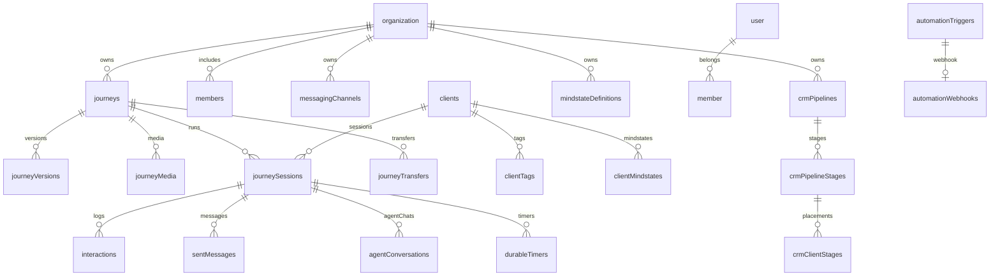

# Database Schema Architecture

Developer-friendly overview of the @journey/db schema layout, domains, and update flow.

## Quick Map

Schema modules live in `packages/db/src/schema/` and are re-exported via `@journey/db/schema`.

| Domain | Tables | Primary Use |
| ------ | ------ | ----------- |
| Auth | `user`, `session`, `account`, `verification` | Better Auth identity + sessions |
| Organization | `organization`, `member`, `invitation` | Multi-tenancy + membership |
| Journey | `journeys`, `journeyVersions`, `journeyMedia`, `journeyTransfers` | Journey configs + audit (CRM default via `journeys.defaultPipelineId`) |
| Channels | `messagingChannels` | Bot channels + credentials |
| Sessions | `clients`, `journeySessions`, `interactions`, `sentMessages`, `agentConversations`, `nodeOutputs` | Runtime execution + logs |
| Variables | `variables` | Unified variable store (global/journey/user) |
| Tags | `tagDefinitions`, `clientTags` | Org-wide tags + assignments |
| CRM | `crmPipelines`, `crmPipelineStages`, `crmClientStages`, `crmStageHistory`, `crmCustomFieldDefinitions`, `crmClientFieldValues`, `crmDirectMessages` | CRM pipeline + fields |
| Automation | `automationTriggers`, `automationWebhooks`, `durableTimers` | Triggers + webhooks + timers |
| Events | `events`, `failedEvents` | Universal event store + DLQ |
| Agents | `agentWorkflows`, `agentDefinitions`, `workflowVersions`, `workflowApprovals` | Agent workflows + approvals |
| Mindstate | `mindstateDefinitions`, `clientMindstates`, `mindstateAnalysisLog` | Mindstate tracking |
| Memory | `agentMemories` | Long-term memory (pgvector) |
| Usage | `llmUsageEvents` | LLM usage tracking |
| Simulator | `testPersonas` | Simulator personas |

Related helpers:

- `enums.ts` defines PostgreSQL enums used across tables.
- `relations.ts` centralizes all Drizzle relations to avoid circular imports.

## High-Level ERD (Simplified)



## Organization Scoping (Multi-Tenancy)

All business data is scoped to organizations. The scoping strategy varies by table type:

### Directly Scoped (`organization_id NOT NULL`)

These tables have `organization_id` as a required column:

| Category | Tables |
|----------|--------|
| Core | `journeys`, `messaging_channels`, `journey_transfers` |
| Users + Simulator | `clients`, `journey_sessions`, `test_personas` |
| Tags | `tag_definitions` |
| CRM | `crm_pipelines`, `crm_pipeline_stages`, `crm_client_stages`, `crm_stage_history`, `crm_custom_field_definitions`, `crm_direct_messages` |
| Automation | `automation_triggers` |
| Agents | `agent_workflows`, `agent_definitions`, `agent_memories` |
| Mindstate | `mindstate_definitions` |
| Variables | `variables` |
| Events + Usage | `events`, `llm_usage_events` |

### Indirectly Scoped (Via Parent FK)

These tables inherit org scope through their parent:

| Table | Scoped Via |
|-------|-----------|
| `journey_versions`, `journey_media` | `journeys.id` |
| `interactions`, `sent_messages`, `agent_conversations`, `durable_timers`, `node_outputs` | `journey_sessions.id` |
| `workflow_versions`, `workflow_approvals` | `agent_workflows.id` |
| `automation_webhooks` | `automation_triggers.id` |
| `client_tags` | `tag_definitions.id` (and `clients.id`) |
| `crm_client_field_values` | `crm_custom_field_definitions.id` (and `clients.id`) |
| `client_mindstates` | `mindstate_definitions.id` |
| `mindstate_analysis_log` | `client_mindstates.id` |

### Auth Tables (No Org Scope)

Better Auth managed tables have no org scope:
- `user`, `session`, `account`, `verification`
- `organization`, `member`, `invitation`

## Key Design Notes

- **Multi-tenancy:** Most tables require `organization_id NOT NULL`. See section above for scoping rules.
- **Enums:** Status/type columns use Postgres enums in `packages/db/src/schema/enums.ts`.
- **Relations:** All relation wiring lives in `packages/db/src/schema/relations.ts` to avoid circular imports.
- **JSONB storage:** Journey configs, agent workflows, mindstate config, and LLM usage metadata are JSONB.
- **Security:** Secrets are stored encrypted + hashed (see `docs/db/security.md`).
- **Soft delete:** `agent_workflows` and `agent_definitions` use `deleted_at` with partial unique indexes.

## Operational Helpers

- **Seed data:** `packages/db/src/seed/` (run `pnpm db:seed` from repo root).
- **Reset scripts:** `packages/db/src/drop.ts` (`pnpm db:reset` for drop + push + seed).
- **Test utilities:** `packages/db/src/test-utils/` (`pnpm --filter @journey/db test:seed`, `pnpm --filter @journey/db test:cleanup`).

## Updating the Schema (Developer Flow)

1. Edit or add a schema module in `packages/db/src/schema/`.
2. Run migration generation from `packages/db`:

```bash
pnpm generate
pnpm migrate
```

3. Validate drift:

```bash
pnpm db:check
```

4. For major refactors, prefer a full reset:

```bash
pnpm db:reset-full
```

## Where to Look

- Schema source: `packages/db/src/schema/`
- Migrations: `packages/db/drizzle/`
- Package docs: `docs/db/README.md`
- Schema conventions: `docs/db/schema-conventions.md`
- Change checklist: `docs/db/change-checklist.md`
- Security: `docs/db/security.md`
