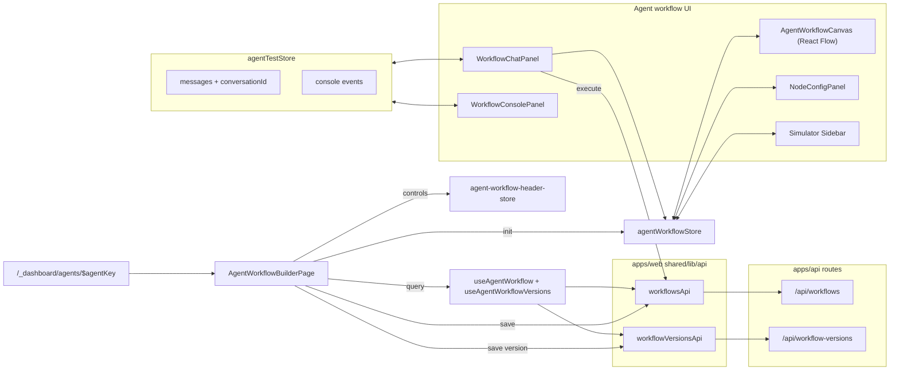
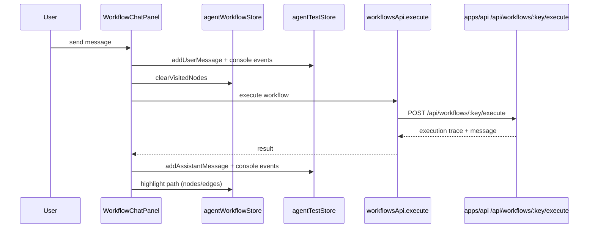

# Agent Workflow Builder Diagram

> Focused architecture for the agent workflow builder (/agents/$agentKey).

## Builder Overview

```
+-------------------------------------------------------------------------------------------+
| Route: /agents/$agentKey                                                                    |
| apps/web/src/routes/_dashboard.agents.$agentKey.tsx                                          |
+-------------------------------------------------------------------------------------------+
| AgentWorkflowBuilderPage                                                                    |
| - loads workflow + versions (useAgentWorkflow, useAgentWorkflowVersions)                    |
| - initializes agentWorkflowStore and header controls                                        |
| - saves workflow + version snapshots                                                        |
|                                                                                             |
| +---------------------------------------------------------------------------------------+   |
| | AgentWorkflowLayout                                                                    |   |
| |  +-----------------------------------------+  +-------------------------------------+ |   |
| |  | Canvas (React Flow)                     |  | Sidebar (Simulator/Test)            | |   |
| |  | - AgentWorkflowCanvas                   |  | - WorkflowSimulatorControls         | |   |
| |  | - NodeSelectorPanel                     |  | - WorkflowChatPanel                 | |   |
| |  | - NodeConfigPanel                       |  | - WorkflowConsolePanel              | |   |
| |  +-----------------------------------------+  +-------------------------------------+ |   |
| +---------------------------------------------------------------------------------------+   |
|                                                                                             |
| Stores:                                                                                     |
| - agentWorkflowStore (nodes, edges, history, settings, simulator highlights)                |
| - agentTestStore (chat, console events, execution state)                                    |
+-------------------------------------------------------------------------------------------+
```

## Data and State Flow



## Simulator Execution Flow



## Key Files

- `apps/web/src/routes/_dashboard.agents.$agentKey.tsx`
- `apps/web/src/features/agent-workflows/pages/agent-workflow-builder-page.tsx`
- `apps/web/src/features/agent-workflows/components/layout/agent-workflow-layout.tsx`
- `apps/web/src/features/agent-workflows/components/canvas/agent-workflow-canvas.tsx`
- `apps/web/src/features/agent-workflows/components/test-panel/workflow-chat-panel.tsx`
- `apps/web/src/features/agent-workflows/components/console/workflow-console-panel.tsx`
- `apps/web/src/features/agent-workflows/components/version-panel/agent-workflow-version-panel.tsx`
- `apps/web/src/features/dashboard/store/agent-workflow-header-store.ts`
- `apps/web/src/features/agent-workflows/stores/agent-workflow-store.ts`
- `apps/web/src/features/agent-workflows/stores/agent-test-store.ts`
- `apps/web/src/shared/lib/api/workflows.ts`
- `apps/web/src/shared/lib/api/workflow-versions.ts`
- `apps/api/src/modules/workflows/routes/index.ts`
- `apps/api/src/modules/workflows/versions.ts`
