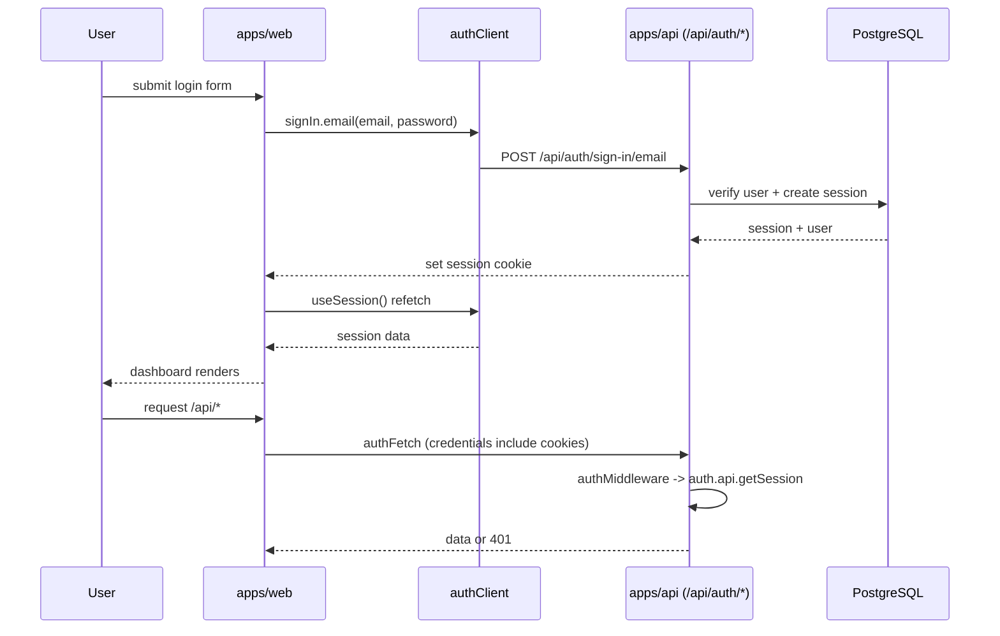
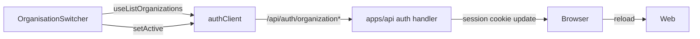

# Auth Flow Diagram

> Authentication and organization context flow across apps/web and apps/api.

## Flow Overview

```
+-------------------------------------------------------------------------------------------+
| Browser bootstrap                                                                          |
| main.tsx -> RouterProvider -> __root.tsx                                                    |
| - ThemeProvider + QueryClientProvider + EventProvider                                       |
| - Outlet                                                                                   |
|                                                                                            |
| _dashboard.tsx (layout gate)                                                                |
| - authClient.useSession()                                                                  |
| - pending -> LoadingSpinner                                                                |
| - no session -> <Login />                                                                  |
| - session -> Sidebar + Header + Route Outlet                                               |
|                                                                                            |
| Login: features/auth/components/login.tsx                                                  |
| - authClient.signIn.email()                                                                |
| - session updates, dashboard renders                                                       |
|                                                                                            |
| Sign out: NavUser + Journey empty state -> authClient.signOut()                             |
+-------------------------------------------------------------------------------------------+
```

## Sign In and Session Gating



## Organization Context Flow



## Notes

- `authClient` base URL comes from `appConfig.api.url` (via `VITE_API_URL`).
- `authFetch` uses `credentials: "include"` to send Better Auth session cookies.
- API auth uses `BETTER_AUTH_SECRET`; `ALLOW_MOCK_AUTH=true` allows `X-Mock-User-Id` in dev/test.

## Key Files

- `apps/web/src/shared/lib/auth-client.ts`
- `apps/web/src/routes/_dashboard.tsx`
- `apps/web/src/features/auth/components/login.tsx`
- `apps/web/src/features/dashboard/components/nav-user.tsx`
- `apps/web/src/features/dashboard/components/organisation-switcher.tsx`
- `apps/web/src/shared/lib/api/base.ts`
- `apps/api/src/lib/auth.ts`
- `apps/api/src/app.ts`
