# Data Model

High-level diagram of the Journey database schema. For exact columns and constraints, see `packages/db/src/schema/`.

## Domain Map

| Domain | Schema Modules | Notes |
| ------ | -------------- | ----- |
| Auth | `auth.ts` | Better Auth tables (user/session/account/verification) |
| Organization | `organization.ts`, `organization-membership.ts` | Org + membership |
| Journey | `journey.ts`, `journey-pipelines.ts`, `journey-transfers.ts` | Journey configs + audit |
| Channels | `channels.ts` | Bot channels |
| Sessions | `session.ts` | Runtime sessions + interactions |
| Variables | `variables.ts` | Global/journey/user scopes |
| Tags | `tags.ts` | Global tags + assignments |
| CRM | `crm.ts` | Pipelines, stages, custom fields, direct messages |
| Automation | `automation.ts` | Triggers, webhooks, durable timers |
| Events | `events.ts` | Universal event store + DLQ |
| Agents | `agents.ts` | Workflows + approvals |
| Mindstate | `mindstate.ts` | Mindstate tracking |
| Memory | `memory.ts` | Agent memory (pgvector) |
| Usage | `usage.ts` | LLM usage tracking (cost + latency) |
| Simulator | `simulator.ts` | Test personas (org-scoped) |

## ASCII Overview

```
┌────────────────────────────────────────────────────────────────────────────┐
│                                ORGANIZATION                                │
│   organization ── member/invitation ── user                                │
└────────────────────────────────────────────────────────────────────────────┘
          │
          │ owns
          ▼
┌────────────────────────────────────────────────────────────────────────────┐
│                                JOURNEYS                                    │
│ journeys ── journeyVersions ── journeyMedia                                │
│      │           │
│      │           └─ journeyDefaultPipelines (CRM mapping)                  │
│      │
│      └─ journeyTransfers (audit)                                           │
└────────────────────────────────────────────────────────────────────────────┘
          │
          │ runs
          ▼
┌────────────────────────────────────────────────────────────────────────────┐
│                                SESSIONS                                    │
│ clients ── journeySessions ── interactions                                 │
│                   │          ├─ sentMessages                               │
│                   │          └─ agentConversations                         │
│                   └─ durableTimers                                         │
└────────────────────────────────────────────────────────────────────────────┘
          │
          │ enrich
          ▼
┌────────────────────────────────────────────────────────────────────────────┐
│                    CRM / TAGS / VARIABLES / MINDSTATE                       │
│ crmPipelines -> crmPipelineStages -> crmClientStages -> crmStageHistory     │
│ crmCustomFieldDefinitions -> crmClientFieldValues                           │
│ crmDirectMessages (client + channel)                                        │
│ tagDefinitions -> clientTags                                                │
│ variables (global/journey/user)                                             │
│ mindstateDefinitions -> clientMindstates -> mindstateAnalysisLog            │
└────────────────────────────────────────────────────────────────────────────┘
          │
          │ system wide
          ▼
┌────────────────────────────────────────────────────────────────────────────┐
│                     AUTOMATION / EVENTS / AGENTS / USAGE                     │
│ automationTriggers -> automationWebhooks                                    │
│ events + failedEvents                                                       │
│ agentWorkflows / agentDefinitions / workflowVersions / workflowApprovals    │
│ agentMemories                                                               │
│ llmUsageEvents                                                              │
└────────────────────────────────────────────────────────────────────────────┘
          │
          │ simulate
          ▼
┌────────────────────────────────────────────────────────────────────────────┐
│                                SIMULATOR                                   │
│ testPersonas -> clients (optional)                                          │
└────────────────────────────────────────────────────────────────────────────┘
```

## Mermaid Overview

```mermaid
erDiagram
    organization ||--o{ journeys : owns
    organization ||--o{ messagingChannels : owns
    organization ||--o{ crmPipelines : owns
    organization ||--o{ tagDefinitions : owns
    organization ||--o{ mindstateDefinitions : owns
    organization ||--o{ automationTriggers : owns
    organization ||--o{ agentWorkflows : owns
    organization ||--o{ agentDefinitions : owns
    organization ||--o{ agentMemories : owns
    organization ||--o{ variables : owns
    organization ||--o{ events : owns
    organization ||--o{ llmUsageEvents : owns
    organization ||--o{ testPersonas : owns

    user ||--o{ member : belongs

    journeys ||--o{ journeyVersions : versions
    journeys ||--o{ journeyMedia : media
    journeys ||--o{ journeySessions : sessions
    journeys ||--o{ journeyTransfers : transfers
    journeys ||--o{ journeyDefaultPipelines : defaultPipeline
    journeys ||--o{ automationTriggers : triggers

    messagingChannels ||--o{ journeySessions : handles

    clients ||--o{ journeySessions : runs
    clients ||--o{ clientTags : tagged
    clients ||--o{ clientMindstates : mindstates
    clients ||--o{ crmClientStages : pipelineStages
    clients ||--o{ crmClientFieldValues : fieldValues
    clients ||--o{ crmDirectMessages : directMessages
    clients ||--o{ agentMemories : memories
    clients ||--o{ testPersonas : personas

    journeySessions ||--o{ interactions : logs
    journeySessions ||--o{ sentMessages : sends
    journeySessions ||--o{ agentConversations : chats
    journeySessions ||--o{ durableTimers : timers

    crmPipelines ||--o{ crmPipelineStages : stages
    crmPipelineStages ||--o{ crmClientStages : assignments
    crmPipelines ||--o{ journeyDefaultPipelines : defaultFor
    crmCustomFieldDefinitions ||--o{ crmClientFieldValues : values
    messagingChannels ||--o{ crmDirectMessages : messages
    user ||--o{ crmDirectMessages : sentBy

    agentWorkflows ||--o{ workflowVersions : versions
    agentWorkflows ||--o{ workflowApprovals : approvals
    mindstateDefinitions ||--o{ clientMindstates : instances
    clientMindstates ||--o{ mindstateAnalysisLog : analyses

    automationTriggers ||--o| automationWebhooks : webhook
```



## Related References

- `docs/db/README.md` - Detailed schema and operations
- `docs/db/security.md` - Encrypted columns + rotation
- `packages/db/src/schema/` - Source of truth
