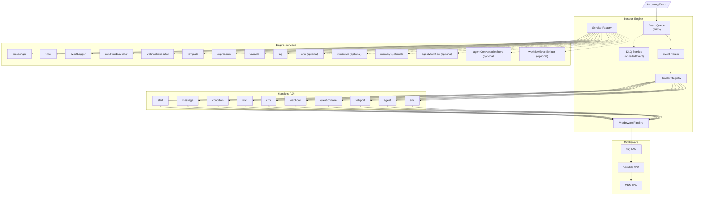

# Engine Architecture Diagram

> Internal structure of the @journey/engine package - the heart of journey execution.

## Session Engine Overview

```
╔══════════════════════════════════════════════════════════════════════════════════════════════════╗
║                                    @journey/engine                                                ║
║                               packages/engine/src/                                                ║
╠══════════════════════════════════════════════════════════════════════════════════════════════════╣
║                                                                                                   ║
║   ┌─────────────────────────────────────────────────────────────────────────────────────────┐    ║
║   │                              SESSION ENGINE                                              │    ║
║   │                           (session-engine.ts)                                            │    ║
║   ├─────────────────────────────────────────────────────────────────────────────────────────┤    ║
║   │                                                                                          │    ║
║   │   ┌───────────────────┐      ┌───────────────────┐      ┌───────────────────┐          │    ║
║   │   │    Event Queue    │ ───► │   Event Router    │ ───► │  Handler Dispatch │          │    ║
║   │   │      (FIFO)       │      │                   │      │                   │          │    ║
║   │   └───────────────────┘      └───────────────────┘      └─────────┬─────────┘          │    ║
║   │                                                                    │                    │    ║
║   │                                                                    ▼                    │    ║
║   │   ┌───────────────────────────────────────────────────────────────────────────────┐    │    ║
║   │   │                           HANDLER REGISTRY                                     │    │    ║
║   │   │                                                                                │    │    ║
║   │   │   ┌─────────┐ ┌─────────┐ ┌─────────┐ ┌─────────┐ ┌─────────┐ ┌─────────┐   │    │    ║
║   │   │   │  start  │ │ message │ │condition│ │  wait   │ │  agent  │ │   crm   │   │    │    ║
║   │   │   │ handler │ │ handler │ │ handler │ │ handler │ │ handler │ │ handler │   │    │    ║
║   │   │   └─────────┘ └─────────┘ └─────────┘ └─────────┘ └─────────┘ └─────────┘   │    │    ║
║   │   │   ┌─────────┐ ┌─────────┐ ┌─────────┐ ┌─────────┐ ┌─────────┐               │    │    ║
║   │   │   │ webhook │ │question.│ │teleport │ │   end   │               │    │    ║
║   │   │   │ handler │ │ handler │ │ handler │ │ handler │               │    │    ║
║   │   │   └─────────┘ └─────────┘ └─────────┘ └─────────┘ └─────────┘               │    │    ║
║   │   │                                                                                │    │    ║
║   │   └───────────────────────────────────────────────────────────────────────────────┘    │    ║
║   │                                          │                                              │    ║
║   │                                          ▼                                              │    ║
║   │   ┌───────────────────────────────────────────────────────────────────────────────┐    │    ║
║   │   │                        MIDDLEWARE PIPELINE                                     │    │    ║
║   │   │                                                                                │    │    ║
║   │   │   Input ─► [Tag MW] ─► [Variable MW] ─► [CRM MW] ─► Output                  │    │    ║
║   │   │                                                                                │    │    ║
║   │   └───────────────────────────────────────────────────────────────────────────────┘    │    ║
║   │                                          │                                              │    ║
║   │                                          ▼                                              │    ║
║   │   ┌───────────────────────────────────────────────────────────────────────────────┐    │    ║
║   │   │                         SERVICE FACTORY                                        │    │    ║
║   │   │                         (EngineServices)                                       │    │    ║
║   │   │                                                                                │    │    ║
║   │   │   ┌─────────────┐ ┌─────────────┐ ┌─────────────┐ ┌─────────────┐            │    │    ║
║   │   │   │ messenger   │ │  variable   │ │  template   │ │ expression  │            │    │    ║
║   │   │   └─────────────┘ └─────────────┘ └─────────────┘ └─────────────┘            │    │    ║
║   │   │   ┌─────────────┐ ┌─────────────┐ ┌─────────────┐ ┌─────────────┐            │    │    ║
║   │   │   │   timer     │ │  webhook    │ │  condition  │ │    tag      │            │    │    ║
║   │   │   └─────────────┘ └─────────────┘ └─────────────┘ └─────────────┘            │    │    ║
║   │   │   ┌─────────────┐ ┌─────────────┐ ┌─────────────┐ ┌─────────────┐            │    │    ║
║   │   │   │ eventLogger │ │   crm?      │ │ mindstate?  │ │  memory?    │            │    │    ║
║   │   │   └─────────────┘ └─────────────┘ └─────────────┘ └─────────────┘            │    │    ║
║   │   │                                                                                │    │    ║
║   │   └───────────────────────────────────────────────────────────────────────────────┘    │    ║
║   │                                                                                          │    ║
║   └─────────────────────────────────────────────────────────────────────────────────────────┘    ║
║                                                                                                   ║
╚══════════════════════════════════════════════════════════════════════════════════════════════════╝
```

## Integration Layer

The engine depends on interfaces for agent workflows, conversation storage, and memory. DB/LLM-backed implementations live in `@journey/engine-integrations`.

```
┌───────────────────────────────────────────────────────────────────┐
│ @journey/engine-integrations (DB + LLM adapters)                   │
│  - AgentWorkflowService                                            │
│  - AgentConversationStore                                          │
│  - MemoryService                                                   │
│  - buildAgentMiddleware + summarizer                               │
└───────────────────────────────────────────────────────────────────┘
                │
                ▼
┌───────────────────────────────────────────────────────────────────┐
│ @journey/engine (SessionEngine, AgentHandler)                      │
└───────────────────────────────────────────────────────────────────┘
```

## Handler Flow Diagram

```
┌──────────────────────────────────────────────────────────────────────────────────────────────────┐
│                                    HANDLER EXECUTION FLOW                                         │
└──────────────────────────────────────────────────────────────────────────────────────────────────┘

    Incoming Event
         │
         ▼
┌─────────────────────────────────────────────────────────────────────────────────────────────────┐
│                                     EVENT QUEUE (FIFO)                                           │
│                           packages/engine/src/event/event-queue.ts                               │
│                                                                                                  │
│   Purpose: Serialize all events to prevent race conditions                                       │
│                                                                                                  │
│   ┌───────────┐   ┌───────────┐   ┌───────────┐                                                │
│   │  Event 1  │ → │  Event 2  │ → │  Event 3  │ → ... → Process One-by-One                     │
│   └───────────┘   └───────────┘   └───────────┘                                                │
│                                                                                                  │
│   Events: message | button_click | timeout                                                     │
└────────────────────────────────────────────────┬────────────────────────────────────────────────┘
                                                 │
                                                 ▼
┌─────────────────────────────────────────────────────────────────────────────────────────────────┐
│                                      EVENT ROUTER                                                │
│                                                                                                  │
│   ┌─────────────────────────────────────────────────────────────────────────────────────────┐   │
│   │  Route by Current Node Type                                                              │   │
│   │                                                                                          │   │
│   │  session.currentNodeId → journey.nodes[id].type → handlerRegistry[type]                 │   │
│   └─────────────────────────────────────────────────────────────────────────────────────────┘   │
└────────────────────────────────────────────────┬────────────────────────────────────────────────┘
                                                 │
                                                 ▼
┌─────────────────────────────────────────────────────────────────────────────────────────────────┐
│                                    HANDLER EXECUTION                                             │
│                              packages/engine/src/handlers/                                       │
│                                                                                                  │
│   ┌─────────────────────────────────────────────────────────────────────────────────────────┐   │
│   │  ExecutionContext                                                                        │   │
│   │  ├── session: EnhancedUserJourney                                                       │   │
│   │  ├── node: JourneyNodeData                                                              │   │
│   │  ├── journey: JourneyConfig                                                             │   │
│   │  ├── outgoingEdges: JourneyEdgeData[]                                                   │   │
│   │  ├── services: EngineServices (SharedServiceContext + engine services)                 │   │
│   │  ├── log: Logger                                                                        │   │
│   │  ├── clientData: ClientData                                                             │   │
│   │  └── organizationId: string                                                             │   │
│   └─────────────────────────────────────────────────────────────────────────────────────────┘   │
│                                                                                                  │
│   Handler.execute(context) → HandlerResult                                                      │
│                                                                                                  │
│   ┌─────────────────────────────────────────────────────────────────────────────────────────┐   │
│   │  HandlerResult                                                                           │   │
│   │  ├── action: "wait" | "transition" | "complete"                                         │   │
│   │  ├── targetNodeId?: string                                                              │   │
│   │  └── trigger?: string                                                                    │   │
│   └─────────────────────────────────────────────────────────────────────────────────────────┘   │
└────────────────────────────────────────────────┬────────────────────────────────────────────────┘
                                                 │
                                                 ▼
┌─────────────────────────────────────────────────────────────────────────────────────────────────┐
│                                   MIDDLEWARE PIPELINE                                            │
│                              packages/engine/src/middleware/                                     │
│                                                                                                  │
│   ┌────────────────────────────────────────────────────────────────────────────────────────┐    │
│   │                                                                                         │    │
│   │   Handler Result                                                                        │    │
│   │         │                                                                               │    │
│   │         ▼                                                                               │    │
│   │   ┌───────────┐     ┌───────────┐     ┌───────────┐                                  │    │
│   │   │    Tag    │ ──► │ Variable  │ ──► │    CRM    │                                  │    │
│   │   │ Middleware│     │ Middleware│     │ Middleware│                                  │    │
│   │   └───────────┘     └───────────┘     └───────────┘                                  │    │
│   │         │                 │                 │                                         │    │
│   │         ▼                 ▼                 ▼                                         │    │
│   │    Apply tag        Apply var        Update CRM                                      │    │
│   │    operations       operations       pipeline                                        │    │
│   │                                                                                         │    │
│   └────────────────────────────────────────────────────────────────────────────────────────┘    │
│                                                                                                  │
└────────────────────────────────────────────────┬────────────────────────────────────────────────┘
                                                 │
                                                 ▼
┌─────────────────────────────────────────────────────────────────────────────────────────────────┐
│                                    STATE TRANSITION                                              │
│                                                                                                  │
│   Based on HandlerResult.action:                                                                 │
│                                                                                                  │
│   "wait"       → Stay at current node, wait for next event                                      │
│   "transition" → Move to targetNodeId, execute next handler                                     │
│   "complete"   → End session execution                                                          │
│                                                                                                  │
│   ┌─────────────────────────────────────────────────────────────────────────────────────────┐   │
│   │  Edge Traversal                                                                          │   │
│   │                                                                                          │   │
│   │  For condition handlers:                                                                 │   │
│   │    • Evaluate each outgoing edge's guards                                               │   │
│   │    • Find first matching edge                                                           │   │
│   │    • Transition to edge.target                                                          │   │
│   │                                                                                          │   │
│   │  For message/wait handlers:                                                              │   │
│   │    • Use single outgoing edge (default path)                                            │   │
│   │    • Or match by edge type (timeout, completed, etc.)                                   │   │
│   └─────────────────────────────────────────────────────────────────────────────────────────┘   │
└─────────────────────────────────────────────────────────────────────────────────────────────────┘
```

## Handler Details

```
┌──────────────────────────────────────────────────────────────────────────────────────────────────┐
│                                     NODE HANDLERS (10)                                            │
│                                packages/engine/src/handlers/                                      │
└──────────────────────────────────────────────────────────────────────────────────────────────────┘

┌───────────────────────────────────────────────────────────────────────────────────────────────────┐
│  START HANDLER (start-handler.ts)                                                                 │
│  ─────────────────────────────────                                                                │
│  • Entry point for journey execution                                                              │
│  • Transitions immediately to next node                                                           │
│  • Can execute initial variable assignments                                                       │
│  Result: transition → first content node                                                          │
└───────────────────────────────────────────────────────────────────────────────────────────────────┘

┌───────────────────────────────────────────────────────────────────────────────────────────────────┐
│  MESSAGE HANDLER (message-handler.ts)                                                             │
│  ─────────────────────────────────────                                                            │
│  • Sends text/media/buttons to user                                                               │
│  • Resolves {{variables}} in content                                                              │
│  • Handles follow-up sequences                                                                    │
│  • Can wait for response or auto-transition                                                       │
│  Result: wait (for response) | transition (auto-continue)                                         │
└───────────────────────────────────────────────────────────────────────────────────────────────────┘

┌───────────────────────────────────────────────────────────────────────────────────────────────────┐
│  CONDITION HANDLER (condition-handler.ts)                                                         │
│  ──────────────────────────────────────────                                                       │
│  • Evaluates condition expressions or rule sets                                                   │
│  • Supports mindstate references in expressions                                                   │
│  • Stores branch result in nodeOutputs                                                            │
│  Result: transition → matched branch edge (guard fallback supported)                              │
└───────────────────────────────────────────────────────────────────────────────────────────────────┘

┌───────────────────────────────────────────────────────────────────────────────────────────────────┐
│  WAIT HANDLER (wait-handler.ts)                                                                   │
│  ─────────────────────────────────                                                                │
│  • Schedules timer via adapter                                                                    │
│  • Supports duration in seconds/minutes/hours/days                                                │
│  • Timer fires → session receives timeout event                                                   │
│  Result: wait (for timer) | transition (on timer fire)                                            │
└───────────────────────────────────────────────────────────────────────────────────────────────────┘

┌───────────────────────────────────────────────────────────────────────────────────────────────────┐
│  AGENT HANDLER (agent-handler.ts)                                                                 │
│  ─────────────────────────────────                                                                │
│  • Delegates to AgentWorkflowService for execution                                                │
│  • Builds conversation history from session events                                                │
│  • Transitions only on exit_to_next_node tool call                                            │
│  Exit reasons: completed | timeout | error                                                        │
│  Result: wait (for user message) | transition (on exit)                                           │
└───────────────────────────────────────────────────────────────────────────────────────────────────┘

┌───────────────────────────────────────────────────────────────────────────────────────────────────┐
│  CRM HANDLER (crm-handler.ts)                                                                     │
│  ───────────────────────────────                                                                  │
│  • Moves client between pipeline stages                                                           │
│  • Sets deal values                                                                               │
│  • Creates notes/activities                                                                       │
│  • Assigns owners                                                                                 │
│  Result: transition → next node                                                                   │
└───────────────────────────────────────────────────────────────────────────────────────────────────┘

┌───────────────────────────────────────────────────────────────────────────────────────────────────┐
│  WEBHOOK HANDLER (webhook-handler.ts)                                                             │
│  ───────────────────────────────────                                                              │
│  • Makes HTTP requests to external services                                                       │
│  • Supports all HTTP methods                                                                      │
│  • Stores response in node outputs + session context                                               │
│  Result: transition → success/error edge                                                          │
└───────────────────────────────────────────────────────────────────────────────────────────────────┘

┌───────────────────────────────────────────────────────────────────────────────────────────────────┐
│  QUESTIONNAIRE HANDLER (questionnaire-handler.ts)                                                 │
│  ────────────────────────────────────────────────                                                 │
│  • Collects structured user input                                                                 │
│  • Multiple questions in sequence                                                                 │
│  • Validates responses                                                                            │
│  • Stores answers in node outputs (nodeOutputs)                                                    │
│  • Optional reminders via follow-up timers                                                        │
│  Result: wait (for answers) | transition (complete)                                               │
└───────────────────────────────────────────────────────────────────────────────────────────────────┘

┌───────────────────────────────────────────────────────────────────────────────────────────────────┐
│  TELEPORT HANDLER (teleport-handler.ts)                                                           │
│  ──────────────────────────────────────                                                           │
│  • Marks session for transfer to another journey                                                  │
│  • Stores __teleport marker in session.context for API layer                                       │
│  Result: complete (API creates new session)                                                       │
└───────────────────────────────────────────────────────────────────────────────────────────────────┘

┌───────────────────────────────────────────────────────────────────────────────────────────────────┐
│  END HANDLER (end-handler.ts)                                                                     │
│  ───────────────────────────────                                                                  │
│  • Terminates journey execution                                                                   │
│  • Optionally sends final message                                                                 │
│  Result: complete                                                                                 │
└───────────────────────────────────────────────────────────────────────────────────────────────────┘

┌───────────────────────────────────────────────────────────────────────────────────────────────────┐
│  FOLLOW-UP SEQUENCES (message-handler + event-router)                                             │
│  ─────────────────────────────────────────────────────────────                                    │
│  • Inline reminders configured on MESSAGE nodes                                                   │
│  • Timers scheduled via TimerService; routing via EventRouter                                     │
│  • Cancelled on user response, optional exit path after final step                                │
└───────────────────────────────────────────────────────────────────────────────────────────────────┘
```

## Service Layer

```
┌──────────────────────────────────────────────────────────────────────────────────────────────────┐
│                                ENGINE SERVICES (core + optional)                                  │
│                              packages/engine/src/services/                                        │
└──────────────────────────────────────────────────────────────────────────────────────────────────┘

┌────────────────────────────────────────────────────────────────────────────────────────────────────┐
│                                                                                                     │
│   ┌─────────────────────────────────────────────────────────────────────────────────────────────┐  │
│   │                             SERVICE FACTORY                                                  │  │
│   │                        (service-factory.ts)                                                  │  │
│   │                                                                                              │  │
│   │   Creates EngineServices (SharedServiceContext + engine services)                            │  │
│   │                                                                                              │  │
│   │   ServiceFactory.createServices(...) → EngineServices                                        │  │
│   │                                                                                              │  │
│   └─────────────────────────────────────────────────────────────────────────────────────────────┘  │
│                                             │                                                       │
│         ┌───────────────────────────────────┼───────────────────────────────────┐                  │
│         │                                   │                                   │                  │
│         ▼                                   ▼                                   ▼                  │
│   ┌───────────────┐               ┌───────────────┐               ┌───────────────┐               │
│   │   VARIABLE    │               │   TEMPLATE    │               │  EXPRESSION   │               │
│   │   SERVICE     │               │   SERVICE     │               │   SERVICE     │               │
│   │               │               │               │               │               │               │
│   │ • executeAction() │           │ • substitute()│               │ • evaluate()  │               │
│   │ • getAll()       │           │ • supports    │               │ • validate()  │               │
│   │                 │           │   {{vars}} +  │               │ • JEXL-based  │               │
│   │                 │           │   {{= expr}}  │               │               │               │
│   └───────────────┘               └───────────────┘               └───────────────┘               │
│                                                                                                     │
│   ┌───────────────┐               ┌───────────────┐               ┌───────────────┐               │
│   │  CONDITION    │               │    TIMER      │               │     TAG       │               │
│   │  EVALUATOR    │               │   SERVICE     │               │   SERVICE     │               │
│   │               │               │               │               │               │               │
│   │ • evaluate()  │               │ • schedule()  │               │ • add/remove  │               │
│   │ • expr/rules  │               │ • cancel()    │               │ • getTags()   │               │
│   │ • regex-safe  │               │ • follow-ups  │               │               │               │
│   │               │               │ • adapter     │               │               │               │
│   └───────────────┘               └───────────────┘               └───────────────┘               │
│                                                                                                     │
│   ┌───────────────┐               ┌───────────────┐               ┌───────────────┐               │
│   │   WEBHOOK     │               │  MESSENGER    │               │ EVENT LOGGER │               │
│   │   EXECUTOR    │               │   SERVICE     │               │               │               │
│   │               │               │               │               │               │               │
│   │ • execute()   │               │ • sendMessage │               │ • logEvent()  │               │
│   │ • HTTP calls  │               │ • templates   │               │ • history     │               │
│   │ • retry + CB  │               │ • media/buttons│              │   tracking    │               │
│   └───────────────┘               └───────────────┘               └───────────────┘               │
│                                                                                                     │
└────────────────────────────────────────────────────────────────────────────────────────────────────┘
```

Optional services provided via config: CRM, mindstate, memory, agentWorkflow, agentConversationStore, and workflowEventEmitter. The DLQ service is created alongside the Event Queue (not part of EngineServices) to record failed events.

## Mermaid Diagram



## File Structure

```
packages/engine/src/
├── session-engine.ts           # Main engine orchestrator
├── event/                      # Event handling
│   ├── event-queue.ts          # FIFO event processing
│   └── event-router.ts         # Event routing
│
├── handlers/                   # Node type handlers (10)
│   ├── index.ts
│   ├── start-handler.ts
│   ├── message-handler.ts
│   ├── condition-handler.ts
│   ├── wait-handler.ts
│   ├── agent-handler.ts
│   ├── crm-handler.ts
│   ├── webhook-handler.ts
│   ├── questionnaire-handler.ts
│   ├── teleport-handler.ts
│   ├── end-handler.ts
│
├── services/                   # Engine services (10)
│   ├── index.ts
│   ├── edge-selector.ts
│   ├── service-factory.ts
│   ├── variable-service.ts
│   ├── template-service.ts
│   ├── expression-service.ts
│   ├── expression-registry.ts
│   ├── condition-evaluator.ts
│   ├── timer-service.ts
│   ├── webhook-executor.ts
│   ├── dlq-service.ts
│   └── factories/
│
├── middleware/                 # Execution middleware
│   ├── built-in/
│   │   ├── tag-middleware.ts
│   │   ├── variable-middleware.ts
│   │   └── crm-middleware.ts
│   ├── factory.ts
│   ├── middleware-pipeline.ts
│   └── index.ts
│
├── state/                      # State management helpers
│   ├── index.ts
│   ├── session-state-manager.ts   # Central session mutations
│   ├── agent-state-manager.ts     # Agent node state
│   └── questionnaire-state-manager.ts # Questionnaire progress
│
├── validation/                 # Journey validation
├── mindstate/                  # MindState integration
├── testing/                    # Test utilities
└── utils/                      # Utilities
    └── retry.ts               # Exponential backoff
```

---

## Related Diagrams

- [System Overview](./system-overview.md) - Complete system architecture
- [Node System](./node-system.md) - Node types and editors
- [LLM Architecture](./llm-architecture.md) - Agent handler details
