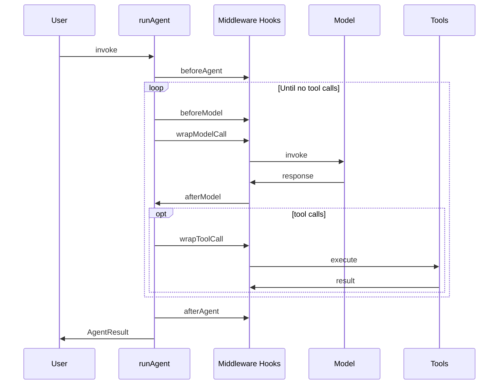
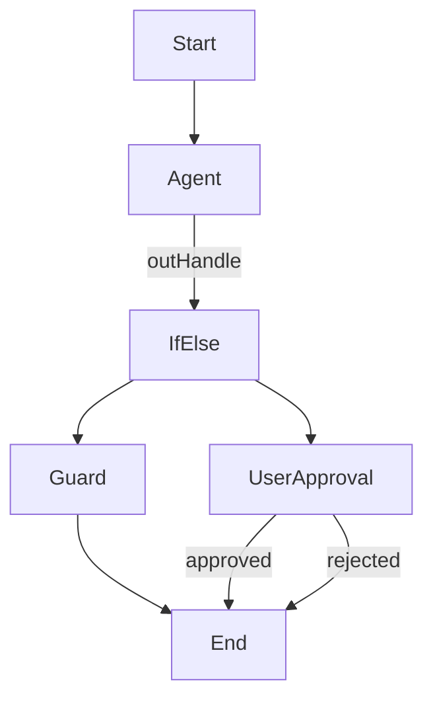

# LLM Architecture

This diagram set describes the `@journey/llm` package: model access, agents, tools, middleware, and workflow runtime.

## Overview

```
┌────────────────────────────────────────────────────────────────────────────┐
│                               @journey/llm                                  │
├────────────────────────────────────────────────────────────────────────────┤
│  Services                                                                   │
│  - LLM (chat, structured output)                                            │
│  - Agent (executeAgent wrapper)                                             │
│  - Audio (STT/TTS, OpenAI)                                                  │
│  - Embeddings (OpenAI)                                                      │
│  - Guards                                                                   │
│  - Usage tracking + adapters (DB-backed default)                            │
│  - Question understanding                                                   │
│                                                                            │
│  Agent Engine                                                               │
│  - runAgent (unified runtime)                                               │
│                                                                            │
│  Middleware                                                                 │
│  - Pipeline + 8 built-ins                                                   │
│                                                                            │
│  Tools                                                                      │
│  - Unified registry (system, utility, mcp)                                 │
│                                                                            │
│  Workflow                                                                   │
│  - DAG runner + node executors                                              │
│                                                                            │
│  Model Registry                                                             │
│  - Metadata + pricing from essential-models.ts                              │
└────────────────────────────────────────────────────────────────────────────┘
```

## Package Layout (current)

```
packages/llm/src/
├── agent/                       # Unified agent engine + model runtime
├── services/                    # LLM, agent, audio, embeddings, guards
├── middleware/                  # Pipeline + built-ins
├── tools/                       # Unified tool system
│   ├── tool.ts                  # Utility tool helper
│   ├── types.ts                 # MCP type re-exports
│   ├── embedded/                # Utility tools (auto-registered)
│   │   ├── tavily.tool.ts
│   │   └── current-time.tool.ts
│   ├── builtin/                 # System tools
│   └── unified/                 # Unified registry
├── workflow/                    # DAG runtime + executors
├── errors/                      # Error classification
├── providers/                   # Mock provider
├── clients/                     # Provider clients
├── config/                      # Defaults + generator scripts
└── utils/                       # Shared helpers
```

## Tool System (Unified)

```mermaid
flowchart LR
  A[Tool IDs] --> B[unifiedToolRegistry]
  B --> C[System tools]
  B --> D[Utility tools]
  B --> E[MCP tools]
  C --> F[AgentTool[]]
  D --> F
  E --> F
```

Tool ID formats:
- `system:save_memory`
- `utility:current_time`
- `mcp:fetch:fetch`

Registration notes:
- `@journey/llm/tools/unified` auto-registers system + journey + embedded tools.
- MCP tools are fetched via `@journey/mcp` and cached for ~5s.

## Agent Execution Flow



Note: `executeAgentWithMiddleware` composes full pipeline middleware and delegates to `runAgent`.

## Workflow Runtime



## Dependencies (runtime)

- `@journey/infra` for circuit breaker
- `@journey/db` for usage tracking
- `@journey/mcp` for MCP tools
- `@journey/schemas` for shared types
- `@journey/logger` for structured logging
- `openai` for audio + embeddings
