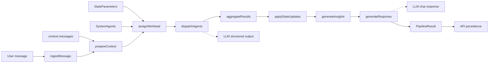

# Mindstate Pipeline

Pipeline flow for `@journey/mindstate`. The pipeline is pure and does not access the database; persistence happens in the API service.

## ASCII Flow

```
User message
  │
  ▼
[ingest] -> [context] -> [workload] -> [dispatch] -> [aggregate] -> [state-update] -> [insights] -> [response]
  │              │                        │                                  │                 │
  │              │                        └─ LLM structured output           │                 └─ LLM chat response
  │              └─ uses provided messages (no DB fetch)                      │
  └─ caller supplies context + agents                                         └─ hysteresis + history

Caller persists results:
- client_mindstates.state_parameters
- client_mindstates.agent_insights
- mindstate_analysis_log
```

## Mermaid Flow



## Key Files

- `packages/mindstate/src/pipeline/orchestrator.ts`
- `packages/mindstate/src/pipeline/steps/`
- `packages/mindstate/src/llm/agent-service.ts`
- `apps/api/src/modules/mindstates/services/analysis-service.ts`
