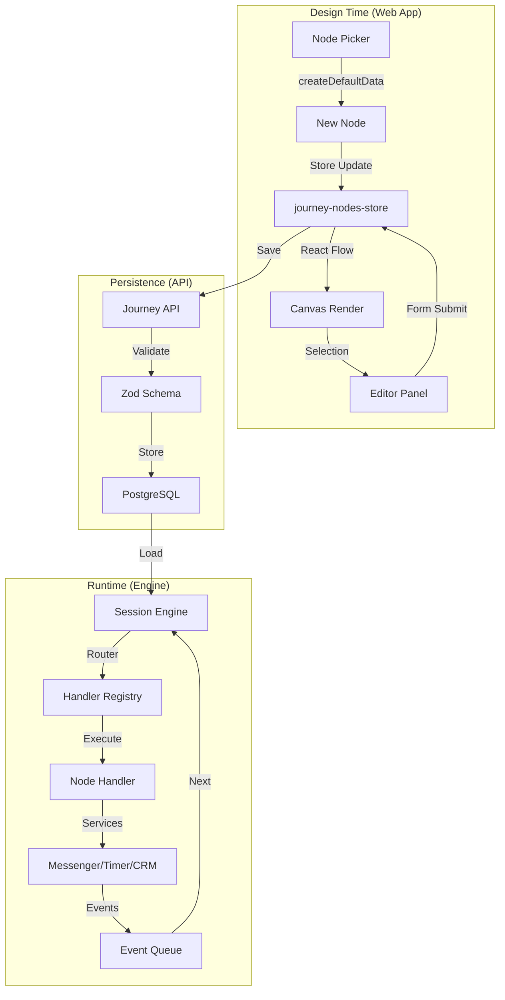

# Node System Architecture

This document describes the complete node system - from schema definitions to runtime handlers to visual editors.

## Overview

The node system is the core of the journey builder. Each node type is defined once and used across:
- **Schemas**: Data validation and type definitions
- **Engine**: Runtime execution handlers
- **Web App**: Visual components and editors

```
┌─────────────────────────────────────────────────────────────────────────────────┐
│                           NODE SYSTEM ARCHITECTURE                              │
│                                                                                 │
│  ┌─────────────────────────────────────────────────────────────────────────┐   │
│  │                        @journey/schemas                                  │   │
│  │   ┌──────────────────────────────────────────────────────────────────┐  │   │
│  │   │                     Node Type Definitions                         │  │   │
│  │   │                                                                   │  │   │
│  │   │   START     MESSAGE    CONDITION    WAIT     WEBHOOK             │  │   │
│  │   │     ●         ○          ◇           ⧖         ⟲                 │  │   │
│  │   │                                                                   │  │   │
│  │   │   CRM      TELEPORT      END      QUESTIONNAIRE    AGENT         │  │   │
│  │   │    ⬡         ➤           ⬤            ?            🤖            │  │   │
│  │   └──────────────────────────────────────────────────────────────────┘  │   │
│  │                               │                                          │   │
│  │   ┌───────────────────────────┴───────────────────────────┐             │   │
│  │   │           NodeCapabilitiesSchema (15 flags)            │             │   │
│  │   │   hasTextMessage  hasButtons  hasMedia  hasTimer        │             │   │
│  │   │   hasFollowUp  hasDuration  hasTimeout  hasConditions   │             │   │
│  │   │   hasVariableAssignment  hasTagAction  hasResponseCapture│             │   │
│  │   │   hasWebhook  hasCrmAction  hasAI  hasQuestions          │             │   │
│  │   └────────────────────────────────────────────────────────┘             │   │
│  └─────────────────────────────────────────────────────────────────────────┘   │
│                                      │                                          │
│              ┌───────────────────────┼───────────────────────┐                 │
│              ▼                       ▼                       ▼                 │
│  ┌───────────────────┐   ┌───────────────────┐   ┌───────────────────┐        │
│  │   @journey/engine │   │     apps/web      │   │     apps/api      │        │
│  │                   │   │                   │   │                   │        │
│  │ ┌───────────────┐ │   │ ┌───────────────┐ │   │ ┌───────────────┐ │        │
│  │ │   Handlers    │ │   │ │   Registry    │ │   │ │  Validation   │ │        │
│  │ │ (10 handlers) │ │   │ │  + Components │ │   │ │ + Persistence │ │        │
│  │ │               │ │   │ │  + Editors    │ │   │ │               │ │        │
│  │ └───────────────┘ │   │ └───────────────┘ │   │ └───────────────┘ │        │
│  └───────────────────┘   └───────────────────┘   └───────────────────┘        │
│                                                                                 │
└─────────────────────────────────────────────────────────────────────────────────┘
```

---

## Node Types (10 Total)

Each node type serves a specific purpose in the journey flow:

| Type | Icon | Category | Purpose |
|------|------|----------|---------|
| **start** | ● | Flow | Journey entry point, initial message |
| **message** | ○ | Action | Display content, buttons, media |
| **condition** | ◇ | Logic | Branch based on expressions |
| **wait** | ⧖ | Flow | Pause for duration |
| **webhook** | ⟲ | Integration | Call external HTTP endpoints |
| **crm** | ⬡ | Integration | Update CRM stage/properties |
| **teleport** | ➤ | Flow | Jump to another journey |
| **end** | ⬤ | Flow | Complete journey, optional summary |
| **questionnaire** | ? | Action | Multi-question interactive flow |
| **agent** | 🤖 | Action | Delegates to agent workflow (workflowKey + timeout) |

### Node Categories

```
┌─────────────────────────────────────────────────────────────────────┐
│                         NODE CATEGORIES                              │
├────────────────┬────────────────┬────────────────┬─────────────────┤
│     FLOW       │     ACTION     │     LOGIC      │   INTEGRATION   │
├────────────────┼────────────────┼────────────────┼─────────────────┤
│     start      │    message     │   condition    │    webhook      │
│     wait       │  questionnaire │                │      crm        │
│    teleport    │     agent      │                │                 │
│      end       │                │                │                 │
└────────────────┴────────────────┴────────────────┴─────────────────┘
```

---

## Node Capabilities

Each node type declares which features it supports via a 15-flag capability schema:

- `hasTextMessage`, `hasButtons`, `hasMedia`
- `hasTimer`, `hasFollowUp`, `hasDuration`, `hasTimeout`
- `hasConditions`, `hasVariableAssignment`, `hasTagAction`, `hasResponseCapture`
- `hasWebhook`, `hasCrmAction`, `hasAI`, `hasQuestions`

Source of truth: `packages/schemas/src/nodes/capabilities.ts` (`NODE_CAPABILITIES`).

**Capability Usage:**
- **Section Registry**: Show/hide editor sections based on capabilities
- **Field Registry**: Include/exclude form fields based on capabilities
- **UI Components**: Conditional rendering based on node features

---

## Schema Architecture

All node data types are defined in `@journey/schemas`:

```
packages/schemas/src/nodes/
├── index.ts           # Node type union, NodeTypeSchema
├── base.ts            # BaseNodeData, shared fields (Timer, Media, etc.)
├── capabilities.ts    # NodeCapabilitiesSchema, NODE_CAPABILITIES
├── button.ts          # Button configuration
├── follow-up.ts       # Follow-up sequence definitions
│
├── start.ts           # StartNodeDataSchema
├── message.ts         # MessageNodeDataSchema
├── condition.ts       # ConditionNodeDataSchema, ConditionRule
├── wait.ts            # WaitNodeDataSchema
├── webhook.ts         # WebhookNodeDataSchema
├── crm.ts             # CrmNodeDataSchema
├── teleport.ts        # TeleportNodeDataSchema
├── end.ts             # EndNodeDataSchema
├── questionnaire.ts   # QuestionnaireNodeDataSchema
└── agent.ts           # AgentNodeDataSchema (workflowKey + timeout, shared configs live here too)
```

### Discriminated Union Pattern

```typescript
// All node types form a discriminated union on the 'type' field
export const JourneyStepDataSchema = z.discriminatedUnion("type", [
  StartNodeDataSchema,      // { type: "start", content, ... }
  MessageNodeDataSchema,    // { type: "message", content, buttons, ... }
  ConditionNodeDataSchema,  // { type: "condition", branches, ... }
  WaitNodeDataSchema,       // { type: "wait", duration, ... }
  WebhookNodeDataSchema,    // { type: "webhook", url, method, ... }
  CrmNodeDataSchema,        // { type: "crm", actions, ... }
  TeleportNodeDataSchema,   // { type: "teleport", targetJourneyId, ... }
  EndNodeDataSchema,        // { type: "end", content, ... }
  QuestionnaireNodeDataSchema, // { type: "questionnaire", questions, ... }
  AgentNodeDataSchema,      // { type: "agent", workflowKey, timeout? }
]);
```

---

## Engine Handlers

Each node type has a corresponding handler in the engine:

```
packages/engine/src/handlers/
├── index.ts              # Handler registry, exports all handlers
├── start-handler.ts      # Initialize session, send welcome
├── message-handler.ts    # Send content, handle responses
├── condition-handler.ts  # Evaluate rules, route to branch
├── wait-handler.ts       # Schedule wake-up timer
├── webhook-handler.ts    # Make HTTP call, parse response
├── crm-handler.ts        # Update CRM stage/properties
├── teleport-handler.ts   # Jump to another journey
├── end-handler.ts        # Complete session, send summary
├── questionnaire-handler.ts # Multi-question flow
└── agent-handler.ts      # LLM conversation loop
```

### Handler Interface

```typescript
interface NodeHandler {
  nodeType: NodeType;

  execute(context: ExecutionContext): Promise<HandlerResult>;
  handleEvent?(event: JourneyEvent, context: ExecutionContext): Promise<NodeEventResult | null>;
}

// Handler returns one of:
type HandlerResult =
  | { action: "transition"; targetNodeId: string; trigger: string }
  | { action: "wait" }       // Wait for user input or timer
  | { action: "complete" };  // End the session
```

### Handler Flow

```
┌─────────────────────────────────────────────────────────────────────────────┐
│                         HANDLER EXECUTION FLOW                              │
│                                                                             │
│   ┌──────────┐      ┌──────────┐      ┌──────────┐      ┌──────────┐      │
│   │  Event   │──▶   │  Router  │──▶   │ Handler  │──▶   │  Result  │      │
│   │ Received │      │(by type) │      │ Execute  │      │          │      │
│   └──────────┘      └──────────┘      └──────────┘      └──────────┘      │
│                                              │                              │
│                                              ▼                              │
│                          ┌─────────────────────────────────┐               │
│                          │        Handler Actions          │               │
│                          ├─────────────────────────────────┤               │
│                          │ • services.messenger.send()     │               │
│                          │ • services.variable.get/set()   │               │
│                          │ • services.timer.schedule()     │               │
│                          │ • services.webhook.call()       │               │
│                          │ • services.crm.update()         │               │
│                          │ • services.memory.save/recall() │               │
│                          └─────────────────────────────────┘               │
│                                              │                              │
│                                              ▼                              │
│   ┌──────────────────────────────────────────────────────────────────┐     │
│   │                      Handler Result                               │     │
│   ├───────────────────┬────────────────────┬────────────────────────┤     │
│   │    transition     │       wait         │       complete         │     │
│   │  (go to next)     │  (wait for input)  │   (end session)        │     │
│   └───────────────────┴────────────────────┴────────────────────────┘     │
│                                                                             │
└─────────────────────────────────────────────────────────────────────────────┘
```

Handlers can optionally implement `handleEvent()` to consume events before edge routing (used by questionnaire and agent nodes).

Agent behavior (prompts, tools, middleware, execution steps) is defined in the
agent workflow schemas under `packages/schemas/src/agents/workflow/`. The journey
node only references a `workflowKey` and optional timeout. Shared agent config
schemas (LLM/tools/middleware) live in `packages/schemas/src/nodes/agent.ts` for
workflow reuse.

---

## Web App Registry

The web app uses a registry pattern for node definitions:

```
apps/web/src/features/nodes/journey/
├── registry/
│   ├── node-registry.ts    # NodeRegistry class, singleton
│   ├── section-registry.ts # Editor sections by capability
│   └── form-registry.ts    # Form field definitions
│
├── definitions/             # Self-registering node configs
│   ├── start.ts
│   ├── message.ts
│   ├── agent.ts
│   ├── condition.ts
│   ├── wait.ts
│   ├── webhook.ts
│   ├── crm.ts
│   ├── teleport.ts
│   ├── end.ts
│   ├── questionnaire.ts
│   └── index.ts            # Imports all definitions
│
├── components/              # Visual node components
│   ├── base-node.tsx       # Shared node wrapper
│   ├── node-wrapper.tsx    # React Flow integration
│   ├── start-node.tsx
│   ├── message-node.tsx
│   └── ...                 # One per node type
│
└── editors/                 # Node configuration editors
    ├── editor-base.tsx     # Shared editor structure
    ├── start-node-editor.tsx
    ├── message-node-editor.tsx
    ├── sections/           # Reusable editor sections
    │   ├── timer-section.tsx
    │   ├── media-section.tsx
    │   ├── variable-action-section.tsx
    │   └── ...
    └── ...
```

### Node Definition Structure

```typescript
interface NodeDefinition {
  type: NodeType;                // "message"
  label: string;                 // "Message"
  description: string;           // "Display content..."
  category: "flow" | "action" | "logic" | "integration";
  icon: LucideIcon;              // MessageSquare
  colors: NodeColorScheme;       // { icon, border, header, selected }
  config: NodeConfigOptions;     // { features, canHaveButtons, ... }
  createDefaultData: () => JourneyStepData;
  component: ComponentType;      // Visual node for canvas
  editor: ComponentType;         // Editor panel component
}

// Self-registration pattern
nodeRegistry.register({
  type: "message",
  label: "Message",
  // ...
});
```

### Registry Flow

```
┌─────────────────────────────────────────────────────────────────────────────┐
│                         NODE REGISTRY PATTERN                               │
│                                                                             │
│   ┌──────────────────┐                                                     │
│   │  definitions/    │ ──────┐                                             │
│   │   message.ts     │       │                                             │
│   │   start.ts       │       │  Self-register on import                    │
│   │   condition.ts   │       ▼                                             │
│   │   ...            │    ┌─────────────────────────────────────┐          │
│   └──────────────────┘    │         NODE REGISTRY               │          │
│                           │  ┌─────────────────────────────┐    │          │
│                           │  │ Map<NodeType, NodeDefinition>│   │          │
│                           │  └─────────────────────────────┘    │          │
│                           │                                      │          │
│                           │  Methods:                            │          │
│                           │  • get(type) → NodeDefinition       │          │
│                           │  • getComponent(type) → Component   │          │
│                           │  • getEditor(type) → Editor         │          │
│                           │  • getAddable() → NodeDefinition[]  │          │
│                           │  • createDefaultData(type)          │          │
│                           └─────────────────────────────────────┘          │
│                                         │                                   │
│                     ┌───────────────────┼───────────────────┐              │
│                     ▼                   ▼                   ▼              │
│            ┌──────────────┐     ┌──────────────┐     ┌──────────────┐     │
│            │ Node Picker  │     │   Canvas     │     │ Editor Panel │     │
│            │              │     │  Rendering   │     │              │     │
│            │ getAddable() │     │getComponent()│     │ getEditor()  │     │
│            └──────────────┘     └──────────────┘     └──────────────┘     │
│                                                                             │
└─────────────────────────────────────────────────────────────────────────────┘
```

---

## Node Data Flow

From creation to runtime execution:



---

## Message Node Deep Dive

The message node is the most feature-rich node type:

```
┌─────────────────────────────────────────────────────────────────────────────┐
│                         MESSAGE NODE STRUCTURE                              │
│                                                                             │
│   Schema (MessageNodeDataSchema)                                            │
│   ├── type: "message"                                                       │
│   ├── label: string                                                         │
│   ├── content: string              # Main message text                      │
│   ├── buttons?: ButtonConfig[]     # Buttons route via targetNodeId         │
│   ├── media?: Media                # Image/video attachment                 │
│   ├── tags?: string[]              # Legacy/UI tags list                    │
│   ├── timer?: Timer                # Auto-advance timeout                   │
│   ├── followUpSequence?: FollowUpSequence # Reminder sequence              │
│   ├── responseType?: ResponseType  # auto|buttons|text|any                  │
│   ├── storeResponseAs?: string     # Alias for user response                │
│   ├── delay?: number               # Delay before sending (0-60s)           │
│   ├── tagAction?: TagAction        # Tag add/remove                         │
│   ├── variableAction?: VariableAction # Variable operations                │
│   └── crmAction?: CrmAction        # CRM stage updates                      │
│                                                                             │
│   Handler (messageHandler)                                                  │
│   ├── 1. Determine response type (explicit or inferred)                     │
│   ├── 2. Filter edges by guards (Smart Edges)                              │
│   ├── 3. Apply send delay if configured                                    │
│   ├── 4. Send message via messenger service                                │
│   ├── 5. Set activeButtons for unified button routing                      │
│   ├── 6. Handle auto-transition for "auto" response type                   │
│   ├── 7. Schedule timer edge if configured                                 │
│   ├── 8. Schedule follow-up sequence if enabled                            │
│   └── 9. Return wait/transition result                                     │
│                                                                             │
│   Editor (MessageNodeEditor)                                                │
│   ├── Content Section                                                       │
│   │   └── Rich text editor with template variables                         │
│   ├── Media Section (hasMedia capability)                                   │
│   │   └── Image/video upload or URL                                        │
│   ├── Buttons Section (hasButtons capability)                               │
│   │   └── Button list with targets                                         │
│   ├── Timer Section (hasTimer capability)                                   │
│   │   └── Duration picker + target selection                               │
│   ├── Follow-Up Section (hasFollowUp capability)                           │
│   │   └── Reminder step builder                                            │
│   ├── Variable Actions Section                                             │
│   │   └── Variable set/increment/delete                                    │
│   ├── Tag Actions Section                                                   │
│   │   └── Tag add/remove                                                   │
│   └── Metadata Section                                                      │
│       └── Label, notes, node ID                                            │
│                                                                             │
└─────────────────────────────────────────────────────────────────────────────┘
```

---

## Agent Node Deep Dive

The agent node executes an agent workflow (LLM logic lives in the workflow):

```
┌─────────────────────────────────────────────────────────────────────────────┐
│                          AGENT NODE STRUCTURE                               │
│                                                                             │
│   Schema (AgentNodeDataSchema)                                              │
│   ├── type: "agent"                                                         │
│   ├── label: string                                                         │
│   ├── workflowKey: string            # Agent workflow to execute            │
│   ├── timeout?: AgentTimeout         # Inactivity timeout (timer edge)      │
│   ├── next?: string                  # Default next node on completion      │
│   ├── tagAction?: TagAction          # Base actions                         │
│   ├── variableAction?: VariableAction                                      │
│   └── crmAction?: CrmAction                                                 │
│                                                                             │
│   Handler Flow                                                              │
│   ┌──────────────────────────────────────────────────────────────────┐     │
│   │                 AGENT WORKFLOW EXECUTION                         │     │
│   │                                                                  │     │
│   │  Load workflow by key → build context → run workflow runner       │     │
│   │  ├─ emits messages via messenger                                  │     │
│   │  ├─ uses tools + permissions                                      │     │
│   │  └─ completes or times out → transition/timeout edge              │     │
│   └──────────────────────────────────────────────────────────────────┘     │
│                                                                             │
└─────────────────────────────────────────────────────────────────────────────┘
```

---

## File Structure Summary

```
Node System Files
├── packages/schemas/src/nodes/     # Type definitions (10 node types)
│   ├── index.ts                    # Union types, NodeType enum
│   ├── capabilities.ts             # 16 capability flags
│   └── [node-type].ts              # Per-type schema
│
├── packages/engine/src/handlers/   # Runtime handlers (10 handlers)
│   ├── index.ts                    # Handler registry
│   └── [node-type]-handler.ts      # Per-type handler
│
└── apps/web/src/features/nodes/journey/
    ├── registry/                   # Node, section, form registries
    ├── definitions/                # Self-registering configs
    ├── components/                 # Visual components
    ├── editors/                    # Editor panels
    │   └── sections/               # Reusable sections
    ├── hooks/                      # Form and editing hooks
    ├── config/                     # Theme, defaults
    └── types.ts                    # Web-specific type extensions
```

---

## Key Design Principles

1. **Single Source of Truth**: Node schemas in `@journey/schemas` are the canonical definitions
2. **Self-Registration**: Node definitions register themselves on import
3. **Capability-Based UI**: Editor sections render based on declared capabilities
4. **Handler Isolation**: Each handler is independent, communicates via services
5. **Discriminated Unions**: Type-safe node data handling via `type` field
6. **Composable Editors**: Sections are reused across node types based on capabilities
