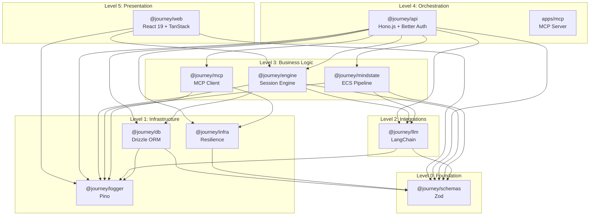

# Package Dependencies Diagram

> Monorepo package structure and dependency relationships.

## Package Hierarchy

```
┌─────────────────────────────────────────────────────────────────────────────────────────────────────┐
│                                    JOURNEY BUILDER MONOREPO                                          │
│                                        (Turborepo + pnpm)                                            │
├─────────────────────────────────────────────────────────────────────────────────────────────────────┤
│                                                                                                      │
│  ┌─────────────────────────────────────────────────────────────────────────────────────────────┐    │
│  │  LEVEL 5: PRESENTATION                                                                       │    │
│  │                                                                                              │    │
│  │   ╔═══════════════════════════════════════════════════════════════════════════════════╗     │    │
│  │   ║                              apps/web                                              ║     │    │
│  │   ║                           (@journey/web)                                           ║     │    │
│  │   ╠═══════════════════════════════════════════════════════════════════════════════════╣     │    │
│  │   ║  React 19 + TanStack Router + React Flow v12 + Tailwind v4                        ║     │    │
│  │   ║                                                                                    ║     │    │
│  │   ║  Dependencies: engine, logger, schemas                                            ║     │    │
│  │   ║                                                                                    ║     │    │
│  │   ║  Features:                                                                         ║     │    │
│  │   ║  ├── journey/      (Builder, simulator, nodes)                                    ║     │    │
│  │   ║  ├── agent-workflows/                                                              ║     │    │
│  │   ║  ├── auth/                                                                         ║     │    │
│  │   ║  ├── crm/                                                                          ║     │    │
│  │   ║  ├── mindstate/                                                                    ║     │    │
│  │   ║  ├── dashboard/                                                                    ║     │    │
│  │   ║  ├── settings/                                                                     ║     │    │
│  │   ║  ├── users/                                                                        ║     │    │
│  │   ║  └── developers/                                                                   ║     │    │
│  │   ╚═══════════════════════════════════════════════════════════════════════════════════╝     │    │
│  │                                          │                                                   │    │
│  └──────────────────────────────────────────┼───────────────────────────────────────────────────┘    │
│                                             │                                                        │
│  ┌──────────────────────────────────────────┼───────────────────────────────────────────────────┐    │
│  │  LEVEL 4: ORCHESTRATION                  │                                                    │    │
│  │                                          ▼                                                    │    │
│  │   ╔═══════════════════════════════════════════════════════════════════════════════════╗     │    │
│  │   ║                              apps/api                                              ║     │    │
│  │   ║                           (@journey/api)                                           ║     │    │
│  │   ╠═══════════════════════════════════════════════════════════════════════════════════╣     │    │
│  │   ║  Hono.js + Better Auth + BullMQ + Drizzle                                         ║     │    │
│  │   ║                                                                                    ║     │    │
│  │   ║  Dependencies: ALL packages (engine, llm, mindstate, db, logger, schemas, ...)    ║     │    │
│  │   ║                                                                                    ║     │    │
│  │   ║  Routes:  journeys, sessions, simulator, workflows, crm, events, webhooks, ...   ║     │    │
│  │   ║  Services: journey, session, timer, channel, crm, automation, agent              ║     │    │
│  │   ║  Adapters: telegram, whatsapp                                                     ║     │    │
│  │   ╚═══════════════════════════════════════════════════════════════════════════════════╝     │    │
│  │                                          │                                                   │    │
│  │   ╔═══════════════════════════════════════════════════════════════════════════════════╗     │    │
│  │   ║                              apps/mcp                                              ║     │    │
│  │   ║                           (MCP Server)                                             ║     │    │
│  │   ╚═══════════════════════════════════════════════════════════════════════════════════╝     │    │
│  │                                          │                                                   │    │
│  └──────────────────────────────────────────┼───────────────────────────────────────────────────┘    │
│                                             │                                                        │
│  ┌──────────────────────────────────────────┼───────────────────────────────────────────────────┐    │
│  │  LEVEL 3: BUSINESS LOGIC                 │                                                    │    │
│  │                                          ▼                                                    │    │
│  │   ╔════════════════════════════════════════════════════════════════════════════════════╗    │    │
│  │   ║                            packages/engine                                          ║    │    │
│  │   ║                          (@journey/engine)                                          ║    │    │
│  │   ╠════════════════════════════════════════════════════════════════════════════════════╣    │    │
│  │   ║                                                                                     ║    │    │
│  │   ║  Dependencies: infra, logger, schemas                                             ║    │    │
│  │   ║                                                                                     ║    │    │
│  │   ║  ┌─────────────────────────────────────────────────────────────────────────────┐   ║    │    │
│  │   ║  │  SESSION ENGINE                                                              │   ║    │    │
│  │   ║  │  ├── Event Router                                                            │   ║    │    │
│  │   ║  │  ├── Handler Registry (10 handlers)                                          │   ║    │    │
│  │   ║  │  ├── Middleware Pipeline                                                     │   ║    │    │
│  │   ║  │  ├── Service Factory                                                         │   ║    │    │
│  │   ║  │  └── Event Queue (FIFO)                                                      │   ║    │    │
│  │   ║  └─────────────────────────────────────────────────────────────────────────────┘   ║    │    │
│  │   ║                                                                                     ║    │    │
│  │   ║  Handlers: start, message, condition, wait, webhook, crm, teleport,               ║    │    │
│  │   ║            questionnaire, agent, end                                              ║    │    │
│  │   ║                                                                                     ║    │    │
│  │   ║  Services: messenger, variable, template, expression, condition, timer,           ║    │    │
│  │   ║            webhook, tag, eventLogger (crm/mindstate/memory/agent optional)        ║    │    │
│  │   ║            DLQ is used by EventQueue for failed events                             ║    │    │
│  │   ╚════════════════════════════════════════════════════════════════════════════════════╝    │    │
│  │                                          │                                                   │    │
│  │   ╔═════════════════════════════════════╗│╔═════════════════════════════════════╗          │    │
│  │   ║       packages/mindstate            ║│║        packages/mcp                  ║          │    │
│  │   ║      (@journey/mindstate)           ║│║       (@journey/mcp)                 ║          │    │
│  │   ╠═════════════════════════════════════╣│╠═════════════════════════════════════╣          │    │
│  │   ║                                     ║│║                                      ║          │    │
│  │   ║  Dependencies: llm, logger, schemas ║│║  Dependencies: infra, logger         ║          │    │
│  │   ║                                     ║│║                                      ║          │    │
│  │   ║  • Pipeline Orchestrator            ║│║  • MCP Client                        ║          │    │
│  │   ║  • 8 Pipeline Steps                 ║│║  • Tool Definitions                  ║          │    │
│  │   ║  • System Agents (ECS)              ║│║  • Type Exports                      ║          │    │
│  │   ║  • State Parameters                 ║│║                                      ║          │    │
│  │   ╚═════════════════════════════════════╝│╚═════════════════════════════════════╝          │    │
│  │                                          │                                                   │    │
│  └──────────────────────────────────────────┼───────────────────────────────────────────────────┘    │
│                                             │                                                        │
│  ┌──────────────────────────────────────────┼───────────────────────────────────────────────────┐    │
│  │  LEVEL 2: INTEGRATIONS                   │                                                    │    │
│  │                                          ▼                                                    │    │
│  │   ╔════════════════════════════════════════════════════════════════════════════════════╗    │    │
│  │   ║                             packages/llm                                            ║    │    │
│  │   ║                           (@journey/llm)                                            ║    │    │
│  │   ╠════════════════════════════════════════════════════════════════════════════════════╣    │    │
│  │   ║                                                                                     ║    │    │
│  │   ║  Dependencies: logger, schemas, infra, db, mcp                                       ║    │    │
│  │   ║                                                                                     ║    │    │
│  │   ║  ┌─────────────────────────────────────────────────────────────────────────────┐   ║    │    │
│  │   ║  │  LLM SERVICE                                                                 │   ║    │    │
│  │   ║  │  • generateChatResponse(), structured output, streaming                       │   ║    │    │
│  │   ║  └─────────────────────────────────────────────────────────────────────────────┘   ║    │    │
│  │   ║                                                                                     ║    │    │
│  │   ║  ┌─────────────────────────────────────────────────────────────────────────────┐   ║    │    │
│  │   ║  │  AGENT RUNTIME                                                               │   ║    │    │
│  │   ║  │  • executeAgent(), runAgent(), middleware pipeline                           │   ║    │    │
│  │   ║  └─────────────────────────────────────────────────────────────────────────────┘   ║    │    │
│  │   ║                                                                                     ║    │    │
│  │   ║  ┌─────────────────────────────────────────────────────────────────────────────┐   ║    │    │
│  │   ║  │  TOOL SYSTEM                                                                 │   ║    │    │
│  │   ║  │  • system, utility, mcp tools (unified registry)                             │   ║    │    │
│  │   ║  │  • journey tools (legacy via buildBuiltinTools)                              │   ║    │    │
│  │   ║  └─────────────────────────────────────────────────────────────────────────────┘   ║    │    │
│  │   ║                                                                                     ║    │    │
│  │   ║  ┌─────────────────────────────────────────────────────────────────────────────┐   ║    │    │
│  │   ║  │  MIDDLEWARE PIPELINE (8 builtin)                                             │   ║    │    │
│  │   ║  │  • pii-detection, model-fallback, usage-tracking, summarization,            │   ║    │    │
│  │   ║  │    human-in-the-loop, llm-guard, todo-list, model-call-limit                │   ║    │    │
│  │   ║  └─────────────────────────────────────────────────────────────────────────────┘   ║    │    │
│  │   ║                                                                                     ║    │    │
│  │   ║  ┌─────────────────────────────────────────────────────────────────────────────┐   ║    │    │
│  │   ║  │  WORKFLOW EXECUTORS                                                          │   ║    │    │
│  │   ║  │  • core/ (core operations)                                                   │   ║    │    │
│  │   ║  │  • data/ (data transformations)                                              │   ║    │    │
│  │   ║  │  • logic/ (control flow)                                                     │   ║    │    │
│  │   ║  │  • tools/ (tool execution)                                                   │   ║    │    │
│  │   ║  └─────────────────────────────────────────────────────────────────────────────┘   ║    │    │
│  │   ║                                                                                     ║    │    │
│  │   ║  Providers: OpenAI, Anthropic, Google GenAI, Groq, Mock                           ║    │    │
│  │   ╚════════════════════════════════════════════════════════════════════════════════════╝    │    │
│  │                                          │                                                   │    │
│  │   ╔════════════════════════════════════════════════════════════════════════════╗            │    │
│  │   ║                   packages/engine-integrations                             ║            │    │
│  │   ║                 (@journey/engine-integrations)                             ║            │    │
│  │   ╠════════════════════════════════════════════════════════════════════════════╣            │    │
│  │   ║  Dependencies: engine, db, llm, logger, schemas                            ║            │    │
│  │   ║                                                                           ║            │    │
│  │   ║  • Workflow loader + runner                                               ║            │    │
│  │   ║  • Conversation store                                                     ║            │    │
│  │   ║  • Memory service (embeddings + pgvector)                                 ║            │    │
│  │   ║  • Middleware builder + summarizer                                        ║            │    │
│  │   ╚════════════════════════════════════════════════════════════════════════════╝            │    │
│  │                                          │                                                   │    │
│  └──────────────────────────────────────────┼───────────────────────────────────────────────────┘    │
│                                             │                                                        │
│  ┌──────────────────────────────────────────┼───────────────────────────────────────────────────┐    │
│  │  LEVEL 1: INFRASTRUCTURE                 │                                                    │    │
│  │                                          ▼                                                    │    │
│  │   ╔═════════════════════════════════════════════════════════════════════════════════════╗   │    │
│  │   ║                              packages/db                                             ║   │    │
│  │   ║                            (@journey/db)                                             ║   │    │
│  │   ╠═════════════════════════════════════════════════════════════════════════════════════╣   │    │
│  │   ║                                                                                      ║   │    │
│  │   ║  Dependencies: schemas, logger                                                       ║   │    │
│  │   ║                                                                                      ║   │    │
│  │   ║  Client: db, queryClient, poolConfig, withQueryLogging                               ║   │    │
│  │   ║  Utilities: encrypt/decrypt/isEncrypted/hashSecret                                   ║   │    │
│  │   ║  Seed + test utils: src/seed/, src/test-utils/                                       ║   │    │
│  │   ║                                                                                      ║   │    │
│  │   ║  Schema Modules:                                                                     ║   │    │
│  │   ║  ├── auth.ts                    (auth users + sessions)                             ║   │    │
│  │   ║  ├── organization.ts            (workspaces)                                        ║   │    │
│  │   ║  ├── organization-membership.ts (members + invitations)                             ║   │    │
│  │   ║  ├── journey.ts                 (journeys, versions, media)                         ║   │    │
│  │   ║  ├── journey-pipelines.ts       (default CRM pipeline mapping)                      ║   │    │
│  │   ║  ├── journey-transfers.ts       (transfer audit)                                    ║   │    │
│  │   ║  ├── channels.ts                (messaging channels)                                ║   │    │
│  │   ║  ├── session.ts                 (clients, sessions, interactions)                   ║   │    │
│  │   ║  ├── variables.ts               (global/journey/user variables)                     ║   │    │
│  │   ║  ├── tags.ts                    (tag definitions + assignments)                     ║   │    │
│  │   ║  ├── crm.ts                     (pipelines, stages, fields, messages)               ║   │    │
│  │   ║  ├── automation.ts              (triggers, webhooks, timers)                        ║   │    │
│  │   ║  ├── events.ts                  (event log + DLQ)                                   ║   │    │
│  │   ║  ├── agents.ts                  (agent workflows + approvals)                      ║   │    │
│  │   ║  ├── mindstate.ts               (mindstate tracking)                                ║   │    │
│  │   ║  ├── memory.ts                  (agent memories, pgvector)                          ║   │    │
│  │   ║  ├── simulator.ts               (test personas)                                     ║   │    │
│  │   ║  ├── usage.ts                   (LLM usage tracking)                                ║   │    │
│  │   ║  ├── enums.ts                   (Postgres enums)                                    ║   │    │
│  │   ║  └── relations.ts               (table relationships)                               ║   │    │
│  │   ╚═════════════════════════════════════════════════════════════════════════════════════╝   │    │
│  │                                          │                                                   │    │
│  │   ╔═══════════════════════════════════╗  │  ╔═══════════════════════════════════╗           │    │
│  │   ║        packages/logger            ║  │  ║        packages/infra             ║           │    │
│  │   ║       (@journey/logger)           ║  │  ║       (@journey/infra)            ║           │    │
│  │   ╠═══════════════════════════════════╣  │  ╠═══════════════════════════════════╣           │    │
│  │   ║                                   ║  │  ║                                   ║           │    │
│  │   ║  Dependencies: (none)             ║  │  ║  Dependencies: logger, schemas    ║           │    │
│  │   ║                                   ║  │  ║                                   ║           │    │
│  │   ║  • Pino-based logging             ║  │  ║  • Circuit breaker                ║           │    │
│  │   ║  • Dual env (Node/Browser)        ║  │  ║  • Rate limiting                  ║           │    │
│  │   ║  • Error serialization            ║  │  ║  • Retry patterns                 ║           │    │
│  │   ║  • File + console output          ║  │  ║                                   ║           │    │
│  │   ╚═══════════════════════════════════╝  │  ╚═══════════════════════════════════╝           │    │
│  │                                          │                                                   │    │
│  └──────────────────────────────────────────┼───────────────────────────────────────────────────┘    │
│                                             │                                                        │
│  ┌──────────────────────────────────────────┼───────────────────────────────────────────────────┐    │
│  │  LEVEL 0: FOUNDATION                     │                                                    │    │
│  │                                          ▼                                                    │    │
│  │   ╔════════════════════════════════════════════════════════════════════════════════════╗    │    │
│  │   ║                            packages/schemas                                         ║    │    │
│  │   ║                          (@journey/schemas)                                         ║    │    │
│  │   ╠════════════════════════════════════════════════════════════════════════════════════╣    │    │
│  │   ║                                                                                     ║    │    │
│  │   ║  Dependencies: zod                                                                  ║    │    │
│  │   ║                                                                                     ║    │    │
│  │   ║  ┌──────────────────────────────────────────────────────────────────────────────┐  ║    │    │
│  │   ║  │  NODE SCHEMAS (10 types)                                                      │  ║    │    │
│  │   ║  │  start, message, condition, wait, agent, crm, webhook,                       │  ║    │    │
│  │   ║  │  questionnaire, teleport, end                                                │  ║    │    │
│  │   ║  └──────────────────────────────────────────────────────────────────────────────┘  ║    │    │
│  │   ║  ┌──────────────────────────────────────────────────────────────────────────────┐  ║    │    │
│  │   ║  │  SERVICE INTERFACES (12)                                                      │  ║    │    │
│  │   ║  │  IVariable, IMessenger, IMemory, ITemplate, ITag, ICrm,                      │  ║    │    │
│  │   ║  │  IMindstate, IDlq, IExpression, IFollowUp, ICache, IJourney                  │  ║    │    │
│  │   ║  └──────────────────────────────────────────────────────────────────────────────┘  ║    │    │
│  │   ║  ┌──────────────────────────────────────────────────────────────────────────────┐  ║    │    │
│  │   ║  │  PERMISSIONS                                                                  │  ║    │    │
│  │   ║  │  subjects, resources, capabilities, checker, guarded-context, audit          │  ║    │    │
│  │   ║  └──────────────────────────────────────────────────────────────────────────────┘  ║    │    │
│  │   ║  ┌──────────────────────────────────────────────────────────────────────────────┐  ║    │    │
│  │   ║  │  UTILITIES                                                                    │  ║    │    │
│  │   ║  │  • Content split/merge + edge style defaults                                 │  ║    │    │
│  │   ║  │  • Type conversion (isEmpty, isTruthy, toNumber, toString)                   │  ║    │    │
│  │   ║  │  • Variable namespaces (buildVariableNamespaces)                             │  ║    │    │
│  │   ║  │  • Store events + no-op service factories                                    │  ║    │    │
│  │   ║  └──────────────────────────────────────────────────────────────────────────────┘  ║    │    │
│  │   ║                                                                                     ║    │    │
│  │   ╚════════════════════════════════════════════════════════════════════════════════════╝    │    │
│  │                                                                                              │    │
│  └──────────────────────────────────────────────────────────────────────────────────────────────┘    │
│                                                                                                      │
└──────────────────────────────────────────────────────────────────────────────────────────────────────┘
```

## Mermaid Dependency Graph



## Import Rules

### Allowed Dependencies

| Package | Can Import From |
|---------|----------------|
| `@journey/schemas` | (none) |
| `@journey/logger` | (none) |
| `@journey/infra` | logger, schemas |
| `@journey/db` | logger, schemas |
| `@journey/llm` | db, infra, logger, mcp, schemas |
| `@journey/mcp` | infra, logger |
| `@journey/mindstate` | llm, logger, schemas |
| `@journey/engine` | infra, logger, schemas |
| `@journey/engine-integrations` | db, engine, llm, logger, schemas |
| `@journey/api` | ALL packages |
| `@journey/web` | engine, logger, schemas |
| `@journey/mcp-service` | mcp, logger |

### Forbidden Patterns

```typescript
// ❌ NEVER import apps into packages
import { something } from "@journey/api";  // in any package

// ❌ NEVER import higher-level packages
import { db } from "@journey/db";  // in @journey/schemas

// ❌ NEVER create circular dependencies
import { engine } from "@journey/engine";  // in @journey/db
```

## Package Exports

### @journey/schemas
```json
{
  "exports": {
    ".": "./src/index.ts",
    "./api": "./src/api/index.ts"
  }
}
```

### @journey/engine
```json
{
  "exports": {
    ".": "./src/index.ts",
    "./validation/journey-validator": "./src/validation/journey-validator.ts"
  }
}
```

### @journey/llm
```json
{
  "exports": {
    ".": "./src/index.ts",
    "./config": "./src/config/index.ts",
    "./middleware": "./src/middleware/index.ts",
    "./workflow": "./src/workflow/index.ts",
    "./tools/unified": "./src/tools/unified/index.ts"
  }
}
```

### @journey/db
```json
{
  "exports": {
    ".": "./src/index.ts",
    "./schema": "./src/schema/index.ts",
    "./client": "./src/client.ts",
    "./test-utils": "./src/test-utils/index.ts"
  }
}
```

### @journey/infra
```json
{
  "exports": {
    ".": "./src/index.ts",
    "./circuit-breaker": "./src/circuit-breaker/index.ts"
  }
}
```

---

## Related Diagrams

- [System Overview](./system-overview.md) - Complete system architecture
- [Engine Architecture](./engine-architecture.md) - Engine internals
- [LLM Architecture](./llm-architecture.md) - AI layer details
