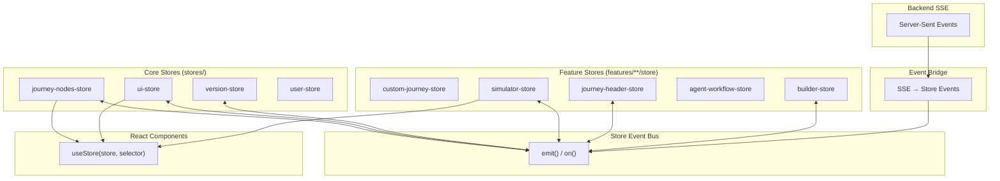

# Store Architecture Diagram

> TanStack Store state management and event-driven communication.

## Store Overview

```
┌────────────────────────────────────────────────────────────────────────────────────────────────────┐
│                                  STORE ARCHITECTURE                                                │
│                          apps/web/src/stores + feature stores                                      │
├────────────────────────────────────────────────────────────────────────────────────────────────────┤
│ Core stores (stores/):                                                                             │
│  - journey-nodes-store (nodes, edges, undo/redo)                                                   │
│  - ui-store (selection, dialogs, panels, pending changes)                                          │
│  - version-store (versions + active version)                                                       │
│  - user-store (current user + org context)                                                         │
│                                                                                                    │
│ Feature stores (features/**/store or features/**/stores):                                          │
│  - custom-journey-store (journey builder data cache)                                               │
│  - simulator-store (simulator state + playback)                                                    │
│  - journey-header-store (dashboard header controls)                                                │
│  - agent-workflow-store / agent-test-store (agent workflows)                                       │
│  - builder-store (mindstate builder)                                                               │
│                                                                                                    │
│ Store infrastructure (stores/):                                                                    │
│  - store-event-bus (cross-store events)                                                            │
│  - store-actions (multi-store coordination)                                                        │
│  - event-bridge (SSE -> store events)                                                              │
└────────────────────────────────────────────────────────────────────────────────────────────────────┘
```

## Event Bus System

```
┌────────────────────────────────────────────────────────────────────────────────────────────────────┐
│                                  STORE EVENT BUS                                                    │
│                              store-event-bus.ts                                                     │
└────────────────────────────────────────────────────────────────────────────────────────────────────┘

┌────────────────────────────────────────────────────────────────────────────────────────────────────┐
│                                                                                                     │
│   Purpose: Type-safe cross-store communication without direct imports                              │
│                                                                                                     │
│   ┌─────────────────────────────────────────────────────────────────────────────────────────────┐  │
│   │                              EVENT TYPES (from @journey/schemas)                             │  │
│   │                                                                                              │  │
│   │   Canvas Events:                                                                             │  │
│   │   ├── node:added    { nodeId, nodeType, position? }                                         │  │
│   │   ├── node:updated  { nodeId, updates }                                                     │  │
│   │   ├── node:deleted  { nodeId }                                                              │  │
│   │   ├── edge:added    { edgeId, source, target }                                              │  │
│   │   ├── edge:updated  { edgeId, updates }                                                     │  │
│   │   └── edge:deleted  { edgeId }                                                              │  │
│   │                                                                                              │  │
│   │   Journey Events:                                                                            │  │
│   │   ├── journey:loaded  { journeyId, nodes, edges }                                           │  │
│   │   ├── journey:saved   { journeyId, timestamp }                                              │  │
│   │   └── journey:reset   { }                                                                   │  │
│   │                                                                                              │  │
│   │   Selection Events:                                                                          │  │
│   │   ├── selection:node  { nodeId }                                                            │  │
│   │   ├── selection:edge  { edgeId }                                                            │  │
│   │   └── selection:cleared { }                                                                 │  │
│   │                                                                                              │  │
│   │   UI Events:                                                                                 │  │
│   │   ├── ui:pendingChanges { hasPending }                                                      │  │
│   │   ├── ui:editMode       { enabled }                                                         │  │
│   │   └── ui:requestSimulatorMode { }                                                           │  │
│   │                                                                                              │  │
│   │   Sync Events (from Event Bridge):                                                           │  │
│   │   ├── sync:session.started  { sessionId, journeyId }                                        │  │
│   │   ├── sync:session.event    { sessionId, eventType, data }                                  │  │
│   │   └── sync:journey.saved    { journeyId, savedBy, timestamp }                               │  │
│   │                                                                                              │  │
│   └─────────────────────────────────────────────────────────────────────────────────────────────┘  │
│                                                                                                     │
│   ┌─────────────────────────────────────────────────────────────────────────────────────────────┐  │
│   │                                         API                                                  │  │
│   │                                                                                              │  │
│   │   // Emit an event                                                                          │  │
│   │   storeEventBus.emit({ type: 'node:updated', payload: { nodeId, updates } });              │  │
│   │                                                                                              │  │
│   │   // Subscribe to an event                                                                  │  │
│   │   const log = createLogger('store-event');                                                   │  │
│   │   const unsubscribe = storeEventBus.on('node:updated', (event) => {                        │  │
│   │     log.info({ nodeId: event.payload.nodeId }, 'node:updated');                              │  │
│   │   });                                                                                        │  │
│   │                                                                                              │  │
│   │   // Cleanup                                                                                 │  │
│   │   unsubscribe();                                                                             │  │
│   │                                                                                              │  │
│   └─────────────────────────────────────────────────────────────────────────────────────────────┘  │
│                                                                                                     │
└────────────────────────────────────────────────────────────────────────────────────────────────────┘
```

## Store Communication Flow

```
┌────────────────────────────────────────────────────────────────────────────────────────────────────┐
│                              STORE COMMUNICATION PATTERN                                            │
└────────────────────────────────────────────────────────────────────────────────────────────────────┘

  User Action (e.g., Delete Node)
         │
         ▼
┌─────────────────────────────────────────────────────────────────────────────────────────────────────┐
│  JOURNEY-NODES-STORE                                                                                 │
│                                                                                                      │
│   deleteNode(nodeId) {                                                                              │
│     // 1. Update local state                                                                        │
│     this.setState({ nodes: nodes.filter(n => n.id !== nodeId) });                                  │
│                                                                                                      │
│     // 2. Emit event (NO knowledge of other stores)                                                 │
│     storeEventBus.emit({                                                                            │
│       type: 'node:deleted',                                                                         │
│       payload: { nodeId }                                                                           │
│     });                                                                                              │
│   }                                                                                                  │
│                                                                                                      │
└────────────────────────────────────────────────┬────────────────────────────────────────────────────┘
                                                 │
                            ┌────────────────────┴────────────────────┐
                            │          STORE EVENT BUS                │
                            │                                         │
                            │   { type: 'node:deleted',              │
                            │     payload: { nodeId: 'node-123' } }  │
                            │                                         │
                            └────────────────────┬────────────────────┘
                                                 │
                 ┌───────────────────────────────┼───────────────────────────────┐
                 │                               │
                 ▼                               ▼
┌────────────────────────────────┐ ┌────────────────────────────────────────────┐
│         UI-STORE               │ │          OTHER SUBSCRIBERS                 │
│                                │ │ (feature stores or components as needed)  │
│  // Subscribe to node:deleted  │ │                                            │
│  storeEventBus.on(             │ │  storeEventBus.on('node:deleted', ...)     │
│    'node:deleted',             │ │  storeEventBus.on('sync:journey.saved', ..)│
│    (event) => {                │ │                                            │
│      // Clear selection if     │ │                                            │
│      // deleted node selected  │ │                                            │
│      if (selectedNodeId ===    │ │                                            │
│          event.payload.nodeId) │ │                                            │
│        this.clearSelection();  │ │                                            │
│    }                           │ │                                            │
│  );                            │ │                                            │
│                                │ │                                            │
└────────────────────────────────┘ └────────────────────────────────────────────┘
```

## Event Bridge (Backend → Frontend)

```
┌────────────────────────────────────────────────────────────────────────────────────────────────────┐
│                                      EVENT BRIDGE                                                   │
│                                    event-bridge.ts                                                  │
└────────────────────────────────────────────────────────────────────────────────────────────────────┘

┌────────────────────────────────────────────────────────────────────────────────────────────────────┐
│                                                                                                     │
│   Purpose: Bridge SSE events from backend to store event bus                                       │
│                                                                                                     │
│                                                                                                     │
│       BACKEND                    EVENT BRIDGE                     STORE BUS                        │
│                                                                                                     │
│   ┌───────────────┐         ┌───────────────────────┐         ┌───────────────┐                   │
│   │ SSE Events    │────────►│ Event Dispatcher      │────────►│ Store Event   │                   │
│   │               │         │                       │         │    Bus        │                   │
│   │ session.start │         │ transformToStoreEvent │         │               │                   │
│   │ journey.saved │         │                       │         │ sync:session  │                   │
│   │ node.updated  │         │ ┌───────────────────┐ │         │   .started    │                   │
│   │               │         │ │ Metrics Tracking  │ │         │ sync:journey  │                   │
│   └───────────────┘         │ │ • eventsReceived  │ │         │   .saved      │                   │
│                             │ │ • eventsBridged   │ │         │               │                   │
│                             │ │ • transformErrors │ │         │               │                   │
│                             │ └───────────────────┘ │         │               │                   │
│                             └───────────────────────┘         └───────────────┘                   │
│                                                                                                     │
│   ┌─────────────────────────────────────────────────────────────────────────────────────────────┐  │
│   │                               TRANSFORMATION MAP                                             │  │
│   │                                                                                              │  │
│   │   Backend Event          │  Store Event               │  Payload                            │  │
│   │   ─────────────────────────────────────────────────────────────────                         │  │
│   │   session.started        │  sync:session.started      │  { sessionId, journeyId }          │  │
│   │   session.event          │  sync:session.event        │  { sessionId, eventType, data }    │  │
│   │   journey.created        │  sync:journey.saved        │  { journeyId, savedBy, timestamp } │  │
│   │   journey.updated        │  sync:journey.saved        │  { journeyId, savedBy, timestamp } │  │
│   │   node.created           │  node:added                │  { nodeId, nodeType, position }    │  │
│   │   node.updated           │  node:updated              │  { nodeId, updates }               │  │
│   │   node.deleted           │  node:deleted              │  { nodeId }                        │  │
│   │   edge.created           │  edge:added                │  { edgeId, source, target }        │  │
│   │   edge.deleted           │  edge:deleted              │  { edgeId }                        │  │
│   │                                                                                              │  │
│   └─────────────────────────────────────────────────────────────────────────────────────────────┘  │
│                                                                                                     │
│   ┌─────────────────────────────────────────────────────────────────────────────────────────────┐  │
│   │                                  USAGE (React Hook)                                          │  │
│   │                                                                                              │  │
│   │   function App() {                                                                          │  │
│   │     // Start bridge on mount, stop on unmount                                               │  │
│   │     useEventBridge({ debug: process.env.NODE_ENV === 'development' });                      │  │
│   │                                                                                              │  │
│   │     return <AppContent />;                                                                  │  │
│   │   }                                                                                          │  │
│   │                                                                                              │  │
│   └─────────────────────────────────────────────────────────────────────────────────────────────┘  │
│                                                                                                     │
└────────────────────────────────────────────────────────────────────────────────────────────────────┘
```

## Mermaid Diagram



## Store Files

```
apps/web/src/stores/
├── journey-nodes-store.ts      # Nodes/edges + undo/redo
├── ui-store.ts                 # UI state (edit mode, selection)
├── version-store.ts            # Version history
├── user-store.ts               # User state
├── store-event-bus.ts          # Event bus (type-safe)
├── store-actions.ts            # Multi-store coordination
├── event-bridge.ts             # SSE → store events
├── patterns/                   # Reusable store patterns
└── index.ts                    # Exports
```

Feature stores live under feature folders:

- `apps/web/src/features/journey/builder/store/custom-journey-store.ts`
- `apps/web/src/features/journey/simulator/store/simulator-store.ts`
- `apps/web/src/features/dashboard/store/journey-header-store.ts`
- `apps/web/src/features/agent-workflows/stores/agent-workflow-store.ts`
- `apps/web/src/features/agent-workflows/stores/agent-test-store.ts`
- `apps/web/src/features/mindstate/stores/builder-store.ts`

---

## Related Diagrams

- [Web App Architecture](./web-app-architecture.md) - Full frontend structure
- [System Overview](./system-overview.md) - Complete system
