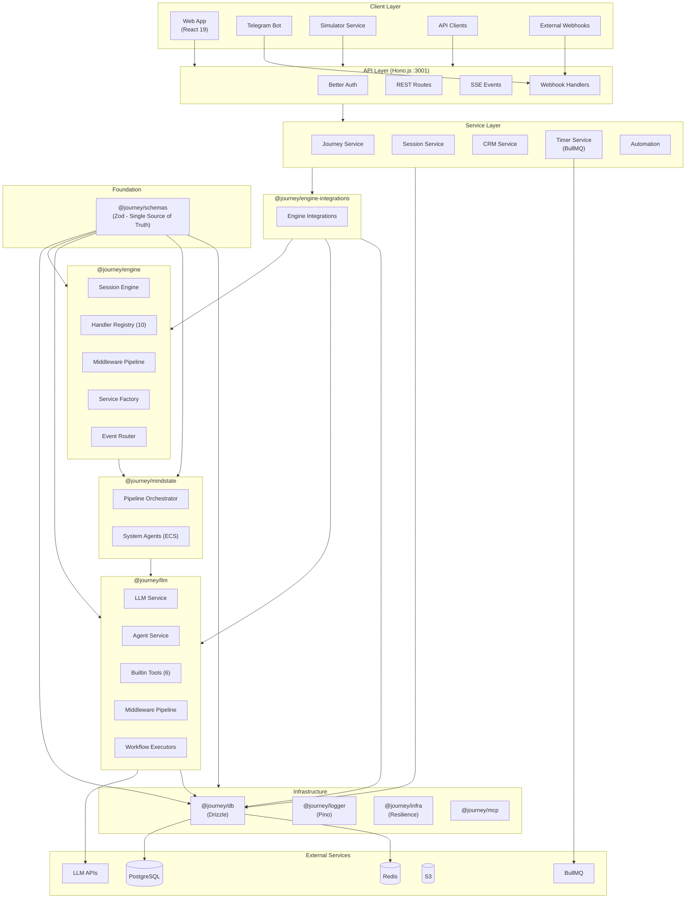

# System Overview Diagram

> High-level architecture of the Journey Builder platform.

## Complete System Architecture

```
┌─────────────────────────────────────────────────────────────────────────────────────────────────────┐
│                                        JOURNEY BUILDER                                               │
│                                  Visual State Machine Platform                                       │
├─────────────────────────────────────────────────────────────────────────────────────────────────────┤
│                                                                                                      │
│  ┌─────────────────────────────────────────────────────────────────────────────────────────────┐    │
│  │                                    CLIENT LAYER                                              │    │
│  ├─────────────────────────────────────────────────────────────────────────────────────────────┤    │
│  │                                                                                              │    │
│  │   ┌─────────────────┐  ┌─────────────────┐  ┌─────────────────┐  ┌─────────────────┐       │    │
│  │   │    Web App      │  │    Telegram     │  │   Simulator     │  │   Webhooks      │       │    │
│  │   │   (React 19)    │  │      Bot        │  │   (Web UI)      │  │  (External)     │       │    │
│  │   │   :3000         │  │                 │  │                 │  │                 │       │    │
│  │   └────────┬────────┘  └────────┬────────┘  └────────┬────────┘  └────────┬────────┘       │    │
│  │            │                    │                    │                    │                │    │
│  └────────────┼────────────────────┴────────────────────┴────────────────────┴────────────────┘    │
│               │                                                                                      │
│  ┌────────────┼─────────────────────────────────────────────────────────────────────────────────┐   │
│  │            │                          API LAYER                                               │   │
│  │            ▼                         (apps/api)                                               │   │
│  ├───────────────────────────────────────────────────────────────────────────────────────────────┤   │
│  │                                                                                               │   │
│  │   ┌──────────────────────────────────────────────────────────────────────────────────────┐   │   │
│  │   │                           HONO.JS SERVER (:3001)                                      │   │   │
│  │   ├──────────────────────────────────────────────────────────────────────────────────────┤   │   │
│  │   │                                                                                       │   │   │
│  │   │  ┌──────────────────┐  ┌──────────────────┐  ┌──────────────────┐                    │   │   │
│  │   │  │  Authentication  │  │    REST Routes   │  │   SSE Events     │                    │   │   │
│  │   │  │  (Better Auth)   │  │   route files   │  │  (Redis Pub/Sub) │                    │   │   │
│  │   │  └──────────────────┘  └──────────────────┘  └──────────────────┘                    │   │   │
│  │   │                                                                                       │   │   │
│  │   │  Routes:                                                                              │   │   │
│  │   │  ├── /journeys, /sessions, /events                                                   │   │   │
│  │   │  ├── /workflows, /agent-tools, /models                                                │   │   │
│  │   │  ├── /channels, /uploads, /audio                                                      │   │   │
│  │   │  ├── /crm/*, /mindstates                                                              │   │   │
│  │   │  ├── /variables, /tags, /user-tags                                                    │   │   │
│  │   │  └── /webhook/telegram                                                                │   │   │
│  │   │                                                                                       │   │   │
│  │   └──────────────────────────────────────────────────────────────────────────────────────┘   │   │
│  │                                           │                                                   │   │
│  │   ┌───────────────────────────────────────┼───────────────────────────────────────────────┐  │   │
│  │   │                          SERVICE LAYER                                                 │  │   │
│  │   │  ┌──────────────┐  ┌──────────────┐  ┌──────────────┐  ┌──────────────┐              │  │   │
│  │   │  │   Journey    │  │   Session    │  │   Simulator  │  │     CRM      │              │  │   │
│  │   │  │   Service    │  │   Service    │  │   Service    │  │   Service    │              │  │   │
│  │   │  └──────────────┘  └──────────────┘  └──────────────┘  └──────────────┘              │  │   │
│  │   │  ┌──────────────┐  ┌──────────────┐  ┌──────────────┐  ┌──────────────┐              │  │   │
│  │   │  │    Timer     │  │   Channel    │  │  Automation  │  │  Workflow    │              │  │   │
│  │   │  │   Service    │  │   Service    │  │   Handler    │  │   Service    │              │  │   │
│  │   │  │  (BullMQ)    │  │              │  │              │  │              │              │  │   │
│  │   │  └──────────────┘  └──────────────┘  └──────────────┘  └──────────────┘              │  │   │
│  │   └───────────────────────────────────────────────────────────────────────────────────────┘  │   │
│  │                                           │                                                   │   │
│  └───────────────────────────────────────────┼───────────────────────────────────────────────────┘   │
│                                              │                                                       │
│  ┌───────────────────────────────────────────┼───────────────────────────────────────────────────┐   │
│  │                                   BUSINESS LOGIC LAYER                                         │   │
│  ├───────────────────────────────────────────┴───────────────────────────────────────────────────┤   │
│  │                                                                                                │   │
│  │  ╔═══════════════════════════════════════════════════════════════════════════════════════╗    │   │
│  │  ║                            @journey/engine                                             ║    │   │
│  │  ║                         (Session Engine - Core)                                        ║    │   │
│  │  ╠═══════════════════════════════════════════════════════════════════════════════════════╣    │   │
│  │  ║                                                                                        ║    │   │
│  │  ║   ┌─────────────────────────────────────────────────────────────────────────────┐     ║    │   │
│  │  ║   │                         SESSION ENGINE                                       │     ║    │   │
│  │  ║   │  ┌─────────────┐  ┌─────────────┐  ┌─────────────┐  ┌─────────────┐        │     ║    │   │
│  │  ║   │  │Event Router │  │  Handler    │  │ Middleware  │  │  Service    │        │     ║    │   │
│  │  ║   │  │             │  │  Registry   │  │  Pipeline   │  │  Factory    │        │     ║    │   │
│  │  ║   │  └─────────────┘  └─────────────┘  └─────────────┘  └─────────────┘        │     ║    │   │
│  │  ║   └─────────────────────────────────────────────────────────────────────────────┘     ║    │   │
│  │  ║                                                                                        ║    │   │
│  │  ║   ┌─────────────────────────────────────────────────────────────────────────────┐     ║    │   │
│  │  ║   │                           HANDLERS (10)                                      │     ║    │   │
│  │  ║   │  ┌─────────┐ ┌─────────┐ ┌─────────┐ ┌─────────┐ ┌─────────┐ ┌─────────┐  │     ║    │   │
│  │  ║   │  │  start  │ │ message │ │condition│ │  wait   │ │  agent  │ │   crm   │  │     ║    │   │
│  │  ║   │  └─────────┘ └─────────┘ └─────────┘ └─────────┘ └─────────┘ └─────────┘  │     ║    │   │
│  │  ║   │  ┌─────────┐ ┌─────────┐ ┌─────────┐ ┌─────────┐                         │     ║    │   │
│  │  ║   │  │ webhook │ │question.│ │teleport │ │   end   │                         │     ║    │   │
│  │  ║   │  └─────────┘ └─────────┘ └─────────┘ └─────────┘                         │     ║    │   │
│  │  ║   └─────────────────────────────────────────────────────────────────────────────┘     ║    │   │
│  │  ║                                                                                        ║    │   │
│  │  ║   ┌─────────────────────────────────────────────────────────────────────────────┐     ║    │   │
│  │  ║   │                          SERVICES (core)                                    │     ║    │   │
│  │  ║   │  ┌─────────────┐ ┌─────────────┐ ┌─────────────┐ ┌─────────────┐            │     ║    │   │
│  │  ║   │  │ messenger   │ │  variable   │ │  template   │ │ expression  │            │     ║    │   │
│  │  ║   │  └─────────────┘ └─────────────┘ └─────────────┘ └─────────────┘            │     ║    │   │
│  │  ║   │  ┌─────────────┐ ┌─────────────┐ ┌─────────────┐ ┌─────────────┐            │     ║    │   │
│  │  ║   │  │ condition   │ │   timer     │ │   webhook   │ │ eventLogger │            │     ║    │   │
│  │  ║   │  └─────────────┘ └─────────────┘ └─────────────┘ └─────────────┘            │     ║    │   │
│  │  ║   └─────────────────────────────────────────────────────────────────────────────┘     ║    │   │
│  │  ║                                                                                        ║    │   │
│  │  ╚═══════════════════════════════════════════════════════════════════════════════════════╝    │   │
│  │                                                                                                │   │
│  │  ╔═══════════════════════════════════════════════════════════════════════════════════════╗     │   │
│  │  ║                   @journey/engine-integrations                                         ║     │   │
│  │  ║              (DB/LLM adapters for agent workflows + memory)                            ║     │   │
│  │  ║  • AgentWorkflowService • AgentConversationStore • MemoryService • Summarizer          ║     │   │
│  │  ╚═══════════════════════════════════════════════════════════════════════════════════════╝     │   │
│  │                                                                                                │   │
│  │  ╔═══════════════════════════════╗  ╔═══════════════════════════════╗                         │   │
│  │  ║         @journey/llm          ║  ║      @journey/mindstate       ║                         │   │
│  │  ║    (AI/LLM Integration)       ║  ║    (Psychology Tracking)      ║                         │   │
│  │  ╠═══════════════════════════════╣  ╠═══════════════════════════════╣                         │   │
│  │  ║                               ║  ║                               ║                         │   │
│  │  ║  ┌───────────────────────┐   ║  ║  ┌───────────────────────┐   ║                         │   │
│  │  ║  │     LLM Service       │   ║  ║  │  Pipeline Orchestrator │   ║                         │   │
│  │  ║  │  • OpenAI             │   ║  ║  │  • ingestMessage       │   ║                         │   │
│  │  ║  │  • Anthropic          │   ║  ║  │  • prepareContext      │   ║                         │   │
│  │  ║  │  • Google GenAI       │   ║  ║  │  • dispatchAgents      │   ║                         │   │
│  │  ║  │  • Groq               │   ║  ║  │  • aggregateResults    │   ║                         │   │
│  │  ║  └───────────────────────┘   ║  ║  │  • generateInsights    │   ║                         │   │
│  │  ║  ┌───────────────────────┐   ║  ║  └───────────────────────┘   ║                         │   │
│  │  ║  │    Agent Service      │   ║  ║                               ║                         │   │
│  │  ║  │  • Tool calling       │   ║  ║  ┌───────────────────────┐   ║                         │   │
│  │  ║  │  • Retry logic        │   ║  ║  │   System Agents (ECS)  │   ║                         │   │
│  │  ║  │  • Token tracking     │   ║  ║  │  • State Parameters    │   ║                         │   │
│  │  ║  └───────────────────────┘   ║  ║  │  • Agent Insights      │   ║                         │   │
│  │  ║  ┌───────────────────────┐   ║  ║  └───────────────────────┘   ║                         │   │
│  │  ║  │   Builtin Tools (6)   │   ║  ║                               ║                         │   │
│  │  ║  │  • variable-tools     │   ║  ╚═══════════════════════════════╝                         │   │
│  │  ║  │  • memory-tools       │   ║                                                             │   │
│  │  ║  │  • messaging-tools    │   ║                                                             │   │
│  │  ║  │  • context-tools      │   ║                                                             │   │
│  │  ║  └───────────────────────┘   ║                                                             │   │
│  │  ║  ┌───────────────────────┐   ║                                                             │   │
│  │  ║  │  Middleware Pipeline  │   ║                                                             │   │
│  │  ║  │  • pii-detection      │   ║                                                             │   │
│  │  ║  │  • model-fallback     │   ║                                                             │   │
│  │  ║  │  • usage-tracking     │   ║                                                             │   │
│  │  ║  │  • summarization      │   ║                                                             │   │
│  │  ║  │  • human-in-the-loop  │   ║                                                             │   │
│  │  ║  └───────────────────────┘   ║                                                             │   │
│  │  ║  ┌───────────────────────┐   ║                                                             │   │
│  │  ║  │  Workflow Executors   │   ║                                                             │   │
│  │  ║  │  • core/              │   ║                                                             │   │
│  │  ║  │  • data/              │   ║                                                             │   │
│  │  ║  │  • logic/             │   ║                                                             │   │
│  │  ║  │  • tools/             │   ║                                                             │   │
│  │  ║  └───────────────────────┘   ║                                                             │   │
│  │  ╚═══════════════════════════════╝                                                             │   │
│  │                                                                                                │   │
│  └────────────────────────────────────────────────────────────────────────────────────────────────┘   │
│                                                                                                       │
│  ┌────────────────────────────────────────────────────────────────────────────────────────────────┐   │
│  │                                    INFRASTRUCTURE LAYER                                         │   │
│  ├────────────────────────────────────────────────────────────────────────────────────────────────┤   │
│  │                                                                                                 │   │
│  │  ╔═══════════════════════╗  ╔═══════════════════════╗  ╔═══════════════════════╗              │   │
│  │  ║      @journey/db      ║  ║    @journey/logger    ║  ║    @journey/infra     ║              │   │
│  │  ║    (Drizzle ORM)      ║  ║       (Pino)          ║  ║   (Resilience)        ║              │   │
│  │  ╠═══════════════════════╣  ╠═══════════════════════╣  ╠═══════════════════════╣              │   │
│  │  ║  20 Schema Modules:   ║  ║  • Structured logs    ║  ║  • Circuit breaker    ║              │   │
│  │  ║  • auth               ║  ║  • Dual env support   ║  ║  • Rate limiting      ║              │   │
│  │  ║  • org + membership   ║  ║  • Error serialization║  ║  • Retry patterns     ║              │   │
│  │  ║  • journey + pipeline ║  ║  • File + console     ║  ║                       ║              │   │
│  │  ║  • transfers + channel ║  ║                       ║  ╚═══════════════════════╝              │   │
│  │  ║  • session            ║  ╚═══════════════════════╝                                         │   │
│  │  ║  • variables + tags   ║                                                                    │   │
│  │  ║  • crm + automation   ║  ╔═══════════════════════╗                                         │   │
│  │  ║  • agents + mindstate ║  ║      @journey/mcp     ║                                         │   │
│  │  ║  • events + usage     ║  ║  (Model Context Proto)║                                         │   │
│  │  ║  • memory + simulator ║  ╠═══════════════════════╣                                         │   │
│  │  ║  • enums + relations  ║  ║  • MCP client         ║                                         │   │
│  │  ╚═══════════════════════╝  ║  • Tool definitions   ║                                         │   │
│  │                              ╚═══════════════════════╝                                         │   │
│  │                                                                                                 │   │
│  │   ┌─────────────────────────────────────────────────────────────────────────────────────────┐  │   │
│  │   │                              EXTERNAL SERVICES                                           │  │   │
│  │   │  ┌─────────────┐  ┌─────────────┐  ┌─────────────┐  ┌─────────────┐  ┌─────────────┐   │  │   │
│  │   │  │ PostgreSQL  │  │    Redis    │  │   BullMQ    │  │  AWS S3     │  │ LLM APIs    │   │  │   │
│  │   │  │  (Data)     │  │ (Cache/Pub) │  │  (Queues)   │  │  (Media)    │  │ (AI)        │   │  │   │
│  │   │  │  :5432      │  │  :6379      │  │             │  │             │  │             │   │  │   │
│  │   │  └─────────────┘  └─────────────┘  └─────────────┘  └─────────────┘  └─────────────┘   │  │   │
│  │   └─────────────────────────────────────────────────────────────────────────────────────────┘  │   │
│  │                                                                                                 │   │
│  └─────────────────────────────────────────────────────────────────────────────────────────────────┘   │
│                                                                                                        │
│  ┌─────────────────────────────────────────────────────────────────────────────────────────────────┐   │
│  │                                     FOUNDATION LAYER                                             │   │
│  ├─────────────────────────────────────────────────────────────────────────────────────────────────┤   │
│  │                                                                                                  │   │
│  │  ╔═══════════════════════════════════════════════════════════════════════════════════════════╗  │   │
│  │  ║                                  @journey/schemas                                          ║  │   │
│  │  ║                            (Single Source of Truth - Zod)                                  ║  │   │
│  │  ╠═══════════════════════════════════════════════════════════════════════════════════════════╣  │   │
│  │  ║                                                                                            ║  │   │
│  │  ║   ┌──────────────────────────────────────────────────────────────────────────────────┐    ║  │   │
│  │  ║   │                              TYPE DEFINITIONS                                     │    ║  │   │
│  │  ║   │  ┌─────────────┐  ┌─────────────┐  ┌─────────────┐  ┌─────────────┐             │    ║  │   │
│  │  ║   │  │   nodes/    │  │  journey.ts │  │ variables.ts│  │ mindstate.ts│             │    ║  │   │
│  │  ║   │  │  10 types   │  │             │  │             │  │             │             │    ║  │   │
│  │  ║   │  └─────────────┘  └─────────────┘  └─────────────┘  └─────────────┘             │    ║  │   │
│  │  ║   └──────────────────────────────────────────────────────────────────────────────────┘    ║  │   │
│  │  ║                                                                                            ║  │   │
│  │  ║   ┌──────────────────────────────────────────────────────────────────────────────────┐    ║  │   │
│  │  ║   │                            SERVICE INTERFACES                                     │    ║  │   │
│  │  ║   │  ┌─────────────┐  ┌─────────────┐  ┌─────────────┐  ┌─────────────┐             │    ║  │   │
│  │  ║   │  │IVariableServ│  │IMessengerSrv│  │ IMemorySrv  │  │ ... (12)    │             │    ║  │   │
│  │  ║   │  └─────────────┘  └─────────────┘  └─────────────┘  └─────────────┘             │    ║  │   │
│  │  ║   │  SharedServiceContext + No-op Factory + Guarded Context                          │    ║  │   │
│  │  ║   └──────────────────────────────────────────────────────────────────────────────────┘    ║  │   │
│  │  ║                                                                                            ║  │   │
│  │  ║   ┌──────────────────────────────────────────────────────────────────────────────────┐    ║  │   │
│  │  ║   │                             PERMISSIONS                                           │    ║  │   │
│  │  ║   │  ┌─────────────┐  ┌─────────────┐  ┌─────────────┐  ┌─────────────┐             │    ║  │   │
│  │  ║   │  │  subjects   │  │  resources  │  │capabilities │  │   checker   │             │    ║  │   │
│  │  ║   │  └─────────────┘  └─────────────┘  └─────────────┘  └─────────────┘             │    ║  │   │
│  │  ║   └──────────────────────────────────────────────────────────────────────────────────┘    ║  │   │
│  │  ║                                                                                            ║  │   │
│  │  ║   ┌──────────────────────────────────────────────────────────────────────────────────┐    ║  │   │
│  │  ║   │                              UTILITIES                                            │    ║  │   │
│  │  ║   │  • Type conversion (isEmpty, isTruthy, toNumber, toString)                       │    ║  │   │
│  │  ║   │  • Variable namespaces ({{vars.scope.key}})                                      │    ║  │   │
│  │  ║   │  • Store events (Canvas, Sync, UI events)                                        │    ║  │   │
│  │  ║   │  • Content split/merge + edge style defaults                                     │    ║  │   │
│  │  ║   └──────────────────────────────────────────────────────────────────────────────────┘    ║  │   │
│  │  ║                                                                                            ║  │   │
│  │  ╚═══════════════════════════════════════════════════════════════════════════════════════════╝  │   │
│  │                                                                                                  │   │
│  └──────────────────────────────────────────────────────────────────────────────────────────────────┘   │
│                                                                                                         │
└─────────────────────────────────────────────────────────────────────────────────────────────────────────┘
```

## Mermaid Diagram



## Data Flow Summary

```
User Input (Telegram/Web/Simulator/API)
         │
         ▼
    ┌─────────┐
    │   API   │ ──► Authentication (Better Auth)
    └────┬────┘
         │
         ▼
    ┌─────────┐
    │ Service │ ──► Find/Create Session
    └────┬────┘
         │
         ▼
    ┌─────────┐     ┌─────────┐
    │ Engine  │ ◄──►│   LLM   │ (for Agent nodes)
    └────┬────┘     └─────────┘
         │
         ├──► Variable Service ──► Redis Cache ──► PostgreSQL
         ├──► Template Service
         ├──► Timer Service ──► BullMQ
         └──► Messenger Adapter ──► Telegram API
                    │
                    ▼
              User Response
```

## Key Numbers

| Category          | Count |
| ----------------- | ----- |
| Packages          | 8     |
| Apps              | 3     |
| Node Handlers     | 10    |
| Engine Services   | 10    |
| LLM Builtin Tools | 6     |
| API Routes        | 20    |
| DB Schema Modules | 15    |
| Web Features      | 8     |
| Web Stores        | 8     |

---

## Related Diagrams

- [Package Dependencies](./package-dependencies.md) - Detailed package graph
- [Engine Architecture](./engine-architecture.md) - Engine internals
- [LLM Architecture](./llm-architecture.md) - AI layer details
