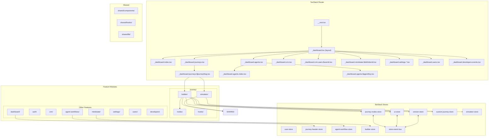

# Web App Architecture Diagram

> Frontend structure of the @journey/web application.

## Application Overview

```
╔═══════════════════════════════════════════════════════════════════════════════════════════════════╗
║                                      @journey/web                                                  ║
║                                    apps/web/src/                                                   ║
║                              React 19 + TanStack + React Flow                                      ║
╠═══════════════════════════════════════════════════════════════════════════════════════════════════╣
║                                                                                                    ║
║   ┌────────────────────────────────────────────────────────────────────────────────────────────┐  ║
║   │                                      ROUTES                                                 │  ║
║   │                               (TanStack Router - File-based)                                │  ║
║   │                                   routes/__root.tsx                                         │  ║
║   ├────────────────────────────────────────────────────────────────────────────────────────────┤  ║
║   │                                                                                             │  ║
║   │   /                          → Dashboard                                                    │  ║
║   │   /journeys                  → Journey List                                                 │  ║
║   │   /journeys/$journeySlug     → Journey Builder (React Flow Canvas)                         │  ║
║   │   /agents                    → Agent Workflow List                                         │  ║
║   │   /agents/$agentKey          → Agent Workflow Builder                                      │  ║
║   │   /crm                       → CRM Dashboard (pipeline view)                               │  ║
║   │   /crm/users/$userId         → CRM User Detail                                              │  ║
║   │   /mindstate                 → MindState List                                              │  ║
║   │   /mindstate/$definitionId   → MindState Builder                                           │  ║
║   │   /settings/*                → App Settings                                                │  ║
║   │   /users                     → User Management                                             │  ║
║   │   /developers/events         → Developer Events                                            │  ║
║   │                                                                                             │  ║
║   └────────────────────────────────────────────────────────────────────────────────────────────┘  ║
║                                              │                                                     ║
║   ┌──────────────────────────────────────────┼──────────────────────────────────────────────────┐ ║
║   │                                          ▼                                                   │ ║
║   │                                     FEATURES                                                 │ ║
║   │                                 (Feature-First Architecture)                                 │ ║
║   ├──────────────────────────────────────────────────────────────────────────────────────────────┤ ║
║   │                                                                                              │ ║
║   │   ┌─────────────────────────────────────────────────────────────────────────────────────┐   │ ║
║   │   │  features/journey/                                      (Main Feature)              │   │ ║
║   │   │  ├── builder/                                                                        │   │ ║
║   │   │  │   ├── components/    (Canvas, toolbar, panels, dialogs)                          │   │ ║
║   │   │  │   ├── hooks/         (selectors, actions, queries)                               │   │ ║
║   │   │  │   ├── pages/         (Route pages)                                               │   │ ║
║   │   │  │   ├── store/         (Journey-specific state)                                    │   │ ║
║   │   │  │   ├── context/       (React context)                                             │   │ ║
║   │   │  │   └── config/        (Configuration)                                             │   │ ║
║   │   │  ├── simulator/                                                                      │   │ ║
║   │   │  │   ├── components/    (Chat, console, controls)                                   │   │ ║
║   │   │  │   ├── hooks/         (useBackendSimulator, usePersonas, selectors)               │   │ ║
║   │   │  │   ├── store/         (Simulator state)                                           │   │ ║
║   │   │  │   └── context/       (Simulator context)                                         │   │ ║
║   │   │  ├── nodes/                                                                          │   │ ║
║   │   │  │   ├── definitions/   (10 node type definitions)                                  │   │ ║
║   │   │  │   ├── editors/       (Node edit forms, sections)                                 │   │ ║
║   │   │  │   ├── forms/         (Form schemas, field registry)                              │   │ ║
║   │   │  │   ├── components/    (UI components)                                             │   │ ║
║   │   │  │   ├── registry/      (Node type registry)                                        │   │ ║
║   │   │  │   ├── hooks/         (useNodeEditor, useNodeForm)                                │   │ ║
║   │   │  │   └── edges/         (Edge handling)                                             │   │ ║
║   │   │  └── hooks/navigation/  (useJourneyCrud, useJourneySelection)                       │   │ ║
║   │   └─────────────────────────────────────────────────────────────────────────────────────┘   │ ║
║   │                                                                                              │ ║
║   │   ┌────────────────────────────┐  ┌────────────────────────────┐                            │ ║
║   │   │  features/agent-workflows/ │  │  features/crm/             │                            │ ║
║   │   │  ├── components/           │  │  ├── components/           │                            │ ║
║   │   │  │   └── nodes/            │  │  └── hooks/queries/        │                            │ ║
║   │   │  └── hooks/                │  │                            │                            │ ║
║   │   └────────────────────────────┘  └────────────────────────────┘                            │ ║
║   │                                                                                              │ ║
║   │   ┌────────────────────────────┐  ┌────────────────────────────┐                            │ ║
║   │   │  features/mindstate/       │  │  features/dashboard/       │                            │ ║
║   │   └────────────────────────────┘  └────────────────────────────┘                            │ ║
║   │                                                                                              │ ║
║   │   ┌────────────────────────────┐  ┌────────────────────────────┐                            │ ║
║   │   │  features/settings/        │  │  features/users/           │                            │ ║
║   │   │  └── components/sections/  │  └────────────────────────────┘                            │ ║
║   │   └────────────────────────────┘                                                            │ ║
║   │                                                                                              │ ║
║   │   ┌────────────────────────────┐  ┌────────────────────────────┐                            │ ║
║   │   │  features/auth/            │  │  features/developers/      │                            │ ║
║   │   └────────────────────────────┘  └────────────────────────────┘                            │ ║
║   │                                                                                              │ ║
║   └──────────────────────────────────────────────────────────────────────────────────────────────┘ ║
║                                              │                                                     ║
║   ┌──────────────────────────────────────────┼──────────────────────────────────────────────────┐ ║
║   │                                          ▼                                                   │ ║
║   │                                      STORES                                                  │ ║
║   │                                   (TanStack Store)                                           │ ║
║   ├──────────────────────────────────────────────────────────────────────────────────────────────┤ ║
║   │                                                                                              │ ║
║   │   ┌─────────────────┐  ┌─────────────────┐  ┌─────────────────┐  ┌─────────────────┐        │ ║
║   │   │ journey-nodes   │  │    ui-store     │  │  version-store  │  │   user-store    │        │ ║
║   │   │    store        │  │                 │  │                 │  │                 │        │ ║
║   │   │ • nodes[]       │  │ • editMode      │  │ • versions[]    │  │ • currentUser   │        │ ║
║   │   │ • edges[]       │  │ • selection     │  │ • activeVersion │  │ • preferences   │        │ ║
║   │   │ • history       │  │ • dialogs       │  │                 │  │                 │        │ ║
║   │   │ • undo/redo     │  │ • panels        │  │                 │  │                 │        │ ║
║   │   └─────────────────┘  └─────────────────┘  └─────────────────┘  └─────────────────┘        │ ║
║   │                                                                                              │ ║
║   │   ┌─────────────────────────────────────────────────────────────┐  ┌─────────────────────┐  │ ║
║   │   │ feature stores: custom-journey, journey-header, simulator,  │  │   store-event-bus   │  │ ║
║   │   │ agent-workflow, agent-test, mindstate builder               │  │  (cross-store)      │  │ ║
║   │   └─────────────────────────────────────────────────────────────┘  └─────────────────────┘  │ ║
║   │                                                                                              │ ║
║   └──────────────────────────────────────────────────────────────────────────────────────────────┘ ║
║                                              │                                                     ║
║   ┌──────────────────────────────────────────┼──────────────────────────────────────────────────┐ ║
║   │                                          ▼                                                   │ ║
║   │                                      SHARED                                                  │ ║
║   ├──────────────────────────────────────────────────────────────────────────────────────────────┤ ║
║   │                                                                                              │ ║
║   │   ┌────────────────────────────┐  ┌────────────────────────────┐  ┌────────────────────────┐│ ║
║   │   │  shared/components/        │  │  shared/hooks/             │  │  shared/lib/           ││ ║
║   │   │  ├── ui/ (shadcn)          │  │  ├── use-debounce         │  │  ├── app-config       ││ ║
║   │   │  ├── layout/               │  │  ├── use-dialog-state     │  │  ├── api/             ││ ║
║   │   │  ├── common/               │  │  ├── use-duration-field   │  │  ├── events/          ││ ║
║   │   │  ├── chat/                 │  │  ├── use-sse-connection   │  │  ├── ui/              ││ ║
║   │   │  └── errors/               │  │  ├── use-store-event      │  │  │   └── notify       ││ ║
║   │   │                            │  │  └── audio/               │  │  └── create-mutation  ││ ║
║   │   └────────────────────────────┘  └────────────────────────────┘  └────────────────────────┘│ ║
║   │                                                                                              │ ║
║   └──────────────────────────────────────────────────────────────────────────────────────────────┘ ║
║                                                                                                    ║
╚════════════════════════════════════════════════════════════════════════════════════════════════════╝
```

## Journey Builder Detail

```
┌────────────────────────────────────────────────────────────────────────────────────────────────────┐
│                                  JOURNEY BUILDER CANVAS                                             │
│                               /journeys/$journeySlug                                                │
└────────────────────────────────────────────────────────────────────────────────────────────────────┘

┌────────────────────────────────────────────────────────────────────────────────────────────────────┐
│  ┌─────────────────────────────────────────────────────────────────────────────────────────────┐  │
│  │                                      HEADER BAR                                              │  │
│  │  ┌──────────────────┐  ┌──────────────────┐  ┌──────────────────┐  ┌──────────────────┐     │  │
│  │  │   Journey Title  │  │   Status Badge   │  │   Version Select │  │   Save Button    │     │  │
│  │  └──────────────────┘  └──────────────────┘  └──────────────────┘  └──────────────────┘     │  │
│  └─────────────────────────────────────────────────────────────────────────────────────────────┘  │
│                                                                                                    │
│  ┌────────────────────┐  ┌─────────────────────────────────────────────┐  ┌────────────────────┐  │
│  │                    │  │                                             │  │                    │  │
│  │    LEFT PANEL      │  │              REACT FLOW CANVAS              │  │    RIGHT PANEL     │  │
│  │                    │  │                                             │  │                    │  │
│  │  ┌──────────────┐  │  │  ┌─────────────────────────────────────┐   │  │  ┌──────────────┐  │  │
│  │  │  Node Palette │  │  │  │                                     │   │  │  │ Node Editor  │  │  │
│  │  │              │  │  │  │   ┌─────────┐    ┌─────────┐        │   │  │  │              │  │  │
│  │  │  ┌────┐      │  │  │  │   │  Start  │───►│ Message │        │   │  │  │  Title       │  │  │
│  │  │  │Start│     │  │  │  │   └─────────┘    └────┬────┘        │   │  │  │  Content     │  │  │
│  │  │  └────┘      │  │  │  │                       │             │   │  │  │  Buttons     │  │  │
│  │  │  ┌────┐      │  │  │  │                       ▼             │   │  │  │  Media       │  │  │
│  │  │  │Msg │      │  │  │  │   ┌─────────┐    ┌─────────┐        │   │  │  │  Timer       │  │  │
│  │  │  └────┘      │  │  │  │   │   End   │◄───│Condition│        │   │  │  │  Variables   │  │  │
│  │  │  ┌────┐      │  │  │  │   └─────────┘    └────┬────┘        │   │  │  │  Tags        │  │  │
│  │  │  │Cond│      │  │  │  │                       │             │   │  │  │  CRM         │  │  │
│  │  │  └────┘      │  │  │  │                       ▼             │   │  │  │              │  │  │
│  │  │  ┌────┐      │  │  │  │                  ┌─────────┐        │   │  │  │  ┌────────┐  │  │  │
│  │  │  │Wait│      │  │  │  │                  │  Agent  │        │   │  │  │  │  Save  │  │  │  │
│  │  │  └────┘      │  │  │  │                  └─────────┘        │   │  │  │  └────────┘  │  │  │
│  │  │  ┌────┐      │  │  │  │                                     │   │  │  │              │  │  │
│  │  │  │Agent│     │  │  │  └─────────────────────────────────────┘   │  │  └──────────────┘  │  │
│  │  │  └────┘      │  │  │                                             │  │                    │  │
│  │  │  ...         │  │  │                                             │  │                    │  │
│  │  └──────────────┘  │  │  ┌─────────────────────────────────────┐   │  │                    │  │
│  │                    │  │  │  Zoom: [━━━━●━━━━]  Fit  Center     │   │  │                    │  │
│  │  ┌──────────────┐  │  │  └─────────────────────────────────────┘   │  │                    │  │
│  │  │  Minimap     │  │  │                                             │  │                    │  │
│  │  │  ┌───────┐   │  │  └─────────────────────────────────────────────┘  │                    │  │
│  │  │  │ · · · │   │  │                                                    │                    │  │
│  │  │  └───────┘   │  │                                                    │                    │  │
│  │  └──────────────┘  │                                                    │                    │  │
│  │                    │                                                    │                    │  │
│  └────────────────────┘                                                    └────────────────────┘  │
│                                                                                                    │
│  ┌─────────────────────────────────────────────────────────────────────────────────────────────┐  │
│  │                                    BOTTOM BAR                                                │  │
│  │  [Undo] [Redo]     Nodes: 5    Edges: 4     Last saved: 2 min ago     [Simulator Mode]      │  │
│  └─────────────────────────────────────────────────────────────────────────────────────────────┘  │
│                                                                                                    │
└────────────────────────────────────────────────────────────────────────────────────────────────────┘
```

## Mermaid Component Tree



## Node Editor Architecture

```
┌────────────────────────────────────────────────────────────────────────────────────────────────────┐
│                                   NODE EDITOR SYSTEM                                                │
│              features/nodes/journey/ (types/*/editor.tsx + editors/)                                │
└────────────────────────────────────────────────────────────────────────────────────────────────────┘

┌────────────────────────────────────────────────────────────────────────────────────────────────────┐
│                                                                                                     │
│   ┌─────────────────────────────────────────────────────────────────────────────────────────────┐  │
│   │                               NODE EDITOR SHELL                                              │  │
│   │                             (node-editor-shell.tsx)                                          │  │
│   │                                                                                              │  │
│   │   Wraps EditorBase and form submit wiring                                                   │  │
│   └─────────────────────────────────────────────────────────────────────────────────────────────┘  │
│                                              │                                                      │
│                                              ▼                                                      │
│   ┌─────────────────────────────────────────────────────────────────────────────────────────────┐  │
│   │                                  NODE TYPE EDITORS                                           │  │
│   │                                                                                              │  │
│   │   Based on node.type, renders specific editor (types/<node>/editor.tsx):                     │  │
│   │                                                                                              │  │
│   │   ┌─────────────┐  ┌─────────────┐  ┌─────────────┐  ┌─────────────┐  ┌─────────────┐      │  │
│   │   │   Start     │  │   Message   │  │  Condition  │  │    Wait     │  │    Agent    │      │  │
│   │   │   Editor    │  │   Editor    │  │   Editor    │  │   Editor    │  │   Editor    │      │  │
│   │   └─────────────┘  └─────────────┘  └─────────────┘  └─────────────┘  └─────────────┘      │  │
│   │   ┌─────────────┐  ┌─────────────┐  ┌─────────────┐  ┌─────────────┐  ┌─────────────┐      │  │
│   │   │     CRM     │  │   Webhook   │  │Questionnaire│  │   Teleport  │  │     End     │      │  │
│   │   │   Editor    │  │   Editor    │  │   Editor    │  │   Editor    │  │   Editor    │      │  │
│   │   └─────────────┘  └─────────────┘  └─────────────┘  └─────────────┘  └─────────────┘      │  │
│   │                                                                                              │  │
│   └─────────────────────────────────────────────────────────────────────────────────────────────┘  │
│                                              │                                                      │
│                                              ▼                                                      │
│   ┌─────────────────────────────────────────────────────────────────────────────────────────────┐  │
│   │                               EDITOR SECTIONS (Reusable)                                     │  │
│   │                              editors/sections/                                               │  │
│   │                                                                                              │  │
│   │   ┌─────────────────────┐  ┌─────────────────────┐  ┌─────────────────────┐                │  │
│   │   │  Title Section      │  │  Content Section    │  │  Buttons Section    │                │  │
│   │   │  (Node title)       │  │  (Message text)     │  │  (Button array)     │                │  │
│   │   └─────────────────────┘  └─────────────────────┘  └─────────────────────┘                │  │
│   │                                                                                              │  │
│   │   ┌─────────────────────┐  ┌─────────────────────┐  ┌─────────────────────┐                │  │
│   │   │  Media Section      │  │  Timer Section      │  │  Variables Section  │                │  │
│   │   │  (Image/video/audio)│  │  (DHMS picker)      │  │  (Var operations)   │                │  │
│   │   └─────────────────────┘  └─────────────────────┘  └─────────────────────┘                │  │
│   │                                                                                              │  │
│   │   ┌─────────────────────┐  ┌─────────────────────┐  ┌─────────────────────┐                │  │
│   │   │  Tags Section       │  │  CRM Section        │  │  Follow-up Section  │                │  │
│   │   │  (Tag operations)   │  │  (Pipeline actions) │  │  (Sequence config)  │                │  │
│   │   └─────────────────────┘  └─────────────────────┘  └─────────────────────┘                │  │
│   │                                                                                              │  │
│   └─────────────────────────────────────────────────────────────────────────────────────────────┘  │
│                                                                                                     │
└────────────────────────────────────────────────────────────────────────────────────────────────────┘
```

## File Structure

```
apps/web/src/
├── routes/                     # TanStack Router file-based routes
│   ├── __root.tsx             # Root layout
│   ├── _dashboard.tsx         # Dashboard layout
│   ├── _dashboard.index.tsx   # Dashboard home
│   ├── _dashboard.journeys.tsx # Journey list
│   ├── _dashboard.journeys.$journeySlug.tsx # Journey builder
│   ├── _dashboard.agents.tsx  # Agent workflows layout
│   ├── _dashboard.agents.index.tsx # Agent workflows list
│   ├── _dashboard.agents.$agentKey.tsx # Agent workflow builder
│   ├── _dashboard.crm.tsx     # CRM layout
│   ├── _dashboard.crm.index.tsx # CRM pipelines
│   ├── _dashboard.crm.users.$userId.tsx # CRM user detail
│   ├── _dashboard.mindstate.tsx # MindState layout
│   ├── _dashboard.mindstate.index.tsx # MindState list
│   ├── _dashboard.mindstate.$definitionId.tsx # MindState builder
│   ├── _dashboard.settings.tsx # Settings layout
│   ├── _dashboard.settings.*.tsx # Settings pages
│   ├── _dashboard.users.tsx   # Users page
│   ├── _dashboard.developers.events.tsx # Developer events
│   ├── 401.tsx                # Unauthorized
│   ├── 403.tsx                # Forbidden
│   ├── 404.tsx                # Not found
│   ├── 503.tsx                # Service unavailable
│   └── error.tsx              # Generic error
│
├── features/                   # Feature modules
│   ├── journey/
│   │   ├── builder/           # Canvas and editor
│   │   ├── simulator/         # Test execution
│   │   ├── nodes/             # Node types
│   │   │   ├── definitions/   # 10 node configs
│   │   │   ├── editors/       # Form editors
│   │   │   ├── forms/         # Form schemas
│   │   │   ├── registry/      # Type registry
│   │   │   └── components/    # UI components
│   │   └── hooks/
│   ├── agent-workflows/
│   ├── auth/
│   ├── crm/
│   ├── mindstate/
│   ├── dashboard/
│   ├── settings/
│   ├── users/
│   └── developers/
│
├── stores/                     # Global state
│   ├── journey-nodes-store.ts
│   ├── ui-store.ts
│   ├── version-store.ts
│   ├── user-store.ts
│   ├── store-event-bus.ts
│   ├── store-actions.ts
│   ├── event-bridge.ts
│   └── patterns/
│
├── shared/                     # Shared code
│   ├── components/
│   │   ├── ui/                # shadcn components
│   │   ├── layout/
│   │   ├── common/
│   │   └── errors/
│   ├── hooks/
│   │   ├── audio/
│   │   ├── use-debounce.ts
│   │   ├── use-dialog-state.ts
│   │   ├── use-duration-field.ts
│   │   ├── use-sse-connection.ts
│   │   └── use-store-event.ts
│   └── lib/
│       ├── app-config.ts
│       ├── api/
│       ├── events/
│       └── ui/notify.ts
│
├── providers/                  # React providers
│   ├── theme-provider.tsx
│   ├── event-provider.tsx
│   └── journey-data-provider.tsx
│
├── hooks/                      # Global hooks
│   └── queries/               # Shared query hooks
├── data/                       # Static data
├── routeTree.gen.ts            # Generated route tree
└── test/                       # Test utilities
```

---

## Related Diagrams

- [Store Architecture](./store-architecture.md) - Store details
- [Node System](./node-system.md) - Node types and editors
- [System Overview](./system-overview.md) - Full system
