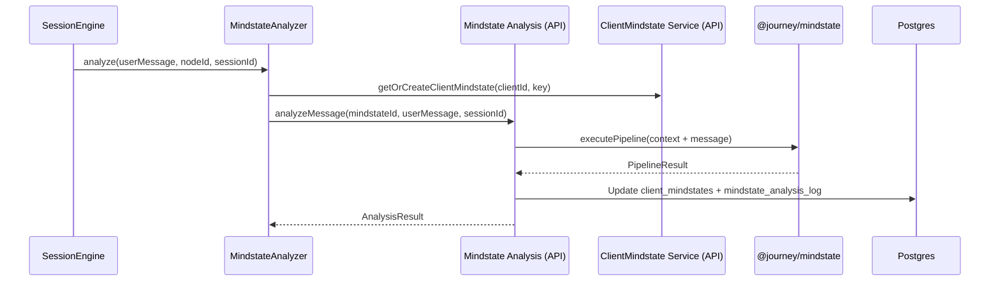
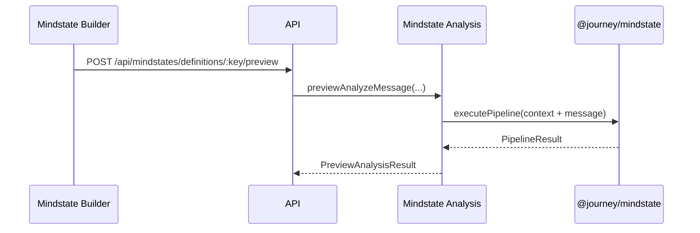

# Mindstate Architecture

Developer-focused overview of how Mindstate works across packages, API, and engine.

## Where Code Lives

- Pipeline: `packages/mindstate/src/`
- Schemas: `packages/schemas/src/mindstate.ts`
- DB tables: `packages/db/src/schema/mindstate.ts`
- API service: `apps/api/src/modules/mindstates/services/analysis-service.ts`
- API routes: `apps/api/src/modules/mindstates/routes/index.ts`
- Engine analysis gate: `packages/engine/src/mindstate/mindstate-analyzer.ts`
- Web builder + viewer: `apps/web/src/features/mindstate/`

## Data Model (Runtime)

- **mindstate_definitions**: org-level templates (agents + parameters).
- **client_mindstates**: per-client state snapshot and agent insights.
- **mindstate_analysis_log**: audit trail for each pipeline run.

See `docs/dev/architecture/diagrams/data-model.md` for ER context.

## Runtime Flow (High Level)

```
Journey message
  -> MindstateAnalyzer (engine)
  -> clientMindstateService.getOrCreateClientMindstate
  -> analysisService.analyzeMessage
  -> @journey/mindstate pipeline (pure)
  -> API service persists updates + logs
```

### Sequence (Engine-Driven)



### Sequence (Builder Preview)



## Mindstate Configuration (Journey)

`JourneyMindstateConfig` controls when the engine triggers analysis:

- `keys`: mindstate definition keys to analyze.
- `analysisMode`: `automatic`, `selective`, `node-triggered`, `manual`.
- `startCondition`: `immediate`, `after_messages`, or `after_node`.
- `nodeTypeRules`: used only in `selective` mode.

Schema: `packages/schemas/src/mindstate.ts`.

## Pipeline Entry Points

- **Production**: `apps/api/src/modules/mindstates/services/analysis-service.ts::analyzeMessage`
- **Preview**: `apps/api/src/modules/mindstates/services/analysis-service.ts::previewAnalyzeMessage`
- **Direct**: `packages/mindstate/src/pipeline/orchestrator.ts::executePipeline`

## Observability

- Logs are namespaced under `mindstate:*` and `mindstateService:*`.
- Engine emits `EventTypes.MINDSTATE_UPDATED` when changes occur.
- Pipeline metrics include duration + token usage.

## Mindstate in Templates

Mindstate parameter values are accessible in templates using the `{{mindstate.key.param}}` syntax:

```handlebars
Your current stress level is {{mindstate.mood.stress}}/10.
```

This works in:

- Message node content
- Agent node prompts
- Condition expressions
- Any template field

### Data Flow Diagram

```
┌──────────────────────────────────────────────────────────────────────────────┐
│                    MINDSTATE TEMPLATE ACCESS FLOW                             │
└──────────────────────────────────────────────────────────────────────────────┘

  Journey with mindstateConfig: { keys: ["mood", "energy"] }
       │
       ▼
┌─────────────────────────────────────────────────────────────────────────────┐
│  buildEvaluationContext()                                                    │
│  packages/engine/src/utils/context.ts                                        │
├─────────────────────────────────────────────────────────────────────────────┤
│                                                                              │
│   ┌─────────────────────┐     ┌─────────────────────┐                       │
│   │ Variable Service    │     │ Mindstate Service   │                       │
│   │ (parallel fetch)    │     │ (parallel fetch)    │                       │
│   └─────────┬───────────┘     └─────────┬───────────┘                       │
│             │                           │                                    │
│             ▼                           ▼                                    │
│   ┌─────────────────────────────────────────────────────────────────────┐   │
│   │                    Evaluation Context (Result)                       │   │
│   │                                                                      │   │
│   │   vars: {                        mindstate: {                        │   │
│   │     journey: { ... },              mood: {                           │   │
│   │     user: { ... },                   stress: 7,                      │   │
│   │     global: { ... },                 happiness: 8                    │   │
│   │   },                               },                                │   │
│   │   user: { id, firstName, ... },    energy: {                         │   │
│   │   session: { id, journeyId, ... }, level: 5                          │   │
│   │   nodes: { PreviousNode: {...} }   }                                 │   │
│   │                                  }                                   │   │
│   └─────────────────────────────────────────────────────────────────────┘   │
│                                                                              │
└──────────────────────────────────────────────────┬──────────────────────────┘
                                                   │
                                                   ▼
                                        ┌─────────────────────┐
                                        │  Template Service    │
                                        │  substitute()        │
                                        └─────────┬───────────┘
                                                  │
    ┌─────────────────────────────────────────────┼─────────────────────────┐
    │                                             │                          │
    ▼                                             ▼                          ▼
┌───────────────┐                     ┌───────────────────┐     ┌───────────────────┐
│ Message Node  │                     │   Agent Prompt    │     │   Condition       │
│ "Stress:      │                     │ "User stress is   │     │ Expression        │
│  {{mindstate. │                     │  {{mindstate.     │     │ mindstate.mood.   │
│  mood.stress}}│                     │  mood.stress}}"   │     │ stress > 7        │
│  /10"         │                     │                   │     │                   │
└───────┬───────┘                     └─────────┬─────────┘     └─────────┬─────────┘
        │                                       │                         │
        ▼                                       ▼                         ▼
  "Stress: 7/10"                    "User stress is 7"                  true
```

### Mermaid Diagram

```mermaid
flowchart TB
    subgraph Config["Journey Configuration"]
        MC["mindstateConfig:<br/>keys: [\"mood\", \"energy\"]"]
    end

    subgraph Build["buildEvaluationContext()"]
        VS["Variable Service<br/>(journey, user, global)"]
        MS["Mindstate Service<br/>(buildMindstateNamespace)"]
    end

    subgraph Context["Evaluation Context"]
        VARS["vars: {...}"]
        USER["user: {...}"]
        SESSION["session: {...}"]
        NODES["nodes: {...}"]
        MINDSTATE["mindstate: {<br/>  mood: { stress: 7 },<br/>  energy: { level: 5 }<br/>}"]
    end

    subgraph Templates["Template Resolution"]
        MSG["Message Node"]
        AGENT["Agent Prompt"]
        COND["Condition Expr"]
    end

    MC --> Build
    VS --> Context
    MS --> Context

    Context --> MSG
    Context --> AGENT
    Context --> COND

    MSG --> OUT1["\"Stress: 7/10\""]
    AGENT --> OUT2["\"User stress is 7\""]
    COND --> OUT3["true"]
```

### How It Works

When `buildEvaluationContext()` is called and the journey has `mindstateConfig.keys`:

1. `buildMindstateNamespace()` fetches all parameters for configured mindstate keys
2. Parameter values are structured as `{ mindstateKey: { paramId: value } }`
3. The namespace is merged into the evaluation context

### Code Location

- `packages/engine/src/utils/context.ts` - `buildMindstateNamespace()`
- `packages/engine/src/types.ts` - `ExecutionContext.mindstateConfig`

### Template Examples

```handlebars
<!-- Simple parameter access -->
Your mood stress level is {{mindstate.mood.stress}}.

<!-- In a message node -->
Based on your energy level of {{mindstate.energy.level}}/10, here are some tips...

<!-- In agent prompts -->
The user's current stress is {{mindstate.mood.stress}} and happiness is {{mindstate.mood.happiness}}.
```

---

## Related Docs

- `docs/mindstate/README.md`
- `docs/dev/architecture/data-flows.md`
- `docs/dev/architecture/diagrams/mindstate-pipeline.md`
- `docs/api/routes.md`
- `docs/dev/architecture/unified-services/variable-namespaces.md` - All template namespaces
