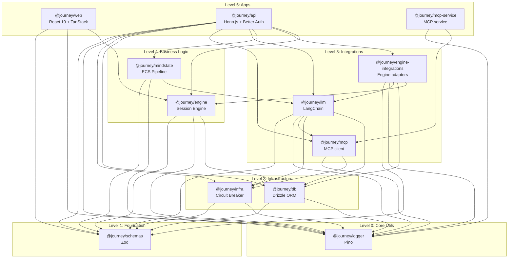

# Package Architecture

> Detailed documentation of all packages in the Journey Builder monorepo.

## Package Inventory

| Package              | Location             | Responsibility                              | Dependencies               |
| -------------------- | -------------------- | ------------------------------------------- | -------------------------- |
| `@journey/schemas`   | `packages/schemas`   | Types & validation (single source of truth) | zod                        |
| `@journey/logger`    | `packages/logger`    | Structured logging                          | pino, pino-pretty          |
| `@journey/db`        | `packages/db`        | Database schema & client                    | drizzle, postgres, pgvector, schemas, logger |
| `@journey/infra`     | `packages/infra`     | Infra primitives (circuit breaker, etc.)    | opossum, schemas, logger   |
| `@journey/mcp`       | `packages/mcp`       | MCP client + types                          | infra, logger              |
| `@journey/llm`       | `packages/llm`       | LLM abstractions                            | langchain, db, infra, mcp, schemas, logger |
| `@journey/engine-integrations` | `packages/engine-integrations` | Engine adapters (DB/LLM)            | db, engine, llm, schemas, logger |
| `@journey/mindstate` | `packages/mindstate` | ECS psychology tracking                     | llm, schemas, logger       |
| `@journey/engine`    | `packages/engine`    | Journey execution (core runtime)            | infra, schemas, logger |
| `@journey/api`       | `apps/api`           | REST API server                             | db, engine, engine-integrations, infra, llm, mcp, mindstate, schemas, logger |
| `@journey/mcp-service` | `apps/mcp`         | MCP service                                 | mcp, logger                |
| `@journey/web`       | `apps/web`           | React web application                       | engine, schemas, logger    |

---

## Dependency Graph

### ASCII Representation

```
┌─────────────────────────────────────────────────────────────────┐
│  Level 5: APPS                                                   │
│  ├── @journey/web (React 19)                                     │
│  ├── @journey/api (Hono.js)                                      │
│  └── @journey/mcp-service (MCP service)                          │
├─────────────────────────────────────────────────────────────────┤
│  Level 4: BUSINESS LOGIC                                         │
│  ├── @journey/engine                                             │
│  └── @journey/mindstate                                          │
├─────────────────────────────────────────────────────────────────┤
│  Level 3: INTEGRATIONS                                           │
│  ├── @journey/llm                                                │
│  ├── @journey/mcp                                                │
│  └── @journey/engine-integrations                                │
├─────────────────────────────────────────────────────────────────┤
│  Level 2: INFRASTRUCTURE                                         │
│  ├── @journey/db                                                 │
│  └── @journey/infra                                              │
├─────────────────────────────────────────────────────────────────┤
│  Level 1: FOUNDATION                                             │
│  └── @journey/schemas                                            │
├─────────────────────────────────────────────────────────────────┤
│  Level 0: CORE UTILS                                             │
│  └── @journey/logger                                             │
└─────────────────────────────────────────────────────────────────┘
```

### Mermaid Representation



---

## Package Details

### @journey/schemas

**Purpose:** Single source of truth for Zod schemas, TypeScript types, and cross-package contracts.

**Location:** `packages/schemas/src/`

**What you get (common entry points):**

- **Nodes**: `NodeTypeSchema`, `JourneyStepDataSchema`, `NodeCapabilitiesSchema`
- **Journey config**: `JourneyConfigSchema`, `JourneyConfigRecordSchema`, `EdgeGuardSchema`
- **Session + activity**: `EnhancedUserJourneySchema`, `UserActivityEntrySchema`, `NodeOutputSchema`
- **Events**: `BaseEventSchema`, `EVENT_REGISTRY`, `TypedEvent`
- **Services**: `SharedServiceContext` + service interfaces + no-op factories
- **Permissions**: `PermissionChecker`, `CapabilityProfiles`, `createGuardedContext`
- **LLM config**: `LLMProviderSchema`, `LLMRuntimeConfigSchema`, `llmConfig`
- **Utilities**: content split/merge, variable helpers, branded IDs, value types, errors

**Where to add new schemas:**

- Node types → `src/nodes/{type}.ts` + `src/nodes/index.ts`
- Journey/edges/guards → `src/journey.ts`
- Events → `src/events/payloads/` + `src/events/registry.ts`
- API routes → `src/api/`
- CRM domain → `src/crm/`
- Agent workflows → `src/agents/workflow/`

**Organization (current):**

```
packages/schemas/src/
├── index.ts
├── journey.ts
├── session.ts
├── value-types.ts
├── automation.ts
├── user-activity.ts
├── content.ts                 # Content split/merge utilities
├── branded-ids.ts
├── mindstate.ts
├── simulator.ts
├── frontend-engine-types.ts   # Frontend engine state types
├── version-management.ts      # Version snapshots
├── utils.ts
├── common/                    # Shared values (status enums)
├── nodes/
├── events/
├── variables/                 # Variable schemas and conversions
├── validation/                # Journey graph validation
├── services/
│   ├── variable-service.ts
│   ├── messenger-service.ts
│   ├── memory-service.ts
│   ├── template-service.ts
│   ├── tag-service.ts
│   ├── crm-service.ts
│   ├── cache-service.ts
│   ├── journey-service.ts
│   ├── shared-context.ts
│   └── noop-factory.ts
├── permissions/
│   ├── subjects.ts
│   ├── resources.ts
│   ├── capabilities.ts
│   ├── checker.ts
│   ├── guarded-context.ts
│   └── audit.ts
├── plugins/                   # Plugin config schemas
├── agents/
├── crm/
├── api/
├── llm/
├── errors/                    # Domain error hierarchy
└── config/
```

**Design Principles:**

- Single schema → inferred TypeScript type
- Discriminated unions for node types and automation triggers
- No app imports; keep contracts pure and reusable
- External deps: `zod`

---

### @journey/logger

**Purpose:** Centralized structured logging using Pino.

**Location:** `packages/logger/src/index.ts`

**Key Exports:**

```typescript
export { createLogger } from "./index";
export { serializeError } from "./index";
export { logger } from "./index"; // Raw Pino logger
```

**Usage Pattern:**

```typescript
import { createLogger, serializeError } from "@journey/logger";

const log = createLogger("feature:action", { sessionId });

log.info({ field: value }, "context:event");
log.error({ err: serializeError(error) }, "context:failed");
log.debug({ data }, "context:debug");
```

**Features:**

- **Dual Environment:** Node.js (file + console) / Browser (console)
- **Lazy Initialization:** Logger created on first use
- **Child Loggers:** Create scoped loggers with extra context
- **Error Serialization:** Recursive error serialization

**Configuration:**

| Environment Variable | Default | Description       |
| -------------------- | ------- | ----------------- |
| `LOG_LEVEL`          | `info`  | Node.js log level |
| `VITE_LOG_LEVEL`     | `info`  | Browser log level |

**Output Destinations:**

- Console (via pino-pretty)
- File (`./logs/journey.log`)

---

### @journey/db

**Purpose:** Database schema and client using Drizzle ORM.

**Location:** `packages/db/src/`

**Entry Points:** `@journey/db`, `@journey/db/schema`, `@journey/db/client`, `@journey/db/test-utils`

**Key Exports:**

```typescript
// Client + helpers
export {
  db,
  queryClient,
  withQueryLogging,
  checkDatabaseHealth,
  closeDatabaseConnection,
  poolConfig,
  getPoolStats,
  startPoolMonitoring,
  type PoolStats,
} from "./client";

// Schema (tables)
export * from "./schema";

// Encryption helpers
export { encrypt, decrypt, isEncrypted, safeEncrypt, hashSecret } from "./utils";
```

**Schema Organization:**

```
packages/db/src/
├── client.ts
├── schema/
│   ├── auth.ts
│   ├── organization.ts
│   ├── organization-membership.ts
│   ├── journey.ts
│   ├── journey-pipelines.ts
│   ├── journey-transfers.ts
│   ├── channels.ts
│   ├── session.ts
│   ├── variables.ts
│   ├── tags.ts
│   ├── crm.ts
│   ├── automation.ts
│   ├── events.ts
│   ├── mindstate.ts
│   ├── agents.ts
│   ├── memory.ts
│   ├── simulator.ts
│   ├── usage.ts
│   ├── enums.ts
│   └── relations.ts
├── seed/
├── test-utils/
└── utils/
```

**Key Tables:**

| Category | Tables |
| -------- | ------ |
| Auth | `user`, `session`, `account`, `verification` |
| Organization | `organization`, `member`, `invitation` |
| Journey | `journeys`, `journeyVersions`, `journeyMedia`, `journeyDefaultPipelines`, `journeyTransfers` |
| Session | `clients`, `journeySessions`, `interactions`, `sentMessages`, `agentConversations` |
| Variables | `variables` |
| Tags | `tagDefinitions`, `clientTags` |
| CRM | `crmPipelines`, `crmPipelineStages`, `crmClientStages`, `crmStageHistory`, `crmCustomFieldDefinitions`, `crmClientFieldValues`, `crmDirectMessages` |
| Automation | `automationTriggers`, `automationWebhooks`, `durableTimers` |
| Events | `events`, `failedEvents` |
| Agents | `agentWorkflows`, `agentDefinitions`, `workflowVersions`, `workflowApprovals` |
| Mindstate | `mindstateDefinitions`, `clientMindstates`, `mindstateAnalysisLog` |
| Memory | `agentMemories` |
| Usage | `llmUsageEvents` |
| Simulator | `testPersonas` |

**Docs:**

- `docs/db/README.md` - usage + operations
- `docs/db/schema-conventions.md` - schema patterns
- `docs/db/security.md` - encryption + rotation

**Operational Scripts (high-level):**

- `pnpm db:generate`, `pnpm db:migrate`, `pnpm db:push`
- `pnpm db:seed`, `pnpm db:reset`, `pnpm db:drop`, `pnpm db:reset-full`
- `pnpm --filter @journey/db test:seed`, `pnpm --filter @journey/db test:cleanup`

---

### @journey/mcp

**Purpose:** MCP client + shared types for communicating with the standalone MCP service.

**Location:** `packages/mcp/src/`

**Entry Points:** `@journey/mcp`, `@journey/mcp/client`, `@journey/mcp/types`

**Key Exports:**

```typescript
// Client
export {
  MCPServiceClient,
  getMCPServiceClient,
  initMCPServiceClient,
  resetMCPServiceClient,
} from "./client";

// Types
export type {
  MCPServersConfig,
  MCPServerConfig,
  MCPServiceClientOptions,
  MCPTool,
  MCPToolCallResponse,
  MCPResource,
  MCPPrompt,
  MCPHealthStatus,
} from "./types";
```

**API Surface (client):**

- `getTools(options?, servers?)`
- `callTool(request)`
- `listResources()`, `listResourceTemplates()`, `readResource()`
- `listPrompts()`, `getPrompt()`
- `getHealth()`, `isAvailable()`

**Layout:**

```
packages/mcp/src/
├── client/
│   └── mcp-service-client.ts
├── types/
│   ├── mcp-server.ts
│   └── mcp-client.ts
└── index.ts
```

---

### @journey/llm

**Purpose:** LLM runtime for model calls, agents, middleware, tools, and workflows.

**Location:** `packages/llm/src/`

**Key Entry Points:**

- `@journey/llm` - core services, agents, middleware helpers
- `@journey/llm/middleware` - middleware pipeline + built-ins
- `@journey/llm/workflow` - workflow engine
- `@journey/llm/tools/unified` - unified tool registry
- `@journey/llm/config` - app-level defaults (`llmConfig`)

**Key Exports (partial):**

```typescript
// LLM Service
export {
  generateChatResponse,
  generateStructuredOutput,
  clearModelCache,
} from "@journey/llm";

// Agent Services
export { executeAgent, runAgent } from "@journey/llm";

// Tools
export { unifiedToolRegistry } from "@journey/llm/tools/unified";

// Middleware
export { executeAgentWithMiddleware, createModelFallbackMiddleware } from "@journey/llm";

// Workflow
export { runWorkflow, registerBuiltinExecutors } from "@journey/llm/workflow";

// Config
export { llmConfig } from "@journey/llm/config";

// Model Registry
export { modelRegistryService } from "@journey/llm";

// Usage + Guards
export { usageTrackingService, evaluateGuards, executeQuestionUnderstanding } from "@journey/llm";

// Audio + Embeddings
export { transcribeAudio, generateSpeech, generateEmbedding } from "@journey/llm";

// Testing
export { MockProvider } from "@journey/llm";
```

**Components (high-level):**

```
packages/llm/src/
├── agent/                   # Unified agent engine + model runtime
├── services/                # LLM, agent, audio, embedding, guards
├── middleware/              # Pipeline + built-ins
├── tools/                   # Unified tool system
├── workflow/                # DAG workflow runtime
├── errors/                  # Error classification
├── providers/               # Mock provider
├── clients/                 # Provider clients
├── config/                  # Defaults + model registry JSON
├── utils/                   # Shared helpers
└── types.ts                 # Package-level types
```

**LLM Configuration:**

```typescript
interface LLMConfig {
  model: string;
  provider?: "openai" | "anthropic" | "google-genai" | "groq" | "cerebras";
  temperature?: number;
  maxTokens?: number;
  timeout?: number; // seconds
  maxRetries?: number;
  fallbackModels?: string[];
  reasoningEffort?: "low" | "medium" | "high";
  structuredOutputMethod?: "jsonSchema" | "functionCalling";
}
```

**Supported Providers:**

- OpenAI (`gpt-*`, `o1`, `o3`)
- Anthropic (`claude-*`)
- Google GenAI (`gemini-*`)
- Groq (llama, qwen, mistral, etc)
- Cerebras (ultra-fast inference)

**Runtime Notes:**

- Usage tracking uses `@journey/db`; call `usageTrackingService.initialize()` in server environments.
- Model registry requires `modelRegistryService.initialize()` on startup for pricing/metadata.
- `@journey/llm/tools/unified` auto-registers system + journey + embedded tools on import.
- MCP tools require `initMCPServiceClient()` to be called on startup.

---

### @journey/engine-integrations

**Purpose:** DB/LLM-backed adapters for `@journey/engine` (agent workflows, conversation store, memory, middleware builder).

**Location:** `packages/engine-integrations/src/`

**Key Exports (partial):**

```typescript
export { createEngineIntegrations } from "@journey/engine-integrations";
export { createAgentWorkflowService } from "@journey/engine-integrations";
export { createAgentConversationStore } from "@journey/engine-integrations";
export { createMemoryService } from "@journey/engine-integrations";
export { buildAgentMiddleware } from "@journey/engine-integrations";
export { prepareMessagesForLLM } from "@journey/engine-integrations";
```

**Components (high-level):**

```
packages/engine-integrations/src/
├── engine-integrations.ts      # Default bundle for SessionEngine
├── agent-workflow-service.ts   # DB-backed workflow loader + runner
├── agent-conversation-store.ts # DB-backed conversation store
├── memory-service.ts           # pgvector + embeddings memory store
├── build-agent-middleware.ts   # Config -> LLM middleware instances
└── conversation-summarizer.ts  # Summarization helpers
```

**Runtime Notes:**

- Requires DB access and OpenAI embeddings for memory.
- Registers LLM workflow executors on first use.

---

### @journey/mindstate

**Purpose:** ECS (Entity Component System) pipeline for psychological state tracking.

**Location:** `packages/mindstate/src/`

**Key Exports:**

```typescript
export { createPipeline, executePipeline, isPipelineError } from "@journey/mindstate";
export type { PipelineInput, PipelineResult, PipelineContext } from "@journey/mindstate";
export type { PipelineOptions, PipelineHooks } from "@journey/mindstate";
export type { Message, StateParameter, SystemAgent, MainAgent } from "@journey/mindstate";
```

**Docs:** `docs/mindstate/README.md`, `docs/dev/architecture/mindstate.md`

**Pipeline Architecture:**

```
┌─────────────────────────────────────────────────────────────────┐
│                    MindState Pipeline                            │
├─────────────────────────────────────────────────────────────────┤
│  1. ingestMessage()      → Parse user message                   │
│  2. prepareContext()     → Build conversation context           │
│  3. assignWorkload()     → Map agents to state parameters       │
│  4. dispatchAgents()     → Parallel agent execution             │
│  5. aggregateResults()   → Flatten updates                      │
│  6. applyStateUpdates()  → Update state parameters              │
│  7. generateInsights()   → Build insight records (no extra LLM)  │
│  8. generateResponse()   → Generate main agent response         │
└─────────────────────────────────────────────────────────────────┘
```

**Pipeline Steps:**

```
packages/mindstate/src/
├── pipeline/
│   ├── orchestrator.ts    # Main pipeline orchestrator
│   └── steps/
│       ├── ingest.ts      # Step 1: Message ingestion
│       ├── context.ts     # Step 2: Context preparation
│       ├── workload.ts    # Step 3: Agent workload assignment
│       ├── dispatch.ts    # Step 4: Parallel agent dispatch
│       ├── aggregate.ts   # Step 5: Result aggregation
│       ├── state-update.ts # Step 6: State updates
│       ├── insights.ts    # Step 7: Insight generation
│       └── response.ts    # Step 8: Response generation
├── llm/
│   ├── agent-service.ts   # Agent execution
│   └── prompts.ts         # Prompt templates
└── types.ts               # Type definitions
```

---

### @journey/engine

**Purpose:** Core journey execution engine (DB/LLM-free runtime).

**Location:** `packages/engine/src/`

**Key Exports:**

```typescript
// Engine entry point
export { SessionEngine } from "@journey/engine";
export type {
  SessionEngineConfig,
  ExecutionContext,
  HandlerResult,
  NodeHandler,
  JourneyEvent,
  MessagingAdapter,
} from "@journey/engine";

// Extensibility + services
export { createHandlerRegistry, createHandlerRegistryWithOverrides } from "@journey/engine";
export { createConditionEvaluator, createTemplateService, createTimerService, createWebhookExecutor } from "@journey/engine";

// Validation + testing helpers
export {
  validateJourneyStructure,
  isValidJourney,
  PathExplorer,
  PathRunner,
  MockMessagingAdapter,
  VariationTester,
  testJourney,
} from "@journey/engine";
```

Expression helpers live on `context.services.expression` inside handlers (see `docs/engine/README.md`).

**Developer quick links:**

- Docs: `docs/engine/README.md`, `docs/engine/bindings-system.md`
- CLI: `pnpm journey:test <journey.json>`, `pnpm journey:analyze <journey.json>`
- Tests: `pnpm -C packages/engine test:core`, `pnpm -C packages/engine test:slow`

**Architecture:**

```
packages/engine/src/
├── session-engine.ts       # Main orchestrator (queue + router + middleware)
├── handlers/               # Node type handlers (10 total)
│   ├── start-handler.ts
│   ├── message-handler.ts
│   ├── condition-handler.ts
│   ├── wait-handler.ts
│   ├── webhook-handler.ts
│   ├── crm-handler.ts
│   ├── teleport-handler.ts
│   ├── questionnaire-handler.ts
│   ├── agent-handler.ts
│   └── end-handler.ts
├── services/               # Reusable services
│   ├── edge-selector.ts
│   ├── condition-evaluator.ts
│   ├── template-service.ts
│   ├── timer-service.ts
│   ├── webhook-executor.ts
│   ├── expression-service.ts
│   ├── variable-service.ts
│   ├── dlq-service.ts
│   └── service-factory.ts
├── middleware/             # Execution middleware
│   ├── built-in/
│   ├── middleware-pipeline.ts
│   └── factory.ts
├── event/                  # Event handling
│   ├── event-queue.ts
│   └── event-router.ts
├── state/                  # State management helpers
│   ├── session-state-manager.ts
│   ├── agent-state-manager.ts
│   └── questionnaire-state-manager.ts
├── mindstate/              # Mindstate analysis
├── validation/             # Journey validation + analyzer
├── testing/                # Variation + race testing
└── utils/                  # Context, guards, retry, JSONPath, etc.
```

**Handler Interface:**

```typescript
interface NodeHandler {
  nodeType: NodeType;
  execute(context: ExecutionContext): Promise<HandlerResult>;
  handleEvent?(event: JourneyEvent, context: ExecutionContext): Promise<NodeEventResult | null>;
}

type HandlerResult =
  | { action: "wait" }
  | { action: "transition"; targetNodeId: string; trigger: string }
  | { action: "complete" };
```

---

## Known Issues Reference

> **Note:** Detailed issue tracking has been moved to [proposals/](../proposals/README.md). Below is a summary of package-related issues.

### Package-Specific Issues

| Package | Critical | High | Location |
|---------|----------|------|----------|
| `@journey/engine` | #26, #27, #33 | #35, #42 | `handlers/agent-handler.ts` |
| `@journey/llm` | - | #25 (any types) | `llm-agent-service.ts` |
| `@journey/schemas` | - | #18 (Zod version) | package.json |

**Full Details:**
- [🔴 Critical Issues](../proposals/active/critical.md) - Data integrity, race conditions
- [🟠 High Priority Issues](../proposals/active/high.md) - Security, performance
- [📋 Full Catalog](../proposals/backlog/issues-catalog.md) - All 69 issues

---

## Import Rules

### Allowed Dependencies

| Package              | Can Import From          |
| -------------------- | ------------------------ |
| `@journey/schemas`   | (none)                   |
| `@journey/logger`    | (none)                   |
| `@journey/infra`     | logger, schemas          |
| `@journey/db`        | schemas, logger          |
| `@journey/mcp`       | infra, logger            |
| `@journey/llm`       | db, infra, logger, mcp, schemas |
| `@journey/engine-integrations` | db, engine, llm, logger, schemas |
| `@journey/mindstate` | llm, logger, schemas     |
| `@journey/engine`    | infra, logger, schemas |
| `@journey/api`       | ALL packages             |
| `@journey/web`       | engine, logger, schemas  |
| `@journey/mcp-service` | mcp, logger            |

**Note:** `@journey/schemas` avoids workspace dependencies to keep contracts portable.

### Forbidden Patterns

```typescript
// ❌ NEVER import app code into packages
import { something } from "@journey/api"; // In @journey/schemas

// ❌ NEVER import higher-level packages
import { db } from "@journey/db"; // In @journey/schemas

// ❌ NEVER create circular dependencies
import { engine } from "@journey/engine"; // In @journey/db
```

### Type Sharing Pattern

```typescript
// ✅ In @journey/schemas - define base types
export const NodeTypeSchema = z.enum([...]);
export type NodeType = z.infer<typeof NodeTypeSchema>;

// ✅ In @journey/web - re-export + extend
export type { NodeType } from "@journey/schemas";
export type JourneyNode = Node<JourneyStepData>;  // React Flow extension
```

---

## Related Documentation

### Issue Tracking
- [Proposals & Issues](../proposals/README.md) - Task tracking hub
- [🔴 Critical Issues](../proposals/active/critical.md) - Must-fix issues
- [🟠 High Priority](../proposals/active/high.md) - Security & performance

### Architecture
- [System Overview](./system-overview.md) - High-level architecture
- [Data Flows](./data-flows.md) - Key data flow diagrams
- [Project Structure](./project-structure.md) - Folder organization

### Unified Services Layer
- [Unified Services Overview](./unified-services/README.md) - SharedServiceContext architecture
- [Service Interfaces](./unified-services/service-interfaces.md) - All 12 service interfaces
- [Variable Namespaces](./unified-services/variable-namespaces.md) - `{{vars.scope.key}}` syntax
- [Permission Model](./unified-services/permission-model.md) - Capability-based access control
- [Testing Patterns](./unified-services/testing-patterns.md) - No-op factories and mocking
