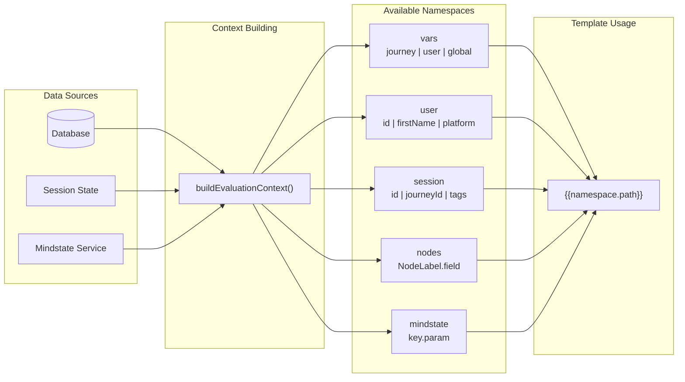

# Variable Namespaces

> Unified syntax for accessing variables across templates and code.

## Overview

The variable namespace system provides consistent access to variables using a unified `{{vars.scope.key}}` syntax in templates and a matching code API. Variable scopes are `journey`, `user`, and `global`. Session data is available as a separate `{{session.*}}` namespace.

### Namespace Overview Diagram

```
┌──────────────────────────────────────────────────────────────────────────────┐
│                         EVALUATION CONTEXT NAMESPACES                         │
│                        (Available in Templates & Expressions)                  │
└──────────────────────────────────────────────────────────────────────────────┘

┌─────────────────────────────────────────────────────────────────────────────────┐
│                                                                                  │
│   ┌─────────────────────────────────────────────────────────────────────────┐   │
│   │  {{vars.*}}                          Variable Scopes                     │   │
│   │  ├── {{vars.journey.*}}              Journey-specific state              │   │
│   │  ├── {{vars.user.*}}                 User preferences/data               │   │
│   │  └── {{vars.global.*}}               Organization-wide settings          │   │
│   └─────────────────────────────────────────────────────────────────────────┘   │
│                                                                                  │
│   ┌─────────────────────────────────────────────────────────────────────────┐   │
│   │  {{user.*}}                          User Profile                        │   │
│   │  ├── {{user.id}}                     Platform user ID                    │   │
│   │  ├── {{user.firstName}}              First name                          │   │
│   │  ├── {{user.lastName}}               Last name                           │   │
│   │  ├── {{user.username}}               Platform username                   │   │
│   │  └── {{user.platform}}               telegram, whatsapp, etc.            │   │
│   └─────────────────────────────────────────────────────────────────────────┘   │
│                                                                                  │
│   ┌─────────────────────────────────────────────────────────────────────────┐   │
│   │  {{session.*}}                       Session Information                 │   │
│   │  ├── {{session.id}}                  Current session ID                  │   │
│   │  ├── {{session.journeyId}}           Journey being executed              │   │
│   │  ├── {{session.currentNodeId}}       Current node position               │   │
│   │  └── {{session.tags}}                User's tags (array)                 │   │
│   └─────────────────────────────────────────────────────────────────────────┘   │
│                                                                                  │
│   ┌─────────────────────────────────────────────────────────────────────────┐   │
│   │  {{nodes.*}}                         Previous Node Outputs               │   │
│   │  └── {{nodes.NodeLabel.field}}       Output from labeled node            │   │
│   │      Example: {{nodes.GetCustomer.email}}                                │   │
│   └─────────────────────────────────────────────────────────────────────────┘   │
│                                                                                  │
│   ┌─────────────────────────────────────────────────────────────────────────┐   │
│   │  {{mindstate.*}}                     Mindstate Parameters (Optional)     │   │
│   │  └── {{mindstate.key.param}}         Parameter from mindstate definition │   │
│   │      Example: {{mindstate.mood.stress}}                                  │   │
│   │      ⚠️  Requires journey with mindstateConfig.keys                      │   │
│   └─────────────────────────────────────────────────────────────────────────┘   │
│                                                                                  │
└─────────────────────────────────────────────────────────────────────────────────┘
```

### Mermaid Diagram



---

## Template Syntax

### Variable Scopes

```handlebars
{{vars.journey.orderTotal}}
<!-- Journey-scoped variable -->
{{vars.user.firstName}}
<!-- User-scoped variable -->
{{vars.global.companyName}}
<!-- Organization-wide setting -->
```

**Note:** Session data is accessed via `{{session.*}}`, not `{{vars.session.*}}`.

### User Profile Fields

```handlebars
{{user.firstName}}
<!-- User's first name -->
{{user.lastName}}
<!-- User's last name -->
{{user.username}}
<!-- Platform username -->
{{user.platform}}
<!-- telegram, whatsapp, etc. -->
{{user.id}}
<!-- User ID -->
```

### Session Information

```handlebars
{{session.id}}
<!-- Current session ID -->
{{session.journeyId}}
<!-- Current journey ID -->
{{session.currentNodeId}}
<!-- Current node being executed -->
{{session.tags}}
<!-- User's tags (array) -->
```

### Node Outputs

Access outputs from previously executed nodes:

```handlebars
{{nodes.GetCustomerInfo.email}}
<!-- Output from "GetCustomerInfo" node -->
{{nodes.CalculateTotal.result}}
<!-- Output from "CalculateTotal" node -->
```

### Mindstate Parameters

Access mindstate parameter values (requires journey with `mindstateConfig`):

```handlebars
{{mindstate.mood.stress}}
<!-- Stress level from "mood" mindstate -->
{{mindstate.energy.level}}
<!-- Level from "energy" mindstate -->
```

**Note:** Mindstate variables are only available when the journey has `mindstateConfig.keys` configured. See [Mindstate Architecture](../mindstate.md#mindstate-in-templates) for details.

---

## Code API

### Reading Variables

```typescript
// Get all variables for a scope
const journeyVars = await context.services.variable.getAll("journey");

// Get specific variable
const name = await context.services.variable.getValue("user", "firstName");

// Check existence
const exists = await context.services.variable.exists("journey", "orderTotal");
```

### Writing Variables

```typescript
// Set single variable
await context.services.variable.setValue("journey", "orderTotal", 99.99);

// Execute batch operations
await context.services.variable.executeAction({
  journeyOperations: [
    { op: "set", key: "status", value: "completed" },
    { op: "increment", key: "visitCount", amount: 1 },
  ],
  userOperations: [{ op: "push", key: "visitHistory", value: new Date().toISOString() }],
});
```

### Variable Operations

| Operation   | Description          | Example                                        |
| ----------- | -------------------- | ---------------------------------------------- |
| `set`       | Set value            | `{ op: "set", key: "x", value: 5 }`            |
| `delete`    | Remove variable      | `{ op: "delete", key: "x" }`                   |
| `increment` | Add to number        | `{ op: "increment", key: "x", amount: 1 }`     |
| `decrement` | Subtract from number | `{ op: "decrement", key: "x", amount: 1 }`     |
| `push`      | Add to array         | `{ op: "push", key: "arr", value: "item" }`    |
| `pop`       | Remove from array    | `{ op: "pop", key: "arr" }`                    |
| `merge`     | Merge objects        | `{ op: "merge", key: "obj", value: { a: 1 } }` |

---

## Building Variable Namespaces

The `buildVariableNamespaces` function creates the complete namespace object for template resolution. It is synchronous and expects pre-fetched variable data:

```typescript
import { buildVariableNamespaces } from "@journey/schemas";

const namespaces = buildVariableNamespaces({
  session,
  user: userProfile,
  journeyVars,
  globalVars,
  userVars,
  nodeOutputs,
});

// Result:
{
  vars: {
    journey: { orderTotal: 99.99, status: "pending" },
    user: { firstName: "John", preferences: {...} },
    global: { companyName: "Acme Corp" },
  },
  user: {
    id: "user-123",
    firstName: "John",
    lastName: "Doe",
    platform: "telegram",
  },
  session: {
    id: "sess-456",
    journeyId: "journey-789",
    currentNodeId: "node-abc",
    tags: ["vip", "subscribed"],
  },
  nodes: {
    GetCustomerInfo: { email: "john@example.com" },
  },
  // When journey has mindstateConfig.keys:
  mindstate: {
    mood: { stress: 7, happiness: 8 },
    energy: { level: 5 },
  },
}
```

---

## Scope Comparison

| Scope     | Lifetime         | Persistence     | Use Case                                             |
| --------- | ---------------- | --------------- | ---------------------------------------------------- |
| `journey` | Journey instance | Database        | Journey-specific state (order details, quiz answers) |
| `user`    | Forever          | Database        | User preferences, accumulated data                   |
| `global`  | Organization     | Database/Config | Organization settings, shared configuration          |

---

## Best Practices

### Naming Conventions

```typescript
// Good: Descriptive, camelCase
"orderTotal";
"lastVisitDate";
"customerSegment";

// Avoid: Vague, inconsistent
"x";
"data1";
"CUSTOMER_INFO";
```

### Scope Selection

```typescript
// Journey scope: Data specific to this journey run
await services.variable.setValue("journey", "quizScore", 85);

// User scope: Data that persists across journeys
await services.variable.setValue("user", "totalQuizzesTaken", 5);

// Global scope: Organization-wide settings
// (Usually read-only from journey context)
const rate = await services.variable.getValue("global", "conversionRate");
```

### Checking Before Use

```typescript
// Check if variable exists before using
const orderTotal = await services.variable.getValue("journey", "orderTotal");
if (orderTotal !== undefined) {
  // Use the variable
}

// Or use getAll and provide defaults
const vars = await services.variable.getAll("journey");
const total = vars.orderTotal ?? 0;
```

---

## Template Examples

### Greeting with Fallback

```handlebars
Hello {{user.firstName || "there"}}!
```

### Conditional Content

```handlebars
{{#if vars.journey.isVip}}
  Welcome back, VIP customer!
{{else}}
  Welcome! Consider our VIP program.
{{/if}}
```

### Order Summary

```handlebars
Your order #{{vars.journey.orderId}}: - Total: ${{vars.journey.orderTotal}}
- Items:
{{vars.journey.itemCount}}

Shipping to:
{{user.firstName}}
{{user.lastName}}
```

---

## Type Conversion

When using variables in conditions or expressions, use the type conversion utilities:

```typescript
import { isTruthy, toNumber, isEmpty } from "@journey/schemas";

// Check if value is truthy (handles edge cases)
if (isTruthy(vars.journey.hasConsented)) {
  // User consented
}

// Convert to number safely
const total = toNumber(vars.journey.orderTotal); // Returns 0 for non-numeric

// Check if empty (null, undefined, "", [], {})
if (!isEmpty(vars.journey.items)) {
  // Has items
}
```

See [Type Conversion](./type-conversion.md) for detailed documentation.

---

## See Also

- [Type Conversion](./type-conversion.md) - Type coercion utilities
- [Service Interfaces](./service-interfaces.md) - IVariableService API
- [SharedServiceContext](./README.md) - Architecture overview
