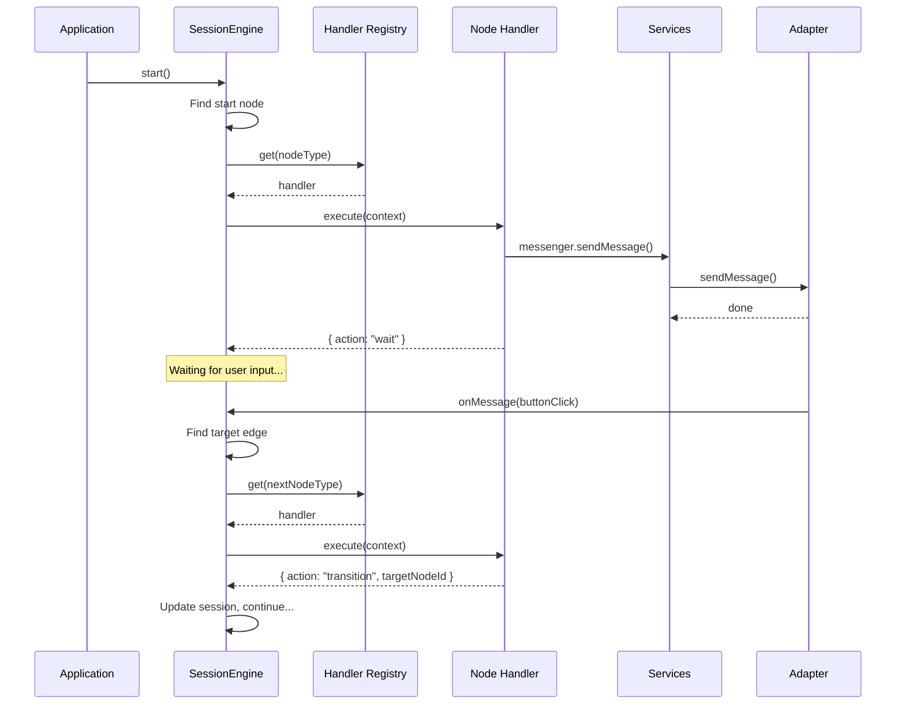
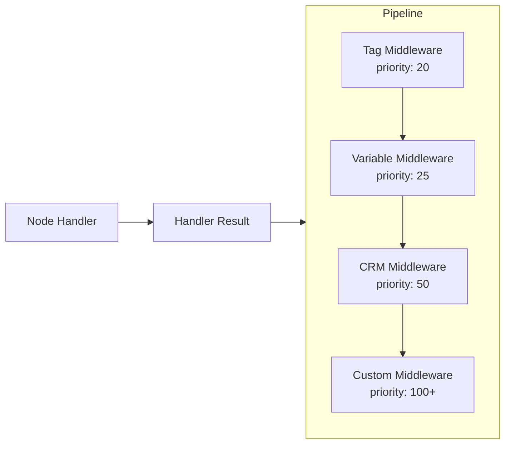
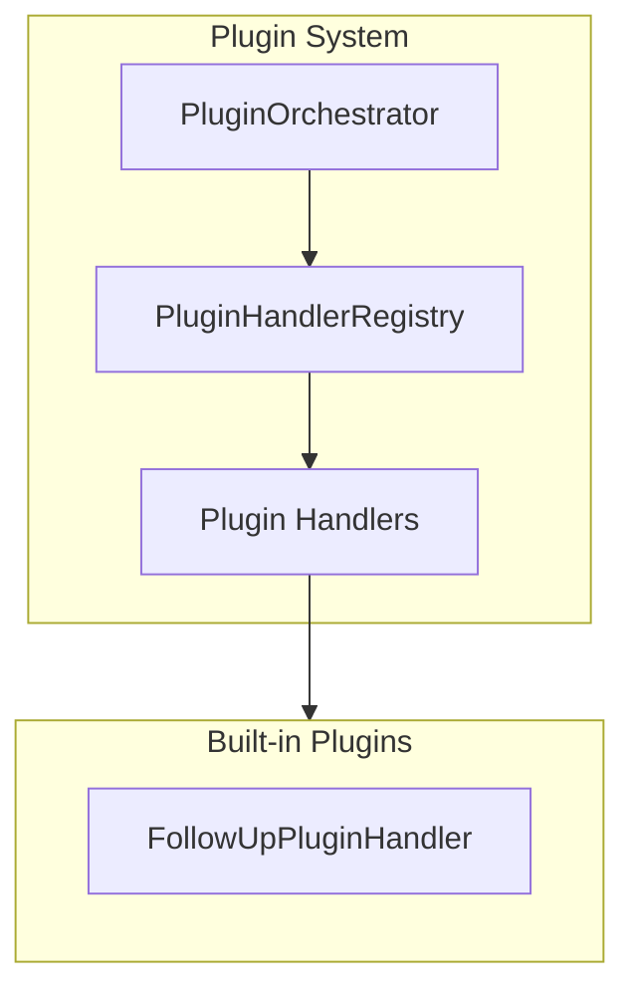

# @journey/engine

The core execution engine for user journeys. This package provides a modular, testable, and extensible architecture for running journey state machines with event sourcing.

## What This Package Does

The **@journey/engine** package is the heart of the journey system. It takes a journey configuration (a graph of nodes and edges) and executes it step by step, managing user interactions along the way.

**In simple terms:**

1. **Receives a journey definition** — A JSON structure describing nodes (start, message, condition, wait, webhook, crm, teleport, questionnaire, agent, end) and edges (connections between nodes).

2. **Manages user sessions** — Tracks where each user is in their journey, what context data they've accumulated, and their full interaction history.

3. **Executes nodes** — When a user reaches a node, the engine runs the appropriate handler: sending messages, evaluating conditions, making API calls, or waiting for timers.

4. **Routes between nodes** — Based on user actions (button clicks, text messages) or system events (timeouts), the engine determines which edge to follow and transitions to the next node.

5. **Records everything** — Every interaction is logged as an event, creating a complete audit trail for debugging, analytics, and replay.

**Key characteristics:**

- **Platform-agnostic** — Works with any messaging platform through the adapter interface
- **Decoupled core** — Engine core runs without DB/LLM dependencies via injected services
- **Stateless execution** — Session state is passed in, not stored internally
- **Event-sourced** — Full history enables replay, debugging, and analytics
- **Serialized events** — FIFO queue prevents timeout/input race conditions
- **Guard-aware routing** — Edge guards with fallback support for safe branching
- **Extensible** — New node types can be added without modifying the core engine

## Architecture Overview

> **See Also:** [Architecture Diagrams](./architecture-diagrams.md) for comprehensive visual documentation including event flow, state lifecycle, and component dependencies.

```mermaid
flowchart TB
    subgraph Engine["SessionEngine (Orchestrator)"]
        direction TB

        EQ[Event Queue]
        ER[Event Router]
        HR[Handler Registry]
        MP[Middleware Pipeline]

        EQ --> ER --> HR --> MP

        subgraph Handlers["Node Handlers (Strategy Pattern)"]
            SH[Start Handler]
            MH[Message Handler]
            CH[Condition Handler]
            WH[Wait Handler]
            WBH[Webhook Handler]
            CRMH[CRM Handler]
            TH[Teleport Handler]
            QH[Questionnaire Handler]
            AH[Agent Handler]
            EH[End Handler]
        end

        HR --> Handlers

        subgraph Services["Services (Dependency Injection)"]
            MS[Messenger Service]
            TS[Timer Service]
            EL[Event Logger]
            CE[Condition Evaluator]
            WE[Webhook Executor]
            TM[Template Service]
            ES[Expression Service]
            VS[Variable Service]
            TAG[Tag Service]
            CRM[CRM Service &#40;optional&#41;]
            MIND[Mindstate Service &#40;optional&#41;]
            MEM[Memory Service &#40;optional&#41;]
        end

        Services --> Handlers

        subgraph Context["Execution Context"]
            Session[(Session State)]
            Node[Current Node]
            Edges[Outgoing Edges]
        end
    end

    subgraph External["External"]
        Adapter[Messaging Adapter]
        Platform[Platform API]
    end

    Handlers --> Context
    Services --> Context
    Context --> Adapter
    Adapter --> Platform
```



### How It Works

1. **SessionEngine** receives a journey config and session state and precomputes node/edge indices
2. Incoming adapter events are serialized through the **EventQueue**
3. **EventRouter** routes events to handler execution (or handler `handleEvent` delegation)
4. The handler receives an **ExecutionContext** containing session, node, edges, and services
5. The **Middleware Pipeline** applies tag/variable/CRM side effects after handler completion
6. The engine updates session state and continues execution

### Execution Flow



## Module Descriptions

### SessionEngine (`session-engine.ts`)

The **SessionEngine** is the orchestrator that coordinates the entire journey execution. It wires together handlers and services, serializes events, routes user input, and applies middleware side effects.

**Responsibilities:**

- Initialize services, handler registry, middleware pipeline, and event queue/router
- Optionally validate journey structure at start (`validateOnStart`)
- Detect fresh start vs resume and handle appropriately
- Find the start node and begin execution (fresh start only)
- Route incoming events (messages, button clicks, timeouts, follow-ups) through the EventQueue
- Delegate per-node logic to handlers (including `handleEvent` for agent/questionnaire)
- Apply tag/variable/CRM middleware after handler completion
- Track mindstate analysis (when configured)
- Manage state transitions, timers, follow-up sequences, and session history
- Precompute graph indices for O(1) node/edge lookups
- Detach adapter listeners, cancel timers/follow-ups, and dispose resources on destroy

**Resume Detection:**

The engine uses the `hasStarted` field for deterministic resume detection:

```typescript
// Primary check - explicit flag set after first node executes
if (session.hasStarted) {
  // This is a resume - don't re-execute, wait for events
  return;
}

// Fallback heuristics for backward compatibility:
// - currentNodeId is set and not empty
// - status is not "active" (already completed/error)
// - history has events
// - progress exists
```

When resuming, the engine:
1. Recovers pending timers from `session.pendingTimers`
2. Recovers plugin follow-ups from `session.pendingPluginFollowUps`
3. Rebuilds in-memory timer maps
4. Waits for incoming events (doesn't re-execute current node)

### GraphIndex (`graph-index.ts`)

The **GraphIndex** provides O(1) runtime lookups for journey graph data. It pre-computes indices at engine initialization, enabling fast node and edge retrieval during execution.

**Structures:**
- `Map<nodeId, JourneyNodeData>` — Node by ID
- `Map<sourceId, JourneyEdgeData[]>` — Edges by source node
- `Map<edgeId, JourneyEdgeData>` — Edge by ID

**Methods:**
- `getNode(nodeId)` — Single node lookup
- `getOutgoingEdges(nodeId)` — Edges from node
- `getEdge(edgeId)` — Single edge lookup
- `hasNode()`, `hasEdge()` — Existence checks
- `getAllNodes()`, `getAllEdges()` — Full collections
- `nodeCount`, `edgeCount` — Cardinality

**Benefits:**
- Pre-built at construction from JourneyConfig
- Can be shared across engine instances for performance
- Eliminates repeated array scans during execution

### Handlers (`handlers/`)

**Handlers** implement the Strategy pattern — each node type has a dedicated handler that knows how to execute that specific type of node. Handlers are stateless functions that receive everything they need through the ExecutionContext.

| Handler                  | Purpose                                                                    |
| ------------------------ | -------------------------------------------------------------------------- |
| **StartHandler**         | Entry point. Sends welcome message and transitions to the first node.      |
| **MessageHandler**       | Content delivery with buttons/media/timers and inline follow-up sequences. |
| **ConditionHandler**     | Branching logic via expressions/rules (supports mindstate references).     |
| **WaitHandler**          | Simple delay. Schedules a timer and waits for it to expire.                |
| **WebhookHandler**       | API integration. Makes HTTP requests, handles responses, stores results.   |
| **CrmHandler**           | CRM integration. Updates client pipeline/stage and logs CRM events.        |
| **TeleportHandler**      | Cross-journey navigation. Marks session for API-driven transfer.           |
| **QuestionnaireHandler** | Stateful Q&A flow with validation, optional reminders, and `handleEvent`.  |
| **AgentHandler**         | Workflow-driven AI conversation with persisted history and `handleEvent`.  |
| **EndHandler**           | Terminal state. Marks journey as completed, sends final message.           |

### Services (`services/`)

**Services** are reusable components that handlers use to perform common operations. They're injected via the ExecutionContext, making handlers easy to test with mocks.

| Service                    | Purpose                                                                           |
| -------------------------- | --------------------------------------------------------------------------------- |
| **MessengerService**       | Sends messages through the adapter with templating + media/buttons.               |
| **TimerService**           | Schedules/cancels timers, including inline follow-up sequences.                   |
| **EventLogger**            | Records interaction events and invokes callbacks (session history + analytics).   |
| **ConditionEvaluator**     | Evaluates condition nodes with JEXL expressions and rules.                        |
| **WebhookExecutor**        | Makes HTTP requests with retries, timeouts, auth, and JSONPath extraction.        |
| **TemplateService**        | Substitutes `{{variables}}` and `{{= expressions }}` in strings.                  |
| **ExpressionService**      | Shared JEXL evaluation (templates, guards, conditions, questionnaire skip rules). |
| **EdgeSelector**           | Guard-aware edge selection with two-phase filtering and fallback support.         |
| **VariableService**        | Manages journey/global/user variables with scoped access.                         |
| **TagService**             | Adds/removes tags via callbacks or session fallback.                              |
| **ConversationHistoryService** | Manages agent conversation message history and context building.              |
| **DLQService**             | Records failed events to Dead Letter Queue for retry/analysis.                    |
| **CRM Service**            | Optional CRM interface used by CRM nodes and middleware.                          |
| **Mindstate Service**      | Optional mindstate interface used for analysis + condition expressions.           |
| **MemoryService**          | Optional memory interface (AI memory + agent tools).                              |
| **AgentWorkflowService**   | Optional workflow loader/runner for agent nodes.                                  |
| **AgentConversationStore** | Optional persistence for agent messages.                                          |
| **WorkflowEventEmitter**   | Optional workflow lifecycle event emitter (SSE/event bus).                        |
| **FollowUpAIService**      | Optional AI service for generating AI-enhanced follow-up messages.                |
| **ServiceFactory**         | Creates and wires all services with proper dependencies.                          |
| **URLValidator**           | Validates webhook URLs (SSRF protection, protocol checks).                        |
| **ServiceConfigurationValidator** | Validates engine configuration at startup.                                  |
| **AIContextBuilder**       | Builds context objects for AI/workflow execution.                                 |
| **PersistenceMonitoring**  | Monitors and tracks session persistence operations.                               |
| **ExpressionRegistry**     | Shared registry of JEXL functions for templates/guards/conditions.                |

### Integrations (`@journey/engine-integrations`)

The engine core does not depend on databases or LLM providers. DB/LLM-backed functionality is provided by `@journey/engine-integrations`:

- **AgentWorkflowService** — loads workflows from the DB and executes them via `@journey/llm/workflow` (registers built-in executors once per process).
- **AgentConversationStore** — appends agent messages to `agent_conversations`.
- **MemoryService** — stores and searches memories using embeddings + pgvector.
- **FollowUpAIService** — generates AI-enhanced follow-up messages using `@journey/llm`.
- **buildAgentMiddleware** — converts `AgentMiddlewareConfig` to LLM middleware instances.
- **Conversation summarizer** — helpers for trimming/summarizing long histories.

Apps can use the default bundle:

```typescript
import { createEngineIntegrations } from "@journey/engine-integrations";

const integrations = createEngineIntegrations({ clientId, organizationId });
const engine = new SessionEngine(session, journey, adapter, {
  agentWorkflowService: integrations.agentWorkflowService,
  memoryService: integrations.memoryService,
  // followUpAIService is also available via integrations.followUpAIService
});
```

See `docs/engine-integrations/README.md` for service-specific usage details.

### Event Queue and History Retention

For multi-instance runtimes, the engine can accept a custom event queue factory:

```typescript
const engine = new SessionEngine(session, journey, adapter, {
  eventQueueFactory: (processEvent, config) => new MyDistributedQueue(processEvent, config),
  eventQueueConfig: {
    backpressureThreshold: 100,
    onBackpressure: ({ queueLength }) => metrics.gauge("engine.queue.depth", queueLength),
    maxQueueLength: 1000,
    overflowPolicy: "drop_oldest",
  },
});
```

The default in-memory queue applies overflow policies (`drop_oldest`, `drop_newest`, `reject`), caps length at 1000 by default, and ignores stale timeout events after cancellation. Processing is catch-and-continue; failed events are recorded via the DLQ callback when `onFailedEvent` is configured.

Session history retention is optional and configurable:

```typescript
const engine = new SessionEngine(session, journey, adapter, {
  historyRetention: { maxEvents: 500, maxAgeMs: 1000 * 60 * 60 },
});
```

You can also hook retention trims for audit or summarization:

```typescript
const engine = new SessionEngine(session, journey, adapter, {
  historyRetention: {
    maxEvents: 500,
    onTrim: ({ removed, retained }) => metrics.count("engine.history.trim", removed.length),
  },
});
```

### Guard Transparency Events

Guard filtering emits structured events for observability:

- `llm.guard.blocked`: emitted when a guard blocks an edge.
- `llm.guard.fallback`: emitted when all guards fail and a fallback edge is used.

Payloads include edge IDs and guard details for debugging and audit trails.

### Event Payload Consistency

- `engine.message` payloads are normalized to `{ content, buttons?, media? }` with buttons `{ id, label }`.
- `user.message` payloads include `{ text }`; `user.click` payloads include `{ buttonId, buttonLabel }`.
- `timer.expired` payloads include `{ timerId, durationMs? }`.
- `timer.followup` payloads include `{ timerId, stepIndex, totalSteps, hasExitOnTimeout }`.
- Guard events (`llm.guard.blocked`, `llm.guard.fallback`) carry edge IDs and guard metadata.
- Other engine-emitted events include `engine.transition`, `engine.error`, `session.tags`, `session.variables`, `journey.crm`, `journey.teleport`, and `mindstate.updated`.

### Utils (`utils/`)

**Utils** are pure functions with no dependencies. They're used by services for common operations.

| Utility                             | Purpose                                                              |
| ----------------------------------- | -------------------------------------------------------------------- |
| **buildFullContext**                | Builds namespaced context with user, session, vars, and nodes.       |
| **buildEvaluationContext**          | Fetches variables and builds a full evaluation context.              |
| **getOrBuildEvaluationContext**     | Caches evaluation context per node execution.                        |
| **getNestedValue**                  | Traverses objects using dot notation (e.g., `"user.profile.name"`).  |
| **toExprEvalContext**               | Normalizes context for expression evaluation (shared schema helper). |
| **extractJsonPath**                 | Extracts values from JSON using JSONPath expressions.                |
| **storeNodeOutput / getNodeOutput** | Stores and retrieves cross-node output data.                         |
| **sanitizeNodeLabel**               | Normalizes labels for node output keys.                              |
| **applyTagOperations**              | Applies tag add/remove operations locally (fallback mode).           |
| **applyVariableOperations**         | Applies variable operations locally (fallback mode).                 |
| **validateMedia**                   | Normalizes/validates media payloads before send.                     |
| **withRetry / sleep**               | Retry helpers + delay utilities for resilient operations.            |
| **guard-utils**                     | Guard evaluation + fallback filtering + event callbacks.             |
| **comparison-utils**                | Shared comparison operators + regex safety for conditions/guards.    |
| **routing-utils**                   | Response type inference + button edge matching helpers.              |
| **conversation-history**            | Agent conversation context building + message history utilities.     |
| **output-helpers**                  | Formats handler outputs consistently (primitives → `{ value }`).     |
| **timer-helpers**                   | Timer scheduling and cancellation helpers for services.              |
| **edge-utils**                      | Edge-specific utilities (type checks, filtering, sorting).           |
| **workflow-context-builder**        | Builds execution context for AI workflow invocations.                |
| **secret-masking**                  | Masks sensitive data in logs (API keys, tokens, passwords).          |

### Routing (`routing/`)

**Routing** provides unified transition resolution logic used by the EventRouter.

| Module                   | Purpose                                                                   |
| ------------------------ | ------------------------------------------------------------------------- |
| **resolve-transition**   | Unified transition resolution for button clicks, text messages, timeouts. |

The `resolveTransition` function encapsulates the complex logic of determining the next node based on:
- Button click events (lookup active buttons, find matching edge)
- Text message events (evaluate guards, find default edge)
- Timeout events (check timer map, find timer edge)
- Plugin follow-up timeouts (delegate to plugin orchestrator)

This module ensures consistent routing behavior across all event types.

## Design Patterns

### 1. Strategy Pattern (Node Handlers)

Each node type has a dedicated handler implementing the `NodeHandler` interface:

```typescript
interface NodeHandler {
  readonly nodeType: NodeType;
  execute(context: ExecutionContext): Promise<HandlerResult>;
  handleEvent?(event: JourneyEvent, context: ExecutionContext): Promise<NodeEventResult | null>;
}

type HandlerResult =
  | { action: "wait" } // Stay at node, await user input
  | { action: "transition"; targetNodeId: string; trigger: string }
  | { action: "complete" }; // Journey ended

interface NodeEventResult {
  handled: boolean;
  action: "continue" | "transition" | "validation_failed";
  targetNodeId?: string;
  trigger?: string;
  reExecute: boolean;
  timerAction: "none" | "followups" | "all";
  validationError?: string;
}
```

**Benefits:**

- Each handler is a single-purpose, testable unit
- Adding new node types requires no changes to the engine
- Handlers can be replaced or extended independently

### 2. Dependency Injection (ExecutionContext)

All handlers receive dependencies through a unified context object:

```typescript
interface ExecutionContext {
  session: EnhancedUserJourney; // Mutable session state
  node: JourneyNodeData; // Current node being executed
  journey: JourneyConfig; // Full journey config
  outgoingEdges: JourneyEdgeData[]; // Edges for routing
  services: EngineServices; // Injectable services
  log: Logger; // Structured logging
  clientData?: ClientData; // User profile data for bindings
  organizationId?: string; // Org scope for memory/global vars
}
```

**Benefits:**

- Handlers are trivially unit-testable with mocked services
- Services can be swapped for testing or different environments
- Clear separation between orchestration and business logic

Use `getOrBuildEvaluationContext(context)` inside handlers to build a cached evaluation context once per node execution.

### 3. Service Layer

Services encapsulate reusable functionality:

| Service                     | Responsibility                                           |
| --------------------------- | -------------------------------------------------------- |
| `MessengerService`          | Send messages to users                                   |
| `TimerService`              | Schedule and cancel timers                               |
| `EventLogger`               | Record interaction events (singleton per engine)         |
| `ConditionEvaluatorService` | Evaluate expressions and rules (JEXL + shared functions) |
| `WebhookExecutorService`    | HTTP requests with retries                               |
| `TemplateService`           | Variable substitution                                    |
| `ExpressionService`         | JEXL expression evaluation (shared function registry)    |
| `VariableService`           | Read/write variables by scope                            |
| `TagService`                | Apply tag operations                                     |
| `CrmService`                | Optional CRM updates                                     |
| `MindstateService`          | Optional mindstate evaluation                            |

## File Structure

```
packages/engine/
├── src/
│   ├── index.ts                    # Public API exports
│   ├── session-engine.ts           # Orchestrator
│   ├── types.ts                    # All TypeScript interfaces
│   │
│   ├── handlers/                   # Node type handlers (10 total)
│   │   ├── index.ts               # Handler registry
│   │   ├── start-handler.ts       # Entry point handler
│   │   ├── message-handler.ts     # Content delivery
│   │   ├── condition-handler.ts   # Branching logic
│   │   ├── wait-handler.ts        # Simple delays
│   │   ├── webhook-handler.ts     # API calls
│   │   ├── crm-handler.ts         # CRM stage updates
│   │   ├── teleport-handler.ts    # Cross-journey navigation
│   │   ├── questionnaire-handler.ts # Multi-question flows
│   │   ├── agent-handler.ts       # AI agent conversations
│   │   └── end-handler.ts         # Terminal state
│   │
│   ├── middleware/                 # Post-handler processing
│   │   ├── index.ts               # Exports
│   │   ├── types.ts               # Middleware interfaces
│   │   ├── middleware-pipeline.ts # Pipeline orchestrator
│   │   ├── factory.ts             # Pipeline factory
│   │   └── built-in/              # Built-in middleware
│   │       ├── tag-middleware.ts      # Tag add/remove
│   │       ├── variable-middleware.ts # Variable operations
│   │       └── crm-middleware.ts      # CRM updates
│   │
│   ├── services/                   # Reusable services
│   │   ├── index.ts
│   │   ├── edge-selector.ts       # Guard-aware edge selection
│   │   ├── service-factory.ts     # Service instantiation & wiring
│   │   ├── dlq-service.ts         # Dead Letter Queue
│   │   ├── timer-service.ts       # Timer management
│   │   ├── condition-evaluator.ts # Expression/rule evaluation
│   │   ├── webhook-executor.ts    # HTTP with retries
│   │   ├── template-service.ts    # {{variable}} substitution
│   │   ├── expression-registry.ts # Shared expression functions
│   │   ├── expression-service.ts  # JEXL expression evaluation
│   │   ├── variable-service.ts    # Variable CRUD by scope
│   │   └── factories/             # Optional service factories
│   │
│   ├── event/                      # Event handling
│   │   ├── index.ts               # Exports
│   │   ├── event-queue.ts         # Serialized event processing
│   │   └── event-router.ts        # Event routing
│   │
│   ├── plugins/                    # Plugin system (follow-ups, extensions)
│   │   ├── index.ts               # Plugin exports
│   │   ├── types.ts               # Plugin interfaces
│   │   ├── plugin-orchestrator.ts # Plugin lifecycle management
│   │   ├── plugin-handler-registry.ts # Plugin handler lookup
│   │   └── follow-up-plugin-handler.ts # Built-in follow-up plugin
│   │
│   ├── routing/                    # Transition resolution
│   │   ├── index.ts               # Routing exports
│   │   └── resolve-transition.ts  # Unified routing logic
│   │
│   ├── graph-index.ts              # O(1) node/edge lookups
│   │
│   ├── mindstate/                  # Mindstate analysis
│   │   ├── index.ts
│   │   └── mindstate-analyzer.ts
│   │
│   ├── validation/                 # Structure validation + analysis
│   │   ├── index.ts
│   │   ├── graph-utils.ts
│   │   ├── journey-validator.ts
│   │   ├── journey-analyzer.ts
│   │   ├── path-explorer.ts
│   │   ├── path-runner.ts
│   │   └── mock-adapter.ts
│   │
│   ├── testing/                    # Variation + race testing
│   │   ├── index.ts
│   │   ├── variation-tester.ts
│   │   ├── variation-explorer.ts
│   │   ├── variation-runner.ts
│   │   ├── race-condition-tester.ts
│   │   ├── coverage-tracker.ts
│   │   ├── coverage-report.ts
│   │   └── benchmark-harness.ts
│   │
│   ├── state/                       # State management helpers
│   │   ├── index.ts                 # Exports
│   │   ├── session-state-manager.ts # Central session mutations
│   │   ├── agent-state-manager.ts   # Agent node state encapsulation
│   │   └── questionnaire-state-manager.ts # Questionnaire progress tracking
│   │
│   └── utils/                      # Pure utility functions
│       ├── index.ts
│       ├── context.ts             # Object traversal & context building
│       ├── node-outputs.ts        # Node output storage/retrieval
│       ├── variable-operations.ts # Tag/variable operation helpers
│       ├── guard-utils.ts         # Guard evaluation + filtering
│       ├── comparison-utils.ts    # Shared comparison operators
│       ├── routing-utils.ts       # Response type & button matching
│       ├── conversation-history.ts # Agent conversation context
│       ├── retry.ts               # Retry helpers
│       ├── validate-media.ts      # Media validation helpers
│       └── jsonpath.ts            # JSONPath extraction
│
└── types/                          # Type declarations
    └── jexl.d.ts                  # JEXL type declarations
```

## Quick Start

### Basic Usage

```typescript
import { SessionEngine } from "@journey/engine";

// Create session state
const session: EnhancedUserJourney = {
  sessionId: "session-123",
  userId: "user-456",
  journeyId: "onboarding",
  currentNodeId: "",
  status: "active",
  context: {},
  tags: [],
  pendingTimers: [],
  pendingPluginFollowUps: [], // Plugin follow-up timers
  nodeOutputs: {},
  activeButtons: undefined, // Currently displayed buttons for O(1) routing
  hasStarted: false, // Set to true after first node executes (deterministic resume detection)
  startedAt: new Date().toISOString(),
  updatedAt: new Date().toISOString(),
  completedAt: null,
  history: [],
};

// Create engine with adapter and client data
const engine = new SessionEngine(session, journeyConfig, adapter, {
  clientData: {
    id: "client-uuid",
    platform: "telegram",
    firstName: "John",
    lastName: "Doe",
    username: "johndoe",
  },
  onEvent: (event) => log.info({ event }, "engine:event"),
});

// Start the journey
await engine.start();
```

### Custom Event Handling

```typescript
const engine = new SessionEngine(session, journey, adapter, {
  onEvent: (event) => {
    // Log to analytics
    analytics.track(event.type, event.payload);

    // Store in database
    db.insertEvent(event);
  },
});
```

## Bindings System

The engine provides a comprehensive bindings system for accessing data in templates. See [Bindings System Documentation](./bindings-system.md) for detailed information.

**Quick Overview:**

- **User namespace**: `{{user.firstName}}`, `{{user.username}}`, `{{user.vars.points}}`
- **Session namespace**: `{{session.id}}`, `{{session.status}}`, `{{session.tags}}`
- **Variables namespace**: `{{vars.journey.welcomeMessage}}`, `{{vars.global.supportEmail}}`, `{{vars.user.locale}}`
- **Nodes namespace**: `{{nodes.Get_Customer.email}}` (cross-node data)
- **Expression mode**: `{{= upper(user.firstName) }}` (JEXL expressions)

## Node Handlers

### Start Handler

Entry point of every journey. Sends welcome message and checks for auto-transitions.

```typescript
// Execution flow:
// 1. Send content message (with optional media)
// 2. Filter outgoing edges by guards (with fallback support)
// 3. Auto-transition via default/Immediate edge (or first passable edge)
```

### Message Handler

Primary content delivery. Supports response types, buttons, media, and timers. Follow-ups are implemented via the plugin system (see [Plugin System](#plugin-system) section).

```typescript
// Message with buttons and timer:
{
  type: "message",
  content: "Hello {{user.firstName}}, choose an option",
  responseType: "buttons",
  buttons: [
    { id: "opt-a", text: "Option A", targetNodeId: "next-a" },
    { id: "opt-b", text: "Option B", targetNodeId: "next-b" },
  ],
  timer: { seconds: 300 } // 5-minute timeout
}

// Execution flow:
// 1. Infer responseType when omitted (buttons -> "buttons", no buttons -> "auto")
// 2. Filter edges by guards (two-phase for button visibility vs fallback)
// 3. Optionally delay, then send message with buttons/media
// 4. Record activeButtons for O(1) routing
// 5. Schedule timer edge if configured (auto waits if timer exists)
// 6. Wait for user interaction or timeout
```

> **Follow-ups via Plugin**: Instead of inline `followUpSequence`, use a connected **plugin node** with type `followup`. See [Plugin System](#plugin-system) for architecture and examples.

### Condition Handler

Branching logic using expressions or rules.

```typescript
// Expression-based (supports mindstate references):
{
  type: "condition",
  expression: "mindstate.mood.stress > 7 || vars.user.tier == 'premium'",
  branches: [
    { id: "high", label: "High Score" },
    { id: "low", label: "Low Score", isDefault: true }
  ]
}

// Rule-based:
{
  type: "condition",
  rules: [
    { field: "user.vars.tier", operator: "equals", value: "premium" }
  ],
  rulesOperator: "and",
  branches: [...]
}

// Execution flow:
// 1. Build evaluation context from session + variables
// 2. Fetch mindstate values if referenced
// 3. Evaluate expression or rules
// 4. Find matching branch edge (guards + fallback applied)
// 5. Store result in node outputs
// 6. Return immediate transition (no user interaction)
```

### Wait Handler

Simple delay before continuing.

```typescript
{
  type: "wait",
  duration: { seconds: 60 }
}

// Execution flow:
// 1. Schedule timer for duration
// 2. Wait for timer to expire
// 3. Transition to next node
```

### Webhook Handler

HTTP requests to external APIs.

```typescript
{
  type: "webhook",
  url: "https://api.example.com/users/{{user.id}}",
  method: "POST",
  body: '{"name": "{{user.firstName}} {{user.lastName}}", "session": "{{session.id}}"}',
  successPath: "$.data",
  errorHandling: "continue"
}

// Execution flow:
// 1. Substitute template variables
// 2. Execute HTTP request (with retries if configured)
// 3. Extract response using JSONPath if configured
// 4. Store result in node outputs (accessible via {{nodes.NodeLabel.field}})
// 5. Store result in session.context under sanitized node label
// 6. Transition to success or error edge (guards applied)
// 7. On errorHandling=fail, session ends with status="dropped"
```

### CRM Handler

Updates CRM pipeline/stage and logs CRM events.

```typescript
{
  type: "crm",
  pipelineId: "sales-pipeline",
  stageId: "qualified",
  notes: "Reached qualified stage"
}

// Execution flow:
// 1. Call CRM service (if configured) to update pipeline/stage
// 2. Store result in node outputs + log journey.crm event
// 3. Transition to next edge (guards applied)
```

### Teleport Handler

Transfers the user to another journey (API layer creates the new session).

```typescript
{
  type: "teleport",
  targetJourneyId: "onboarding-v2",
  targetNodeId: "start",
  preserveContext: true
}

// Execution flow:
// 1. Validate target journey is configured and different
// 2. Emit journey.teleport event
// 3. Write __teleport marker into session.context (preserveContext optional)
// 4. Mark session completed (API handles new session)
```

### Questionnaire Handler

Sequential Q&A with shared timeout, validation, skipping, and optional back navigation.

```typescript
{
  type: "questionnaire",
  introduction: { content: "Quick survey" },
  questions: [
    { id: "q1", content: "What is your role?", responseType: "text", storeResponseAs: "role" },
    { id: "q2", content: "Pick a tier", responseType: "buttons", buttons: [{ id: "pro", text: "Pro" }, { id: "free", text: "Free" }] }
  ],
  timeout: { seconds: 600, targetNodeId: "timeout-node", reminder: { beforeSeconds: 120, content: "Still there?" } },
  completion: { content: "Thanks!" }
}

// Execution flow:
// 1. Initialize state in nodeOutputs (question order, shuffle, skipIf)
// 2. Send introduction (optional), then current question
// 3. handleEvent validates/stores answers and advances or steps back
// 4. Optional reminder uses follow-up timers
// 5. On completion, send completion message, persist responses, transition
```

### Agent Handler

Workflow-driven AI conversations using `agentWorkflowService`.

```typescript
{
  type: "agent",
  workflowKey: "support-agent"
}

// Execution flow:
// 1. Load workflow from agentWorkflowService
// 2. Execute workflow with conversation history + evaluation context
// 3. Send response + wait for next user message
// 4. Transition only when workflow signals completion (exit_to_next_node tool)
```

### End Handler

Terminal state of the journey.

```typescript
{
  type: "end",
  content: "Thank you {{user.firstName}} for completing the journey!"
}

// Execution flow:
// 1. Mark session as completed
// 2. Send final message
// 3. Return complete action
```

## Guard Failure Policy

Guards follow a **fail-open** policy to prevent user deadlock:

- **Invalid guard configurations** → allow edge traversal
- **Evaluation errors** → allow edge traversal
- **Unknown guard types** → allow edge traversal
- **Missing expressions** → allow edge traversal

**All failures are logged** with warnings for debugging.

**Rationale**: Prioritizes user progress over strict validation. Configuration errors should not cause journey deadlock. Guards are meant to enhance routing logic, not create hard gates that can fail.

**Example:**

```typescript
// If guard evaluation throws an error, the edge is still considered passable
const guardResult = evaluateGuard(edge.guard, context);
if (!guardResult.passed && guardResult.error) {
  log.warn({ error: guardResult.error, edgeId: edge.id }, "guard:evaluationFailed");
  // Still allow traversal (fail-open)
}
```

## Services

### Condition Evaluator

Evaluates condition nodes using either expressions or rules. Expressions are JEXL and share the same function registry as templates and guards.

**Expression Evaluation:**

```typescript
const evaluator = createConditionEvaluator();

// Uses JEXL expressions with shared functions
evaluator.evaluate(conditionData, { score: 75, tier: "premium" });
```

**Rule Operators:**

- `equals`, `notEquals`
- `gt`, `gte`, `lt`, `lte`
- `contains`, `notContains`
- `greaterThan`, `lessThan`, `greaterThanOrEqual`, `lessThanOrEqual`
- `exists`, `notExists`
- `startsWith`, `endsWith`
- `matches` (regex, ReDoS-safe evaluation)

### Webhook Executor

HTTP requests with advanced features.

```typescript
const executor = createWebhookExecutor({ template });

// Features:
// - Template variable substitution ({{user.id}}, {{nodes.PreviousNode.field}})
// - Authentication (Bearer, Basic, API Key)
// - Timeout with AbortController
// - Retry with exponential backoff
// - Per-domain circuit breaker (LRU eviction)
// - Mock responses for testing
// - JSONPath extraction from response
```

### Template Service

Variable substitution in strings with two modes (expression mode uses the shared JEXL function registry):

**Simple Mode** (backwards compatible):

```typescript
const template = createTemplateService();

template.substitute("Hello {{user.firstName}}, your score is {{user.vars.points}}", context);
// "Hello John, your score is 100"

// Wildcard: {{path.*}} dumps JSON (useful for LLM prompts)
template.substitute("Context: {{vars.*}}", context);
```

`createTemplateService` also supports `onMissingVariable` and `onExpressionError` callbacks for debugging.

**Expression Mode** (JEXL):

```typescript
template.substitute("Status: {{= user.vars.points > 100 ? 'VIP' : 'Standard' }}", context);
// "Status: VIP"

template.substitute("Name: {{= upper(user.firstName) }}", context);
// "Name: JOHN"
```

### Expression Service

JEXL-based expression evaluation with shared registry functions (consistent across templates, guards, and conditions).

```typescript
import { getOrBuildEvaluationContext } from "@journey/engine";

// Inside a handler: context is ExecutionContext
const evalContext = await getOrBuildEvaluationContext(context);

// String functions
context.services.expression.evaluate("upper(user.firstName)", evalContext); // "JOHN"
context.services.expression.evaluate("lower(user.firstName)", evalContext); // "john"

// Conditional
context.services.expression.evaluate("default(user.email, 'No email')", evalContext);

// Arrays
context.services.expression.evaluate("first(user.tags)", evalContext);
context.services.expression.evaluate("join(user.tags, ', ')", evalContext);

// Numbers
context.services.expression.evaluate("round(user.vars.score, 2)", evalContext);

// Dates
context.services.expression.evaluate("now()", evalContext);
context.services.expression.evaluate("formatDate(session.startedAt, 'YYYY-MM-DD')", evalContext);
```

Use `context.services.expression.validate(...)` when you need to preflight expression syntax.

See [Bindings System Documentation](./bindings-system.md) for complete function reference.

### Timer Service

Timer scheduling and cancellation.

```typescript
const timer = createTimerService({
  sessionId,
  adapter,
  getOutgoingEdges,
  log,
});

// Schedule a timer
const timerId = await timer.scheduleTimer(30000, edgeId);

// Cancel timer on user action
await timer.cancelTimer(timerId);

// Cancel all timers for a node
timer.cancelTimersForNode(nodeId);

// Schedule follow-up reminder
const followUpId = await timer.scheduleFollowUpTimer(nodeId, 0, 60000, followUpSequence);

// Cancel follow-ups when user responds
await timer.cancelFollowUpsForNode(nodeId);

// Check follow-up cancellation behavior
const cancelOnResponse = timer.shouldCancelFollowUpsOnResponse(nodeId);
```

### Edge Selector

Guard-aware edge selection with two-phase filtering and fallback support. The EdgeSelector provides a fluent API for filtering edges by their guard expressions.

```typescript
import { EdgeSelector } from "@journey/engine";

// Basic (sync) - for guards using session/tags only:
const { passableEdges } = EdgeSelector.from(context).withBasicContext().select(edges);

// Full (async) - for guards using vars.*, nodes.*:
const selector = await EdgeSelector.from(context).withFullContext();
const { passableEdges } = selector.select(edges);

// Two-phase selection (guards first, then fallback):
const { passableEdges, guardPassableEdges } = EdgeSelector.from(context).withBasicContext().selectTwoPhase(edges);

// Validate specific edge:
const validatedEdge = EdgeSelector.from(context).withBasicContext().validateEdge(targetEdge, allEdges);
```

**Features:**

- **Two-phase selection**: First filters by guards, then falls back to `isFallback: true` edges if all guards fail
- **Context modes**: `withBasicContext()` (sync, session-only) vs `withFullContext()` (async, full bindings)
- **Guard callbacks**: Emits `llm.guard.blocked` and `llm.guard.fallback` events for observability
- **Edge validation**: `validateEdge()` checks if a specific edge passes guards

**When to use:**

| Context Mode         | Use Case                                                  |
| -------------------- | --------------------------------------------------------- |
| `withBasicContext()` | Guards only check `session.tags`, `session.status`, etc.  |
| `withFullContext()`  | Guards check `vars.journey.*`, `vars.global.*`, `nodes.*` |

## Node Output Model

Nodes can store their execution results for cross-node referencing:

```typescript
// Webhook node "Get Customer" executes
storeNodeOutput(session, node, {
  id: "cust_123",
  email: "john@example.com",
  name: "John Doe",
});

// Later nodes can reference:
// {{nodes.Get_Customer.email}}
// {{nodes.Get_Customer.name}}
```

**Features:**

- Automatically indexed by node label (sanitized)
- Accessible via `{{nodes.NodeLabel.field}}` in templates
- Stored with metadata (nodeId, nodeType, executedAt)
- Mirrored into `session.context` under sanitized label for persistence

## Middleware Pipeline

The engine uses a composable middleware pipeline for post-handler processing. Middleware runs after node handlers complete to apply side effects like tag updates, variable operations, and CRM changes.

### Architecture



### Built-in Middleware

| Middleware   | Priority | Purpose                                                    |
| ------------ | -------- | ---------------------------------------------------------- |
| **Tag**      | 20       | Add/remove user tags based on `tagAction` config           |
| **Variable** | 25       | Execute variable operations (user, journey, global scopes) |
| **CRM**      | 50       | Update client pipeline/stage via CRM service               |

### Custom Middleware

Add custom middleware through `SessionEngineConfig`:

```typescript
import type { Middleware, MiddlewareDefinition } from "@journey/engine";

// Define custom middleware
const auditMiddleware: Middleware = async (node, context, result, next) => {
  context.log.info({ nodeId: node.id, action: result.action }, "middleware:audit");
  await next(); // Continue to next middleware
};

// Register with engine
const engine = new SessionEngine(session, journey, adapter, {
  customMiddleware: [{ name: "audit", middleware: auditMiddleware, priority: 90 }],
});
```

### Priority Guide

- **0-19**: Pre-processing (validation, setup)
- **20-49**: Core processing (tags, variables)
- **50-79**: Side effects (CRM, webhooks)
- **80-99**: Post-processing (cleanup, logging)
- **100+**: Custom middleware

### Error Handling

The pipeline supports two error modes:

- **Default (catch-and-continue)**: Errors are logged but don't stop the pipeline
- **Strict mode**: First error stops the pipeline (`stopOnError: true`)

## Error Handling & Dead Letter Queue

The engine uses a **catch-and-continue** pattern for resilience. Failed events don't stop the queue - they're recorded for later analysis or retry.

### EventQueue Architecture

The EventQueue uses an efficient **two-stack deque** for O(1) amortized enqueue/dequeue operations (avoiding O(n) `Array.shift()`):

- `inbox` array: New events are pushed here
- `outbox` array: Events are shifted from here (refilled from reversed inbox when empty)

```typescript
// Simplified flow in EventQueue
while (queue.length > 0) {
  const event = queue.shift(); // O(1) from outbox
  try {
    await processEvent(event);
  } catch (error) {
    // Log error
    log.error({ eventType: event.type, error }, "eventQueue:processError");

    // Record to DLQ with retry (3 attempts, exponential backoff)
    await dlq.recordFailure(event, error, context);

    // CONTINUE to next event (don't throw)
  }
}
```

### DLQ Retry Behavior

When recording a failed event to the DLQ, the engine uses **exponential backoff retry**:

| Attempt | Delay | Total Wait |
|---------|-------|------------|
| 1st     | 0ms   | 0ms        |
| 2nd     | 100ms | 100ms      |
| 3rd     | 200ms | 300ms      |

After 3 failed attempts, the error is logged and processing continues. This prevents transient database issues from blocking event processing while ensuring persistence is attempted multiple times.

### Dead Letter Queue (DLQ)

Failed events are recorded to the `failed_events` database table:

```typescript
const engine = new SessionEngine(session, journey, adapter, {
  onFailedEvent: async (record) => {
    await db.insert(failedEvents).values({
      sessionId: record.sessionId,
      journeyId: record.journeyId,
      eventType: record.eventType,
      eventPayload: record.eventPayload,
      errorMessage: record.errorMessage,
      errorStack: record.errorStack,
      currentNodeId: record.currentNodeId,
      sessionContext: record.sessionContext,
    });
  },
});
```

### DLQ Record Structure

| Field            | Type    | Description                          |
| ---------------- | ------- | ------------------------------------ |
| `sessionId`      | string  | Session that failed                  |
| `journeyId`      | string? | Journey ID                           |
| `organizationId` | string? | Organization for filtering           |
| `eventType`      | string  | "message", "button_click", "timeout" |
| `eventPayload`   | object  | Full event data                      |
| `currentNodeId`  | string? | Node at time of failure              |
| `sessionContext` | object? | Session context snapshot             |
| `errorMessage`   | string  | Error message                        |
| `errorStack`     | string? | Stack trace                          |
| `status`         | string  | "pending", "resolved", "ignored"     |
| `retryCount`     | number  | Retry attempts                       |

## Adding New Node Types

### 1. Define the Schema (in `@journey/schemas`)

```typescript
// packages/schemas/src/nodes/types/journey/my-node.ts
export const MyNodeDataSchema = z.object({
  type: z.literal("myNode"),
  label: z.string(),
  // ... your properties
});
```

### 2. Create the Handler

```typescript
// packages/engine/src/handlers/my-node-handler.ts
import type { ExecutionContext, HandlerResult, NodeHandler } from "../types";

export const myNodeHandler: NodeHandler = {
  nodeType: "myNode",

  async execute(context: ExecutionContext): Promise<HandlerResult> {
    const { node, outgoingEdges, services, log, clientData } = context;
    const nodeData = node.data as MyNodeData;

    // Build evaluation context
    const evalContext = await buildEvaluationContext(session, services, clientData);

    // Your logic here...

    // Store output if needed
    storeNodeOutput(session, node, result);

    // Return one of:
    return { action: "wait" };
    // or
    return { action: "transition", targetNodeId: "...", trigger: "..." };
    // or
    return { action: "complete" };
  },
};
```

### 3. Register the Handler

```typescript
// packages/engine/src/handlers/index.ts
import { myNodeHandler } from "./my-node-handler";

const defaultHandlers: NodeHandler[] = [
  startHandler,
  messageHandler,
  // ... existing handlers
  myNodeHandler, // Add your handler
];
```

### 4. Override Built-in Handlers (Optional)

Use `handlerOverrides` when you need to replace a core handler implementation:

```typescript
const engine = new SessionEngine(session, journey, adapter, {
  handlerOverrides: [myCustomMessageHandler],
});
```

## Testing

### Unit Testing Handlers

```typescript
import { describe, expect, it, vi } from "vitest";
import { myNodeHandler } from "../handlers/my-node-handler";

describe("MyNodeHandler", () => {
  it("should execute correctly", async () => {
    // Create mock services
    const services = {
      messenger: { sendMessage: vi.fn() },
      timer: { scheduleTimer: vi.fn() },
      // ...
    };

    // Create mock context
    const context = {
      session: {
        /* ... */
      },
      node: { data: { type: "myNode" /* ... */ } },
      outgoingEdges: [],
      services,
      log: { info: vi.fn(), debug: vi.fn() },
      clientData: { id: "user-1", firstName: "John" },
    };

    const result = await myNodeHandler.execute(context);

    expect(result).toEqual({ action: "wait" });
    expect(services.messenger.sendMessage).toHaveBeenCalled();
  });
});
```

### Unit Testing Services

```typescript
import { describe, expect, it } from "vitest";
import { createConditionEvaluator } from "@journey/engine";

describe("ConditionEvaluator", () => {
  it("should evaluate expression", () => {
    const evaluator = createConditionEvaluator();

    const result = evaluator.evaluate(
      {
        type: "condition",
        expression: "score > 50",
        branches: [
          { id: "yes", label: "Yes" },
          { id: "no", label: "No", isDefault: true },
        ],
      },
      { score: 75 }
    );

    expect(result).toBe("yes");
  });
});
```

### Integration Testing

```typescript
import { SessionEngine, MockMessagingAdapter } from "@journey/engine";

describe("SessionEngine Integration", () => {
  it("should execute full journey", async () => {
    const adapter = new MockMessagingAdapter();
    const session = createSession("test-journey");
    const engine = new SessionEngine(session, journeyConfig, adapter, {
      clientData: { id: "user-1", firstName: "John" },
    });

    await engine.start();

    // Verify messages sent
    const messages = adapter.getSentMessages();
    expect(messages).toHaveLength(2);

    // Simulate user interaction
    adapter.simulateButtonClick("opt-a");
    await new Promise((r) => setTimeout(r, 10));

    // Verify state
    expect(engine.getSession().status).toBe("completed");
  });
});
```

### Fuzzy Testing

The engine includes comprehensive fuzzy testing for catching edge cases and ensuring robustness:

- **Structure Validation** - Validates journey graph structure before runtime
- **Property-Based Testing** - Verifies invariants hold for any valid journey
- **Chaos Testing** - Tests resilience to failures and unexpected conditions

```bash
# Run all fuzzy tests
pnpm -C packages/engine test:fuzzy:all

# Individual test suites
pnpm -C packages/engine test:validation   # Structure validation (fast)
pnpm -C packages/engine test:fuzzy        # Property-based tests
pnpm -C packages/engine test:chaos        # Failure injection tests

# Configure with environment variables
FUZZY_JOURNEY_COUNT=500 pnpm -C packages/engine test:fuzzy  # Test with 500 random journeys
FUZZY_SEED=12345 pnpm -C packages/engine test:fuzzy         # Reproducible tests
```

See [Fuzzy Testing Documentation](./fuzzy-testing.md) for full details.

### Journey Analyzer

The engine includes a **Journey Analyzer** CLI for fast O(n+e) structural validation:

```bash
# Quick structural analysis (~3ms)
pnpm journey:analyze ./journey.json

# Full analysis with bottleneck detection
pnpm journey:analyze ./journey.json --full

# JSON output for CI
pnpm journey:analyze ./journey.json --json
```

**Features:**

- Structural validation: Start/end nodes, connectivity, cycles
- Edge validation: Timer edges, condition branches, button connections
- Metrics: Path count, depth, bottlenecks, complexity scoring
- Fast: Runs in milliseconds vs minutes for variation testing

See [Journey Analyzer Documentation](./journey-analyzer.md) for full details.

### Variation Testing

The engine includes a **Variation Tester** CLI tool for systematically testing all possible execution paths through a journey:

```bash
# Pre-flight check (recommended first step)
pnpm journey:analyze ./journey.json

# Test a journey with coverage report
pnpm journey:test ./journey.json --coverage

# Test with race conditions
pnpm journey:test ./journey.json --race-tests

# Limit exploration for large journeys
pnpm journey:test ./journey.json --max-paths 50 --filter "path-0"
```

**Features:**

- Path coverage: Tests every route through the graph
- Input variations: Tests all button/text combinations
- Race condition testing: Verifies timeout vs user action behavior
- Coverage metrics: Node, edge, branch, and input coverage

See [Variation Tester Documentation](./variation-tester.md) for full details.

## Test Coverage Areas

- Unit + integration coverage for services, handlers, and engine flows
- Validation coverage for graph structure and schema rules
- Property-based coverage for invariants
- Chaos coverage for failure scenarios and retries

Run tests:

```bash
pnpm -C packages/engine test               # Unit + integration tests
pnpm -C packages/engine test:core          # Fast core suite
pnpm -C packages/engine test:validation    # Validation-only suite
pnpm -C packages/engine test:comprehensive # Comprehensive node/edge coverage
pnpm -C packages/engine test:slow          # Chaos + property-based + failure scenarios
pnpm -C packages/engine test:fuzzy         # Property-based suite
pnpm -C packages/engine test:chaos         # Chaos/failure injection suite
pnpm -C packages/engine test:fuzzy:all     # Fuzzy tests (validation + property + chaos)
pnpm -C packages/engine test:questionnaire # Questionnaire integration
pnpm -C packages/engine test:followup      # Follow-up integration
pnpm -C packages/engine test:coverage      # Coverage report
pnpm -C packages/engine test:watch         # Watch mode
```

## API Reference

### SessionEngine

```typescript
class SessionEngine {
  constructor(session: EnhancedUserJourney, journey: JourneyConfig, adapter: MessagingAdapter, config?: SessionEngineConfig);

  // Start journey execution (handles both fresh start and resume)
  async start(): Promise<void>;

  // Get current session state
  getSession(): EnhancedUserJourney;

  // Check if destroy() was called
  isDisposed(): boolean;

  // Cleanup resources and detach adapter
  async destroy(): Promise<void>;

  // Inject an event into the queue (timers or tests)
  async injectEvent(event: JourneyEvent): Promise<void>;

  // Force transition (for testing)
  async forceEdgeTransition(edgeId: string): Promise<void>;
}
```

### SessionEngineConfig (selected options)

- `logger`: provide a custom logger instance
- `clientData` / `organizationId`: bindings and scoped services context
- `onEvent`: receive interaction events as they are logged
- `historyRetention`: trim session history by age/count
- `eventQueueFactory` / `eventQueueConfig`: customize event queue behavior
- `onFailedEvent`: persist failed events to DLQ storage
- `onMessageSent`: persist platform message IDs after sends
- `onTagOperation` / `onGetTags`: tag persistence callbacks
- `onVariableOperation` / `onGetVariables`: journey/global variable persistence callbacks
- `onUserVariableOperation` / `onGetUserVariables`: user variable persistence callbacks
- `crmService` / `defaultPipelineId`: CRM integration
- `mindstateService` / `mindstateConfig`: enable mindstate analysis
- `agentWorkflowService` / `agentConversationStore` / `memoryService`: agent integrations
- `workflowEventEmitter`: emit workflow lifecycle events (SSE/event bus)
- `customHandlers` / `handlerOverrides`: extend or replace node handlers
- `customMiddleware`: add post-handler middleware (priority-based)
- `strictVariableOperations`: fail fast on variable operation errors
- `validateOnStart`: validate journey structure before execution (`true` or `{ strict: true }`)

### MessagingAdapter

```typescript
interface MessagingAdapter {
  readonly adapterType: AdapterType;

  // Send message to user
  sendMessage(userId: string, message: JourneyMessage): Promise<SendMessageResult>;

  // Register callback for incoming events
  onMessage(callback: (event: JourneyEvent) => Promise<void>): void;
  offMessage?(callback: (event: JourneyEvent) => Promise<void>): void;
  dispose?(): void | Promise<void>;

  // Timer management
  scheduleTimer(sessionId: string, durationMs: number, edgeId: string): Promise<string>;
  cancelTimer(timerId: string, edgeId: string, sessionId: string): Promise<boolean>;
}
```

### NodeHandler

```typescript
interface NodeHandler {
  readonly nodeType: NodeType;
  execute(context: ExecutionContext): Promise<HandlerResult>;
  handleEvent?(event: JourneyEvent, context: ExecutionContext): Promise<NodeEventResult | null>;
}
```

## Plugin System

The engine supports a plugin architecture for extending node behavior without modifying handlers. Plugins are embedded in node data and execute after their parent node completes.

### Architecture



**Core Components:**

| Component               | Purpose                                                         |
| ----------------------- | --------------------------------------------------------------- |
| `PluginOrchestrator`    | Manages plugin lifecycle, invokes handlers after node execution |
| `PluginHandlerRegistry` | Registry pattern for plugin handlers (lookup by `pluginType`)   |
| `PluginHandler`         | Interface for implementing plugin behavior                      |

### Plugin Lifecycle

1. **Parent node executes** → Returns `{ action: "wait" }`
2. **Orchestrator invokes plugins** → Calls `handler.onParentExecute(pluginData, parentNodeId, index, context)`
3. **Plugin schedules work** → E.g., follow-up timer
4. **Timer fires** → Calls `handler.onTimeout(timerId, context)`
5. **Plugin completes** → Returns action: `continue`, `transition`, or `complete`

### Follow-Up Plugin

The built-in follow-up plugin sends timed reminder messages while waiting for user response.

```typescript
// Plugin embedded in node.data.plugins array
{
  pluginType: "followup",
  enabled: true,
  steps: [
    { delay: { minutes: 5 }, content: "Still there? 👋" },
    { delay: { minutes: 15 }, content: "Let me know if you need help!" }
  ],
  exitPath: {
    nodeId: "timeout-node",
    timeout: { seconds: 60 }  // Wait 60s after last message before exiting
  },
  // Optional AI generation
  ai: {
    enabled: true,
    model: "gemini-3-flash",
    includeUserProfile: true,
    includeNodeContext: true
  }
}
```

**Timer Types:**

- `send` - Delay before sending follow-up message
- `response` - Wait period after message for user response before transitioning to `exitPath`

### Creating Custom Plugins

```typescript
import { PluginHandlerRegistry, PluginHandler } from "@journey/engine";

const myHandler: PluginHandler = {
  pluginType: "my-plugin",

  async onParentExecute(pluginData, parentNodeId, pluginIndex, context) {
    // Schedule work after parent node executes
    return { action: "scheduled", timerId: "timer-123" };
  },

  async onTimeout(timerId, context) {
    // Handle timer firing
    return { action: "continue" }; // or "transition" / "complete"
  },
};

// Register with the engine
registry.register(myHandler);
```

## State Management

Session state is managed through `SessionStateManager`, which encapsulates all mutations and tracks version numbers for cache conflict detection.

### Benefits

- **Single source of truth** for state mutations
- **Version tracking** enables optimistic locking and cache sync
- **Validation** of state transitions (e.g., can't transition from `completed` status)
- **Typed methods** instead of direct property access

### Usage

```typescript
import { createSessionStateManager } from "@journey/engine";

const stateManager = createSessionStateManager(session);

// Transition to a new node
stateManager.transitionToNode("message-1");

// Update context
stateManager.updateContext({ userName: "Alice" });

// Add pending timer
stateManager.addPendingTimer({
  timerId: "timer-123",
  targetEdgeId: "edge-1",
  triggersAt: new Date().toISOString(),
});

// Check version for cache sync
const version = stateManager.getVersion();
```

### State Mutation Methods

| Category              | Methods                                                                |
| --------------------- | ---------------------------------------------------------------------- |
| **Status**            | `setStatus()`, `initializeSession()`, `isActive()`, `isCompleted()`    |
| **Navigation**        | `transitionToNode()`, `getCurrentNodeId()`                             |
| **Context**           | `updateContext()`, `setContextValue()`                                 |
| **Timers**            | `addPendingTimer()`, `removePendingTimer()`, `clearAllPendingTimers()` |
| **Plugin Follow-ups** | `addPendingPluginFollowUp()`, `removePendingPluginFollowUp()`          |
| **Buttons**           | `setActiveButtons()`, `clearActiveButtons()`                           |
| **Node Outputs**      | `setNodeOutput()`, `clearNodeOutput()`, `clearAllNodeOutputs()`        |
| **Tags**              | `setTags()`                                                            |
| **History**           | `addHistoryEvent()`, `trimHistory()`                                   |

### Version Tracking

Each mutation increments the version number, enabling:

```typescript
// Optimistic locking pattern
const initialVersion = stateManager.getVersion();
// ... perform operations ...
const result = stateManager.updateContext({ key: "value" });
if (result.applied && result.version === initialVersion + 1) {
  // Single mutation applied
}
```

### Node-Specific State Managers

For complex node types that maintain internal state across re-executions, dedicated state managers encapsulate the state operations:

#### AgentStateManager

Manages agent node state during multi-turn AI conversations:

```typescript
import { createAgentStateManager, createDefaultAgentState } from "@journey/engine";

// Initialize on first entry
let state = context.getState<AgentState>();
if (!state) {
  state = createDefaultAgentState(nodeData);
  context.setState(state);
}

const agentState = createAgentStateManager(state, context.setState);

// Check workflow initialization
if (!agentState.isWorkflowInitialized()) {
  agentState.setWorkflowInitialized(true);
}

// Track usage across turns
agentState.accumulateUsage({
  promptTokens: 100,
  completionTokens: 50,
  totalTokens: 150,
});

// Check accumulated usage
const usage = agentState.getAccumulatedUsage();
```

**Key Methods:**
| Category | Methods |
|----------|---------|
| **Initialization** | `isWorkflowInitialized()`, `setWorkflowInitialized()` |
| **Greeting** | `isInitialGreetingSent()`, `setInitialGreetingSent()` |
| **Timer** | `hasTimer()`, `getTimerId()`, `setTimerId()` |
| **Usage** | `accumulateUsage()`, `getAccumulatedUsage()`, `resetUsage()` |

#### QuestionnaireStateManager

Manages questionnaire progress through sequential questions:

```typescript
import { createQuestionnaireStateManager, createDefaultQuestionnaireState } from "@journey/engine";

// Initialize with question order (optionally shuffled)
let state = context.getState<QuestionnaireState>();
if (!state) {
  state = createDefaultQuestionnaireState(nodeData);
  context.setState(state);
}

const qState = createQuestionnaireStateManager(state, context.setState);

// Navigate through questions
const questionId = qState.getCurrentQuestionId();
if (qState.isComplete()) {
  // All questions answered
}

// Record response and advance
qState.recordResponse({
  questionId: "q1",
  value: "selected-option",
  buttonId: "btn-a",
  timestamp: new Date().toISOString(),
});

// Handle back navigation
qState.goBack(); // Removes last response
```

**Key Methods:**
| Category | Methods |
|----------|---------|
| **Progress** | `getCurrentIndex()`, `getCurrentQuestionId()`, `isComplete()`, `isFirstQuestion()` |
| **Navigation** | `advance()`, `goBack()`, `skipQuestion()` |
| **Responses** | `recordResponse()`, `addResponse()`, `getResponses()` |
| **Timer** | `hasTimer()`, `getTimerId()`, `setTimerId()` |

## Routing System

The routing system provides unified transition resolution for all event types: button clicks, text messages, and timeouts.

### Transition Resolution

```typescript
import { resolveButtonClick, resolveMessage, resolveTimeout, buildTransitionOptions } from "@journey/engine";

// Build options with pre-computed guard evaluation
const options = await buildTransitionOptions(context, outgoingEdges, activeButtons);

// Resolve based on event type
const result = resolveButtonClick(buttonId, currentNode, outgoingEdges, options);
// or
const result = resolveMessage(currentNode, outgoingEdges, options);
// or
const result = resolveTimeout(timerId, outgoingEdges, options);
```

### Transition Result

```typescript
interface TransitionResult {
  targetNodeId: string | null; // Target node (null if no route found)
  reason: TransitionReason; // Why this route was chosen
  matchedEdgeId?: string; // Edge that matched (if any)
  matchedButtonId?: string; // Button that matched (if button click)
}

type TransitionReason =
  | "button_guard_pass" // Button click with passing guard
  | "button_fallback" // Button fallback edge used
  | "message_guard_pass" // Text message with passing guard
  | "message_fallback" // Message fallback edge used
  | "timeout" // Timer edge matched
  | "timeout_fallback" // Timer fallback used
  | "guard_blocked" // Target blocked by guard
  | "no_match"; // No route found
```

### Button Routing (Two-Phase)

1. **Check active buttons** (dynamically set by handlers/plugins)
2. **Fall back to static buttons** in node config
3. **Use fallback edge** if exactly one non-timer passable edge exists

### Message Routing

Only routes if node accepts text input (`responseType: "text"` or `"any"`):

1. Find first passable default edge
2. Fall back to single passable edge

### Button Filtering for Display

Filters buttons before display to hide those with blocked routes:

```typescript
import { filterRoutableButtons } from "@journey/engine";

const visibleButtons = filterRoutableButtons(nodeButtons, outgoingEdges, passableEdgeIds);
```

## AI Context Builder

`AIContextBuilder` generates well-formatted markdown context for LLM prompts. Used by agent nodes and follow-up AI generation.

### Usage

```typescript
import { createAIContextBuilder } from "@journey/engine";

const context = createAIContextBuilder()
  .section("User Profile")
  .keyValue({ name: "John", plan: "Pro", signupDate: "2024-01-15" })
  .section("Recent Activity")
  .table([
    { action: "viewed_pricing", time: "10:30" },
    { action: "started_trial", time: "10:35" },
  ])
  .section("Conversation")
  .conversation([
    { role: "user", content: "How do I upgrade?" },
    { role: "bot", content: "Click Settings → Billing" },
  ])
  .build();
```

### Output Formats

| Format         | Description                               |
| -------------- | ----------------------------------------- |
| `keyValue`     | `- Name: John` format for objects         |
| `table`        | Markdown table for arrays of objects      |
| `list`         | Bullet points for arrays                  |
| `numbered`     | Numbered list for arrays                  |
| `conversation` | `[user]: message` format for chat history |
| `json`         | Pretty-printed JSON                       |
| `text`         | Raw text passthrough                      |

### Configuration Options

```typescript
const builder = createAIContextBuilder({
  sectionSeparator: "\n---\n", // Between sections
  includeHeaders: true, // Include section titles
  maxValueLength: 500, // Truncate long values
  maxTableRows: 50, // Limit table rows
  maxListItems: 100, // Limit list items
  maxConversationMessages: 20, // Limit conversation history
});
```

### Specialized Context Builders

```typescript
import { buildUserProfileContext, buildNodeOutputContext, buildSessionContext } from "@journey/engine";

// Extract user profile from session context
const profile = buildUserProfileContext(session.context);

// Format node output based on node type
const nodeContext = buildNodeOutputContext(nodeLabel, nodeType, outputData);

// Build full session context (tags, variables, history)
const sessionContext = buildSessionContext({
  tags: session.tags,
  context: session.context,
  history: session.history,
});
```

## Persistence Monitoring

Tracks database persistence operations and alerts when failure rates exceed thresholds. Critical for detecting data loss scenarios.

### Why It Matters

Persistence failures can cause:

- **Conversation context loss** after cache expiry
- **Missing interaction logs** (audit trail gaps)
- **Agent memory gaps** (agent_conversations table)

### Configuration

```typescript
import { initializePersistenceMonitoring } from "@journey/engine";

initializePersistenceMonitoring({
  failureRateThreshold: 0.01, // 1% failure rate triggers alert
  windowSize: 1000, // Rolling window for rate calculation
  consecutiveFailureThreshold: 5, // Alert after 5 consecutive failures
  sentryIntegration: true, // Enable Sentry alerts
  dataDogIntegration: true, // Enable DataDog metrics
});
```

### Tracking Persistence

```typescript
import { trackInteractionPersistenceAttempt, trackAgentConversationPersistenceAttempt, getPersistenceMetrics } from "@journey/engine";

// Track interaction logging
try {
  await saveInteraction(event);
  trackInteractionPersistenceAttempt(true);
} catch (error) {
  trackInteractionPersistenceAttempt(false);
}

// Get current metrics
const metrics = getPersistenceMetrics();
console.log(metrics.interactionFailureRate); // 0.002 = 0.2%
```

### Metrics Tracked

| Metric                | Description                  |
| --------------------- | ---------------------------- |
| `totalAttempts`       | Total persistence operations |
| `totalFailures`       | Failed operations count      |
| `failureRate`         | Rolling failure rate (0-1)   |
| `consecutiveFailures` | Consecutive failure count    |
| `lastFailureTime`     | Timestamp of last failure    |

## Logging

The engine uses structured logging via `@journey/logger`:

```typescript
// Logs include context for correlation
log.info({ from: "node-1", to: "node-2", trigger: "button_click" }, "engine:transition");
log.debug({ nodeId: "node-1", type: "message" }, "engine:executeNode");
log.warn({ eventType: "button_click", nodeId: "node-1" }, "engine:noMatchingEdge");
```

Log namespaces:

- `engine:start` - Journey started
- `engine:transition` - Node transition
- `engine:executeNode` - Node execution
- `engine:event` - Interaction event logged
- `engine:sendMessage` - Message sent to user
- `timer:scheduled` - Timer scheduled
- `timer:cancelled` - Timer cancelled
- `condition:expression` - Expression evaluated
- `condition:rules` - Rules evaluated
- `webhook:request` - HTTP request started
- `webhook:response` - HTTP response received
- `webhook:error` - HTTP request failed

## License

Private project
