# Engine Architecture Diagrams

Comprehensive visual documentation of the Journey Engine architecture. These diagrams help understand how components interact, how events flow, and how state is managed.

> **Note:** These diagrams are rendered using [Mermaid](https://mermaid.js.org/). Most markdown viewers (GitHub, VS Code, Obsidian) render them automatically.

## Table of Contents

1. [High-Level Architecture](#1-high-level-architecture)
2. [Event Processing Pipeline](#2-event-processing-pipeline)
3. [Session State Lifecycle](#3-session-state-lifecycle)
4. [Handler Execution Flow](#4-handler-execution-flow)
5. [Timer and Plugin System](#5-timer-and-plugin-system)
6. [Guard Evaluation Flow](#6-guard-evaluation-flow)
7. [Bindings Context Structure](#7-bindings-context-structure)
8. [Component Dependencies](#8-component-dependencies)
9. [Service Dependency Graph](#9-service-dependency-graph)
10. [Error Flow Diagram](#10-error-flow-diagram)
11. [Resume vs Fresh Start Flow](#11-resume-vs-fresh-start-flow)
12. [Node Handler Lifecycle](#12-node-handler-lifecycle)
13. [Two-Stack Deque Internals](#13-two-stack-deque-internals)
14. [Event Validation Flow](#14-event-validation-flow)
15. [Button Routing Decision Tree](#15-button-routing-decision-tree)
16. [Message Handler Complete Flow](#16-message-handler-complete-flow)
17. [Webhook Executor with Circuit Breaker](#17-webhook-executor-with-circuit-breaker)
18. [DLQ Retry Logic](#18-dlq-retry-logic)
19. [Middleware Pipeline Execution](#19-middleware-pipeline-execution)
20. [Cross-Node Output Reference](#20-cross-node-output-reference)
21. [Memory Model and Limits](#21-memory-model-and-limits)
22. [Complete System Overview](#22-complete-system-overview)
23. [Handler Extension Guide](#23-handler-extension-guide) ← NEW
24. [Plugin Creation Guide](#24-plugin-creation-guide) ← NEW
25. [Debugging Decision Tree](#25-debugging-decision-tree) ← NEW
26. [EventRouter 11-Step Pipeline](#26-eventrouter-11-step-pipeline) ← NEW

---

## 1. High-Level Architecture

Shows the main components of the engine and their relationships:

```mermaid
flowchart TB
    subgraph Engine["@journey/engine"]
        SE[SessionEngine<br/>Orchestrator]

        subgraph Core["Core Components"]
            GI[GraphIndex<br/>O&#40;1&#41; Lookups]
            SSM[SessionStateManager<br/>Version Tracking]
            EQ[EventQueue<br/>FIFO Deque]
            ER[EventRouter<br/>Event Dispatch]
        end

        subgraph Handlers["Node Handlers &#40;Strategy Pattern&#41;"]
            SH[Start]
            MH[Message]
            CH[Condition]
            WH[Wait]
            WBH[Webhook]
            CRMH[CRM]
            TH[Teleport]
            QH[Questionnaire]
            AH[Agent]
            EH[End]
        end

        subgraph Services["Services Layer &#40;DI&#41;"]
            MS[Messenger]
            TS[Timer]
            VS[Variable]
            CE[ConditionEvaluator]
            WE[WebhookExecutor]
            TM[Template]
            ES[EdgeSelector]
            DLQ[DLQ Service]
        end

        subgraph Plugins["Plugin System"]
            PO[PluginOrchestrator]
            PR[PluginRegistry]
            FUP[FollowUpPlugin]
        end

        subgraph Middleware["Middleware Pipeline"]
            TAG[Tag Middleware<br/>priority: 20]
            VAR[Variable Middleware<br/>priority: 25]
            CRM[CRM Middleware<br/>priority: 50]
        end
    end

    subgraph External["External"]
        Adapter[MessagingAdapter]
        Platform[Platform API<br/>&#40;Telegram, etc.&#41;]
    end

    SE --> Core
    SE --> Handlers
    SE --> Plugins
    SE --> Middleware
    Handlers --> Services
    SE --> Adapter
    Adapter --> Platform
```

**Key Points:**
- **SessionEngine** is the orchestrator that wires everything together
- **Core Components** provide infrastructure (indexing, state, events)
- **Handlers** implement Strategy pattern - one per node type
- **Services** are injected via ExecutionContext for testability
- **Plugins** extend node behavior without modifying handlers

---

## 2. Event Processing Pipeline

Shows how events flow from adapter to node execution:

```mermaid
sequenceDiagram
    participant A as Adapter
    participant EQ as EventQueue<br/>&#40;Two-Stack Deque&#41;
    participant ER as EventRouter
    participant H as Handler
    participant SSM as StateManager
    participant DLQ as DLQ Service

    A->>EQ: enqueue&#40;event&#41;
    activate EQ
    Note over EQ: O&#40;1&#41; enqueue<br/>via inbox stack

    loop Process Events &#40;FIFO&#41;
        EQ->>EQ: shift from outbox<br/>&#40;refill from inbox if empty&#41;
        EQ->>ER: processEvent&#40;event&#41;
        activate ER

        ER->>ER: validateSession&#40;&#41;<br/>Check sessionId, userId match

        alt Timeout Event
            ER->>ER: detectStaleTimeout&#40;&#41;<br/>Check if timer cancelled
        end

        alt Handler has handleEvent
            ER->>H: handleEvent&#40;event&#41;
            H-->>ER: &#123;handled, action&#125;
            Note over ER: Questionnaire/Agent<br/>maintain internal state
        else Normal Routing
            ER->>ER: findTargetNode&#40;&#41;
            ER->>ER: evaluateGuards&#40;&#41;
        end

        alt Event Processing Succeeds
            ER->>SSM: transitionToNode&#40;&#41;
            SSM-->>ER: &#123;applied, version&#125;
        else Event Processing Fails
            ER->>DLQ: recordFailure&#40;&#41;
            Note over DLQ: 3 retries<br/>100/200/400ms backoff
        end

        deactivate ER
    end

    Note over EQ: Catch-and-continue:<br/>Failed events don't stop queue

    deactivate EQ
```

**Key Points:**
- **Two-Stack Deque** provides O(1) amortized operations
- **Catch-and-Continue** pattern ensures one bad event doesn't break the queue
- **Stale Timeout Detection** prevents processing cancelled timer events
- **Handler Delegation** for questionnaire/agent nodes that manage internal state

---

## 3. Session State Lifecycle

Shows valid state transitions for a session:

```mermaid
stateDiagram-v2
    [*] --> Created: new session

    Created --> Active: engine.start&#40;&#41;<br/>hasStarted = true

    Active --> Active: transitionToNode&#40;&#41;
    Active --> Paused: pause&#40;&#41;
    Active --> Completed: end node reached
    Active --> Dropped: dropoff/teleport
    Active --> Error: unhandled error

    Paused --> Active: resume&#40;&#41;
    Paused --> Dropped: abandon

    Error --> Active: recover&#40;&#41;
    Error --> Dropped: abandon

    Completed --> [*]: Terminal
    Dropped --> [*]: Terminal

    note right of Active
        Version incremented
        on each mutation
    end note

    note right of Completed
        completedAt timestamp
        set on terminal states
    end note
```

**Key Points:**
- **hasStarted** flag enables deterministic resume detection
- **Version tracking** supports cache conflict detection
- **Terminal states** (completed, dropped) set completedAt timestamp
- **Error recovery** is possible - session can return to active

---

## 4. Handler Execution Flow

Shows how a single node is executed:

```mermaid
flowchart TB
    subgraph Execution["Node Execution Cycle"]
        Start([executeLoop&#40;&#41;]) --> CheckStatus{Session<br/>Active?}

        CheckStatus -->|No| Exit([Return])
        CheckStatus -->|Yes| GetHandler[Get Handler<br/>from Registry]

        GetHandler --> BuildCtx[Build ExecutionContext<br/>&#40;session, node, edges, services&#41;]
        BuildCtx --> ErrorBoundary[Try/Catch Boundary]
        ErrorBoundary --> Execute[handler.execute&#40;context&#41;]

        Execute --> Result{Result Action?}

        Result -->|wait| Middleware[Run Middleware Pipeline<br/>&#40;tags, variables, CRM&#41;]
        Result -->|transition| UpdateState[Update State<br/>transitionToNode&#40;&#41;]
        Result -->|complete| MarkComplete[setStatus&#40;completed&#41;]

        Middleware --> InvokePlugins[Invoke Plugins<br/>&#40;schedule follow-ups&#41;]
        InvokePlugins --> WaitEvent([Wait for Events])

        UpdateState --> LoopGuard{Iteration<br/>Limit?}
        LoopGuard -->|< max| GetHandler
        LoopGuard -->|>= max| SafetyExit[Safety Exit<br/>&#40;prevent infinite loop&#41;]

        MarkComplete --> ExitComplete([Session Complete])

        ErrorBoundary -->|error| HandleError[Set Error Status<br/>Return wait]
    end
```

**Key Points:**
- **Error Boundary** catches handler exceptions, prevents crashes
- **Loop Guard** prevents infinite auto-transition loops (configurable max, default 100)
- **Middleware Pipeline** runs after handler, applies side effects
- **Plugins** are invoked only for "wait" actions

---

## 5. Timer and Plugin System

Shows how timers and follow-up plugins interact:

```mermaid
flowchart TB
    subgraph Scheduling["Timer Scheduling"]
        ScheduleCall[scheduleTimer&#40;&#41;] --> Scale[Apply timerScale<br/>&#40;testing: 0.01x&#41;]
        Scale --> AdapterSchedule[adapter.scheduleTimer&#40;&#41;]
        AdapterSchedule --> UpdateMaps[Update timerMap<br/>+ session.pendingTimers]
    end

    subgraph Recovery["Timer Recovery &#40;Resume&#41;"]
        Resume[Engine Resume] --> RebuildMaps[Rebuild timerMap from<br/>session.pendingTimers]
        RebuildMaps --> CheckStale{Timer<br/>Overdue?}
        CheckStale -->|Yes| WarnStale[Log Warning<br/>&#40;may fire immediately&#41;]
        CheckStale -->|No| Ready[Ready for Events]
    end

    subgraph PluginFlow["Plugin Follow-up Flow"]
        ParentWait[Parent Node Returns wait] --> InvokePlugins[PluginOrchestrator<br/>.invokePlugins&#40;&#41;]
        InvokePlugins --> GetPlugins[Get node.data.plugins]
        GetPlugins --> ForEach[For each plugin]

        ForEach --> GetHandler[Get PluginHandler<br/>from Registry]
        GetHandler --> OnExecute[handler.onParentExecute&#40;&#41;]
        OnExecute --> ScheduleFollowUp[Schedule Follow-up Timer]

        ScheduleFollowUp --> PluginTimerMap[Add to pluginFollowUpMap<br/>+ session.pendingPluginFollowUps]
    end

    subgraph Timeout["Timeout Handling"]
        TimerFires[Timer Event] --> CheckType{Plugin<br/>Timer?}

        CheckType -->|Yes| PluginTimeout[handlePluginTimeout&#40;&#41;]
        CheckType -->|No| EdgeTimeout[Route to Timer Edge]

        PluginTimeout --> GetContext[Get PluginFollowUpContext<br/>&#40;stepIndex, sequence, etc.&#41;]
        GetContext --> OnTimeout[handler.onTimeout&#40;&#41;]
        OnTimeout --> SendMessage[Send Follow-up Message]

        SendMessage --> MoreSteps{More<br/>Steps?}
        MoreSteps -->|Yes| ScheduleFollowUp
        MoreSteps -->|No| CheckExit{Exit<br/>Path?}
        CheckExit -->|Yes| ScheduleExit[Schedule Exit Timer]
        CheckExit -->|No| Done([Done])

        ScheduleExit --> ExitFires[Exit Timer Fires]
        ExitFires --> Transition[Transition to Exit Node]
    end
```

**Key Points:**
- **timerScale** allows fast testing (e.g., 0.01x = 100x faster)
- **Timer Recovery** rebuilds maps from session on resume
- **Plugin Lifecycle**: onParentExecute → schedule → onTimeout → send
- **Exit Path**: Final timeout triggers transition to designated exit node

---

## 6. Guard Evaluation Flow

Shows how edge guards are evaluated for smart routing:

```mermaid
flowchart TB
    subgraph Input["Input"]
        Edges([Outgoing Edges]) --> Selector[EdgeSelector.from&#40;context&#41;]
    end

    subgraph ContextSelection["Context Selection"]
        Selector --> AnalyzeGuards{Guards Need<br/>Full Context?}

        AnalyzeGuards -->|No| BasicCtx[withBasicContext&#40;&#41;<br/>&#40;sync: session + tags&#41;]
        AnalyzeGuards -->|Yes| FullCtx[withFullContext&#40;&#41;<br/>&#40;async: vars.*, nodes.*&#41;]

        BasicCtx --> Select
        FullCtx --> FetchVars[Fetch Variables<br/>&#40;journey, global, user&#41;]
        FetchVars --> Select[select&#40;edges&#41;]
    end

    subgraph Evaluation["Guard Evaluation"]
        Select --> ForEach[For each edge with guard]

        ForEach --> GuardType{Guard<br/>Type?}

        GuardType -->|expression| JEXL[JEXL Evaluate<br/>&#40;shared function registry&#41;]
        GuardType -->|variable| Compare[Compare<br/>field/operator/value]
        GuardType -->|tag| TagCheck[Check has/doesntHave]

        JEXL --> Result{Pass?}
        Compare --> Result
        TagCheck --> Result

        Result -->|Pass| AddPassable[(passableEdges)]
        Result -->|Fail| AddBlocked[(blockedEdges)]
        Result -->|Error| FailOpen[Fail-Open: Allow<br/>&#40;log warning&#41;]
        FailOpen --> AddPassable
    end

    subgraph Fallback["Fallback Logic"]
        AddPassable --> CheckEmpty{All<br/>Blocked?}
        AddBlocked --> CheckEmpty

        CheckEmpty -->|Yes| FindFallback[Find isFallback: true edge]
        FindFallback --> EmitEvent[Emit llm.guard.fallback]
        EmitEvent --> UseFallback[(Use Fallback Edge)]

        CheckEmpty -->|No| ReturnPassable([Return passableEdges])
        UseFallback --> ReturnPassable
    end
```

**Key Points:**
- **Two Context Modes**: Basic (sync) vs Full (async with variable fetching)
- **Three Guard Types**: Expression (JEXL), Variable (comparison), Tag (inclusion)
- **Fail-Open Policy**: Errors allow traversal to prevent user deadlock
- **Fallback Support**: If all guards fail, use designated fallback edge

---

## 7. Bindings Context Structure

Shows the namespaced context object structure for templates and expressions:

```mermaid
flowchart TB
    subgraph Context["Evaluation Context Object"]
        Root[buildFullContext&#40;&#41;]

        subgraph UserNS["user.*"]
            UID["id<br/>&#40;platform_userId&#41;"]
            Platform["platform<br/>&#40;telegram, web, etc.&#41;"]
            FirstName["firstName"]
            LastName["lastName"]
            Username["username"]
            UserVars["vars.*<br/>&#40;user-scoped variables&#41;"]
        end

        subgraph SessionNS["session.*"]
            SID["id"]
            JID["journeyId"]
            Status["status"]
            CurrentNode["currentNodeId"]
            Tags["tags[]"]
        end

        subgraph VarsNS["vars.*"]
            JourneyVars["journey.*<br/>&#40;journey-scoped&#41;"]
            GlobalVars["global.*<br/>&#40;org-scoped&#41;"]
            VarsUserVars["user.*<br/>&#40;= user.vars&#41;"]
        end

        subgraph NodesNS["nodes.*"]
            NodeLabel["NodeLabel.*<br/>&#40;sanitized label&#41;"]
            NodeOutput["&#123; data, nodeId,<br/>nodeType, executedAt &#125;"]
        end

        subgraph MindstateNS["mindstate.* &#40;conditions only&#41;"]
            MindstateKey["&#123;key&#125;.&#123;parameter&#125;"]
        end

        subgraph LegacyNS["Legacy &#40;top-level&#41;"]
            UserResponse["userResponse"]
            InputType["inputType"]
            StoreAs["&#123;storeResponseAs value&#125;"]
        end

        Root --> UserNS
        Root --> SessionNS
        Root --> VarsNS
        Root --> NodesNS
        Root --> MindstateNS
        Root --> LegacyNS
    end

    subgraph Usage["Template Usage Examples"]
        Simple["Simple: &#123;&#123;user.firstName&#125;&#125;"]
        Expr["Expression: &#123;&#123;= upper&#40;user.firstName&#41; &#125;&#125;"]
        Cross["Cross-node: &#123;&#123;nodes.Get_Customer.email&#125;&#125;"]
        Condition["Condition: mindstate.mood.stress > 7"]
    end
```

**Key Points:**
- **Namespaced Access** prevents collisions (user.vars vs vars.user are aliased)
- **Node Outputs** indexed by sanitized label (spaces → underscores)
- **Mindstate** only available in condition nodes (fetched on demand)
- **Legacy Fields** at top level for backward compatibility

---

## 8. Component Dependencies

Shows which components depend on which:

```mermaid
flowchart LR
    subgraph Core["Core &#40;No External Deps&#41;"]
        Types[types.ts]
        GraphIndex[graph-index.ts]
        Utils[utils/*]
    end

    subgraph State["State Management"]
        SSM[SessionStateManager]
        ASM[AgentStateManager]
        QSM[QuestionnaireStateManager]
    end

    subgraph Event["Event System"]
        EQ[EventQueue]
        ER[EventRouter]
        DLQ[DLQService]
    end

    subgraph Services["Services"]
        SF[ServiceFactory]
        TS[TimerService]
        MS[MessengerService]
        VS[VariableService]
        CE[ConditionEvaluator]
        WE[WebhookExecutor]
        ES[EdgeSelector]
        TM[TemplateService]
        EXPR[ExpressionService]
    end

    subgraph Handlers["Handlers"]
        HR[HandlerRegistry]
        SH[StartHandler]
        MH[MessageHandler]
        CH[ConditionHandler]
        WH[WaitHandler]
        WBH[WebhookHandler]
        QH[QuestionnaireHandler]
        AH[AgentHandler]
    end

    subgraph Plugins["Plugins"]
        PO[PluginOrchestrator]
        PR[PluginHandlerRegistry]
        FUP[FollowUpPluginHandler]
    end

    subgraph Engine["Engine"]
        SE[SessionEngine]
    end

    %% Dependencies
    SSM --> Types
    EQ --> Types
    ER --> Types
    ER --> SSM
    ER --> ES

    SF --> TS
    SF --> MS
    SF --> VS
    SF --> CE
    SF --> WE
    SF --> TM
    SF --> EXPR

    HR --> Handlers
    Handlers --> Services
    Handlers --> SSM

    PO --> PR
    PO --> FUP
    PO --> TS

    SE --> GraphIndex
    SE --> SSM
    SE --> EQ
    SE --> ER
    SE --> SF
    SE --> HR
    SE --> PO
```

**Key Points:**
- **SessionEngine** is the composition root that wires everything
- **Services** are created by ServiceFactory, injected into handlers
- **State Managers** are specialized for different node types
- **Handlers** depend on services but not on each other

---

## 9. Service Dependency Graph

Shows which services depend on which for initialization:

```mermaid
flowchart TB
    subgraph External["External Dependencies"]
        Adapter[MessagingAdapter]
        Callbacks[Config Callbacks<br/>&#40;onTag, onVariable, etc.&#41;]
    end

    subgraph Factory["ServiceFactory"]
        SF[ServiceFactory] --> Creates

        subgraph Creates["Created Services"]
            subgraph Core["Core Services &#40;No Dependencies&#41;"]
                TM[TemplateService]
                EXPR[ExpressionService]
                EL[EventLogger]
            end

            subgraph DependsOnCore["Depends on Core"]
                CE[ConditionEvaluator]
                VS[VariableService]
                TS[TagService]
            end

            subgraph DependsOnAdapter["Depends on Adapter"]
                MS[MessengerService]
                TMR[TimerService]
            end

            subgraph DependsOnMultiple["Depends on Multiple"]
                WE[WebhookExecutor]
                ES[EdgeSelector]
                CHS[ConversationHistoryService]
            end
        end
    end

    TM --> CE
    EXPR --> CE
    Callbacks --> VS
    Callbacks --> TS
    Adapter --> MS
    Adapter --> TMR
    TM --> WE
    VS --> WE
    EXPR --> ES
    VS --> ES
```

**Key Points:**
- **Core Services** (Template, Expression, EventLogger) have no dependencies
- **ConditionEvaluator** uses Template + Expression for evaluation
- **MessengerService** and **TimerService** require the adapter
- **EdgeSelector** uses Expression for guard evaluation

---

## 10. Error Flow Diagram

Shows how errors propagate through the engine:

```mermaid
flowchart TB
    subgraph Sources["Error Sources"]
        Handler[Handler Error]
        Service[Service Error]
        Adapter[Adapter Error]
        Guard[Guard Error]
    end

    subgraph Handling["Error Handling Layers"]
        subgraph HandlerLevel["Handler Level"]
            HCatch[try/catch in Handler]
            HResult[Return safe HandlerResult]
        end

        subgraph EngineLevel["Engine Level"]
            EBoundary[Error Boundary<br/>executeLoop&#40;&#41;]
            SetError[Set session.status = 'error']
            ReturnWait[Return action: 'wait']
        end

        subgraph QueueLevel["Queue Level"]
            QCatch[catch in processEvent]
            DLQ[Record to DLQ]
            Continue[Continue with next event]
        end

        subgraph GuardLevel["Guard Level"]
            FailOpen[Fail-Open Policy]
            AllowEdge[Allow edge traversal]
            LogWarn[Log warning]
        end
    end

    Handler --> HCatch
    HCatch -->|caught| HResult
    HCatch -->|uncaught| EBoundary

    Service --> HCatch
    Adapter --> HCatch

    EBoundary --> SetError
    SetError --> ReturnWait
    ReturnWait --> QCatch

    QCatch -->|failed event| DLQ
    DLQ --> Continue

    Guard --> FailOpen
    FailOpen --> AllowEdge
    AllowEdge --> LogWarn

    subgraph Recovery["Recovery Options"]
        Retry[DLQ Retry<br/>3 attempts]
        Manual[Manual recovery<br/>via API]
        Resume[Session resume<br/>from last state]
    end

    DLQ --> Retry
    SetError --> Manual
    SetError --> Resume
```

**Key Points:**
- **Handler errors** are caught at handler level first, then engine level
- **Guard errors** use fail-open policy to prevent user deadlock
- **DLQ** records failed events with exponential backoff retry (100ms, 200ms, 400ms)
- **Session status = 'error'** can be recovered via API or session resume

---

## 11. Resume vs Fresh Start Flow

Shows the detailed difference between starting fresh and resuming a session:

```mermaid
flowchart TB
    subgraph Entry["engine.start&#40;&#41;"]
        Start([start&#40;&#41; called])
    end

    Start --> CheckDisposed{disposed?}
    CheckDisposed -->|Yes| Exit([Return early])
    CheckDisposed -->|No| CheckResume

    subgraph Detection["Resume Detection"]
        CheckResume{hasStarted<br/>flag set?}

        CheckResume -->|Yes| IsResume([Resume Path])
        CheckResume -->|No| CheckHeuristics

        CheckHeuristics{Fallback<br/>Heuristics}

        CheckHeuristics -->|has currentNode<br/>+ active status<br/>+ history/progress| IsResume
        CheckHeuristics -->|otherwise| IsFresh([Fresh Start Path])
    end

    subgraph FreshPath["Fresh Start"]
        IsFresh --> SetHasStarted[Set hasStarted = true]
        SetHasStarted --> FindStart[Find START node]
        FindStart --> ExecuteStart[Execute START handler]
        ExecuteStart --> EnterLoop[Enter execute loop]
        EnterLoop --> WaitEvents([Wait for events])
    end

    subgraph ResumePath["Resume"]
        IsResume --> RecoverTimers[Recover timers from<br/>session.pendingTimers]
        RecoverTimers --> RecoverPlugins[Recover plugin follow-ups from<br/>session.pendingPluginFollowUps]
        RecoverPlugins --> RebuildMaps[Rebuild in-memory<br/>timerMap + followUpMap]
        RebuildMaps --> CheckStale{Stale timers<br/>detected?}
        CheckStale -->|Yes| LogWarning[Log warning:<br/>may fire immediately]
        CheckStale -->|No| Ready
        LogWarning --> Ready([Wait for events])
    end

    subgraph Events["Event Processing &#40;Both Paths&#41;"]
        WaitEvents --> Adapter[Adapter fires event]
        Ready --> Adapter
        Adapter --> Queue[EventQueue.enqueue&#40;&#41;]
        Queue --> Router[EventRouter.process&#40;&#41;]
        Router --> Handler[Handler execution]
        Handler --> Middleware[Middleware pipeline]
        Middleware --> NextState{action?}
        NextState -->|wait| WaitEvents
        NextState -->|transition| EnterLoop
        NextState -->|complete| Complete([Session complete])
    end
```

**Key Points:**
- **hasStarted flag** is the primary resume detection mechanism
- **Fresh start** executes START node and enters the execute loop
- **Resume** recovers timers and plugin follow-ups, then waits for events
- **Stale timers** (triggersAt in the past) are logged as warnings
- Both paths converge at the event processing loop

---

## 12. Node Handler Lifecycle

Shows the detailed execution flow for different handler types:

```mermaid
flowchart TB
    subgraph StandardHandler["Standard Handler &#40;Message, Wait, Webhook&#41;"]
        SH_Start([execute&#40;context&#41;]) --> SH_Build[Build output<br/>&#40;template substitution&#41;]
        SH_Build --> SH_Action[Perform action<br/>&#40;send, schedule, HTTP&#41;]
        SH_Action --> SH_Store[Store node output]
        SH_Store --> SH_Return[Return HandlerResult]
        SH_Return --> SH_Middleware[Middleware runs]
        SH_Middleware --> SH_Done([Done])
    end

    subgraph StatefulHandler["Stateful Handler &#40;Questionnaire, Agent&#41;"]
        SF_Start([execute&#40;context&#41;]) --> SF_Init{First<br/>execution?}

        SF_Init -->|Yes| SF_InitState[Initialize state<br/>in nodeOutputs]
        SF_Init -->|No| SF_LoadState[Load existing state<br/>from nodeOutputs]

        SF_InitState --> SF_Process
        SF_LoadState --> SF_Process

        SF_Process[Process current step] --> SF_Send[Send output]
        SF_Send --> SF_Wait([Return wait])

        SF_Wait --> SF_Event[User event arrives]
        SF_Event --> SF_HandleEvent[handleEvent&#40;&#41;]

        SF_HandleEvent --> SF_Valid{Valid<br/>response?}
        SF_Valid -->|No| SF_ValidationErr[Return validation_failed<br/>&#40;reExecute: true&#41;]
        SF_ValidationErr --> SF_Process

        SF_Valid -->|Yes| SF_UpdateState[Update state]
        SF_UpdateState --> SF_Complete{All steps<br/>complete?}

        SF_Complete -->|No| SF_Next[Continue: reExecute]
        SF_Next --> SF_Process

        SF_Complete -->|Yes| SF_Transition[Return transition<br/>to exit node]
        SF_Transition --> SF_Done([Done])
    end

    subgraph ConditionHandler["Condition Handler"]
        CH_Start([execute&#40;context&#41;]) --> CH_Parse[Parse mindstate refs<br/>from expression/rules]
        CH_Parse --> CH_Fetch[Async fetch<br/>mindstate values]
        CH_Fetch --> CH_Build[Build eval context]
        CH_Build --> CH_Eval[Evaluate expression<br/>or rules]
        CH_Eval --> CH_Select[Select target branch]
        CH_Select --> CH_Guard[Validate guards<br/>on target edge]
        CH_Guard --> CH_Return[Return transition]
        CH_Return --> CH_Done([Done])
    end
```

**Key Points:**
- **Standard handlers** are stateless: execute → action → return
- **Stateful handlers** maintain state in `nodeOutputs` across events
- **handleEvent()** is only called for stateful handlers (questionnaire, agent)
- **Condition handler** auto-transitions (never returns "wait")

---

## 13. Two-Stack Deque Internals

Shows the O(1) amortized queue implementation:

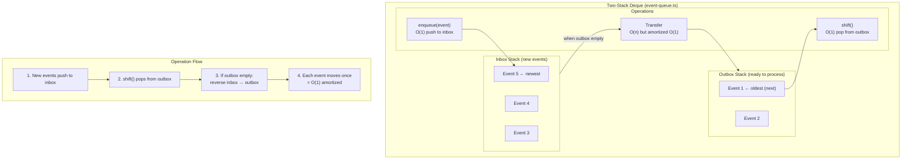

**Key Points:**
- **Push to inbox**: O(1) always
- **Pop from outbox**: O(1) when non-empty
- **Transfer**: O(n) but each element transfers exactly once
- **Amortized complexity**: O(1) per operation
- **Memory efficient**: No array shifting like `Array.shift()`

---

## 14. Event Validation Flow

Shows detailed validation before event processing:

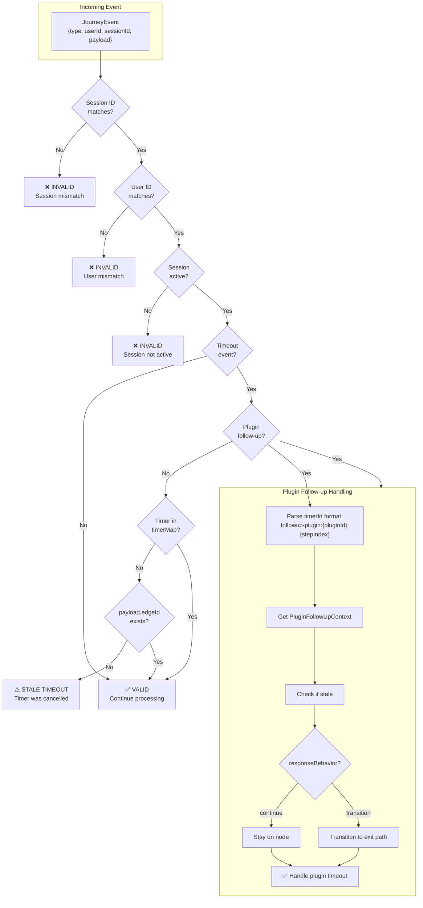

**Key Points:**
- **Three validation checks**: Session ID, User ID, Session status
- **Stale timeout detection**: Checks both timerMap and payload.edgeId
- **Plugin follow-up path**: Special handling for plugin timers
- **Fail fast**: Invalid events return early without processing

---

## 15. Button Routing Decision Tree

Shows how button clicks are routed to target nodes:

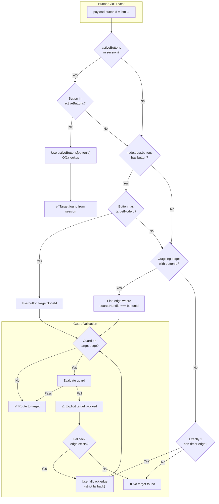

**Key Points:**
- **activeButtons**: O(1) lookup from session (set by message-handler)
- **Explicit target**: Button config can specify targetNodeId directly
- **Edge matching**: Falls back to sourceHandle matching
- **Strict fallback**: Only if exactly 1 non-timer edge exists
- **Guard validation**: Even explicit targets must pass guards

---

## 16. Message Handler Complete Flow

Shows the full message node execution including edge selection:

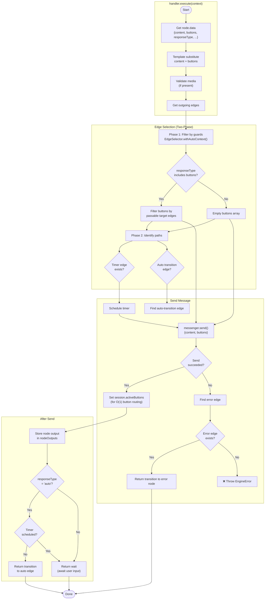

**Key Points:**
- **Two-phase edge selection**: Guards first, then categorize edges
- **Button filtering**: Only show buttons with passable target edges
- **activeButtons**: Stored in session for fast button routing
- **Auto-transition**: Only if responseType='auto' AND no timer scheduled
- **Error handling**: Explicit error edge or throw

---

## 17. Webhook Executor with Circuit Breaker

Shows webhook execution with retry, circuit breaker, and size limits:

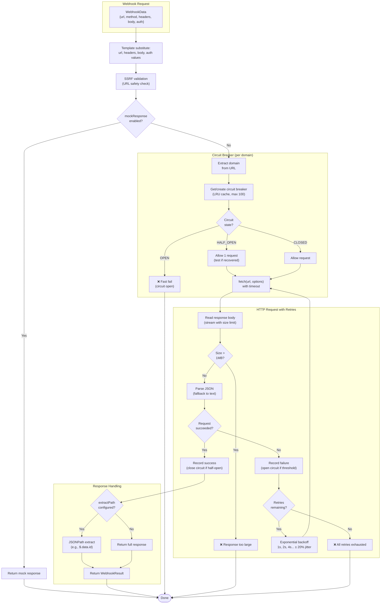

**Key Points:**
- **Circuit breaker**: Per-domain, LRU eviction at 100 domains
- **Response size limit**: 1MB default (prevents OOM)
- **Retry logic**: Exponential backoff with jitter
- **SSRF protection**: URL validation before request
- **JSONPath extraction**: Optional response data extraction

---

## 18. DLQ Retry Logic

Shows the Dead Letter Queue with exponential backoff:

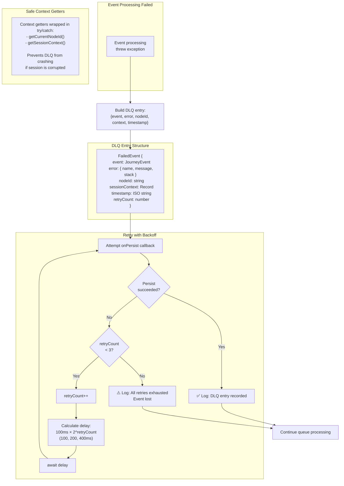

**Key Points:**
- **3 retry attempts**: 100ms, 200ms, 400ms delays
- **Exponential backoff**: Each retry doubles the delay
- **Safe getters**: Context retrieval wrapped in try/catch
- **Never blocks queue**: Even if DLQ fails, queue continues
- **Full context captured**: Event, error, node, session state

---

## 19. Middleware Pipeline Execution

Shows the middleware pipeline with priority ordering:

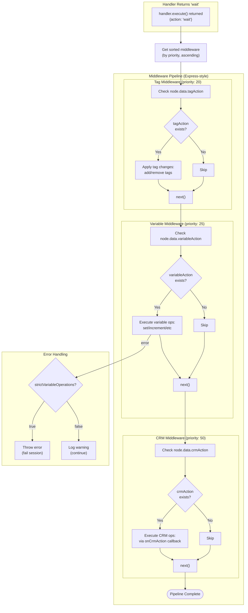

**Key Points:**
- **Priority ordering**: Lower number runs first (20 → 25 → 50)
- **Express-style**: Each middleware calls next() to continue
- **Error handling**: strictVariableOperations controls behavior
- **Side effects only**: Middleware runs after handler, applies mutations
- **Extensible**: Custom middleware can be added

---

## 20. Cross-Node Output Reference

Shows how nodes store and reference outputs:

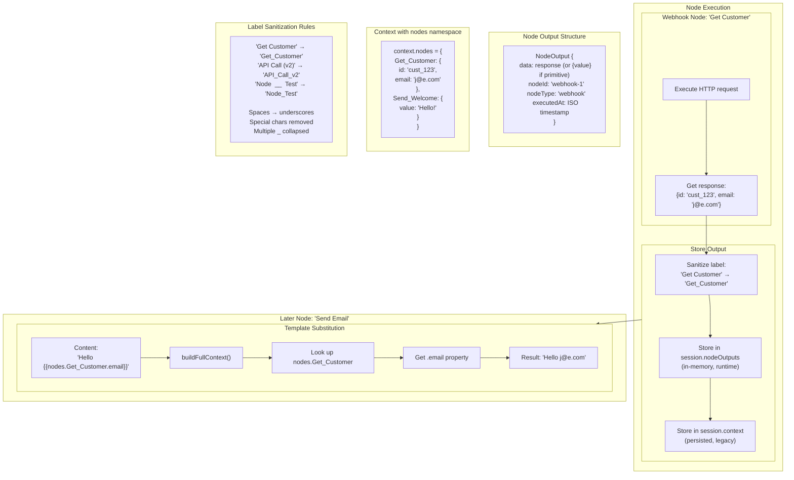

**Key Points:**
- **Label sanitization**: Converts node labels to valid identifiers
- **Dual storage**: nodeOutputs (runtime) + context (persisted)
- **Primitive wrapping**: Non-object values wrapped as `{value}`
- **Namespace access**: `nodes.Label.property` in templates
- **Execution order**: Can only reference previously executed nodes

---

## 21. Memory Model and Limits

Shows what's cached where and the size limits:

```mermaid
flowchart TB
    subgraph PerSession["Per-Session Memory"]
        subgraph InMemory["In-Memory (SessionStateManager)"]
            NodeOutputs["nodeOutputs: Map<br/>Cross-node data<br/>Grows with journey depth"]
            ActiveButtons["activeButtons: Map<br/>O(1) button routing<br/>Cleared on transition"]
            Context["context: Record<br/>Legacy + storeResponseAs<br/>Grows with stored values"]
        end

        subgraph Persisted["Persisted (session state)"]
            PendingTimers["pendingTimers[]<br/>Recovered on resume"]
            PendingPlugins["pendingPluginFollowUps[]<br/>Recovered on resume"]
            History["history[]<br/>Event log (configurable retention)"]
        end
    end

    subgraph PerEngine["Per-Engine Memory"]
        GraphIndex["GraphIndex<br/>nodeById, edgesBySource, edgeById<br/>Built once, O(nodes + edges)"]
        HandlerRegistry["HandlerRegistry<br/>~10 handlers"]
        TimerMap["timerMap: Map<br/>timerId → edgeId<br/>Cleared when timer fires"]
        PluginMap["pluginFollowUpMap: Map<br/>timerId → context<br/>Cleared when step completes"]
    end

    subgraph Global["Global Memory"]
        CircuitBreakers["domainCircuitBreakers: Map<br/>Max 100 domains (LRU)<br/>Per-domain circuit state"]
        JEXLCache["JEXL expression cache<br/>(internal to jexl library)"]
    end

    subgraph Limits["Configurable Limits"]
        QueueLimit["EventQueue.maxQueueLength<br/>Default: 1000 events"]
        ResponseLimit["WebhookExecutor.maxResponseBytes<br/>Default: 1MB"]
        LoopLimit["executeLoop.maxIterations<br/>Default: 100"]
        HistoryRetention["historyRetentionCount<br/>Default: 1000 events"]
    end

    subgraph Warnings["Memory Warnings"]
        W1["⚠️ Agent allResponses<br/>Unbounded growth<br/>TODO: Add limit"]
        W2["⚠️ Large node outputs<br/>Webhook responses stored fully<br/>Consider extractPath"]
        W3["⚠️ Many active sessions<br/>Each session holds state<br/>Clean up completed sessions"]
    end
```

**Key Points:**
- **Per-session**: nodeOutputs, activeButtons, context, timers
- **Per-engine**: GraphIndex (O(n+e)), timer maps
- **Global**: Circuit breakers (LRU 100), JEXL cache
- **Limits**: Queue 1000, response 1MB, loop 100, history 1000
- **Watch out**: Agent responses, large webhook outputs

---

## 22. Complete System Overview

Comprehensive view of all major components and their interactions:

```mermaid
flowchart TB
    subgraph External["External World"]
        User["User"]
        Platform["Platform API<br/>(Telegram, Web, etc.)"]
        Webhooks["External APIs<br/>(Webhooks)"]
        CRM["CRM System"]
    end

    subgraph Adapter["Messaging Adapter Layer"]
        MA["MessagingAdapter<br/>- sendMessage()<br/>- onMessage()<br/>- scheduleTimer()<br/>- cancelTimer()"]
    end

    User <--> Platform
    Platform <--> MA
    MA <--> Webhooks
    MA <--> CRM

    subgraph Engine["SessionEngine (Orchestrator)"]
        subgraph EventSystem["Event System"]
            EQ["EventQueue<br/>(Two-Stack Deque)"]
            ER["EventRouter<br/>(Validation + Routing)"]
            DLQ["DLQ Service<br/>(Failed Events)"]
        end

        subgraph StateLayer["State Management"]
            SSM["SessionStateManager<br/>(Version Tracking)"]
            GI["GraphIndex<br/>(O(1) Lookups)"]
            NO["Node Outputs<br/>(Cross-Node Data)"]
        end

        subgraph HandlerLayer["Node Handlers"]
            HR["HandlerRegistry"]
            SH["Start"]
            MH["Message"]
            CH["Condition"]
            WH["Wait"]
            WBH["Webhook"]
            QH["Questionnaire"]
            AH["Agent"]
            EH["End"]
        end

        subgraph ServiceLayer["Services"]
            MS["Messenger"]
            TS["Timer"]
            VS["Variable"]
            CE["ConditionEvaluator"]
            WE["WebhookExecutor"]
            TM["Template"]
            ES["EdgeSelector"]
        end

        subgraph PluginLayer["Plugin System"]
            PO["PluginOrchestrator"]
            FUP["FollowUp Plugin"]
        end

        subgraph MiddlewareLayer["Middleware Pipeline"]
            TW["Tag (p:20)"]
            VW["Variable (p:25)"]
            CW["CRM (p:50)"]
        end
    end

    MA --> EQ
    EQ --> ER
    ER --> DLQ
    ER --> SSM
    ER --> HR
    HR --> HandlerLayer
    HandlerLayer --> ServiceLayer
    ServiceLayer --> MA
    HandlerLayer --> SSM
    HandlerLayer --> NO
    HandlerLayer --> PluginLayer
    PluginLayer --> TS
    HandlerLayer --> MiddlewareLayer
    MiddlewareLayer --> VS
    MiddlewareLayer --> CRM
    CH --> CE
    WBH --> WE
    MH --> MS
    ES --> CE

    subgraph Testing["Testing Tools"]
        BR["Blade Runner<br/>(Variation Tester)"]
        JA["Journey Analyzer<br/>(Structural Validation)"]
        FT["Fuzzy Tester<br/>(Random Journeys)"]
    end

    Testing -.-> Engine
```

**Key Points:**
- **SessionEngine** is the composition root that wires everything
- **Event flow**: Adapter → Queue → Router → Handler → Services → Adapter
- **State management**: SessionStateManager + GraphIndex + NodeOutputs
- **Extensibility**: Handlers, Services, Plugins, Middleware are all pluggable
- **Testing**: Comprehensive tools for validation and path testing

---

## 23. Handler Extension Guide

Step-by-step guide for adding a new node type handler:

```mermaid
flowchart TB
    subgraph Step1["Step 1: Define Schema"]
        S1[Create MyNodeDataSchema<br/>in @journey/schemas] --> S2[Add to<br/>schemas/src/nodes/types/journey/]
        S2 --> S3[Export from index.ts]
        S3 --> S4[Add to NodeDataSchema union]
    end

    subgraph Step2["Step 2: Create Handler"]
        H1[Create my-node-handler.ts<br/>in packages/engine/src/handlers/] --> H2[Implement NodeHandler interface]
        H2 --> H3{Stateful or<br/>Stateless?}

        H3 -->|Stateless| H4[Implement execute&#40;&#41; only<br/>&#40;like message, webhook&#41;]
        H3 -->|Stateful| H5[Also implement handleEvent&#40;&#41;<br/>&#40;like questionnaire, agent&#41;]

        H4 --> H6[Return HandlerResult:<br/>wait, transition, or complete]
        H5 --> H6
    end

    subgraph Step3["Step 3: Register Handler"]
        R1[Add to handlers/index.ts<br/>defaultHandlers array] --> R2[OR pass via<br/>config.customHandlers]
        R2 --> R3[OR use handlerOverrides<br/>to replace built-in]
    end

    subgraph HandlerInterface["NodeHandler Interface"]
        IF["interface NodeHandler &#123;<br/>  nodeType: NodeType;<br/>  execute&#40;ctx&#41;: Promise&lt;HandlerResult&gt;;<br/>  handleEvent?&#40;event, ctx&#41;: Promise&lt;NodeEventResult&gt;;<br/>&#125;"]
    end

    Step1 --> Step2
    Step2 --> Step3
```

**Key Points:**
- **Schema first**: Define the node data schema before implementing the handler
- **Stateless handlers**: Only need `execute()` - most node types
- **Stateful handlers**: Also need `handleEvent()` for multi-turn interactions
- **Registration options**: Default array, customHandlers, or handlerOverrides

---

## 24. Plugin Creation Guide

How to create and register a custom plugin:

```mermaid
flowchart TB
    subgraph Definition["1. Define Plugin Handler"]
        D1[Create plugin handler file<br/>in packages/engine/src/plugins/] --> D2[Implement PluginHandler interface]
        D2 --> D3[Set pluginType identifier<br/>&#40;matches node.data.plugins[].type&#41;]
        D3 --> D4[Implement onParentExecute&#40;&#41;]
        D4 --> D5[Optionally implement onTimeout&#40;&#41;]
    end

    subgraph Interface["PluginHandler Interface"]
        IF["interface PluginHandler &#123;<br/>  pluginType: string;<br/>  onParentExecute&#40;ctx&#41;: Promise&lt;PluginResult&gt;;<br/>  onTimeout?&#40;ctx&#41;: Promise&lt;PluginTimeoutResult&gt;;<br/>&#125;"]
    end

    subgraph Results["Result Actions"]
        R1["PluginResult =<br/>  | &#123; action: 'scheduled', timerId &#125;<br/>  | &#123; action: 'noop' &#125;<br/>  | &#123; action: 'error', message &#125;"]

        R2["PluginTimeoutResult =<br/>  | &#123; action: 'continue' &#125; ← stay on node<br/>  | &#123; action: 'transition', nodeId &#125; ← exit<br/>  | &#123; action: 'complete' &#125; ← done"]
    end

    subgraph Lifecycle["Plugin Lifecycle"]
        L1[Parent node returns 'wait'] --> L2[PluginOrchestrator.invokePlugins&#40;&#41;]
        L2 --> L3[For each plugin in node.data.plugins]
        L3 --> L4[Get handler by pluginType]
        L4 --> L5[Call handler.onParentExecute&#40;&#41;]
        L5 --> L6{Result?}

        L6 -->|scheduled| L7[Timer scheduled via TimerService]
        L6 -->|noop| L8[Continue to next plugin]

        L7 --> L9[Timer fires → onTimeout&#40;&#41;]
        L9 --> L10{Continue or<br/>transition?}
        L10 -->|continue| L11[Schedule next step]
        L10 -->|transition| L12[Exit to target node]
    end

    Definition --> Lifecycle
```

**Key Points:**
- **Plugin type matching**: pluginType must match `node.data.plugins[].type`
- **Timer-based**: Plugins schedule timers via onParentExecute
- **Recovery**: State persisted in `session.pendingPluginFollowUps`
- **Built-in plugin**: `follow-up` for automated message sequences

---

## 25. Debugging Decision Tree

Where to look when things go wrong:

```mermaid
flowchart TB
    Start([Issue Detected]) --> Q1{What type<br/>of issue?}

    Q1 -->|Event not processed| E1{Check EventQueue}
    E1 --> E2[Is processing<br/>flag stuck?]
    E2 -->|Yes| E3["Previous event threw<br/>unhandled error<br/>→ Check DLQ logs"]
    E2 -->|No| E4[Is queue at<br/>max capacity?]
    E4 -->|Yes| E5["Check overflowPolicy<br/>→ Increase limit or<br/>fix slow handlers"]
    E4 -->|No| E6["Check adapter.onMessage()<br/>→ Verify callback wired"]

    Q1 -->|Node not executing| N1{Check Handler}
    N1 --> N2[Is handler registered?]
    N2 -->|No| N3["Add to customHandlers<br/>or defaultHandlers"]
    N2 -->|Yes| N4[Check execute&#40;&#41;<br/>throwing?]
    N4 -->|Yes| N5["Look for:<br/>engine:handler:error logs"]
    N4 -->|No| N6["Check session.status<br/>→ Must be 'active'"]

    Q1 -->|Timer not firing| T1{Check TimerService}
    T1 --> T2[Timer in timerMap?]
    T2 -->|No| T3["scheduleTimer&#40;&#41; failed<br/>→ Check adapter impl"]
    T2 -->|Yes| T4[Is timerScale<br/>affecting delay?]
    T4 -->|Check| T5["env.TIMER_SCALE<br/>→ 0.01 = 100x faster"]
    T4 -->|No| T6["Check for stale<br/>timeout detection"]

    Q1 -->|Plugin not triggering| P1{Check PluginOrchestrator}
    P1 --> P2[Plugin in<br/>node.data.plugins?]
    P2 -->|No| P3["Add plugin config<br/>to node data"]
    P2 -->|Yes| P4[plugin.enabled<br/>= true?]
    P4 -->|No| P5["Enable plugin"]
    P4 -->|Yes| P6["Check handler<br/>in registry"]

    Q1 -->|Guard blocking route| G1{Check EdgeSelector}
    G1 --> G2["Enable debug logs:<br/>llm.guard.blocked"]
    G2 --> G3[Check guard<br/>expression syntax]
    G3 --> G4["Verify context<br/>has required data"]
    G4 --> G5["Check fail-open<br/>policy applied"]

    Q1 -->|State not persisted| S1{Check StateManager}
    S1 --> S2["Using stateManager<br/>for mutations?"]
    S2 -->|No| S3["DON'T mutate session<br/>directly → use stateManager"]
    S2 -->|Yes| S4["Check version<br/>tracking working"]

    subgraph LogMessages["Key Log Patterns to Search"]
        L1["engine:event:rejected:disposed"]
        L2["eventQueue:processError"]
        L3["engine:noMatchingEdge"]
        L4["timer:recoveredPotentiallyStale"]
        L5["pluginOrchestrator:noHandler"]
        L6["handler:execute:error"]
    end
```

**Key Log Files:**
- `apps/api/logs/journey-error.*.log` - Error-only log (fast debugging)
- `apps/api/logs/journey.log` - Full debug log (verbose)

---

## 26. EventRouter 11-Step Pipeline

Detailed view of the 11-step event routing process:

```mermaid
flowchart TB
    subgraph Input["Incoming Event"]
        Event["JourneyEvent from adapter"]
    end

    Event --> Step1

    subgraph Steps["11 Processing Steps"]
        Step1["1️⃣ VALIDATE EVENT<br/>Check sessionId, userId, status"]
        Step1 -->|Invalid| Reject1["❌ Return early"]
        Step1 -->|Valid| Step2

        Step2["2️⃣ HANDLE PLUGIN FOLLOW-UP<br/>Check if plugin timer"]
        Step2 -->|Plugin timer| PluginPath["Handle via<br/>PluginOrchestrator"]
        Step2 -->|Regular timer| Step3

        Step3["3️⃣ CHECK STALE TIMEOUT<br/>Verify timer still in timerMap"]
        Step3 -->|Stale| Reject2["⚠️ Ignore stale timer"]
        Step3 -->|Valid| Step4

        Step4["4️⃣ GET CURRENT NODE<br/>graphIndex.getNode&#40;currentNodeId&#41;"]
        Step4 -->|Not found| Reject3["❌ Return early"]
        Step4 -->|Found| Step5

        Step5["5️⃣ LOG USER ACTION<br/>eventLogger.logEvent&#40;&#41;"]
        Step5 --> Step6

        Step6["6️⃣ CHECK RESPONSE ACCEPTANCE<br/>isResponseAccepted&#40;eventType, responseType&#41;"]
        Step6 --> Step7

        Step7["7️⃣ TRIGGER MINDSTATE ANALYSIS<br/>onMindstateAnalysis&#40;&#41; if message"]
        Step7 --> Step8

        Step8["8️⃣ STORE USER RESPONSE<br/>stateManager.setContextValue&#40;&#41;"]
        Step8 --> Step9

        Step9["9️⃣ DELEGATE TO HANDLER<br/>handler.handleEvent&#40;&#41; if exists"]
        Step9 -->|Handled| HandleDone["Handler consumed event"]
        Step9 -->|Not handled| Step10

        Step10["🔟 BUILD GUARD CONTEXT<br/>buildFullGuardContext&#40;&#41;"]
        Step10 --> Step11

        Step11["1️⃣1️⃣ FIND TARGET NODE<br/>findTargetNode&#40;event, edges, guardContext&#41;"]
        Step11 -->|Found| Transition["executeTransition&#40;&#41;"]
        Step11 -->|Not found| NoMatch["handleNoMatchingEdge&#40;&#41;"]
    end

    subgraph Transition["Execute Transition"]
        T1["Cancel timers for node"]
        T1 --> T2["Cancel plugin follow-ups"]
        T2 --> T3["onTransition&#40;targetNodeId&#41;"]
        T3 --> T4["Clear activeButtons"]
    end
```

**Key Points:**
- **Early exits**: Validation, stale timeout, missing node
- **Handler delegation**: Stateful handlers (questionnaire, agent) can consume events
- **Guard context**: Built lazily, cached for entire node execution
- **Transition cleanup**: Timers and plugin follow-ups cancelled atomically

---

## Related Documentation

- [Engine README](./README.md) - Full API documentation
- [Bindings System](./bindings-system.md) - Template and expression syntax
- [Variation Tester](./variation-tester.md) - Path testing CLI
- [Journey Analyzer](./journey-analyzer.md) - Structural validation

---

## Diagram Source

These diagrams are maintained in this file using Mermaid syntax. To edit:

1. Modify the code blocks in this file
2. Preview in a Mermaid-compatible viewer
3. Commit changes

For complex diagrams, use the [Mermaid Live Editor](https://mermaid.live/) for previewing.
