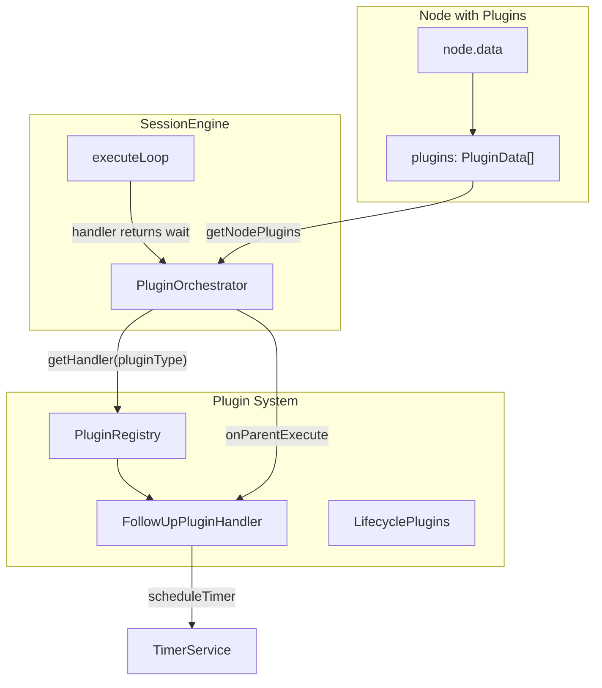
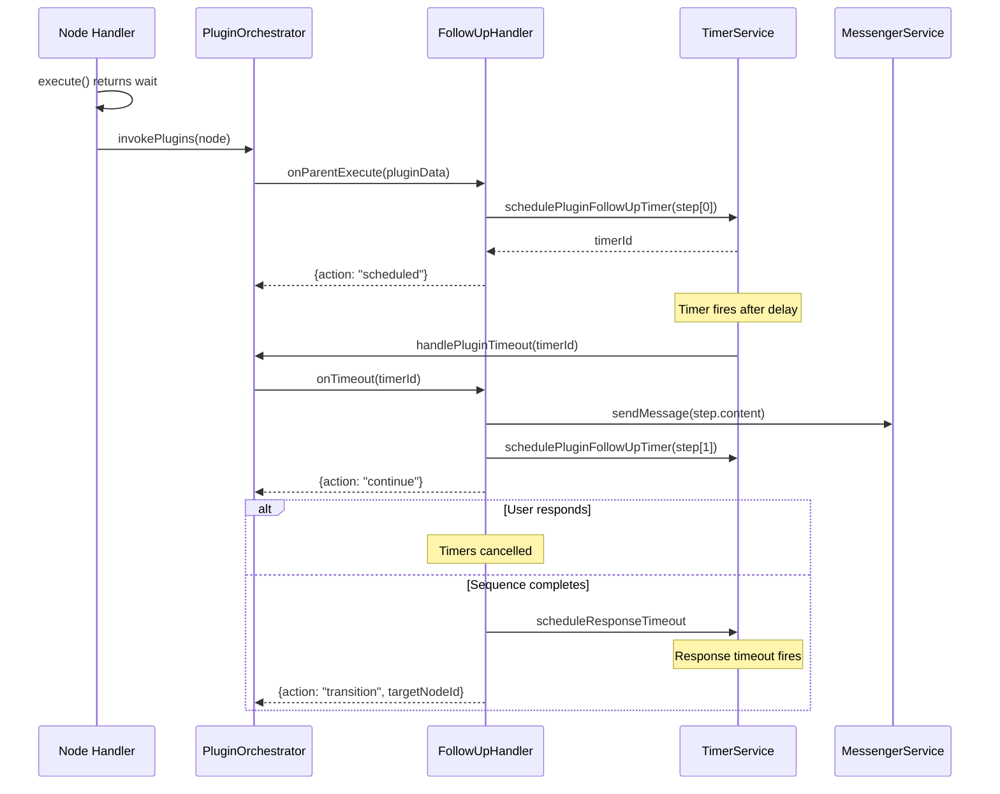

# Plugin System

The engine provides a comprehensive plugin system for extending node functionality without modifying core handlers. Plugins follow the Strategy pattern and are invoked by the PluginOrchestrator after node execution.

## Table of Contents

1. [Overview](#overview)
2. [Plugin Types](#plugin-types)
3. [Follow-Up Plugin](#follow-up-plugin)
4. [Plugin Lifecycle](#plugin-lifecycle)
5. [Creating Custom Plugins](#creating-custom-plugins)
6. [Lifecycle Plugins](#lifecycle-plugins)
7. [Debug State Providers](#debug-state-providers)

---

## Overview

Plugins extend journey nodes with additional functionality:

- **Node Plugins**: Attached to specific nodes (e.g., follow-up sequences)
- **Lifecycle Plugins**: Global observers for analytics, logging, metrics

### Architecture



### Key Components

| Component | Location | Purpose |
|-----------|----------|---------|
| `PluginOrchestrator` | `plugins/plugin-orchestrator.ts` | Manages plugin lifecycle |
| `PluginHandlerRegistry` | `plugins/registry.ts` | Stores plugin handlers by type |
| `FollowUpPluginHandler` | `plugins/follow-up-plugin-handler.ts` | Handles follow-up sequences |
| `PluginService` | `plugins/types.ts` | Interface for plugin lookups |

---

## Plugin Types

### Node Plugins (Embedded)

Plugins embedded in `node.data.plugins` array:

```typescript
interface JourneyNodeData {
  id: string;
  type: NodeType;
  data: {
    // ... node-specific data
    plugins?: PluginData[];  // Embedded plugins
  };
}
```

Each plugin has:
- `pluginType`: Type identifier (e.g., `"followup"`)
- `enabled`: Boolean to enable/disable
- Type-specific configuration

### Current Plugin Types

| Type | pluginType | Purpose |
|------|------------|---------|
| Follow-Up | `"followup"` | Scheduled follow-up message sequences |

---

## Follow-Up Plugin

The follow-up plugin sends scheduled messages after a node executes, typically used for re-engagement when users don't respond.

### Configuration

```typescript
interface FollowUpPluginData {
  pluginType: "followup";
  enabled: boolean;

  // Sequence of follow-up steps
  steps: FollowUpStep[];

  // Exit behavior after sequence completes
  exitPath?: {
    nodeId: string;      // Target node after sequence
    timeout?: Duration;  // Wait time before exit (default: 59s)
  };

  // Cancel all pending follow-ups on any user response
  cancelOnAnyResponse?: boolean;

  // AI enhancement (optional)
  ai?: FollowUpAiConfig;
}

interface FollowUpStep {
  delay: Duration;           // Time before sending this step
  content: string;           // Message content (or AI instructions)
  fallbackContent?: string;  // Fallback if AI fails
  buttons?: FollowUpButton[];
  media?: Media;
  exitOnTimeout?: boolean;   // Exit sequence after this step
}
```

### Execution Flow



### Timer Types

The follow-up plugin uses two timer types:

| Timer Type | Purpose | Fires When |
|------------|---------|------------|
| `"send"` | Delay BEFORE sending message | Time elapses before step |
| `"response"` | Wait AFTER sending for response | User doesn't respond in time |

### AI Enhancement

When `ai.enabled = true`:

```typescript
interface FollowUpAiConfig {
  enabled: boolean;
  model?: string;              // Default: PRIMARY_MODEL
  includeUserProfile?: boolean;  // Include user context
  includeNodeContext?: boolean;  // Include parent node output
  includeSessionContext?: boolean;
  customContext?: string;      // Custom template
}
```

The step content becomes AI instructions, and the LLM generates personalized messages.

### Example Configuration

```json
{
  "pluginType": "followup",
  "enabled": true,
  "steps": [
    {
      "delay": { "value": 5, "unit": "minutes" },
      "content": "Hey {{user.firstName}}, still there? 👋"
    },
    {
      "delay": { "value": 1, "unit": "hours" },
      "content": "Just checking in! Let me know if you have questions.",
      "exitOnTimeout": true
    }
  ],
  "exitPath": {
    "nodeId": "dropoff-node",
    "timeout": { "value": 60, "unit": "seconds" }
  },
  "cancelOnAnyResponse": true
}
```

---

## Plugin Lifecycle

### Invocation

Plugins are invoked when a handler returns `{action: "wait"}`:

```typescript
// In SessionEngine.executeLoop()
const result = await handler.execute(context);

if (result.action === "wait") {
  // Run middleware pipeline
  await middlewarePipeline.execute(context, handlerResult);

  // Invoke plugins AFTER middleware
  await pluginOrchestrator.invokePlugins(node, context);
}
```

### State Persistence

Plugin state is persisted in session for recovery:

```typescript
interface EnhancedUserJourney {
  // Plugin follow-up timers (recovered on resume)
  pendingPluginFollowUps: PendingPluginFollowUp[];
}

interface PendingPluginFollowUp {
  timerId: string;
  pluginId: string;      // "{parentNodeId}-plugin-{index}"
  parentNodeId: string;
  stepIndex: number;
  triggersAt: string;    // ISO timestamp
  sequence: FollowUpSequence;
  timerType: "send" | "response";
}
```

### Recovery on Resume

When engine resumes, the TimerService rebuilds the in-memory map:

```typescript
// In TimerService constructor
function recoverPluginFollowUps(pendingFollowUps: PendingPluginFollowUp[]) {
  for (const followUp of pendingFollowUps) {
    pluginFollowUpMap.set(followUp.timerId, {
      pluginId: followUp.pluginId,
      parentNodeId: followUp.parentNodeId,
      pluginIndex: 0,
      stepIndex: followUp.stepIndex,
      sequence: followUp.sequence,
      timerType: followUp.timerType,
    });
  }
}
```

---

## Creating Custom Plugins

### Plugin Handler Interface

```typescript
interface PluginHandler<T extends PluginData = PluginData> {
  /** Plugin type identifier */
  readonly pluginType: string;

  /**
   * Called when parent node executes.
   */
  onParentExecute(
    pluginData: T,
    parentNodeId: string,
    pluginIndex: number,
    context: PluginExecutionContext
  ): Promise<PluginExecuteResult>;

  /**
   * Handle timeout (optional).
   */
  onTimeout?(
    timerId: string,
    context: PluginExecutionContext
  ): Promise<PluginTimeoutResult>;
}
```

### Result Types

```typescript
// From onParentExecute
type PluginExecuteResult =
  | { action: "scheduled"; timerId: string }
  | { action: "noop" }
  | { action: "error"; message: string };

// From onTimeout
type PluginTimeoutResult =
  | { action: "continue" }
  | { action: "transition"; targetNodeId: string; trigger: string }
  | { action: "complete" };
```

### Execution Context

```typescript
interface PluginExecutionContext {
  session: EnhancedUserJourney;
  stateManager: SessionStateManager;
  adapter: MessagingAdapter;
  services: EngineServices;
  log: Logger;
  organizationId?: string;
  pluginService: PluginService;
}
```

### Example: Custom Notification Plugin

```typescript
class NotificationPluginHandler implements PluginHandler<NotificationPluginData> {
  readonly pluginType = "notification";

  async onParentExecute(
    pluginData: NotificationPluginData,
    parentNodeId: string,
    pluginIndex: number,
    context: PluginExecutionContext
  ): Promise<PluginExecuteResult> {
    const { services, log } = context;

    if (!pluginData.enabled) {
      return { action: "noop" };
    }

    // Send push notification via external service
    await sendPushNotification(pluginData.message, context.session.userId);

    log.info({ parentNodeId }, "notification:sent");
    return { action: "noop" };  // No timer needed
  }
}
```

### Registering Custom Plugins

```typescript
const registry = new PluginHandlerRegistry(log);
registry.register(new NotificationPluginHandler());

const orchestrator = new PluginOrchestrator({
  // ... other deps
  registry,
});
```

---

## Lifecycle Plugins

Lifecycle plugins observe journey execution without modifying behavior. Use for analytics, logging, and metrics.

### Interface

```typescript
interface LifecyclePlugin {
  readonly name: string;

  onEvent(
    event: LifecycleEvent,
    context: LifecyclePluginContext
  ): Promise<void> | void;

  onInit?(): Promise<void> | void;
  onDestroy?(): Promise<void> | void;
}
```

### Event Types

```typescript
type LifecycleEventType =
  | "session:start"
  | "session:complete"
  | "session:error"
  | "node:enter"
  | "node:exit"
  | "transition"
  | "message:sent"
  | "message:received";
```

### Example: Analytics Plugin

```typescript
const analyticsPlugin: LifecyclePlugin = {
  name: "analytics",

  async onEvent(event, context) {
    switch (event.type) {
      case "node:exit":
        await trackNodeCompletion(event.nodeId, event.durationMs);
        break;
      case "session:complete":
        await trackSessionCompletion(context.session.sessionId);
        break;
    }
  },

  async onInit() {
    await initializeAnalyticsClient();
  },

  async onDestroy() {
    await flushAnalyticsBatch();
  },
};
```

### Context

Lifecycle plugins receive read-only context:

```typescript
interface LifecyclePluginContext {
  session: Readonly<EnhancedUserJourney>;
  log: Logger;
}
```

---

## Debug State Providers

For simulator UI integration, plugins can expose debug state.

### Interface

```typescript
interface PluginDebugStateProvider<TSessionState, TDebugState> {
  readonly pluginType: string;
  readonly sessionStateKey: keyof EnhancedUserJourney;

  extractDebugState(sessionState: TSessionState): TDebugState;
}
```

### Follow-Up Debug Provider

```typescript
const followUpDebugStateProvider: PluginDebugStateProvider<
  EnhancedUserJourney["pendingPluginFollowUps"],
  FollowUpDebugState[] | undefined
> = {
  pluginType: "followup",
  sessionStateKey: "pendingPluginFollowUps",

  extractDebugState(state) {
    return state?.map(fu => ({
      timerId: fu.timerId,
      pluginId: fu.pluginId,
      parentNodeId: fu.parentNodeId,
      stepIndex: fu.stepIndex,
      totalSteps: fu.sequence.steps.length,
      triggersAt: fu.triggersAt,
      timerType: fu.timerType,
    }));
  },
};
```

---

## Related Documentation

- [Architecture Diagrams](./architecture-diagrams.md) - Visual plugin flow diagrams
- [Timer and Plugin System](./architecture-diagrams.md#5-timer-and-plugin-system) - Detailed timer interaction
- [Bindings System](./bindings-system.md) - Template variables in plugin content
