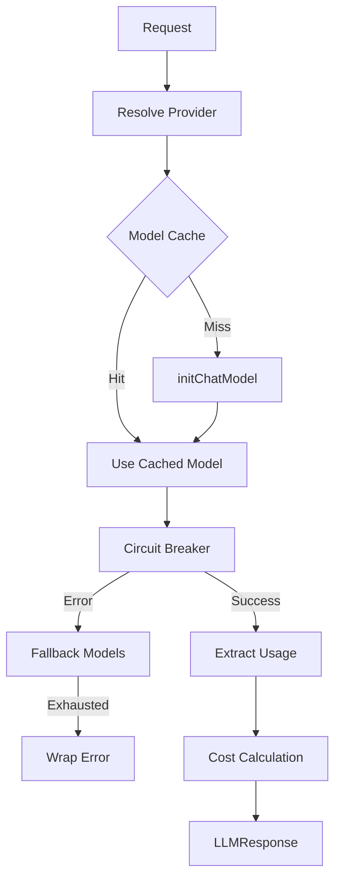
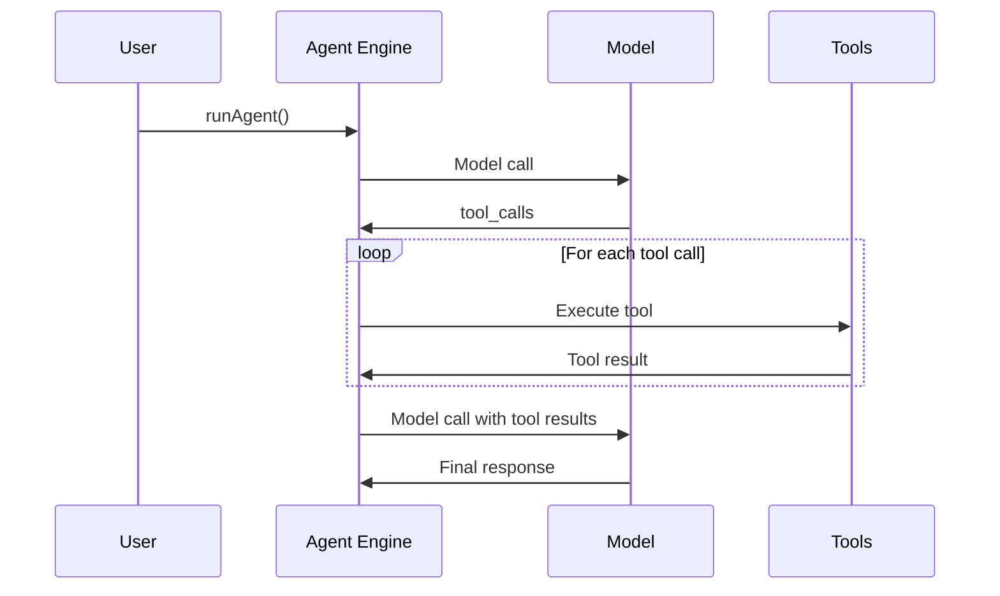
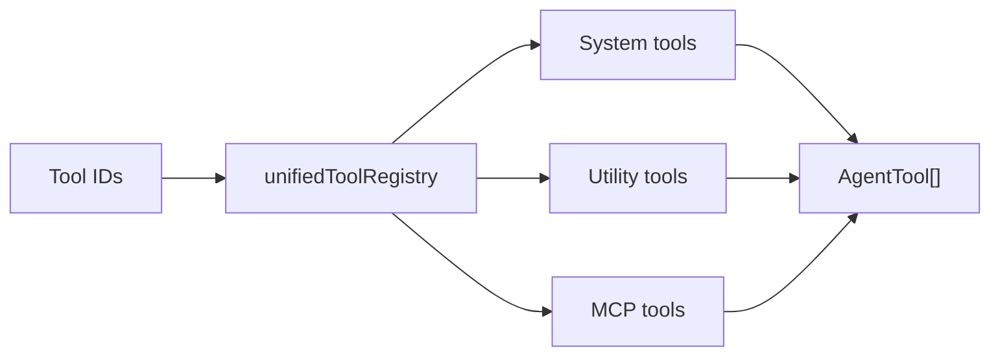

# LLM Package Architecture

Architecture notes for `@journey/llm` covering provider routing, model runtime, tools, middleware, and workflow execution.

## Design Patterns

### 1. Provider Resolution

Provider is resolved in this order (shared by llm-service and agent runtime):

1. `LLMConfig.provider` (explicit)
2. `getModelRegistryAdapter().getModel()` (authoritative metadata via adapter)

For models not in the registry, pass the provider explicitly or let LangChain handle inference. The model registry is the single source of truth for provider mapping - no magic string matching is used.

Fallback model calls clear the provider to enable auto-detection for cross-provider fallbacks (e.g., OpenAI → Anthropic).

### 1.5. Adapter Pattern: Model Registry & Usage Tracking

Both model registry and usage tracking use a **global adapter context pattern** to separate core logic from infrastructure dependencies.

#### Model Registry Adapter

The `ModelRegistryAdapter` interface abstracts model metadata lookup from storage mechanism:

```typescript
interface ModelRegistryAdapter {
  getModel(modelId: string): ModelMetadata | undefined;
  getModels(): ModelMetadata[];
  calculateCost(modelId: string, inputTokens: number, outputTokens: number): number;
  isReady?(): boolean;
}
```

Implementations:
- **NoopModelAdapter** - Fallback with empty metadata (used when registry unavailable)
- **EssentialModelAdapter** - Bundled ~12 essential models (~10KB) for all environments (edge/browser and server)

Core services (llm-service, embedding-service, guard-service, agent runtime) use `getModelRegistryAdapter()` to query models without Node.js dependencies. This enables portable `@journey/llm/core`.

#### Usage Tracking Adapter

Similarly, usage tracking decouples core logging from database access:

```typescript
interface UsageTrackingAdapter {
  recordUsage(usage: TokenUsage, context: UsageContext): Promise<void>;
  isReady?(): boolean;
}
```

Implementations:
- **NoopUsageAdapter** - Discards usage (used in edge/portable environments)
- **DatabaseUsageAdapter** (server-only) - Records to PostgreSQL

**Initialization** (in API at startup):
```typescript
import { initializeServerServices } from "@journey/llm/server";
initializeServerServices(); // Sets adapters and initializes services
```

### 2. Circuit Breaker

`@journey/infra` wraps all model calls to protect the system from cascading failures.
Both the LLM service and agent runtime use circuit breakers.

```
Closed -> Open when error rate exceeds threshold
Open -> HalfOpen after timeout
HalfOpen -> Closed on success, Open on failure
```

### 3. Model Cache (Unified Runtime)

A single consolidated runtime module (`packages/llm/src/runtime/model-runtime.ts`) manages all model creation, caching, and invocation. Models are cached by a composite key including **all** behavioral parameters:

- model identifier
- provider (with 2-tier resolution: explicit → registry lookup)
- temperature (or reasoningEffort for reasoning models)
- maxTokens
- **topP** (nucleus sampling) ← includes all sampling params
- **frequencyPenalty** (repetition penalty)
- **presencePenalty** (topic diversity)
- maxRetries
- timeout

This cache key fix ensures that models with different sampling parameters are cached separately, preventing incorrect model reuse.

**Token Cost Calculation**: Cost is calculated per-iteration by `extractTokenUsage()` and accumulated correctly by `addTokenUsage()` - NOT recalculated globally. This ensures accurate cost tracking in multi-model scenarios (e.g., primary model fails → fallback model is used).

### 4. Structured Output Strategy

Structured output uses provider-aware defaults:

- OpenAI: JSON schema
- Others: function calling

Google GenAI schemas are sanitized before use to avoid unsupported constructs. When tools are present, `runAgent` injects a `__final_response__` tool to capture structured output.

### 5. Unified Tool Registry

Tools are unified under one registry with normalized IDs:

- `system:` for context-aware tools (services + session)
- `utility:` for embedded tools
- `mcp:` for MCP tools (external service)

`@journey/llm/tools/unified` auto-registers system + journey tools and imports `../embedded` to auto-register utility tools. MCP tool definitions are fetched via `@journey/mcp` with a short cache TTL.

### 6. Agent Engine (`runAgent`)

`runAgent` is the unified agent runtime that handles:

1. Middleware composition (array passed to config)
2. Middleware hooks (beforeModel, afterModel, wrapModelCall, wrapToolCall)
3. Model call with error handling
4. Tool execution loop (parallel by default)
5. Final response assembly

### 7. Middleware Pipeline

Middleware is passed as an array to `runAgent` and composed internally:

- beforeAgent -> beforeModel -> wrapModelCall -> afterModel -> wrapToolCall -> afterAgent
- Built-ins: fallback, call limits, PII, summarization, todo list, HITL, usage tracking, guard
- Priority ordering: lower numbers run first

### 8. Error Classification

Errors are wrapped into typed `LLMError` classes and classified via provider-aware detectors. `classifyError()` and `isRetryableError()` drive retry/fallback behavior.

### 9. Workflow Runtime

Workflow runner executes a DAG of nodes and supports:

- variable resolution and safe expressions
- conditional branching
- guard blocking
- user approval pause/resume
- tool execution nodes (context, MCP, guard)

`runWorkflow` emits lifecycle events when `context.emit` is provided.

### 10. Shared Runtime Utilities

Provider resolution, token extraction, and model cache key generation are centralized in `packages/llm/src/runtime/model-runtime.ts` to eliminate duplication:

- `resolveProvider()` - 2-tier provider resolution (explicit config → registry lookup)
- `extractTokenUsage()` - Token extraction schemas for all provider response formats
- `getModelCacheKey()` - Composite key generation for model caching
- `isMockModel()` - Test model detection

Both LLM service and agent runtime use these shared functions to ensure consistent behavior.

### 11. Configuration and Sampling Parameters

The `LLMConfig` interface supports fine-grained model control with the following sampling parameters:

```typescript
interface LLMConfig {
  model: string;           // Model ID
  provider?: LLMProvider;  // Explicit provider override
  temperature?: number;    // Sampling temperature (0-2)
  maxTokens?: number;      // Maximum output tokens
  topP?: number;           // Nucleus sampling (0-1)
  frequencyPenalty?: number; // Repetition penalty (-2 to 2)
  presencePenalty?: number;  // Topic diversity penalty (-2 to 2)
  // ... other fields
}
```

**Propagation**: All parameters are passed through `buildModelConfig()` in the agent runtime and properly included in the model cache key. This ensures different sampling configurations create distinct model instances.

**Agent Usage**:
```typescript
const result = await runAgent({
  model: "gpt-4o",
  temperature: 0.8,
  topP: 0.9,           // Nucleus sampling
  frequencyPenalty: 0.5, // Reduce repetition
  tools: [...],
  messages: [...],
});
```

**Fallback Behavior**: When fallback occurs, sampling parameters are preserved while provider is cleared for auto-detection.

### 12. Package Boundaries

The `@journey/llm` package is split into multiple entry points following dependency boundaries:

**`@journey/llm/core`** (portable - no Node.js):
- LLM service (chat, streaming, structured output)
- Agent runtime (agent engine, middleware, model runtime)
- Tool system (unified registry, system tools, utility tools)
- Workflow runtime (DAG execution, guards, nodes)
- Middleware (pipeline, built-in middleware classes)
- Embedding service
- Error classification

Uses `ModelRegistryAdapter` for model lookups (injected at runtime).

**`@journey/llm/server`** (Node.js-only):
- FileSystemModelAdapter - loads full registry from `essential-models.ts`
- Usage tracking service with database persistence
- Audio service (speech synthesis, transcription) with temp files
- MCP client integration

**`@journey/llm`** (main):
- Re-exports all core functionality
- For browser: import from `@journey/llm/core`
- For server: import from `@journey/llm` or `@journey/llm/server` as needed

**Import Rules**:
- Browser/Edge: Use `@journey/llm/core` directly
- Backend services: Use `@journey/llm` for convenience, but server components must be initialized
- Tests: Mock adapters can be injected without file system access

This separation enables portable LLM functionality while isolating server dependencies and enabling dependency injection for testability.

---

## Data Flow Diagrams

### LLM Request Flow



### Agent + Tools



### Unified Tool Resolution



---

## Module Map

```
agent/          # Unified agent engine + model runtime
services/       # LLM, agent, guards, audio, embeddings
middleware/     # Pipeline + built-ins
tools/          # Unified registry, system tools, utility tools
workflow/       # DAG runtime + executors
errors/         # Error classification
config/         # Defaults + model registry JSON
```
