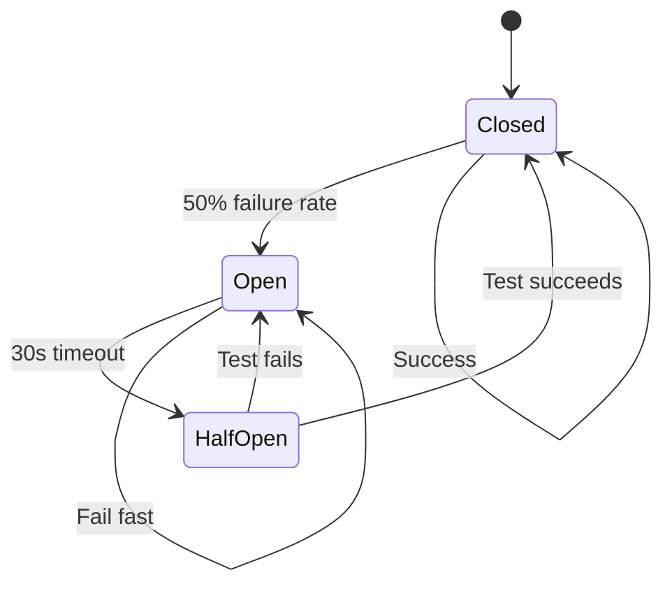
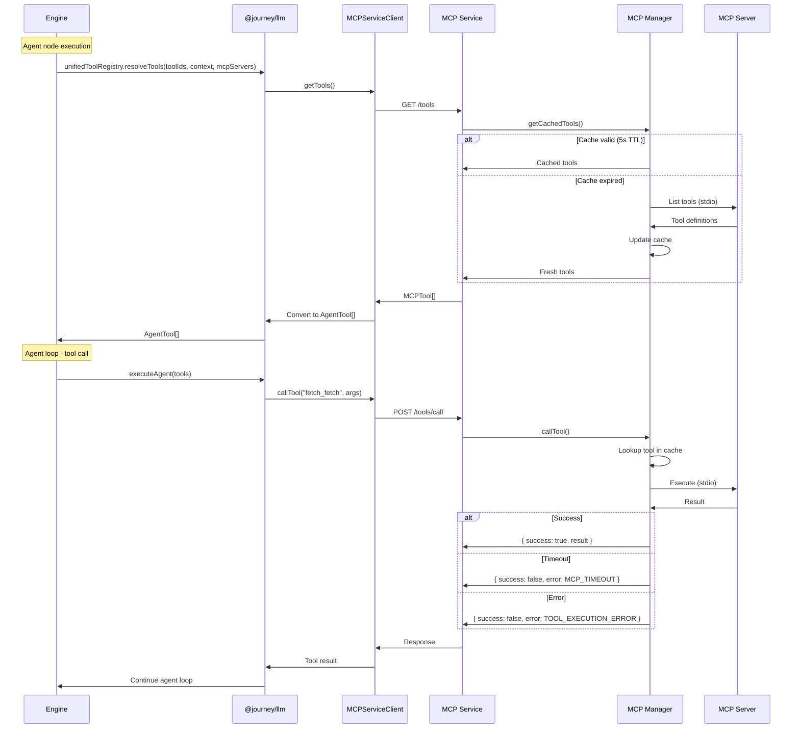

# MCP Architecture

Standalone Model Context Protocol (MCP) service providing tool isolation, fault tolerance, and language-agnostic server support.

## Why Standalone Service?

```
┌─────────────────────────────────────────────────────────────────────────────┐
│                     Benefits of Standalone Architecture                      │
├─────────────────────────────────────────────────────────────────────────────┤
│                                                                              │
│   ┌───────────────────┐     ┌───────────────────┐     ┌───────────────────┐ │
│   │ Process Isolation │     │ Independent       │     │ Language          │ │
│   │                   │     │ Lifecycle         │     │ Agnostic          │ │
│   │ MCP crashes don't │     │                   │     │                   │ │
│   │ affect main API   │     │ Restart MCP       │     │ Python, Node,     │ │
│   │                   │     │ without API       │     │ Rust, Go servers  │ │
│   │ Failures isolated │     │ downtime          │     │                   │ │
│   └───────────────────┘     └───────────────────┘     └───────────────────┘ │
│                                                                              │
│   ┌───────────────────┐     ┌───────────────────┐     ┌───────────────────┐ │
│   │ Clean Separation  │     │ Hot-Swappable     │     │ Independent       │ │
│   │                   │     │ Tools             │     │ Scaling           │ │
│   │ API focuses on    │     │                   │     │                   │ │
│   │ business logic    │     │ Enable/disable    │     │ Scale MCP         │ │
│   │                   │     │ via env vars      │     │ separately        │ │
│   │ MCP on tools      │     │                   │     │ from API          │ │
│   └───────────────────┘     └───────────────────┘     └───────────────────┘ │
│                                                                              │
└─────────────────────────────────────────────────────────────────────────────┘
```

## System Overview

```
┌─────────────────────────────────────────────────────────────────────────────┐
│                         Journey Builder System                               │
├─────────────────────────────────────────────────────────────────────────────┤
│                                                                              │
│  ┌───────────────────────┐                ┌─────────────────────────────┐   │
│  │    Journey API        │                │      MCP Service            │   │
│  │    (port 3001)        │                │      (port 3002)            │   │
│  │                       │                │                             │   │
│  │  ┌─────────────────┐  │    HTTP        │  ┌───────────────────────┐ │   │
│  │  │                 │  │◄──────────────►│  │     MCP Manager       │ │   │
│  │  │  @journey/llm   │  │                │  │                       │ │   │
│  │  │                 │  │  GET /tools    │  │  • Server lifecycle   │ │   │
│  │  │  Agent Service  │  │  POST /call    │  │  • Tool caching       │ │   │
│  │  │                 │  │  GET /health   │  │  • Error handling     │ │   │
│  │  └─────────────────┘  │                │  └───────────┬───────────┘ │   │
│  │                       │                │              │             │   │
│  │  ┌─────────────────┐  │                │     ┌────────┴────────┐   │   │
│  │  │ MCPServiceClient│  │                │     │                 │   │   │
│  │  │                 │  │                │   ┌─┴─┐  ┌───┐  ┌───┐ │   │   │
│  │  │ Circuit Breaker │  │                │   │ F │  │FS │  │...│ │   │   │
│  │  └─────────────────┘  │                │   └───┘  └───┘  └───┘ │   │   │
│  └───────────────────────┘                │    MCP Servers (stdio) │   │   │
│                                           └─────────────────────────────┘   │
└─────────────────────────────────────────────────────────────────────────────┘

Legend:
  F  = Fetch Server (Python)
  FS = Filesystem Server (Node.js)
```

## Two-Component Design

### 1. MCP Service (`apps/mcp`)

Standalone HTTP service managing MCP server lifecycle.

```
apps/mcp/
├── src/
│   ├── index.ts              # Entry point, lifecycle
│   ├── app.ts                # Hono application factory
│   ├── config/
│   │   └── mcp-servers.ts    # Server configuration
│   ├── routes/
│   │   ├── health.ts         # Health check endpoint
│   │   ├── tools.ts          # Tool listing and execution
│   │   ├── prompts.ts        # Prompt listing + retrieval
│   │   ├── resources.ts      # Resource listing + read
│   │   └── servers.ts        # Server status endpoint
│   ├── services/
│   │   └── mcp-manager.ts    # Core lifecycle management
│   └── utils/
│       └── timeout.ts        # Timeout utilities
└── package.json
```

**Key Dependencies:**
- `@langchain/mcp-adapters` - MCP server management
- `hono` - Lightweight HTTP framework
- `@journey/infra` - Circuit breaker, utilities

### 2. MCP Shared Library (`packages/mcp`)

Shared types and HTTP client for consuming the service.

```
packages/mcp/
├── src/
│   ├── client/
│   │   └── mcp-service-client.ts  # HTTP client
│   ├── types/
│   │   ├── mcp-server.ts          # Server config types
│   │   └── mcp-client.ts          # Client types
│   └── index.ts                   # Public exports
└── package.json
```

---

## Tool IDs in @journey/llm

MCP tools are surfaced through the unified registry with IDs in the form `mcp:{server}:{tool}` (for example `mcp:fetch:fetch`). The registry and MCP loader convert MCP tool definitions into `AgentTool` entries for agent execution.

## HTTP API

### Endpoints

| Method | Path | Description |
|--------|------|-------------|
| `GET` | `/` | Service metadata + endpoint list |
| `GET` | `/health` | Health check with server status |
| `GET` | `/tools` | List all available tools |
| `POST` | `/tools/list` | List tools with server filters/options |
| `POST` | `/tools/call` | Execute a tool |
| `GET` | `/prompts` | List all prompts |
| `POST` | `/prompts/list` | List prompts with server filters/options |
| `POST` | `/prompts/get` | Fetch a prompt by name |
| `GET` | `/resources` | List all resources |
| `POST` | `/resources/list` | List resources with server filters/options |
| `POST` | `/resources/read` | Read a resource by URI |
| `GET` | `/resource-templates` | List all resource templates |
| `POST` | `/resource-templates/list` | List resource templates with server filters/options |
| `GET` | `/servers` | List configured servers |

### Health Check

```http
GET /health
```

Response:
```json
{
  "status": "healthy",
  "servers": [
    {
      "name": "fetch",
      "status": "connected",
      "toolCount": 1
    },
    {
      "name": "filesystem",
      "status": "disconnected",
      "toolCount": 0
    }
  ],
  "timestamp": "2024-12-19T10:30:00.000Z"
}
```

**Status Values:**
| Status | Meaning |
|--------|---------|
| `healthy` | All servers connected |
| `degraded` | Some servers failed |
| `unhealthy` | Not initialized |

### List Tools

```http
GET /tools
```

Response:
```json
{
  "tools": [
    {
      "name": "fetch_fetch",
      "description": "Fetch web content and convert to markdown",
      "schema": {
        "type": "object",
        "properties": {
          "url": { "type": "string" }
        },
        "required": ["url"]
      },
      "serverName": "fetch"
    }
  ],
  "count": 1
}
```

### List Tools (with filters/options)

```http
POST /tools/list
Content-Type: application/json

{
  "servers": ["fetch"],
  "options": { "headers": { "Authorization": "Bearer ..." } }
}
```

### Execute Tool

```http
POST /tools/call
Content-Type: application/json

{
  "toolName": "fetch_fetch",
  "args": {
    "url": "https://example.com"
  }
}
```

Success Response (200):
```json
{
  "success": true,
  "result": "# Example Domain\n\nThis domain is for...",
  "executionTimeMs": 1234
}
```

Error Response (4xx/5xx):
```json
{
  "success": false,
  "error": {
    "code": "TOOL_NOT_FOUND",
    "message": "Tool 'invalid_tool' not found"
  },
  "executionTimeMs": 5
}
```

### Prompts

```http
GET /prompts
```

```http
POST /prompts/list
Content-Type: application/json

{
  "servers": ["fetch"],
  "options": { "headers": { "Authorization": "Bearer ..." } }
}
```

```http
POST /prompts/get
Content-Type: application/json

{
  "serverName": "fetch",
  "name": "summarize",
  "args": { "tone": "neutral" }
}
```

### Resources

```http
GET /resources
```

```http
POST /resources/list
Content-Type: application/json

{
  "servers": ["filesystem"]
}
```

```http
POST /resources/read
Content-Type: application/json

{
  "serverName": "filesystem",
  "uri": "file:///data/example.txt"
}
```

```http
GET /resource-templates
```

```http
POST /resource-templates/list
Content-Type: application/json

{
  "servers": ["filesystem"]
}
```

### Error Codes

| HTTP | Code | Description |
|------|------|-------------|
| 400 | `INVALID_JSON` | Invalid request body |
| 400 | `INVALID_REQUEST` | Missing/invalid toolName |
| 404 | `TOOL_NOT_FOUND` | Tool doesn't exist |
| 500 | `MCP_NOT_INITIALIZED` | Manager not ready |
| 500 | `TOOL_EXECUTION_ERROR` | Tool threw exception |
| 504 | `MCP_TIMEOUT` | Tool exceeded 30s timeout |

---

## Server Configuration

### Transport Types

```typescript
// Stdio transport (local subprocesses)
interface MCPStdioServerConfig {
  transport: "stdio";
  command: string;              // e.g., "npx", "uvx", "node"
  args?: string[];              // Command arguments
  env?: Record<string, string>; // Environment variables
}

// HTTP transport (remote servers)
interface MCPHttpServerConfig {
  transport: "http" | "sse";
  url: string;                  // Server URL
  headers?: Record<string, string>; // Auth headers
}
```

Note: `streamable_http` is accepted in `MCP_REMOTE_SERVERS` and normalized to `http`.

### Environment Variables

```bash
# MCP Service Configuration
PORT=3002
LOG_LEVEL=info
CORS_ORIGINS=http://localhost:3001,http://localhost:3000
API_URL=http://localhost:3001

# Server Enable/Disable
MCP_FETCH_ENABLED=true
MCP_FILESYSTEM_ENABLED=true
MCP_FILESYSTEM_PATHS=/allowed/path1,/allowed/path2
MCP_REMOTE_SERVERS='[{"name":"remote","url":"https://mcp.example.com","transport":"http","headers":{"Authorization":"Bearer ..."}}]'

# From API side
MCP_SERVICE_URL=http://localhost:3002
MCP_SERVICE_TIMEOUT=30000
```

`MCP_REMOTE_SERVERS` accepts a JSON array or map; `transport` supports `http`, `sse`, and `streamable_http` (normalized to `http`).

### Available Servers

#### Fetch Server

| Property | Value |
|----------|-------|
| **Name** | `fetch` |
| **Package** | `mcp-server-fetch` (Anthropic official) |
| **Runtime** | Python via `uvx` |
| **Enable** | `MCP_FETCH_ENABLED=true` |

**Tools Provided:**
- `fetch_fetch` - Fetch URL and convert to markdown

#### Filesystem Server

| Property | Value |
|----------|-------|
| **Name** | `filesystem` |
| **Package** | `@modelcontextprotocol/server-filesystem` |
| **Runtime** | Node.js via `npx` |
| **Enable** | `MCP_FILESYSTEM_ENABLED=true` |
| **Paths** | `MCP_FILESYSTEM_PATHS` (comma-separated) |

**Tools Provided:**
- `filesystem_read` - Read file contents
- `filesystem_write` - Write to files
- `filesystem_list` - List directory

---

## Client Integration

### MCPServiceClient

Singleton HTTP client with circuit breaker protection.

```typescript
import {
  initMCPServiceClient,
  getMCPServiceClient
} from "@journey/mcp";

// Initialize once at startup
initMCPServiceClient({
  baseUrl: process.env.MCP_SERVICE_URL || "http://localhost:3002",
  timeout: 30000,
  circuitBreakerEnabled: true,
  circuitBreaker: {
    errorThresholdPercentage: 50,
    resetTimeout: 30000
  }
});

// Use anywhere
const client = getMCPServiceClient();

// Get available tools
const tools = await client.getTools();

// Execute a tool
const result = await client.callTool({
  toolName: "fetch_fetch",
  args: { url: "https://example.com" }
});

// Check health
const health = await client.getHealth();
const isAvailable = await client.isAvailable();
```

### Circuit Breaker



**Behavior:**
- **Closed**: Normal operation, requests flow through
- **Open**: Fail fast, no network calls (service unavailable)
- **Half-Open**: Single request allowed to test recovery

---

## Integration Flow



---

## Fault Tolerance

### Graceful Degradation

```
┌─────────────────────────────────────────────────────────────────────────────┐
│                         Failure Scenarios                                    │
├─────────────────────────────────────────────────────────────────────────────┤
│                                                                              │
│   Scenario 1: MCP Service Unavailable                                        │
│   ─────────────────────────────────────                                      │
│   API → HTTP GET /tools (timeout/connection error)                           │
│     → Circuit breaker OPEN                                                   │
│     → Return empty tools[]                                                   │
│     → Agent uses embedded tools only                                         │
│     → Request succeeds with reduced capabilities                             │
│                                                                              │
│   Scenario 2: MCP Server (Fetch) Crashes                                     │
│   ────────────────────────────────────────                                   │
│   MCP Service detects no tools from fetch server                             │
│     → Health endpoint shows "degraded"                                       │
│     → Still serves other servers' tools                                      │
│     → fetch tools unavailable, filesystem works                              │
│                                                                              │
│   Scenario 3: Tool Execution Timeout                                         │
│   ──────────────────────────────────────                                     │
│   Tool execution exceeds 30 seconds                                          │
│     → withTimeout() rejects promise                                          │
│     → Error caught and wrapped                                               │
│     → HTTP 504 Gateway Timeout response                                      │
│     → Agent loop continues with error message                                │
│                                                                              │
│   Scenario 4: Circuit Breaker Open                                           │
│   ──────────────────────────────────                                         │
│   50% of recent requests failed                                              │
│     → Circuit opens                                                          │
│     → Requests fail immediately (no network)                                 │
│     → After 30s, single test request allowed                                 │
│     → If succeeds, circuit closes                                            │
│                                                                              │
└─────────────────────────────────────────────────────────────────────────────┘
```

### Timeout Protection

```typescript
// All operations have 30-second timeouts
const TIMEOUT = 30000;

// Initialization
await withTimeout(client.initConnections(), TIMEOUT);

// Tool fetching
await withTimeout(client.getTools(), TIMEOUT);

// Tool execution
await withTimeout(rawTool.invoke(args), TIMEOUT);
```

---

## Security

### CORS Configuration

```typescript
// Default allowed origins
const origins = [
  "http://localhost:3001",  // API
  "http://localhost:3000"   // Web
];

// Configure via environment
CORS_ORIGINS=http://localhost:3001,http://localhost:3000
```

### Request Validation

```typescript
// Body size limit: 1MB
app.use(bodyLimit({ maxSize: 1024 * 1024 }));

// Request validation
if (!toolName || typeof toolName !== "string") {
  return { error: { code: "INVALID_REQUEST" } };
}

if (args !== undefined && typeof args !== "object") {
  return { error: { code: "INVALID_REQUEST" } };
}
```

### Filesystem Protection

```bash
# Restrict filesystem access to specific paths
MCP_FILESYSTEM_PATHS=/data/uploads,/data/exports

# Server only has access to these directories
```

---

## Monitoring

### Health Check Integration

```typescript
// Kubernetes/Docker health checks
app.get("/health", async (c) => {
  const status = await mcpManager.getHealthStatus();

  // Return appropriate HTTP status
  if (status.status === "unhealthy") {
    return c.json(status, 503);
  }

  return c.json(status, 200);
});
```

### Logging

```typescript
// Structured logging with @journey/logger
log.info({ serverName, toolCount }, "mcp:serverConnected");
log.warn({ serverName, error }, "mcp:serverFailed");
log.error({ toolName, error }, "mcp:toolExecutionFailed");
```

### Metrics (Tool Execution Time)

```typescript
// Every tool call response includes timing
{
  "success": true,
  "result": "...",
  "executionTimeMs": 1234
}
```

---

## File Reference

### MCP Service (apps/mcp)

| File | Purpose |
|------|---------|
| `src/index.ts` | Entry point, graceful shutdown |
| `src/app.ts` | Hono app factory, middleware |
| `src/services/mcp-manager.ts` | Core lifecycle management |
| `src/config/mcp-servers.ts` | Server configuration |
| `src/routes/health.ts` | Health check endpoint |
| `src/routes/tools.ts` | Tool operations |
| `src/routes/servers.ts` | Server status |

### MCP Library (packages/mcp)

| File | Purpose |
|------|---------|
| `src/client/mcp-service-client.ts` | HTTP client |
| `src/types/mcp-server.ts` | Server config types |
| `src/types/mcp-client.ts` | Client types |
| `src/index.ts` | Public exports |

---

## Related Documentation

- [Tools Documentation](./tools.md) - MCP tool integration in agents
- [MCP Package](../mcp/README.md) - Shared library documentation
- [Architecture](./architecture.md) - Overall LLM package design
