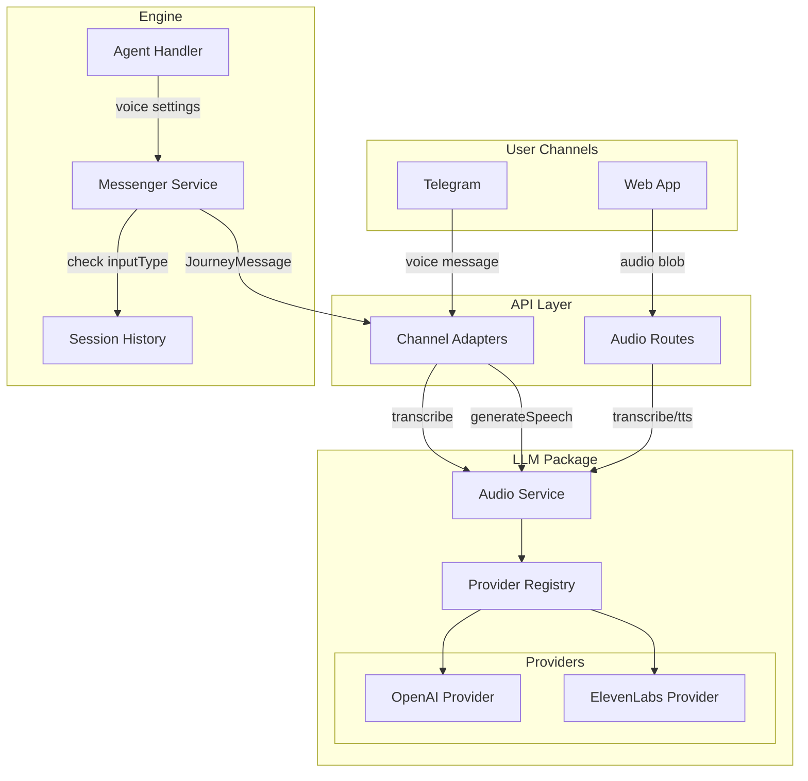
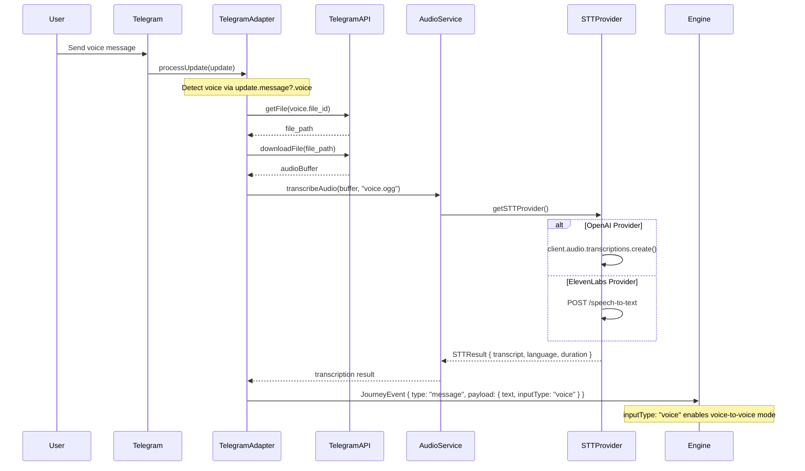
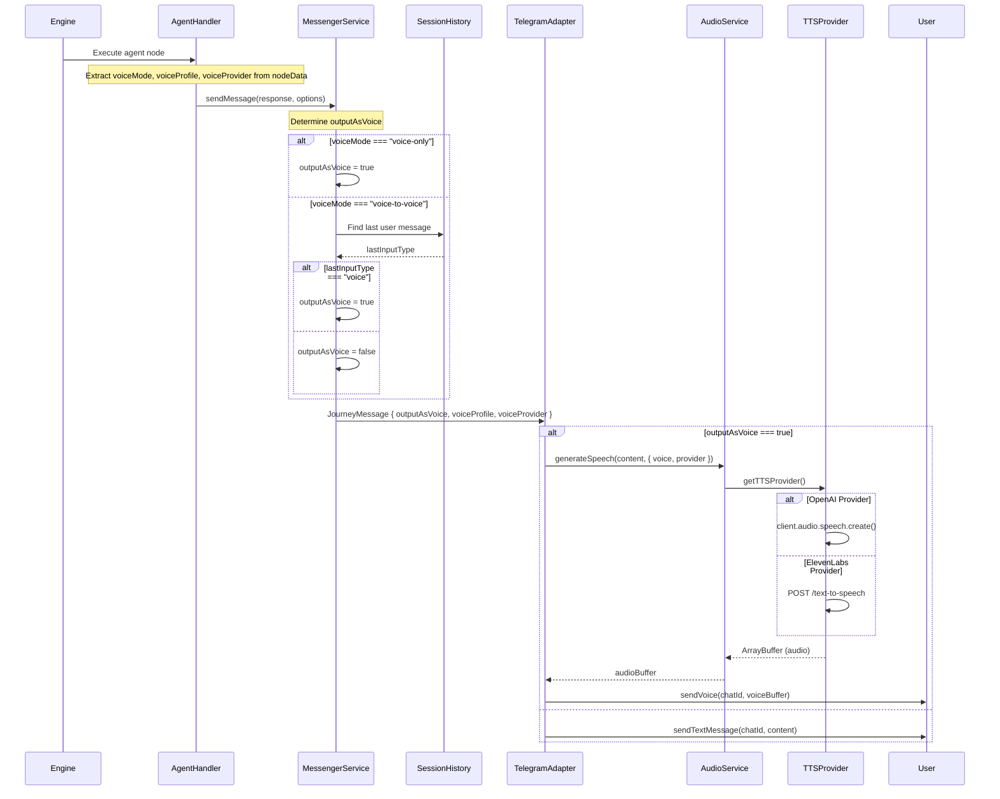
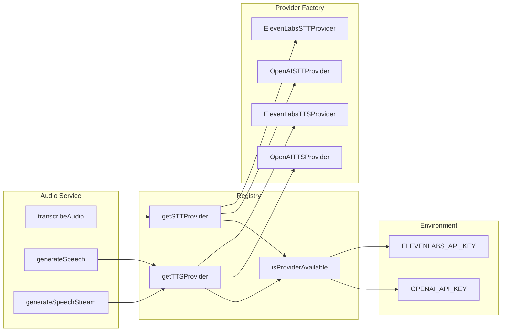
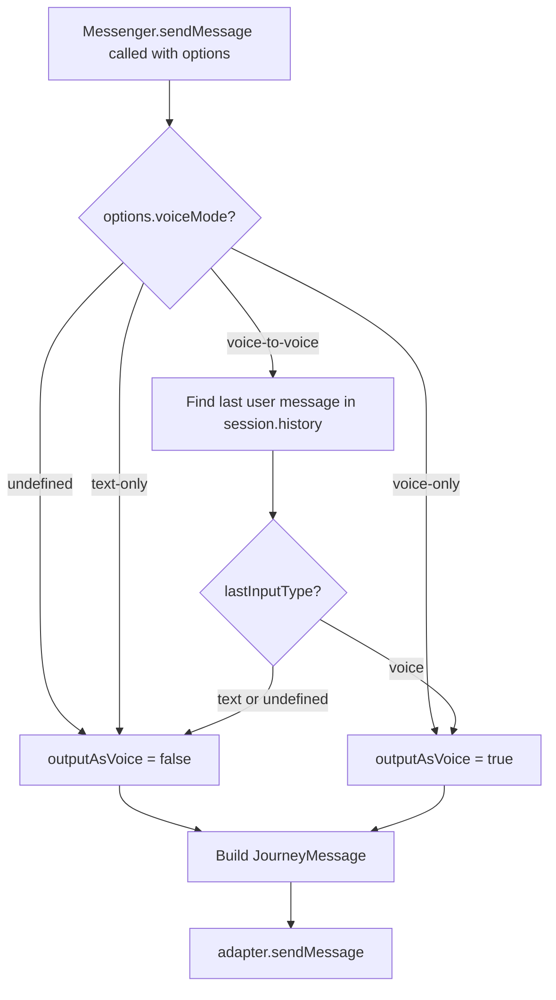

# Voice Service Architecture

> Complete system design for Speech-to-Text (STT) and Text-to-Speech (TTS) services in Journey.

---

## Table of Contents

1. [Overview](#overview)
2. [Architecture Diagrams](#architecture-diagrams)
3. [Data Flow](#data-flow)
4. [API Reference](#api-reference)
5. [Configuration](#configuration)
6. [Provider Implementations](#provider-implementations)
7. [Voice Modes](#voice-modes)
8. [Error Handling & Fallbacks](#error-handling--fallbacks)
9. [Usage Tracking](#usage-tracking)
10. [Key Files Reference](#key-files-reference)

---

## Overview

The Journey Voice Service provides bidirectional voice capabilities:

- **STT (Speech-to-Text)**: Transcribes user voice messages to text
- **TTS (Text-to-Speech)**: Converts agent responses to voice messages

### Supported Providers

| Provider       | STT Model         | TTS Models                                                 | Default Voice |
| -------------- | ----------------- | ---------------------------------------------------------- | ------------- |
| **OpenAI**     | gpt-4o-transcribe | tts-1 (stream), tts-1-hd (quality)                         | ash           |
| **ElevenLabs** | scribe_v1         | eleven_flash_v2_5 (75ms), eleven_multilingual_v2 (quality) | Rachel        |

### Voice Modes

| Mode             | Behavior                                 |
| ---------------- | ---------------------------------------- |
| `text-only`      | Always respond with text (default)       |
| `voice-to-voice` | Reply with voice only if user sent voice |
| `voice-only`     | Always reply with voice message          |

---

## Architecture Diagrams

### High-Level System Overview



### STT Flow (Voice Input Path)



### TTS Flow (Voice Output Path)



### Provider Registry Pattern



### Voice Mode Decision Logic



---

## Data Flow

### Voice Settings Propagation

```
Agent Node Definition
├── voiceMode: "text-only" | "voice-to-voice" | "voice-only"
├── voiceProfile: string (voice ID)
└── voiceProvider: "openai" | "elevenlabs"
         │
         ▼
Agent Handler (agent-handler.ts:252-255)
├── Extracts from nodeData
└── Creates workflowContext with voice settings
         │
         ▼
Workflow Executor (agent.ts:346-348)
├── Builds BuiltinToolContext
└── Passes voiceMode, voiceProfile to tools
         │
         ▼
Send Message Tool (messaging-tools.ts:59-62)
├── Checks context.voiceMode
└── Builds SendMessageOptions
         │
         ▼
Messenger Service (service-factory.ts:345-368)
├── Determines outputAsVoice based on voiceMode + inputType
└── Creates JourneyMessage with voice fields
         │
         ▼
Telegram Adapter (adapter.ts:60-100)
├── Checks message.outputAsVoice
├── Calls generateSpeech() if true
└── Sends voice or falls back to text
         │
         ▼
User receives voice or text message
```

### JourneyMessage Interface

```typescript
interface JourneyMessage {
  type: "text" | "buttons" | "media";
  content: string;
  buttons?: Array<{ id: string; label: string }>;
  media?: { type: "image" | "video"; url: string; mediaId?: string };

  // Voice output fields
  outputAsVoice?: boolean; // Flag to convert to speech
  voiceProfile?: string; // Which voice to use
  voiceProvider?: "openai" | "elevenlabs"; // TTS provider
}
```

---

## API Reference

### POST /api/llm/audio/transcribe

Transcribe audio to text using STT.

**Auth**: Protected (settings:read)

**Request**:

```
Content-Type: multipart/form-data
Body: audio file with key "audio"
```

**Response**:

```typescript
{
  transcript: string;
  language?: string;
  duration?: number;
}
```

**Implementation**: `apps/api/src/modules/llm/routes/audio.ts`

---

### POST /api/llm/audio/tts

Generate complete speech audio (non-streaming).

**Auth**: Protected (settings:read)

**Request**:

```typescript
{
  text: string;           // 1-4096 chars
  voice?: VoiceProfile;   // Optional voice ID
  provider?: AudioProvider; // "openai" | "elevenlabs"
}
```

**Response**:

```
Content-Type: audio/mpeg
Body: Complete MP3 audio file
```

---

### POST /api/llm/audio/tts/stream

Generate streaming speech via Server-Sent Events.

**Auth**: Protected (settings:read)

**Request**: Same as /tts

**Response**: SSE stream with events:

```typescript
// Audio chunk
event: audio_chunk
data: { index: number, data: string } // Base64 PCM16

// Completion
event: audio_complete
data: { totalChunks: number }

// Error
event: error
data: { message: string }
```

---

### GET /api/llm/voices/elevenlabs

Discover available ElevenLabs voices.

**Auth**: Protected (settings:read)

**Response**:

```typescript
{
  voices: VoiceInfo[];
  source: "api" | "hardcoded";
}

interface VoiceInfo {
  id: string;
  label: string;
  gender?: string;
  preview_url?: string;
}
```

**Fallback**: Returns hardcoded voices if API key missing or request fails.

---

## Configuration

### AUDIO_CONFIG Structure

**File**: `packages/schemas/src/config/llm/services.ts`

```typescript
export const AUDIO_CONFIG = {
  // Default providers
  providers: {
    stt: "openai" as AudioProvider,
    tts: "openai" as AudioProvider,
  },

  // STT model
  stt: {
    id: "gpt-4o-transcribe",
    provider: "openai",
  },

  // TTS models
  tts: {
    stream: { id: "tts-1", provider: "openai" },
    nonStream: { id: "tts-1-hd", provider: "openai" },
  },

  // OpenAI configuration
  openai: {
    stt: { id: "gpt-4o-transcribe", provider: "openai" },
    tts: {
      stream: { id: "tts-1", provider: "openai" },
      nonStream: { id: "tts-1-hd", provider: "openai" },
    },
    voices: [
      { id: "alloy", label: "Alloy", gender: "neutral" },
      { id: "ash", label: "Ash", gender: "male" },
      { id: "coral", label: "Coral", gender: "female" },
      { id: "echo", label: "Echo", gender: "male" },
      { id: "fable", label: "Fable", gender: "neutral" },
      { id: "nova", label: "Nova", gender: "female" },
      { id: "onyx", label: "Onyx", gender: "male" },
      { id: "sage", label: "Sage", gender: "female" },
      { id: "shimmer", label: "Shimmer", gender: "female" },
    ],
    defaultVoice: "ash",
  },

  // ElevenLabs configuration
  elevenlabs: {
    stt: { id: "scribe_v1", provider: "elevenlabs" },
    tts: {
      stream: { id: "eleven_flash_v2_5", provider: "elevenlabs" },
      nonStream: { id: "eleven_multilingual_v2", provider: "elevenlabs" },
    },
    voices: [
      { id: "21m00Tcm4TlvDq8ikWAM", label: "Rachel", gender: "female" },
      { id: "ErXwobaYiN019PkySvjV", label: "Antoni", gender: "male" },
      { id: "EXAVITQu4vr4xnSDxMaL", label: "Bella", gender: "female" },
      { id: "MF3mGyEYCl7XYWbV9V6O", label: "Elli", gender: "female" },
      { id: "TxGEqnHWrfWFTfGW9XjX", label: "Josh", gender: "male" },
      { id: "VR6AewLTigWG4xSOukaG", label: "Arnold", gender: "male" },
      { id: "pNInz6obpgDQGcFmaJgB", label: "Adam", gender: "male" },
      { id: "yoZ06aMxZJJ28mfd3POQ", label: "Sam", gender: "male" },
    ],
    defaultVoice: "21m00Tcm4TlvDq8ikWAM", // Rachel
  },
};
```

### Helper Functions

```typescript
// Get voices for a provider
getVoicesForProvider(provider: AudioProvider): VoiceInfo[]

// Get default voice for a provider
getDefaultVoiceForProvider(provider: AudioProvider): string
```

---

## Provider Implementations

### OpenAI Audio Provider

**File**: `packages/llm/src/providers/openai-audio.ts`

#### STT (OpenAISTTProvider)

```typescript
// Model: gpt-4o-transcribe
// Features:
// - High accuracy multi-language transcription
// - Automatic language detection
// - Supports language hints and prompts

async transcribe(audio: Buffer, filename: string, config: STTProviderConfig): Promise<STTResult>
```

#### TTS (OpenAITTSProvider)

```typescript
// Models:
// - tts-1: Low latency streaming
// - tts-1-hd: High quality non-streaming
//
// Voices: alloy, ash, coral, echo, fable, nova, onyx, sage, shimmer

async speak(text: string, config: TTSProviderConfig): Promise<ArrayBuffer>
async *speakStream(text: string, config: TTSProviderConfig): AsyncGenerator<Uint8Array>
```

### ElevenLabs Audio Provider

**File**: `packages/llm/src/providers/elevenlabs-audio.ts`

#### STT (ElevenLabsSTTProvider)

```typescript
// Model: scribe_v1
// Features:
// - 99 language support
// - Returns actual audio duration from API
// - Language code parameter support

async transcribe(audio: Buffer, filename: string, config: STTProviderConfig): Promise<STTResult>
```

#### TTS (ElevenLabsTTSProvider)

```typescript
// Models:
// - eleven_flash_v2_5: ~75ms latency (streaming)
// - eleven_multilingual_v2: Best quality, 29 languages (non-streaming)
//
// API: POST https://api.elevenlabs.io/v1/text-to-speech/{voice_id}

async speak(text: string, config: TTSProviderConfig): Promise<ArrayBuffer>
async *speakStream(text: string, config: TTSProviderConfig): AsyncGenerator<Uint8Array>
```

---

## Voice Modes

### text-only (Default)

- Agent always responds with text messages
- No TTS processing occurs
- Lowest latency and cost

### voice-to-voice

- Smart mode that mirrors user's communication style
- Checks `session.history` for last user message's `inputType`
- Only outputs voice if user's last message was voice
- Provides natural conversation flow

**Implementation** (`service-factory.ts:350-356`):

```typescript
if (options.voiceMode === "voice-to-voice") {
  const lastUserEvent = [...this.session.history].reverse().find((e) => e.type === "user.message");
  const lastInputType = (lastUserEvent?.payload as { inputType?: string })?.inputType;
  outputAsVoice = lastInputType === "voice";
}
```

### voice-only

- Agent always responds with voice messages
- All text responses are converted to speech
- Highest cost but fully voice-based experience

---

## Error Handling & Fallbacks

### STT Error Handling

**Location**: `apps/api/src/adapters/telegram/adapter.ts:338-347`

```typescript
// If transcription fails:
// 1. Log error with file details
// 2. Notify user: "Sorry, I couldn't understand that voice message..."
// 3. Continue processing without crashing
```

### TTS Error Handling

**Location**: `apps/api/src/adapters/telegram/adapter.ts:95-99`

```typescript
// If voice sending fails (e.g., VOICE_MESSAGES_FORBIDDEN):
// 1. Log warning with error details
// 2. Fall through to standard text message flow
// 3. User receives text instead of voice
```

### Voice Discovery Fallback

**Location**: `apps/api/src/modules/llm/routes/voices.ts`

```typescript
// ElevenLabs voice discovery:
// 1. Try API call to https://api.elevenlabs.io/v1/voices
// 2. If no API key: return hardcoded voices
// 3. If API fails: return hardcoded voices
// 4. Response indicates source: "api" | "hardcoded"
```

---

## Usage Tracking

Both providers integrate with the usage tracking system for cost monitoring.

### OpenAI Usage

```typescript
await recordUsage({
  model: "gpt-4o-transcribe",
  provider: "openai",
  type: "stt",
  durationMs: processingTime,
  organizationId,
  metadata: {
    audioSizeBytes: audio.length,
    transcriptLength: result.text.length,
    estimatedDurationSec: estimatedDuration,
  },
});
```

### ElevenLabs Usage

```typescript
await recordUsage({
  model: "scribe_v1",
  provider: "elevenlabs",
  type: "stt",
  durationMs: processingTime,
  organizationId,
  metadata: {
    audioSizeBytes: audio.length,
    transcriptLength: result.text.length,
    audioDurationSec: result.duration,
    detectedLanguage: result.language_code,
  },
});
```

---

## Key Files Reference

| Component               | File Path                                           | Key Lines        | Purpose                                |
| ----------------------- | --------------------------------------------------- | ---------------- | -------------------------------------- |
| **Audio Service**       | `packages/llm/src/services/audio-service.ts`        | 90-236           | Main STT/TTS interface                 |
| **OpenAI Provider**     | `packages/llm/src/providers/openai-audio.ts`        | 30-200+          | OpenAI STT/TTS implementation          |
| **ElevenLabs Provider** | `packages/llm/src/providers/elevenlabs-audio.ts`    | 40-150+          | ElevenLabs STT/TTS implementation      |
| **Provider Registry**   | `packages/llm/src/providers/audio-registry.ts`      | 33-152           | Provider factory & selection           |
| **Provider Types**      | `packages/llm/src/providers/types.ts`               | 57-116           | STTProvider, TTSProvider interfaces    |
| **Audio Config**        | `packages/schemas/src/config/llm/services.ts`       | 32-151           | AUDIO_CONFIG, voices, defaults         |
| **Agent Node Schema**   | `packages/schemas/src/nodes/agent.ts`               | 298-310          | voiceMode, voiceProfile, voiceProvider |
| **Voice Mode Schema**   | `packages/schemas/src/nodes/message.ts`             | 13-24            | VoiceModeSchema definition             |
| **Telegram Adapter**    | `apps/api/src/adapters/telegram/adapter.ts`         | 60-100, 312-347  | Voice input/output handling            |
| **Agent Handler**       | `packages/engine/src/handlers/agent-handler.ts`     | 252-255, 393-414 | Voice settings to workflow             |
| **Messenger Service**   | `packages/engine/src/services/service-factory.ts`   | 345-368          | Voice mode decision logic              |
| **Engine Types**        | `packages/engine/src/types.ts`                      | 54-65, 313-320   | JourneyMessage, SendMessageOptions     |
| **Audio API Routes**    | `apps/api/src/modules/llm/routes/audio.ts`          | -                | /transcribe, /tts endpoints            |
| **Voices API Route**    | `apps/api/src/modules/llm/routes/voices.ts`         | 47-111           | /voices/elevenlabs endpoint            |
| **Web Audio Client**    | `apps/web/src/shared/lib/api/audio.ts`              | 66-288           | Client-side audio API                  |
| **Voice Chat Hook**     | `apps/web/src/shared/hooks/audio/use-voice-chat.ts` | -                | React hook for voice UI                |

---

## Related Documentation

- [LLM Architecture](./architecture.md) - Overall LLM package design
- [LLM Services](./services.md) - Service interfaces and patterns
- [Model Registry](./model-registry.md) - Model configuration system
