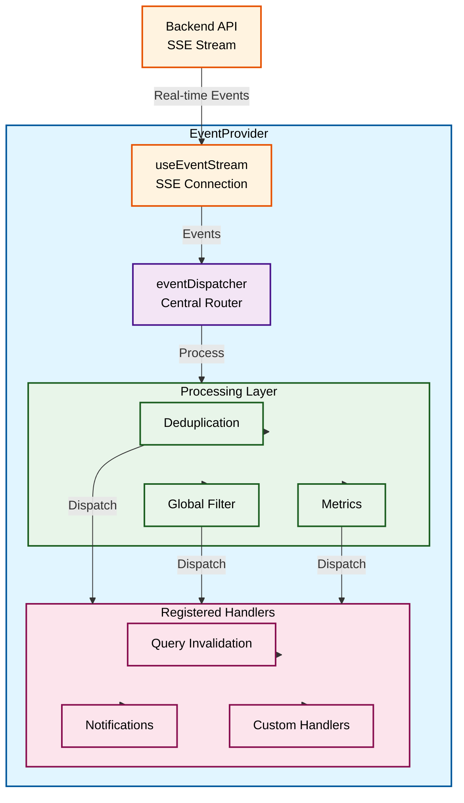

# Frontend Events System

The frontend events system receives real-time events via SSE (Server-Sent Events) and dispatches them to registered handlers for query invalidation, notifications, and custom logic.

## Table of Contents

- [Overview](#overview)
- [Architecture](#architecture)
- [Setup](#setup)
- [Using Event Handlers](#using-event-handlers)
- [Event Registry](#event-registry)
- [Error Handling](#error-handling)
- [Debug Mode & Metrics](#debug-mode--metrics)
- [Testing](#testing)

---

## Overview

The frontend events system provides:

- **Real-time updates** - SSE streaming from backend
- **Query invalidation** - Automatic TanStack Query cache updates
- **Notifications** - Toast notifications for important events
- **Custom handlers** - React hooks for event processing
- **Priority-based dispatch** - Control handler execution order
- **Deduplication** - Prevent duplicate event processing
- **Error isolation** - Per-handler try/catch in the dispatcher

---

## Architecture



### Key Components

| Component           | Location                                                | Purpose                                             |
| ------------------- | ------------------------------------------------------- | --------------------------------------------------- |
| EventProvider       | `providers/event-provider.tsx`                          | Connects SSE to dispatcher, registers core handlers |
| Event Stream Hook   | `features/developers/hooks/events/use-event-stream.ts`  | SSE connection + buffering                          |
| Event Dispatcher    | `shared/lib/events/dispatcher.ts`                       | Central routing, priority, deduplication, metrics   |
| Event Registry      | `shared/lib/events/registry.ts`                         | Maps events to cache keys and notifications         |
| Event Handlers Hook | `features/developers/hooks/events/use-event-handler.ts` | React hooks for registering handlers                |

---

## Setup

### Provider Configuration

Wrap your app with `EventProvider`:

```tsx
import { EventProvider } from "@/providers/event-provider";

function App() {
  return (
    <QueryClientProvider client={queryClient}>
      <EventProvider>
        <Router />
      </EventProvider>
    </QueryClientProvider>
  );
}
```

### Provider Props

| Prop                      | Type      | Default | Description              |
| ------------------------- | --------- | ------- | ------------------------ |
| `enabled`                 | `boolean` | `true`  | Enable SSE streaming     |
| `enableQueryInvalidation` | `boolean` | `true`  | Auto-invalidate queries  |
| `enableNotifications`     | `boolean` | `true`  | Show toast notifications |

```tsx
// Disable notifications (e.g., in tests)
<EventProvider enableNotifications={false}>
  <App />
</EventProvider>
```

---

## Using Event Handlers

### Basic Handler

Use `useEventHandler` for type-specific event handling:

```tsx
import { createLogger } from "@journey/logger";
import { EventTypes } from "@journey/schemas";
import { useEventHandler } from "@/features/developers";

const log = createLogger("journey-list");

function JourneyList() {
  useEventHandler(EventTypes.JOURNEY_CREATED, (event) => {
    log.info({ journeyId: event.journeyId }, "journey:created");
  });

  return <div>...</div>;
}
```

### Multiple Event Types

Handle multiple event types with a single handler:

```tsx
useEventHandler(["journey.created", "journey.updated", "journey.deleted"], (event) => {
  // Handle any journey lifecycle event
  refetchJourneys();
});
```

### Handler with Configuration

Use `useEventHandlerWithConfig` for advanced options:

```tsx
import { useEventHandlerWithConfig } from "@/features/developers";
import { HANDLER_PRIORITY } from "@/shared/lib/events";

useEventHandlerWithConfig("user.message", {
  handler: (event) => handleMessage(event),
  priority: HANDLER_PRIORITY.HIGH,
  filter: (event) => event.payload?.journeyId === currentJourneyId,
});
```

### Global Handler

Receive all events regardless of type:

```tsx
import { createLogger } from "@journey/logger";
import { useGlobalEventHandler } from "@/features/developers";

const log = createLogger("event-observer");

useGlobalEventHandler((event) => {
  log.debug({ eventType: event.type }, "event:received");
});
```

### Handler Priorities

```typescript
import { HANDLER_PRIORITY } from "@/shared/lib/events";

// Priority levels (higher runs first)
HANDLER_PRIORITY.CRITICAL; // 100 - Query invalidation
HANDLER_PRIORITY.HIGH; // 50  - Important custom logic
HANDLER_PRIORITY.NORMAL; // 0   - Default
HANDLER_PRIORITY.LOW; // -50 - Logging, analytics
```

---

## Event Registry

The registry maps events to cache invalidation and notifications:

```typescript
// lib/events/registry.ts
import { EventTypes } from "@journey/schemas";

export const FRONTEND_EVENT_REGISTRY: Partial<Record<EventType, FrontendEventConfig>> = {
  [EventTypes.JOURNEY_CREATED]: {
    invalidates: [journeyKeys.list()],
    notify: true,
    notifyMessage: "Journey created",
    notifyVariant: "success",
  },
  [EventTypes.CRM_STAGE_CHANGED]: {
    invalidates: [crmKeys.clients()],
    notify: false,
  },
};
```

### Configuration Options

| Field           | Type                                          | Description                                        |
| --------------- | --------------------------------------------- | -------------------------------------------------- |
| `invalidates`   | `QueryKey[]`                                  | Query keys to invalidate                           |
| `notify`        | `boolean`                                     | Show toast notification                            |
| `notifyMessage` | `string`                                      | Custom message (uses event description if omitted) |
| `notifyVariant` | `"success" \| "info" \| "warning" \| "error"` | Toast style                                        |

### Adding New Event Handling

1. Add entry to `FRONTEND_EVENT_REGISTRY`:

```typescript
"my.new.event": {
  invalidates: [myQueryKeys.all],
  notify: true,
  notifyMessage: "Something happened",
  notifyVariant: "info",
},
```

2. Query keys will auto-invalidate, notifications will auto-show.

---

## Error Handling

Each handler is wrapped in a try/catch inside the dispatcher. A failing handler logs an error but does not block other handlers or future events. For UI isolation, use standard React error boundaries around your component tree.

---

## Debug Mode & Metrics

### Enable Debug Mode

```typescript
import { eventDispatcher } from "@/shared/lib/events";

// Enable detailed logging
eventDispatcher.setDebugMode(true);
```

Debug mode logs:

- Handler registrations
- Event dispatches
- Duplicate skips
- Filter blocks

### View Metrics

```typescript
const metrics = eventDispatcher.getMetrics();
console.log(metrics);
// {
//   eventsDispatched: 42,
//   handlersExecuted: 126,
//   handlerErrors: 0,
//   unknownEventTypes: 2,
//   eventsFiltered: 5,
//   duplicatesSkipped: 3,
//   averageDispatchTime: 0.45,
// }
```

### Reset Metrics

```typescript
eventDispatcher.resetMetrics();
```

### Global Filter

Filter all events before dispatch:

```typescript
// Only process CRM events
eventDispatcher.setGlobalFilter((event) => event.type.startsWith("crm."));

// Clear filter
eventDispatcher.setGlobalFilter(null);
```

---

## Testing

### Mock Event Dispatch

```typescript
import { eventDispatcher } from "@/shared/lib/events";
import { vi } from "vitest";

// Spy on dispatch
const dispatchSpy = vi.spyOn(eventDispatcher, "dispatch");

// Test your component...

expect(dispatchSpy).toHaveBeenCalledWith(expect.objectContaining({ type: "journey.created" }));
```

### Test Event Handlers

```typescript
import { renderHook } from "@testing-library/react";
import { useEventHandler } from "@/features/developers";

test("handles events", async () => {
  const handler = vi.fn();

  renderHook(() => useEventHandler("test.event", handler));

  // Dispatch test event
  await eventDispatcher.dispatch({
    id: "test-1",
    type: "test.event",
    organizationId: "org-1",
    timestamp: new Date().toISOString(),
    payload: { test: true },
  });

  expect(handler).toHaveBeenCalledTimes(1);
});
```

### Disable Event System in Tests

```tsx
<EventProvider enabled={false} enableNotifications={false}>
  <ComponentUnderTest />
</EventProvider>
```

---

## Type Safety

### Validate Event Types

Use the type guard for runtime validation:

```typescript
import { isValidEventType } from "@/shared/lib/events";

function handleSSEEvent(rawEvent: { type: string }) {
  if (isValidEventType(rawEvent.type)) {
    // rawEvent.type is now narrowed to EventType
    const config = getEventConfig(rawEvent.type);
  }
}
```

### Pattern Matching

Match events by namespace:

```typescript
import { matchesEventPattern } from "@/shared/lib/events";

matchesEventPattern("crm.stage.changed", "crm.*"); // true
matchesEventPattern("crm.stage.changed", "crm.stage.changed"); // true
matchesEventPattern("journey.created", "crm.*"); // false
```

---

## Event Types Reference

See [Events System Documentation](../api/events/events-system.md) for complete event types reference.

### Common Event Categories

| Category     | Events | Description                  |
| ------------ | ------ | ---------------------------- |
| `bot.*`      | 6      | Bot lifecycle                |
| `crm.*`      | 15     | CRM operations               |
| `tag.*`      | 5      | Tag assignments              |
| `variable.*` | 1      | Variable changes             |
| `journey.*`  | 9      | Journey lifecycle & sessions |
| `user.*`     | 2      | User interactions            |
| `system.*`   | 6      | System operations            |

---

## Related Documentation

- [Events System (Backend)](../api/events/events-system.md) - Complete event reference
- [Query Keys](../web/README.md) - TanStack Query key structure
